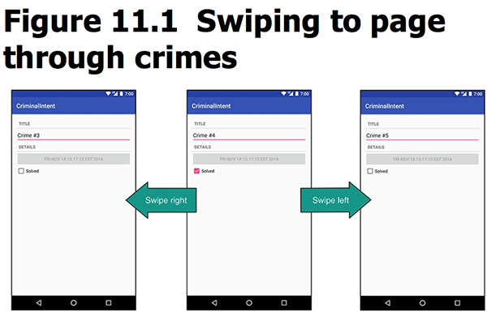
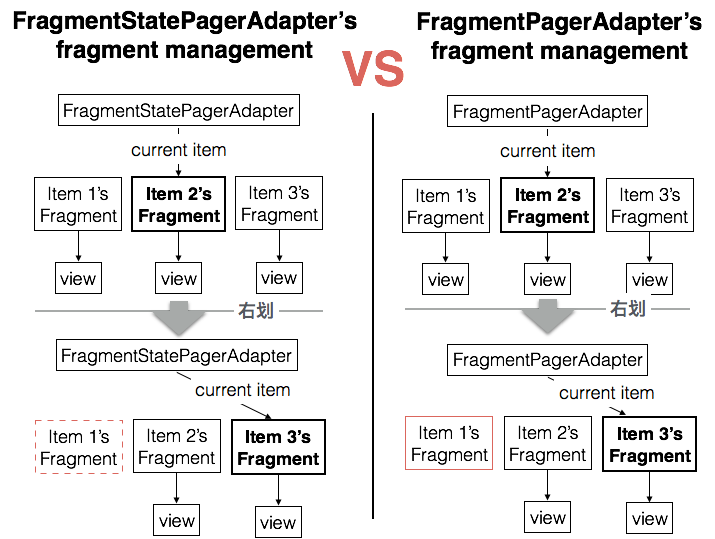

本章完成了Details界面的左右滑屏，引入了ViewPager。当进入某一条item的Details后，无需退回list，左右滑屏直接切换到相邻的item details中：


本章要点：
- ViewPager的使用
<!-- more -->

# 创建ViewPager的步骤
共分三步：
① 创建CrimePagerActivity，并提领ViewPager实例
② 在CrimePagerActivity中，为ViewPager实例创建和关联适配器
③ 修改CrimeHolder.onClick(...)，令其启动CrimePagerActivity而不是CrimeActivity

## 创建CrimePagerActivity的java代码和xml布局：
``` java
// CrimePagerActivity.java
public class CrimePagerActivity extends AppCompatActivity {
    @Override
    protected void onCreate(Bundle savedInstanceState){
        super.onCreate(savedInstanceState);
        setContentView(R.layout.activity_crime_pager);
        // 提领xml中的ViewPager
        mViewPager = (ViewPager)findViewById(R.id.crime_view_pager);
    }
}
```
``` xml
<!-- activity_crime_pager.xml -->
<android.support.v4.view.ViewPager
    xmlns:android="http://schemas.android.com/apk/res/android"
    android:id="@+id/crime_view_pager"
    android:layout_width="match_parent"
    android:layout_height="match_parent">
</android.support.v4.view.ViewPager>
```

## 为ViewPager关联Adapter
ViewPager也需要一个适配器，这和[RecyclerView的设计思想](/2016/10/19/2017/1019AndroidProgrammingBNRG08/#RecyclerView的设计思想)是类似的：ViewPager是码头，适配器是调度中心，由调度中心负责创建集装箱——CrimeFragment，货物是Crime实例。将ViewPager和适配器关联起来就是把该Adapter设置给ViewPager，适配器需要具备的最小接口集合是`getItem(int)`和`getCount()`，用于获得“集装箱”和总数信息。关联发生在CrimePagerActivity，具体代码如下：
``` java
// CrimePagerActivity.java
public class CrimePagerActivity extends AppCompatActivity {
    private ViewPager mViewPager;
    private List<Crime> mCrimes;

    @Override
    protected void onCreate(Bundle savedInstanceState){
        super.onCreate(savedInstanceState);
        setContentView(R.layout.activity_crime_pager);
        mViewPager = (ViewPager)findViewById(R.id.crime_view_pager);

        mCrimes = CrimeLab.get(this).getCrimes();	// 获取model
        fragmentManager = getSupportFragmentManager();

        // 创建Adapter，并设置给mViewPager
        mViewPager.setAdapter(new FragmentStatePagerAdapter(fragmentManager) {
            @Override   // 根据位置获取Fragment
            public Fragment getItem(int position) {
                Crime crime = mCrimes.get(position);
                return CrimeFragment.newInstance(crime.getId());
            }
            @Override	// 获取model中数据元素的总数
            public int getCount() {	
                return mCrimes.size();
            }
        });
        // 这个参数是由发起方设置的，传入初始应当显示的crimeId
        UUID crimeId = (UUID)getIntent().getSerializableExtra(EXTRA_CRIME_ID);
        // 设置初始显示的crimeId
        for(int i=0; i<mCrimes.size(); i++){
            if(mCrimes.get(i).getId().equals(crimeId)){
                mViewPager.setCurrentItem(i);
                break;
            }
        }
    }
}
```

默认情况下，ViewPager仅加载相邻的一个页面，而不是所有页面，通过调用其setOffscreenPageLimit(int)可以指定加载相邻的几个页面。

最后一步把CrimeActivity改为CrimePagerActivity就不演示了，没什么新东西。只需要完成上面的代码，进入ViewPager之后的左右滑屏都已经由ViewPager自动完成了。

# FragmentStatePagerAdapter vs FragmentPagerAdapter
二者的区别在于如何处理暂时不显示的Fragment，下图很清楚地表达这一点：

使用FragmentStatePagerAdapter，不需要的Fragment会被销毁；而FragmentPagerAdapter只会调用detach(Fragment)而不是remove(Fragment)，这只会销毁Fragment的View 而不会销毁Fragment。
前者更节省资源，后者会更流畅。对于本节的例子，数据量可能很大，因此使用前者；对于要现实的页面是固定的几页，比如tab页的情况，就比较适合使用后者。

> 在P802中提到，FragmentStatePagerAdapter会在被销毁的时候把Fragment的状态保存到Bundle，如果用户返回，它会再从Bundle中恢复Fragment。这和FragmentStatePagerAdapter vs FragmentPagerAdapter的区别有关系么？是说只有前者才有这种恢复的能力？

# 为什么不能使用RecyclerView?
RecyclerView是由CrimeHolder来充当“集装箱”，由其基类ViewHolder负责创建“货物”View，而不是Fragment，可参见[为RecyclerView创建java代码
](/2016/10/19/2017/1019AndroidProgrammingBNRG08/#为RecyclerView创建java代码)。“货物”的类型不能随意指定，因此Android引入了ViewPager。

当ViewPager盛放的不是Fragment而是一般的View时，则需要派生PagerAdapter，并实现如下三个接口：
``` java
// 创建itemView并添加到container
public Object instantiateItem(ViewGroup container, int position)
// 删除itemView
public void destroyItem(ViewGroup container, int position, Object object)
// 判断view和object是否为同一个实例
public abstract boolean isViewFromObject(View view, Object object)
```
ViewPager调用`instantiateItem(ViewGroup, 5)`返回objA，如果调用`isViewFromObject(View, objA)`并传入item5，则返回true，否则返回false。

> 不过本节并没有讲透为什么要实现这三个接口，只是说这是一个复杂的过程，并没有讲PagerAdapter和ViewPager具体是怎么配合的。


