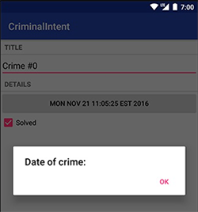

本章在Details界面中点击了日期后，弹出选择日期的DatePicker Dialog。

本章要点：
- 创建和调起Dialog
- 在同一个Activity内的不同Fragment之间传递数据
<!-- more -->

# 如何创建和使用Dialog
## 创建Dialog
派生DialogFragment子类，并实现`onCreateDialog(Bundle savedInstanceState)`方法
``` java
// DatePickerFragment
public class DatePickerFragment extends DialogFragment {
    @Override
    public Dialog onCreateDialog(Bundle savedInstanceState){
        return new android.support.v7.app.AlertDialog.Builder(getActivity())
            .setTitle(R.string.date_picker_title)
            .setPositiveButton(android.R.string.ok, null)
            .create();
    }
}
```
当Activity需要将Dialog展现在屏幕上时，会调用此方法。应该在此方法内创建并展现Dialog。

## 显示Dialog
调用DialogFragment的下面两个方法：
`public void show(FragmentManager manager, String tag)`
`public void show(FragmentTransaction transaction, String tag)`
它们都能显示Dialog。
参数`tag`是DialogFragment实例的唯一标识；
如果传入参数`FragmentTransaction`，你需要负责创建和提交transaction；
如果传入参数`FragmentManager`，manager会负责创建和提交transaction。
点击details中日期按钮的响应代码如下：
``` java
// CrimeFragment.java
mDateButton.setOnClickListener(new View.OnClickListener(){
    @Override
    public void onClick(View v){
        FragmentManager manager = getFragmentManager();
        DatePickerFragment dialog = new DatePickerFragment();
        dialog.show(manager, DIALOG_DATE);
    }
});
```
此时弹出的Dialog如下：


## 定制Dialog的UI
可以通过调用AlertDialog.Build的`setView(View v)`方法来定制Dialog的顶部标题到底部按钮之间的UI。具体步骤还是xml+代码：
dialog_date.xml
``` xml
<DatePicker xmlns:android="http://schemas.android.com/apk/res/android"
    android:id="@+id/dialog_date_picker"
    android:layout_width="wrap_content"
    android:layout_height="wrap_content"
    android:calendarViewShown="false">
</DatePicker>
```

``` java
// DatePickerFragment.java
public class DatePickerFragment extends DialogFragment {
    @Override
    public Dialog onCreateDialog(Bundle savedInstanceState){
        View v = LayoutInflater.from(getActivity()) 
            .inflate(R.layout.dialog_date, null);		// 加载布局
        return new android.support.v7.app.AlertDialog.Builder(getActivity())
            .setView(v)							// 定制UI
            .setTitle(R.string.date_picker_title)
            .setPositiveButton(android.R.string.ok, null)
            .create();
    }
}
```

## 向DialogFragment传入参数
传入参数和[笔记七· 向创建的Fragment传入参数](http://localhost:4000/2016/10/18/2017/1018AndroidProgrammingBNRG07/#向创建的Fragment传入参数)完全一致，使用Argument。① 把创建实例的代码封装到DatePickerFragment类的内部；② 在`onCreateDialog(...)`中解析传入参数，并更新UI。代码如下：
``` java
// DatePickerFragment.java
public class DatePickerFragment extends DialogFragment {
    private static final String ARG_DATE = "date";
    private DatePicker mDatePicker;

    // 创建DatePickerFragment实例，并传入Date参数
    public static DatePickerFragment newInstance(Date date) {
        Bundle args = new Bundle();
        args.putSerializable(ARG_DATE, date);

        DatePickerFragment fragment = new DatePickerFragment();
        fragment.setArguments(args);
        return fragment;
    }
    @Override
    public Dialog onCreateDialog(Bundle savedInstanceState){
        // 解析输入参数，并展现到UI
        Date date = (Date)getArguments().getSerializable(ARG_DATE);
        Calendar calendar = Calendar.getInstance();
        calendar.setTime(date);
        int year = calendar.get(Calendar.YEAR);
        int month = calendar.get(Calendar.MONTH);
        int day = calendar.get(Calendar.DAY_OF_MONTH);

        View v = LayoutInflater.from(getActivity())
                .inflate(R.layout.dialog_date, null);

        mDatePicker = (DatePicker) v.findViewById(R.id.dialog_date_picker);
        mDatePicker.init(year, month, day, null);

        return new android.support.v7.app.AlertDialog.Builder(getActivity())
                .setView(v)
                .setTitle(R.string.date_picker_title)
                .setPositiveButton(android.R.string.ok, null)
                .create();
    }
}
```
原先响应Date按钮点击，创建和显示DatePickerFragment的代码修改如下：
``` java
// CrimeFragment.java
    mDateButton.setOnClickListener(new View.OnClickListener(){
        @Override
        public void onClick(View v){
            FragmentManager manager = getFragmentManager();
            // 创建DatePickerFragment，并传入Date参数
            DatePickerFragment dialog = DatePickerFragment.newInstance(mCrime.getDate());
            dialog.show(manager, DIALOG_DATE);
        }
    });
```

## 从DialogFragment返回数据
在本节中CrimeFragment和DatePickerFragment同在CrimeActivity之中，CrimeFragment启动DatePickerFragment之后怎么从DatePickerFragment返回数据呢？
① 把CrimeFragment设置为DatePickerFragment的TargetFragment：
`public void setTargetFragment(Fragment fragment, int requestCode)`
TargetFragment将根据requestCode来分辨从哪个Fragment返回。
② DatePickerFragment调用`CrimeFragment.onActivityResult(int, Intent)`将返回值传递给CrimeFragment。在[笔记五·从启动的Activity返回数据](http://localhost:4000/2016/10/16/2017/1016AndroidProgrammingBNRG05/#从启动的Activity返回数据)中讲到，在Activity之间返回数据时，由ActivityManager负责调用`Activity.onActivityResult(int, Intent)`，Activity在收到此回调后，其FragmentManager会调用自己每个Fragment的`Fragment.onActivityResult(int, Intent)`。
此处在Fragment返回给Fragment时，我们借用此机制。
③ 给DatePickerFragment的OK按钮设置ClickListener，当点击OK时执行②中的回传。
④ 实现`CrimeFragment.onActivityResult(int, Intent)`令其更新界面。

具体代码如下：
``` java
// CrimeFragment.java
    mDateButton.setOnClickListener(new View.OnClickListener(){
        @Override
        public void onClick(View v){
            FragmentManager manager = getFragmentManager();
            DatePickerFragment dialog = DatePickerFragment.newInstance(mCrime.getDate());
            dialog.setTargetFragment(CrimeFragment.this, REQUEST_DATE); // ①
            dialog.show(manager, DIALOG_DATE);
        }
    });
```

``` java

public class DatePickerFragment extends DialogFragment {
    ...
    public static final String EXTRA_DATE = "com.bnrg.bnrg07.date";

    private void sendResult(int resultCode, Date date){ // ②
        if(getTargetFragment() == null)
            return;

        Intent intent = new Intent();
        intent.putExtra(EXTRA_DATE, date);
        getTargetFragment().onActivityResult(getTargetRequestCode(), resultCode, intent);
    }

    ...
    @Override
    public Dialog onCreateDialog(Bundle savedInstanceState){
        ...
        return new android.support.v7.app.AlertDialog.Builder(getActivity())
                .setView(v)
                .setTitle(R.string.date_picker_title)
                .setPositiveButton(android.R.string.ok, new DialogInterface.OnClickListener(){
                    @Override
                    public void onClick(DialogInterface dialog, int which){ // ③
                        int year = mDatePicker.getYear();
                        int month = mDatePicker.getMonth();
                        int day = mDatePicker.getDayOfMonth();
                        Date date = new GregorianCalendar(year, month, day).getTime();
                        sendResult(Activity.RESULT_OK, date);
                    }
                })
                .create();
    }
}
```

``` java

public class CrimeFragment extends Fragment {
    ...
    @Override
    public void onActivityResult(int requestCode, int resultCode, Intent data){ // ④
        if(resultCode != Activity.RESULT_OK)
            return;
        
        if(requestCode == REQUEST_DATE){
            Date date = (Date)data.getSerializableExtra(DatePickerFragment.EXTRA_DATE);
            mCrime.setDate(date);
            updateDate();
        }
    }

    private void updateDate() {
        mDateButton.setText(mCrime.getDate().toString());
    }
}
```