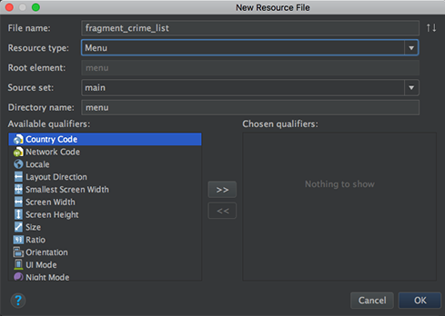
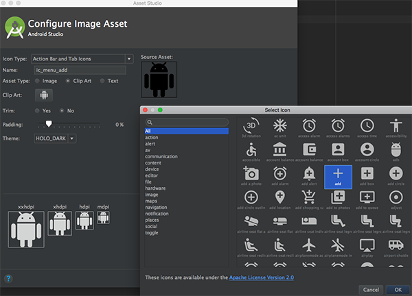
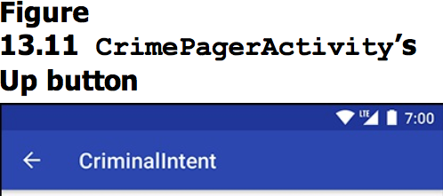
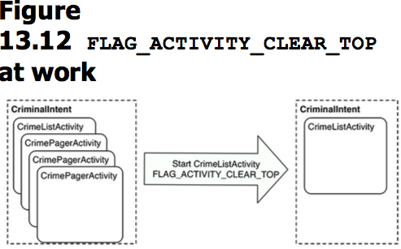

本章在app顶部的toolbar中添加两个菜单项：“+”号菜单用于添加新数据，Hide Subtitle/Show Subtitle用于显示/隐藏Crime总数。


本章要点：
- 创建菜单，并关联响应函数
- 添加系统图标
- 设置层级导航关系
<!-- more -->

# 怎么创建菜单
## 1. 添加菜单的xml布局文件
在res上右键 > New > Android resource file，资源类型选择Menu：


添加菜单项item：
``` xml
<menu xmlns:android="http://schemas.android.com/apk/res/android"
    xmlns:app="http://schemas.android.com/apk/res-auto">
    <item
        android:id="@+id/new_crime"
        android:icon="@drawable/ic_menu_add"
        android:title="@string/new_crime"
        app:showAsAction="ifRoom|withText"/>
    </menu>
```
其中showAsAction用于设定展现形态，`ifRoom`表示如果有空间就展现；否则显示`...`，组合`withText`后表示如果空间足够则展现文字，如果不够则只展现图标，如果还不够则展现`...`。其它showAsAction选项还有`always`和`never`，不建议使用`always`，它表示总是完全展现；`never`则是总展现成`...`。

## 2. 创建菜单
实现回调函数`onCreateOptionsMenu(Menu)`。对于Activity和Fragment，有两个回调函数与菜单相关：
`public void onCreateOptionsMenu(Menu menu, MenuInflater inflater)` 负责创建菜单
`public boolean onOptionsItemSelected(MenuItem item)` 负责响应菜单项点击
这是两个回调函数，如果要创建菜单，需要先调用`Fragment::setHasOptionsMenu(boolean)`，并设置参数为true，告诉FragmentManager“我要显示菜单”，FragmentManager会调用`onCreateOptionsMenu(Menu)`完成菜单创建。

本节的具体代码如下：
``` java
// CrimeListFragment.java
public class CrimeListFragment extends Fragment {
    ...
    @Override
    public void onCreate(Bundle savedInstanceState){
        super.onCreate(savedInstanceState);
        setHasOptionsMenu(true); // 要求创建菜单
    }
    @Override // 完成创建菜单
    public void onCreateOptionsMenu(Menu menu, MenuInflater inflater){
        super.onCreateOptionsMenu(menu, inflater);
        inflater.inflate(R.menu.fragment_crime_list, menu);
    }
}
```
默认的空间只够显示图标，长按会显示提示文字：


## 3. 响应菜单项点击
在前一步中已经提到，响应菜单点击需要实现回调函数`onOptionsItemSelected(MenuItem item)`
``` java
// CrimeListFragment.java
public class CrimeListFragment extends Fragment {
...
@Override
public boolean onOptionsItemSelected(MenuItem item){
    switch (item.getItemId()){
        case R.id.new_crime: // 判断菜单项id
            Crime crime = new Crime(); // 添加数据
            CrimeLab.get(getActivity()).addCrime(crime);
            // 启动Activity编辑新数据
            Intent intent = CrimePagerActivity.newIntent(getActivity(), crime.getId());
            startActivity(intent);
            return true;
        default:
            return super.onOptionsItemSelected(item);
        }
    }
}
```

# 怎么添加系统的剪辑图标
如果要添加系统图标，例如“+”号，可以
①直接使用@android.drawable/ic_menu_add，但不建议这么做，因为不同的设备和系统使用什么图标是可变的，未必总是适合自己的app
②从~/Library/Android/sdk/platforms/android-25/data/res找到这些资源，并添加到app项目里
③通过AndroidStudio添加资源，这种方式最简单。步骤如下：

在drawable右键 > New > Image Asset，在弹出面板上选择`Icon Type`为`Action Bar and Tab Icons`，点击`Clip Art`，在弹出图片库中选择要使用的图标：

然后选择需要支持的屏幕密度即可。

# 动态调整菜单项文字
本节又添加了一条Hide Subtitle/Show Subtitle菜单，用于显示和隐藏数据项的个数。每次点击该菜单项后，菜单项文字会随之变化。本节的做法是在创建菜单时，根据当前状态决定显示`Hide Subtitle`还是`Show Subtitle`：
``` java
// CrimeListFragment.java
...
@Override
public void onCreateOptionsMenu(Menu menu, MenuInflater inflater){
    super.onCreateOptionsMenu(menu, inflater);
    inflater.inflate(R.menu.fragment_crime_list, menu);
    MenuItem subtitleItem = menu.findItem(R.id.show_subtitle);
    if(mSubtitleVisible){
        subtitleItem.setTitle(R.string.hide_subtitle);
    }else{
        subtitleItem.setTitle(R.string.show_subtitle);
    }
}
...
```
这就需要每次点击菜单都重新创建菜单才行，菜单项的响应代码如下：
``` java
// CrimeListFragment.java
...
@Override
public boolean onOptionsItemSelected(MenuItem item){
    switch (item.getItemId()){
        ...
        case R.id.show_subtitle:
            mSubtitleVisible = !mSubtitleVisible;
            // 它会导致菜单无效而重新创建
            getActivity().invalidateOptionsMenu();	 
            updateSubtitle();
            return true;
        default:
            return super.onOptionsItemSelected(item);
    }
}
```

# 使用分层导航Hierarchical Navigation
在AndroidManifest.xml中可以直接设置Activity之间的父子关系：
``` xml
<manifest xmlns:android="http://schemas.android.com/apk/res/android" ...>
    <application ... >
    ...
        <activity android:name=".CrimePagerActivity"
        android:parentActivityName=".CrimeListActivity">
        </activity>
    </application>
</manifest>
```
`android:parentActivityName`会在Activity的标题栏添加导航按钮：

看起来它和点击系统的Back按钮效果一样，而实际上它相当于做了如下操作：
``` java
Intent intent = new Intent(this, CrimeListActivity.class);
intent.addFlags(Intent.FLAG_ACTIVITY_CLEAR_TOP);
startActivity(intent);
finish();
```
FLAG_ACTIVITY_CLEAR_TOP的含义是：在activity栈中查找指定Activity，如果找到，则弹出其上的所有Activity，直到使得该Activity称为栈顶：


## 分层导航的副作用
在本节的例子中，你会发现当从CrimePagerActivity使用分层导航按钮回到CrimeListActivity后，标题栏中的Hide Subtitle/Show Subtitle状态被重置了，使用Back按钮则不存在这样的问题。这是因为使用分层导航的向上按钮会导致上一层Activity被重建。这意味着Activity任何状态变量保存的数据都会消失。也就是说，他其实并不是在Activity栈中找到目标Activity，让它显示出来那么简单，而是彻底重新创建了这个Activity。
本节给出的解决方案是：
1、自己实现navigate up机制，让CrimePagerActivity弹回到CrimeListActivity。
2、当CrimeListActivity弹出CrimePagerActivity时，让后者记住前者的标题，在重建CrimeListActivity时，再把标题传回去。
我其实没有理解这两种方案的差异，但他们都有一个缺陷就是父子Activity的耦合性太强了。书中也没有给出很好的解决方案，竟然说让用户多点一次按钮也不是什么大问题。
为什么Android会使用这么屎的方式来实现Up呢？我觉得这是个致命的缺陷。