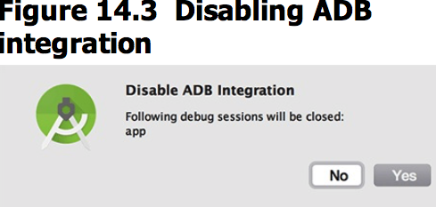
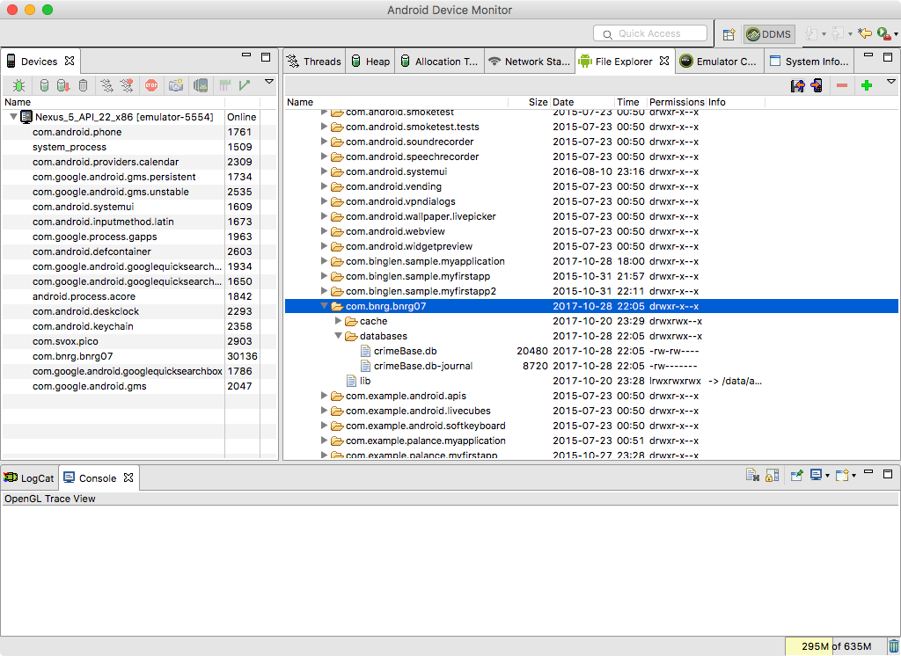

本章引入了SQLite数据库，把原先使用Singleton记录在内存的数据，永久保存到了数据库上。使得app具备的数据保存的能力。
本章要点：
- SQLite数据的操作步骤
<!-- more -->

# 使用SQLite数据库
## 1. 创建数据库
首先派生SQLiteOpenHelper的子类，用于初始化数据库：
``` java
// CrimeBaseHelper.java
public class CrimeBaseHelper extends SQLiteOpenHelper{
    private static final int VERSION = 1;
    private static final String DATABASE_NAME = "crimeBase.db";

    public CrimeBaseHelper(Context context){
        super(context, DATABASE_NAME, null, VERSION);
    }

    @Override
    public void onCreate(SQLiteDatabase db){
        db.execSQL("create table " + CrimeDbSchema.CrimeTable.NAME + "(" +
                " _id integer primary key autoincrement, "+
                CrimeDbSchema.CrimeTable.Cols.UUID + ", " +
                CrimeDbSchema.CrimeTable.Cols.TITLE + ", " +
                CrimeDbSchema.CrimeTable.Cols.DATE + ", " +
                CrimeDbSchema.CrimeTable.Cols.SOLVED + ")");
    }

    @Override
    public void onUpgrade(SQLiteDatabase db, int oldVersion, int newVersion){
    }
}
```
在调用端数据库的代码如下：
``` java
// CrimeLab.java
    private CrimeLab(Context context){
        mContext = context.getApplicationContext();
        mDatabase = new CrimeBaseHelper(mContext).getWritableDatabase();
    }
```
它不用关心是否要创建、初始化数据库等问题，这些工作由`CrimeBaseHelper::getWritableDatabase()`完成：
- 打开目录/data/data/<包名>/databases/，如果其下不存在数据库文件crimeBase.db则新建
- 如果是首次创建数据库，则调用`CrimeBaseHelper::onCreate(SQLiteDatabase)`并保存VERSION
- 如果不是首次，则检查数据库的版本号，如果代码版本号高于数据库文件版本号，则调用`onUpgrade(SQLiteDatabase, int, int)`完成数据格式升级。

因此我们只需要在`onCreate(SQLiteDatabase)`中实现数据库创建的代码，在`onUpgrade(SQLiteDatabase, int, int)`中实现数据格式升级的代码即可。

### 封装数据库Schema
在上文中使用了数据库的表名、列名，这些数据数据库Schema的部分，需要自己封装，都是一些常量：
``` java
// CrimeDbSchema.java
public class CrimeDbSchema {
    public static final class CrimeTable{
        public static final String NAME = "crimes";
        public static final class Cols{
            public static final String UUID = "uuid";
            public static final String TITLE = "title";
            public static final String DATE = "date";
            public static final String SOLVED = "solved";
        }
    }
}
```
## 2.添加新数据
用来操作数据库的CrimeBaseHelper实例保存在客户端代码`CrimeLab::mDatabase`中，对其增删改查也都是基于此实例完成的。使用`CrimeBaseHapler::insert(...)`添加新数据，代码如下：
``` java
// CrimeLab.java
    public void addCrime(Crime c){
        ContentValues values = getContentValues(c);
        mDatabase.insert(CrimeDbSchema.CrimeTable.NAME, null, values);
    }
    ...
    private static ContentValues getContentValues(Crime crime){
        ContentValues values = new ContentValues();
        values.put(CrimeDbSchema.CrimeTable.Cols.UUID, crime.getId().toString());
        values.put(CrimeDbSchema.CrimeTable.Cols.TITLE, crime.getTitle());
        values.put(CrimeDbSchema.CrimeTable.Cols.DATE, crime.getDate().getTime());
        values.put(CrimeDbSchema.CrimeTable.Cols.SOLVED, crime.isSolved() ? 1:0);
        return values;
    }
```
### 使用ContentValues
写数据库的时候需要过把数据封装成ContentValues实例，它类似HashMap或Bundle，内部保存了key-value对。在函数`getContentValues(Crime)`中，把业务层数据转成ContentValues实例。

调用`insert(...)`时，第1个参数是表名，第3个是要插入的值。第2个参数被称为`nullColumnHack`，如果insert的某个字段为空，SQLite的插入操作会失败，此时给`nullColumnHack`传入一个uuid就可以绕过这个问题。但是，如果数据库的设计要求某字段不能为空，还是应该按照数据库的设计意图填入内容，而不是绕过，因此建议不要使用这个tricky参数，总是传入null。

## 3.修改数据
和添加类似，修改也是在客户端操作`CrimeLab::mDatabase`对象，使用`CrimeBaseHapler::update(...)`：
``` java
// CrimeLab.java
    public void updateCrime(Crime crime){
        String uuidString = crime.getId().toString();
        ContentValues values = getContentValues(crime);

        mDatabase.update(CrimeDbSchema.CrimeTable.NAME, values,
                CrimeDbSchema.CrimeTable.Cols.UUID + "=?", // whereClause
                new String[]{uuidString});  // whereArgs
    }
```
和`insert(...)`的不同在于它要指定要修改哪一条数据，通过crimeId来指定。这里没有使用where语句，而是通过`=?`传入等号的右值参数，这样做的好处在于安全。如果使用where语句，形式如`where ABC=“xxx”`，等号右侧的`xxx`本应传入字符串，但是可以构造出特殊的字串来篡改整句SQL文，这被称为SQL注入攻击。使用`=？`可以把右值参数仅当作字符变量来处理，而不会变成SQL代码，从而避免了被注入的风险。

## 4.查询数据
直接上代码：
``` java
// CrimeLab.java
    private CrimeCursorWrapper queryCrimes(String whereClause, String[] whereArgs){
        Cursor cursor = mDatabase.query(CrimeDbSchema.CrimeTable.NAME,
                null, // columns - null selects all columns
                whereClause,
                whereArgs,
                null, //groupBy
                null, // having
                null    // orderBy
        );
        return new CrimeCursorWrapper(cursor);
    }

    public List<Crime> getCrimes(){
        List<Crime> crimes = new ArrayList<>();
        CrimeCursorWrapper cursor = queryCrimes(null, null);
        try{
            cursor.moveToFirst();
            while(!cursor.isAfterLast()){
                crimes.add(cursor.getCrime());
                cursor.moveToNext();
            }
        }finally{
            cursor.close();
        }
        return crimes;
    }

    public Crime getCrime(UUID id){
        CrimeCursorWrapper cursor = queryCrimes(CrimeDbSchema.CrimeTable.Cols.UUID + "=?",
                new String[] {id.toString()});
        try{
            if(cursor.getCount() == 0){
                return null;
            }
            cursor.moveToFirst();
            return cursor.getCrime();
        }finally {
            cursor.close();
        }
    }
```
其中`whereClause`和`whereArgs`参数和`update（...)`一致，需要关注最后一句CrimeCursorWrapper类。前文讲过，在写数据库的时候需要把数据封装成ContentValues实例，在读取数据的时候，SQLite则是以Cursor实例输出的，这属于底层机制层，CrimeCursorWrapper的作用就是隐藏掉数据库细节，转换成业务层数据：
``` java
// CrimeCursorWrapper.java
public class CrimeCursorWrapper extends CursorWrapper {
    public CrimeCursorWrapper(Cursor cursor){
        super(cursor);  // 内部保存了cursor
    }

    public Crime getCrime(){
        // 从cursor提取每一个字段
        String uuidString = getString(getColumnIndex(CrimeDbSchema.CrimeTable.Cols.UUID));
        String title = getString(getColumnIndex(CrimeDbSchema.CrimeTable.Cols.TITLE));
        long date = getLong(getColumnIndex(CrimeDbSchema.CrimeTable.Cols.DATE));
        int isSolved = getInt(getColumnIndex(CrimeDbSchema.CrimeTable.Cols.SOLVED));
        // 组织成crime实例
        Crime crime = new Crime(UUID.fromString(uuidString));
        crime.setTitle(title);
        crime.setDate(new Date(date));
        crime.setSolved(isSolved != 0);
        return crime;
    }
}
```
以上就是数据库的操作部分，本节的剩余部分就是引入数据库后对于业务层带来的变化了。

## 引入SQLite给业务层带来的变化
### 添加记录
点击“+”菜单，由`CrimeListFragment::onOptionsItemSelected(...)`响应：
``` java
// CrimeListFragment.java
    @Override
    public boolean onOptionsItemSelected(MenuItem item){
        switch (item.getItemId()){
            case R.id.new_crime:
                Crime crime = new Crime();
                CrimeLab.get(getActivity()).addCrime(crime);
                Intent intent = CrimePagerActivity.newIntent(getActivity(), crime.getId());
                startActivity(intent);
                return true;
            ...
        }
    }
```
它调用到`CrimeLab::addCrime(...)`完成入库。
### 修改数据
当从CrimeFragment中退出回到CrimeListFragment时，需要完成数据的修改：
``` java
// CrimeFragment.java
    @Override
    public void onPause(){
        super.onPause();
        CrimeLab.get(getActivity()).updateCrime(mCrime);
    }
```
它调用到`CrimeLab::updateCrime(...)`完成数据库的更新。
### 查询数据
当CrimeListFragment首次加载时，调用`CrimeListFragment::onCreateView(...)` > `CrimeListFragment::updateUI()` > `CrimeLab::getCrimes()` ;
当从CrimeFragment退回到CrimeListFragment时，调用`CrimeListFragment::onResume()` > `CrimeListFragment::updateUI()` > `CrimeLab::getCrimes()`;
`CrimeLab::getCrimes()`。
从数据库中查询到数据，传递给CrimeAdapter，完成UI更新：
``` java
// CrimeListFragment.java
    private void updateUI(){
        CrimeLab crimeLab = CrimeLab.get(getActivity());
        List<Crime> crimes = crimeLab.getCrimes();
        if(mAdapter == null) {
            mAdapter = new CrimeAdapter(crimes);
            mCrimeRecyclerView.setAdapter(mAdapter);
        }else{
            mAdapter.setCrimes(crimes);
            mAdapter.notifyDataSetChanged();
        }
        updateSubtitle();
    }
```

# 使用Android Device Monitor查看文件
Android Studio菜单 Tools > Android > Android Device Monitor，弹出`Disable ADB Integration`对话框，点击“No”：

在Android Device Monitor的File Explorer中就可以看到Android设备的文件了：


