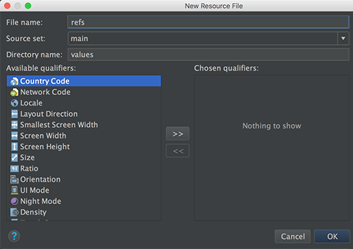
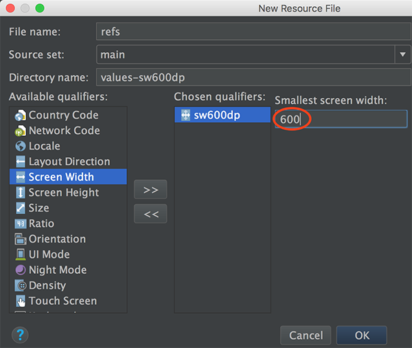

本章
本章要点：
- 
<!-- more -->

# 使用资源别名
在`res/values右键` > `New` > `Values Resource File`：

创建文件`res/values/refs.xml`如下：
``` xml
<?xml version="1.0" encoding="utf-8"?>
<resources>
    <item name="activity_masterdetail" type="layout">@layout/activity_fragment</item>
</resources>
```
这样就为`R.layout.activity_fragment`创建了一个别名`R.layout.activity_masterdetail`，原先使用前者的地方，现在也可以直接使用后者：
``` java
// CrimeListActivity.java
public class CrimeListActivity extends SingleFragmentActivity {
    ...
    @Override
    protected int getLayoutResId(){
        return R.layout.activity_masterdetail;
        // return R.layout.activity_fragment; // 这两行代码是等价的
    }
}
```
## 根据设备尺寸为指定资源生成两套实现
本节为设备宽度大于600dp时创建了refs.xml的另一套实现，操作步骤为：`res/values右键` > `New` > `Values Resource File` > 弹出New Resource File > 在`Available qualifiers`中选择`Smallest Screen Width` > 点击 `>>` > 在`Smallest Screen Width：`中填写600 > 点击OK：

`sw`是`smallest width`的缩写，`sw600dp`表示当设备的宽度大于600dp时，使用本配置。完成res/values/refs.xml(sw600dp)文件内容为：
``` xml
<?xml version="1.0" encoding="utf-8"?>
<resources>
    <item name="activity_masterdetail" type="layout">@layout/activity_twopane</item>
</resources>
```

这样就实现了在屏幕宽度小于600dp的手机下使用refs.xml，即单个List视图；在屏幕宽度大于等于600dp的tablet下使用refs.xml(sw600dp)，即List-Detail双视图。在代码中使用`activity_masterdetail`，同时实现`activity_twopane`的布局，即可完成目标效果。

# 适配tablet的布局，让布局在phone下是List > 点击 > Details模式
，在tablet下是List|Details模式，需要修改：
1、修改SingleFragmentActivity，使得它的布局不是hardcode写死的
2、创建新的布局，包含两个fragment容器
3、修改CrimeListActivity，使之在phone下加载一个Fragment容器，在tablet下加载两个容器

## 1.修改SingleFragmentActivity
``` java
public abstract class SingleFragmentActivity extends AppCompatActivity {
    protected abstract Fragment createFragment();

    @LayoutRes
    protected int getLayoutResId(){
        return R.layout.activity_fragment;
    }

    @Override
    protected void onCreate(Bundle savedInstanceState) {
        super.onCreate(savedInstanceState);
        setContentView(getLayoutResId());	// 修改此处，不再hardcode

        FragmentManager fm = getSupportFragmentManager();
        Fragment fragment = fm.findFragmentById(R.id.fragment_container);
        if(fragment  == null){
            fragment = createFragment();
            fm.beginTransaction().add(R.id.fragment_container, fragment).commit();
        }
    }
}
```

# @LayoutRes关键字
``` java
// SingleFragmentActivity.java
public abstract class SingleFragmentActivity extends AppCompatActivity {
    protected abstract Fragment createFragment();

    @LayoutRes
    protected int getLayoutResId(){
        return R.layout.activity_fragment;
    }
...
}
```
P2464用@LayoutRes作为函数的前缀，表明该函数一定返回一个合法的layout资源ID。
