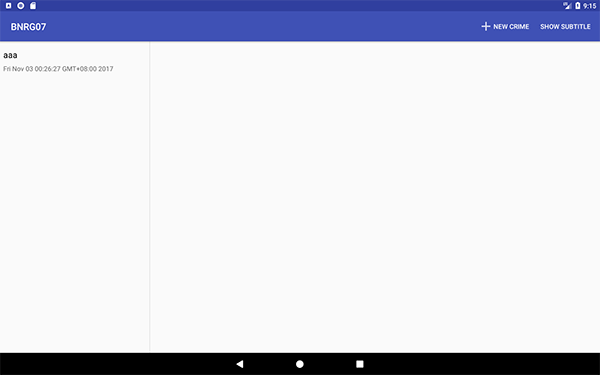

本章
本章要点：
- 
<!-- more -->

# 使用资源别名
在`res/values右键` > `New` > `Values Resource File`：

创建文件`res/values/refs.xml`如下：
``` xml
<?xml version="1.0" encoding="utf-8"?>
<resources>
    <item name="activity_masterdetail" 
    type="layout">@layout/activity_fragment</item>
</resources>
```
这就为`R.layout.activity_fragment`创建了一个别名`R.layout.activity_masterdetail`，原先使用前者的地方，现在可以直接使用后者：
``` java
// CrimeListActivity.java
public class CrimeListActivity extends SingleFragmentActivity {
    ...
    @Override
    protected int getLayoutResId(){
        return R.layout.activity_masterdetail;
        // return R.layout.activity_fragment; // 这两行代码是等价的
    }
}
```
## 根据设备尺寸为指定资源生成两套实现
本节为设备宽度大于600dp时创建了refs.xml的另一套实现，操作步骤为：`res/values右键` > `New` > `Values Resource File` > 弹出New Resource File > 在`Available qualifiers`中选择`Smallest Screen Width` > 点击 `>>` > 在`Smallest Screen Width：`中填写600 > 点击OK：

`sw`是`smallest width`的缩写，`sw600dp`表示当设备的宽度大于600dp时，使用版本`refs.xml(sw600dp)`否则使用版本`refs.xml`。`res/values/refs.xml(sw600dp)`文件内容为：
``` xml
<?xml version="1.0" encoding="utf-8"?>
<resources>
    <item name="activity_masterdetail" 
    type="layout">@layout/activity_twopane</item>
</resources>
```

在屏幕宽度＜600dp的phone下，`activity_masterdetail`=`@layout/activity_fragment`；
在屏幕宽度≥600dp的tablet，`activity_masterdetail`=`@layout/activity_twopane`。
在代码中使用`activity_masterdetail`，同时实现`activity_twopane`的布局，即可完成目标效果。

# 适配tablet的布局
目标是：让布局在phone下是List > 点击 > Details模式，在tablet下是List|Details模式，需要修改：
1、修改SingleFragmentActivity，使得它的布局不是hardcode写死的
2、创建新的布局，包含两个fragment容器
3、修改CrimeListActivity，使之在phone下加载一个Fragment容器，在tablet下加载两个容器

## 1.修改SingleFragmentActivity
``` java
public abstract class SingleFragmentActivity extends AppCompatActivity {
    protected abstract Fragment createFragment();

    @LayoutRes
    protected int getLayoutResId(){
        return R.layout.activity_fragment;
    }

    @Override
    protected void onCreate(Bundle savedInstanceState) {
        super.onCreate(savedInstanceState);
        setContentView(getLayoutResId());	// 修改此处，不再hardcode

        FragmentManager fm = getSupportFragmentManager();
        Fragment fragment = fm.findFragmentById(R.id.fragment_container);
        if(fragment  == null){
            fragment = createFragment();
            fm.beginTransaction().add(R.id.fragment_container, fragment).commit();
        }
    }
}
```
把原先写死的加载布局`R.layout.activity_fragment`改成了从函数获取，这样子类就有机会重写函数`getLayoutResId()`，也就可以在子类中重新定义需要加载的布局了。
`SingleFragmentActivity`有两个子类：`CrimeListActivity`和`CrimeActivity`。要修改的是前者：在phone下只包含一个CrimeListFragment，在tablet下包含CrimeListFragment和CrimeFragment。

### @LayoutRes关键字
前面那段代码中使用了@LayoutRes关键字，见书中P2464，表明该函数一定返回一个合法的layout资源ID。

## 2.创建容纳两个Fragment的新布局
activity_twopane.xml
``` xml
<?xml version="1.0" encoding="utf-8"?>
<LinearLayout xmlns:android="http://schemas.android.com/apk/res/android"
              android:layout_width="match_parent"
              android:layout_height="match_parent"
              android:divider="?android:attr/dividerHorizontal"
              android:orientation="horizontal"
              android:showDividers="middle">
    <FrameLayout
        android:id="@+id/fragment_container"
        android:layout_width="0dp"
        android:layout_height="match_parent"
        android:layout_weight="1">

    </FrameLayout>

    <FrameLayout
        android:id="@+id/detail_fragment_container"
        android:layout_width="0dp"
        android:layout_height="match_parent"
        android:layout_weight="3">

    </FrameLayout>
</LinearLayout>
```

## 3.让CrimeListActivity兼容tablet
``` java
// CrimeListActivity.java
public class CrimeListActivity extends SingleFragmentActivity
implements CrimeListFragment.Callbacks, CrimeFragment.Callbacks{
    @Override
    protected Fragment createFragment(){
        return new CrimeListFragment();
    }

    @Override
    protected int getLayoutResId(){
        return R.layout.activity_masterdetail;
    }
    ...
}
```

这三步组合的逻辑是：`SingleFragmentActivity`根据子类提供的LayoutResId决定要加载的布局，并把子类提供的Fragment添加到Activity。
对于`CrimeListActivity`，在屏幕宽度＜600dp的phone下，加载到的布局是单Fragment，创建的Fragment是CrimeListFragment;在屏幕宽度≥600dp的tablet下，加载到的布局是双Fragment，创建的Fragment也是CrimeListFragment，并对应到fragment_container上。


<font color=red>有个问题需要回头再研究的：Fragment和布局里的id究竟是怎么关联起来的呢？我记得在FragmentManager的事务中，id仅用来做标识的。</font>

## 4.展现detail视图
其实仅这三步并没有完成对tablet的适配，因为details还没有出场。一般的想法是在CrimeListFragment中响应item点击，让CrimeFragment展现出来，但这样会导致list和detail视图之间的耦合，他们是平级的，相互之间应该解耦，这属于上层CrimeListActivity的业务逻辑，应该交给它处理。

### 设置回调
因此在本节由CrimeListActivity提供回调函数给CrimeListFragment，当item被点击时，后者只负责回调该函数，并不知道其内部细节。本节处理这块的手法非常精妙：
``` java
// CrimeListFragment.java
public class CrimeListFragment extends Fragment {
    ...
    private Callbacks mCallbacks;

    public interface Callbacks{
        void onCrimeSelected(Crime crime);
    }

    @Override
    public void onAttach(Context context){
        super.onAttach(context);
        mCallbacks = (Callbacks)context;
    }

    @Override
    public void onDetach(){
        super.onDetach();
        mCallbacks = null;
    }
    ...
}
```
它定义了一个接口类，该类必须有一个`void onCrimeUpdated(Crime crime)`接口。
回顾[笔记七·fragment的生命周期](http://localhost:4000/2016/10/18/2017/1018AndroidProgrammingBNRG07/#fragment的生命周期)，当CrimeListFragment被载入Activity时，Activity会调用它的`onAttach(Context)`函数，并把自己当做参数传入，即这个Contetxt其实是宿主Activity，他又被赋给了Callbacks类型的成员变量，这就要求宿主Activity必须有` void onCrimeUpdated(Crime crime)`接口，否则会出编译错误。

### 实现回调
接下来需要让宿主Activity遵守该接口，并响应点击事件：
``` java

public class CrimeListActivity extends SingleFragmentActivity
implements CrimeListFragment.Callbacks, CrimeFragment.Callbacks{
    @Override
    protected Fragment createFragment(){
        return new CrimeListFragment();
    }
    ...
    @Override
    protected int getLayoutResId(){
        return R.layout.activity_masterdetail;
    }

    @Override
    public void onCrimeSelected(Crime crime){
        if(findViewById(R.id.detail_fragment_container) == null){
            Intent intent = CrimePagerActivity.newIntent(this, crime.getId());
            startActivity(intent);
        }else{
            Fragment newDetail = CrimeFragment.newInstance(crime.getId());
            getSupportFragmentManager().beginTransaction().replace(R.id.detail_fragment_container,
                    newDetail).commit();
        }
    }
}
```
回顾[“创建容纳两个Fragment的新布局”](http://localhost:4000/2016/10/28/2017/1028AndroidProgrammingBNRG17/#2-创建容纳两个Fragment的新布局)，`R.id.detail_fragment_container`是在`activity_twopane.xml`中定义的。
再回顾[“让CrimeListActivity兼容tablet”](http://localhost:4000/2016/10/28/2017/1028AndroidProgrammingBNRG17/#3-让CrimeListActivity兼容tablet)：
- 在phone下它提供的布局是`activity_fragment`，因此找不到资源`R.id.detail_fragment_container`，if分支为真，将启动`CrimePagerActivity`；
- 在tablet下它提供的布局是`activity_twopane`，走else分支，使用`CrimeFragment`替换掉`R.id.detail_fragment_container`。

### 调用回调
最后一步是在点击菜单“+”或点击item时调用回调函数：
``` java
// CrimeListFragment.java
public class CrimeListFragment extends Fragment {
    ...
    private class CrimeHolder extends RecyclerView.ViewHolder
    implements View.OnClickListener{
        ...
        @Override
        public void onClick(View view){ // 响应item点击
            mCallbacks.onCrimeSelected(mCrime);
        }
    }
    @Override
    public boolean onOptionsItemSelected(MenuItem item){
        switch (item.getItemId()){
            case R.id.new_crime:        // 响应“+”
                Crime crime = new Crime();
                CrimeLab.get(getActivity()).addCrime(crime);
                updateUI();
                mCallbacks.onCrimeSelected(crime);
                return true;
            ...
        }
    }
}
```

## 5.更新CrimeListFragment
完善业务逻辑，还需要在CrimeFragment中的数据被编辑更新后，同步更新左侧的CrimeListFragmen，手法和[展现detail视图](http://localhost:4000/2016/10/28/2017/1028AndroidProgrammingBNRG17/#4-展现detail视图)是一模一样的：在CrimeFragment中定义内部接口类，让CrimeListActivity遵守该接口类，并定义回调，供CrimeFragment调用。没什么新内容，这里就不再重复了。

# 设备尺寸决定的配置
在Android3.2之前使用设备的具体尺寸修饰资源文件，使得该资源文件能匹配不同的设备尺寸，具体的尺寸被分为四类：small, normal, large和xlarge，下表给出这四类对应的屏幕最小尺寸：

Name|Minimum screen size
---|---|---
small|320×426dp
normal|320×470dp
large|480×640dp
xlarge|720×960dp

到了Android3.2之后具体尺寸修饰方式被废掉了，取代它的是维度修饰：

Qualifier format|Description
---|---|---
wXXXdp|可用宽度≥XXXdp
hXXXdp|可用高度≥XXXdp
swXXXdp|最小宽度或高度≥XXXdp

例如为宽度≥300dp的屏幕创建布局文件，应为res/layout-w300dp。
sw的含义是最小宽度，例如在1024×800的屏幕sw就是800，在800×1024的屏幕，sw依然是800。