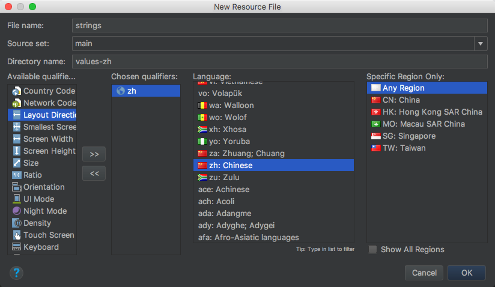
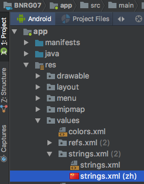
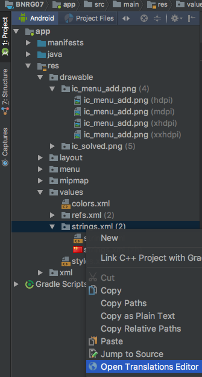

本章支持了国际化，引入多语种的支持。
本章要点：
- 添加不同的语种字符资源
<!-- more -->

# 添加不同语种的字符资源
为strings资源创建语言相关的子目录即可。具体步骤：
右键res/values > New > Values resource file，在`Avaliable qualifier`选择`Locale`，进而选择需要的语言和区域：

它会在res/Values下为strings创建对应语种的备选：

将strings本尊的内容拷贝到strings.xml(zh)中，修改为中文版本即可。

## 保留默认资源
尽管strings.xml用于英文，但是不要把它改名为strings.xml(en)，因为这会让默认语种空缺，当设备的locale改为app不支持的语种时，由于没有默认语种，导致xml布局文件中原本应当显示字串的地方，只能显示字串资源的id，更糟糕的是会导致引用该资源的java代码崩溃。

“保留默认资源”的原则有一个例外，那就是屏幕度。res/drawable下的资源被分为-mdpi, -xxhdpi等等，当找不到与设备匹配的drawable资源时，Android并不是简单的拿默认资源顶上，而是拿和设备尺寸、密度接近的资源补上。具体策略可参见[《支持多种屏幕》](https://developer.android.com/guide/practices/screens_support.html)。

## 使用Translations Editor检查翻译覆盖度
AndroidStudio提供了一个工具Translations Editor，将多种语言下同一个字符显示在一起，便于检查翻译的覆盖度，右键res/values/strings.xml > Open Translations Editor：

## 设备资源类型
在官方文档[《应用资源》](https://developer.android.com/guide/topics/resources/providing-resources.html#AlternativeResources)中罗列了完整的设备资源类型。
一个资源如果针对几种设备类型都有对应的版本，Android会按照该文档中的顺序决定优先使用哪一个。例如一个字符串，提供了zh版本，有提供了w600dp版本，在宽度为600dp的中文环境下，Android会使用zh版本，而不是w600dp。