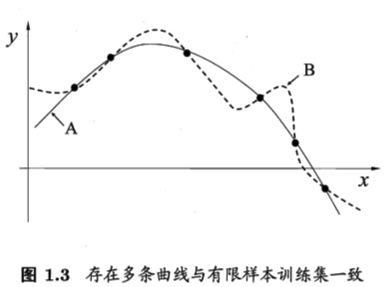
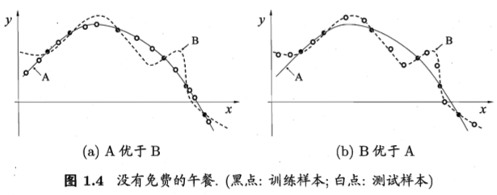

本章主要介绍基本术语，这些术语成为后面描述问题的基础。

本章要点：
- 
<!-- more -->

# 基本术语和概念
假设手机一批西瓜的数据：
(色泽=青绿; 根蒂=蜷缩; 敲声=浊响)
(色泽=乌黑; 根蒂=稍蜷; 敲声=沉闷)
(色泽=浅白; 根蒂=硬挺; 敲声=清脆)
……

以上这组记录的集合称为一个数据集（data set）。

每条记录是关于一个事件或对象的描述，称为一个示例（instance）或样本（sample）。

反映事件或对象在某方面的表现或性质，例如“色泽”、“根蒂”、“敲声”称为属性（attribute）或特征（feature）。属性的取值，如“青绿”、“乌黑”称为属性值（attribute value），属性张成的空间称为属性空间（attribute space）或样本空间（sample space）或输入空间（input space）。

把“色泽”、“根蒂”、“敲声”作为三个坐标轴，它们张成一个用于描述西瓜的三维空间，每个西瓜都可以在这个空间中找到自己的坐标，由于空间中每个点对应一个坐标向量，因此把一个示例称为一个特征向量（feature vector）。

令D={x1, x2, ...,  xm}表示包含m个样本的数据集，每个样本由d个属性描述，则每个样本xi=(xi1; xi2;...;xid)是d维样本空间X中的一个向量，xi∈X，其中xij是xi在第j个属性上的取值，d称为样本xi的维数（dimensionality）。

从数据中学的模型的过程称为学习（learning）或训练（training）。
训练过程中使用的数据称为训练数据（training data），其中每个样本称为训练样本（training sample），训练样本组成的集合称为训练集（training set），学得模型对应了关于数据的某种潜在规律称为假设（hypothesis），这种潜在规律自身称为真相或事实（ground-truth)。

如果希望学得一个能判断没剖开的是不是“好瓜”的模型，仅有前面的样本数据是不够的，还需要获得训练样本的“结果”信息，该结果信息称为标记（label），有了标记信息的样本称为样例（example）。用(xi, yi)表示第i个样例，其中yi∈Y是样本xi的标记，Y是所有标记的集合，称为标记空间（label space）或输出空间。

如果待预测的是离散值，例如“好瓜”、“坏瓜”，这类学习任务称为分类（classification），如果待预测的是连续值，例如西瓜成熟度0.95、037，这类学习问题称为回归（regression）

学的模型后，使用其进行预测的过程称为测试（testing），被预测的样本称为测试样本（testing Sample）

将训练集中的西瓜分成若干组，每组称为一个簇（cluster），这些自动形成的簇可能对应一些潜在的概念划分，这样的学习过程称为聚类（clustering），在聚类学习中，这些潜在的概念是事先不知道的，而且学习过程中使用的训练样本通常没有标记信息。

根据训练数据是否有标记信息，学习任务可划分为两大类：监督学习（supervised learning）和无监督学习（unsupervised learning），分类和回归是前者的代表，聚类是后者的代表。

机器学习的目标是视学得的模型能很好的适用于新样本，而不是仅仅在训练样本上工作的很好。学得模型适用于新样本的能力称为泛化（generalization）能力

假设样本空间中全体样本服从一个未知分布（distribution）D，我们获得的每个样本都是独立地从这个分布上采样获得的，即独立同分布（independent and identically distributed，简称i.i.d）

# 归纳偏好
机器学习算法在学习过程中对某种类型假设的偏好，称为归纳偏好（inductive bias）或简称偏好。

归纳偏好有点类似于排序算法中的“稳定性”的概念。一个有效的机器学习算法必有其归纳偏好，否则它将被假设空间中看似在训练集上“等效”的假设所迷惑，而无法产生确定的学习结果。即学得的模型对于同一个样本时而告诉我们它是好的，时而告诉我们它是不好的，这样的学习结果是没有意义的。

本节祭出牛逼闪闪的“没有免费的午餐”定理（No Free Lunch Theorem，简称NFL定理）[Wolpert, 1996; Wolpert and Macready, 1995]，表明无论学习算法𝞷a多聪明多牛逼，学习算法𝞷b多笨拙多傻逼，它们的期望性能是相同的。
对于给定的训练集，可能学习出模型A和模型B：

当测试样本为（a）时，A就优于B，当测试样本为（b）时，B就优于A：

NFL定理有一个重要前提是：所有“问题”出现的机会相同，而实际情况常常不是这样，我们只关注自己正在试图解决的问题。
NFL所表达的含义是：脱离具体问题，空泛谈论“什么学习算法更好”毫无意义，因为如果考虑所有潜在问题，所有学习算法都一样好。要谈论算法的相对优劣，必须针对具体的学习问题。这个工作还是依赖“人”对业务的理解程度，所以在“人工智能”的领域，更需要产品思维导向，渗透和理解业务，才能选取更贴切的归纳偏好。这是我个人的理解。