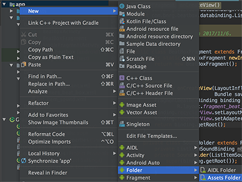
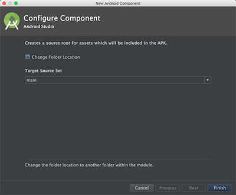
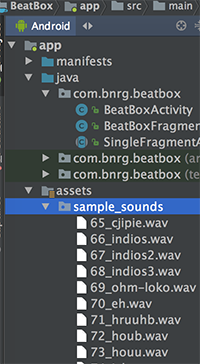

本章。
本章要点：
- Data Binding
- assets 资源
<!-- more -->

什么是data binding？
什么是Model-View-ViewModel，MVVM？
在创建project的时候有一个“是否支持kotlin"选项，这是什么意思？

# Data Binding
## 什么是Data Binding
## 怎么实现Data Binding
### 1.配置app/build.gradle
``` gradle
android {
    ...
    defaultConfig { ... }
    buildTypes { ... }
    dataBinding{
        enabled = true
    }
}
```
开启了dataBinding，IDE会自动生成data binding class，并集成到项目当中供你使用。
### 2.用layout包裹目标布局
// fragment_beat_box.xml
``` xml
<layout xmlns:android="http://schemas.android.com/apk/res/android">
    <android.support.v7.widget.RecyclerView
        android:id="@+id/recycler_view"
        android:layout_width="match_parent"
        android:layout_height="match_parent"/>
</layout>
```
按照之前的做法，这个布局文件只放RecyclerView，现在需要在外面裹一层`layout`标签，这层标签会令data binding tool自动生成binding class，默认类名根据该布局的文件名生成，所不同的是布局文件名是xxx_yyy.xml而类名是XxxYyy。在本节为`fragment_beat_box.xml`生成的data binding class为`FragmentBeatBoxBinding`。

按照以前的做法，一个Activity需要在`onCreate(...)`函数中inflate布局文件，再根据id提取widget：
``` java
    @Override
    protected void onCreate(Bundle savedInstanceState){
        super.onCreate(savedInstanceState);
        setContentView(R.layout.activity_crime_pager); // 加载布局文件
        ...
        mViewPager = (ViewPager)findViewById(R.id.crime_view_pager); // 根据id提领子视图
        ...
    }
```
使用了data binding，则需要从布局文件中inflate出data binding instance：
``` java
    @Override
    public View onCreateView(LayoutInflater inflater, ViewGroup container,
                             Bundle savedInstanceState){
        // 从布局文件提领data binding实例
        FragmentBeatBoxBinding binding = DataBindingUtil.inflate(inflater,
                R.layout.fragment_beat_box, container, false);
        // 根据data binding实例直接访问布局中的子视图
        binding.recyclerView.setLayoutManager(new GridLayoutManager(getActivity(), 3));
        return binding.getRoot();
    }
```
该实例的`getRoot()`方法返回布局中祖先节点，此外还可以通过id直接访问布局中的子视图，如上例中的`binding.recyclerView`。

有时候AndroidStudio会报告找不到`FragmentBeatBoxBinding`这个符号，可以手动添加`import com.bnrg.beatbox.databinding.FragmentBeatBoxBinding;`。

## Data Binding有什么好处？

# 添加Assets资源
Assets资源会被原封不动地打入apk包，和一般的资源相比，不会有系统工具帮助统一管理assets资源——不会根据设备分辨率、语言、横竖屏不同而匹配不同资源，不能在代码中通过布局文件或其他资源文件提取到assets资源。仅通过代码控制的资源，例如音频文件适合以assets资源的形式存在。添加assets资源的步骤如下：

在app右键 > New > Folder > Assets Folder：

在弹出窗口中点击Finish：

再在assets右键 > New > Directory，创建新目录sample_sounds。将音频文件直接拷贝到目录BeatBox/app/src/main/assets/sample_sounds/，它们将自动展现到AndroidStudio项目内：


通过如下代码获取资源：
``` java
AssetManager assets = context.getAssets();
soundNames = assets.list("sample_sounds");
```
其中context可以是任意Activity，通过`assets.list("sample_sounds")`函数列出assets/sample_sounds目录下所有资源名称。