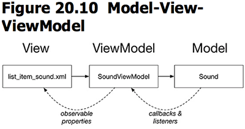

本章引入了Data Binding，让Java代码和XML文件之间可以更直接地相互调用。
本章要点：
- Data Binding
- MVVM vs MVC
- assets 资源
<!-- more -->

# Data Binding
## 什么是Data Binding
Data Binding是让Java代码和XML布局文件相互打通的技术，它包括：
1. 在Java代码中直接把ID当做变量访问元素的能力。本节之前，也可以在Java代码中提领XML文件中的元素，通过`findViewById(...)`来查找和获取子控件，使用了Data Binding之后，AndroidStudio会为XML文件生成Java类，这样就可以直接把XML文件中的ID直接当做Java对象来访问了。
2. 在XML文件中嵌入Java代码完善布局的能力。很有点JSP的味道了，本节之前介绍的内容足以完成所有的界面展现、交互工作，为什么还要提供这种能力呢？XML布局文件规定的是显示模板，Java代码提供的是数据和展现代码，展现代码必须遵守模板规定的方式工作——比如界面上有几个widget，分别对应数据的什么字段——模板和代码紧紧地耦合在一起。
打个比方：一个手机生产厂商委托A生产包装盒，B生产手机及配件。本节之前的方式是由B负责出厂包装，如果A生产的包装盒内部布局发生变化，就可能会影响B在包装流水线中的分工协作。引入了Data Binding机制之后，相当于把出厂包装的活交给了A，A和B之间只要商定好手机和配件尺寸规格即可——这是两家公司必须了解的细节，至于公司A怎么设计包装盒，B就不管了，他只负责把生产好的手机和配件交给A，如果A改动了包装布局，它自然知道该怎么调整出厂包装。这样的分工安排更合理。

## 让Java代码访问XML布局元素
### 1.配置app/build.gradle
``` gradle
android {
    ...
    defaultConfig { ... }
    buildTypes { ... }
    dataBinding{
        enabled = true
    }
}
```
开启了dataBinding，IDE会自动生成data binding class，并集成到项目当中供你使用。
### 2.用layout包裹目标布局
// fragment_beat_box.xml
``` xml
<layout xmlns:android="http://schemas.android.com/apk/res/android">
    <android.support.v7.widget.RecyclerView
        android:id="@+id/recycler_view"
        android:layout_width="match_parent"
        android:layout_height="match_parent"/>
</layout>
```
按照之前的做法，这个布局文件只放RecyclerView，现在需要在外面裹一层`layout`标签，这层标签会令data binding tool自动生成binding class，默认类名根据该布局的文件名生成，所不同的是布局文件名是xxx_yyy.xml而类名是XxxYyy。在本节为`fragment_beat_box.xml`生成的data binding class为`FragmentBeatBoxBinding`。

按照以前的做法，一个Activity需要在`onCreate(...)`函数中inflate布局文件，再根据id提取widget：
``` java
    @Override
    protected void onCreate(Bundle savedInstanceState){
        super.onCreate(savedInstanceState);
        setContentView(R.layout.activity_crime_pager); // 加载布局文件
        ...
        // 根据id提领子视图
        mViewPager = (ViewPager)findViewById(R.id.crime_view_pager); 
        ...
    }
```
使用了data binding，则需要从布局文件中inflate出data binding instance：
``` java
    @Override
    public View onCreateView(LayoutInflater inflater, ViewGroup container,
                             Bundle savedInstanceState){
        // 从布局文件提领data binding实例
        FragmentBeatBoxBinding binding = DataBindingUtil.inflate(inflater,
                R.layout.fragment_beat_box, container, false);
        // 根据data binding实例直接访问布局中的子视图recyclerView
        binding.recyclerView.setLayoutManager(new GridLayoutManager(getActivity(), 3));
        return binding.getRoot();
    }
```
该实例的`getRoot()`方法返回布局中祖先节点，此外还可以通过id直接访问布局中的子视图，如上例中的`binding.recyclerView`。

有时候AndroidStudio会报告找不到`FragmentBeatBoxBinding`这个符号，可以手动添加`import com.bnrg.beatbox.databinding.FragmentBeatBoxBinding;`。

## 在XML文件中访问Java对象
### 1.在XML文件中声明数据类型，并使用
// list_item_sound.xml
``` xml
<layout xmlns:android="http://schemas.android.com/apk/res/android"
    xmlns:tools="http://schemas.android.com/tools">
    <data>
        <variable name="viewModel" type="com.bnrg.beatbox.SoundViewModel"/>
    </data>

    <Button
        android:layout_width="match_parent"
        android:layout_height="120dp"
        android:text="@{viewModel.title}"
        tools:text="Sound name"/>
</layout>
```
在`data`部分声明了数据类型，和变量`viewModel`，Data Binding Tools会为每一个变量生成`getter/setter`方法在，Widget中可以使用变量的函数和数据成员，如上例中的`@{viewModel.title}`。这里有一些简写的约定，例如`viewModel.title`是`viewModel.getTitle()`的简写。
下一步肯定就需要把数据传入xml。
### 2.将数据传入XML文件
回顾[笔记八·RecyclerView的设计思想](http://localhost:4000/2017/10/19/2017/1019AndroidProgrammingBNRG08/#RecyclerView的设计思想)，Adapter作为调度中心负责“集装箱”的生产和装配，`onCreateViewHolder()`负责生产，`onBindViewHolder()`负责装配：
``` java
// BeatBoxFragment.java
private class SoundHolder extends RecyclerView.ViewHolder{
    private ListItemSoundBinding mBinding;
    private SoundHolder(ListItemSoundBinding binding){
        super(binding.getRoot());
        mBinding = binding; 
        mBinding.setViewModel(new SoundViewModel(mBeatBox));    // ②
    }

    public void bind(Sound sound){
        mBinding.getViewModel().setSound(sound);    // ④
        mBinding.executePendingBindings();
    }
}

private class SoundAdapter extends RecyclerView.Adapter<SoundHolder>{
    private List<Sound> mSounds;

    public SoundAdapter(List<Sound> sounds){mSounds = sounds;}

    @Override   
    public SoundHolder onCreateViewHolder(ViewGroup parent, int viewType){
        LayoutInflater inflater = LayoutInflater.from(getActivity());
        ListItemSoundBinding binding = DataBindingUtil.inflate(inflater,
                R.layout.list_item_sound, parent, false);
        return new SoundHolder(binding);    // ①
    }

    @Override   
    public void onBindViewHolder(SoundHolder holder, int position){
        Sound sound = mSounds.get(position);
        holder.bind(sound); // ③
    }

    @Override
    public int getItemCount(){return mSounds.size();}
}
```
①生产集装箱时，通过Data Binding将Binding对象传入“集装箱”ViewHolder
②在“集装箱”ViewHolder的构造函数中通过`mBinding.setViewModel(...)`将Java对象传入XML
③④当需要重新装配“集装箱”时，通过`mBinding.getViewModel()`获得XML中的数据，重新为之设置Sound

在`SoundHolder::bind(...)`的末位有一行` mBinding.executePendingBindings();`调用，它的作用是当RecyclerView刷新的时候，确保layout立刻刷新自己，不要延迟。

<font color=red>我发现SoundHolder的构造函数是private，Singleton才会这么写，这会让外部无法创建它的实例，为什么SoundAdapter::onCreateViewHolder(...)可以做到呢？</font>

再来看看“集装箱”里存放的数据，每个集装箱里存放的核心数据就是Sound对象：
``` java
// SoundViewModel
public class SoundViewModel extends BaseObservable{
    private Sound mSound;
    private BeatBox mBeatBox;

    public SoundViewModel(BeatBox beatBox){
        mBeatBox = beatBox;
    }

    @Bindable
    public String getTitle(){
        return mSound.getName();
    }

    public Sound getSound(){
        return mSound;
    }

    public void setSound(Sound sound){
        mSound = sound;
        notifyChange();
    }
}
```
其中`setSound(...)`有一行`notifyChange();`这是因为当“集装箱”SoundHolder发生重新装配`bind(...)`时，layout并不知道这件事，这会导致界面错乱。为了解决这个问题，需要有一种机制当某个集装箱发生重新装配时，应通知layout刷新，`notifyChange();`正是起到这样的作用。它通知Binding class所有标注为`@Bindable`的字段都需要更新，在上面的代码中就是`getTitle()`。

# MVVM（Model-View-ViewModel）
回顾一下本节中BeatBoxFragment，它本来应当承担Controller的角色，应当负责取出Model对象的字段，设置到View的某个子控件上去。但在本节里因为引入了Data Binding，都无需这么做了，它只是简单地把数据对象扔给XML。这似乎改变了原本的MVC格局，弱化了C的职责。但这也引入了一个原本不存在的SoundViewModel。

我们再回到手机生产商的类比上来：原先有专门负责包装的Controller公司，他从包装生产商View拿到包装盒，从手机/配件生产商Model拿到硬件，把他们包装成盒，完成塑封。现在改由包装生产商View直接从手机/配件生产商Model拿到硬件完成包装。但是如果Model直接把一堆手机、配件混在一起，View还需要再分拣，于是两人协商，Model的交付物是一个简易包装，它把一套手机及配件封入简易包装再交给View，这个简易包装就是ViewModel。

在本节的例子中，list_item_sound.xml只使用了一个Sound成员，所以看起来SoundViewModel似乎多余。但是如果list_item_sound.xml使用了多个数据类型的多个字段，SoundViewModel就必要了：
1、负责收纳“一套”数据，也就是在list_item_sound.xml上现实的数据；
2、负责向list_item_sound.xml提供需要的数据接口，SoundViewModel::getTitle()正是这类接口。
本节绘制MVVM的模型如下：


# 添加Assets资源
Assets资源会被原封不动地打入apk包，和一般的资源相比，不会有系统工具帮助统一管理assets资源——不会根据设备分辨率、语言、横竖屏不同而匹配不同资源，不能在代码中通过布局文件或其他资源文件提取到assets资源。
这么多不便为什么还要使用Assets资源呢？因为Assets就像随包带的文件系统，你可以自定义它的目录结构。比如在本例中有20多个音频资源，如果当做一般资源导入，代码需要通过资源ID来操作每一个音频数据，而导入成Assets后，只需要通过代码遍历目录，逐个获取文件即可，以后如果要添加或删除音频，只需要加入或删除文件即可，代码完全不用修改。添加assets资源的步骤如下：

在app右键 > New > Folder > Assets Folder：

在弹出窗口中点击Finish：

再在assets右键 > New > Directory，创建新目录sample_sounds。将音频文件直接拷贝到目录BeatBox/app/src/main/assets/sample_sounds/，它们将自动展现到AndroidStudio项目内：


通过如下代码获取资源：
``` java
AssetManager assets = context.getAssets();
// 获取assets/sample_sounds/下所有文件名
String[] soundNames = assets.list("sample_sounds");
// 获得首个文件的数据
InputStream soundData = assets.open(soundNames[0]);
// 获得第二个文件的数据
AssetFileDescriptor assetFd = assets.openFd(soundNames[1]);
```
访问Assets资源必须通过`AssetManager`，使用`File`操作Assets是不灵的。
其中context可以是任意Activity，通过`assets.list("sample_sounds")`函数列出assets/sample_sounds目录下所有资源名称。
打开文件访问数据时，使用`open(...)`获得`InputStream`实例；使用`openFd(...)`获得`AssetFileDescriptor`实例。

<font color=red>在创建project的时候有一个“是否支持kotlin"选项，这是什么意思？</font>