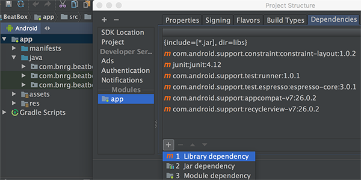
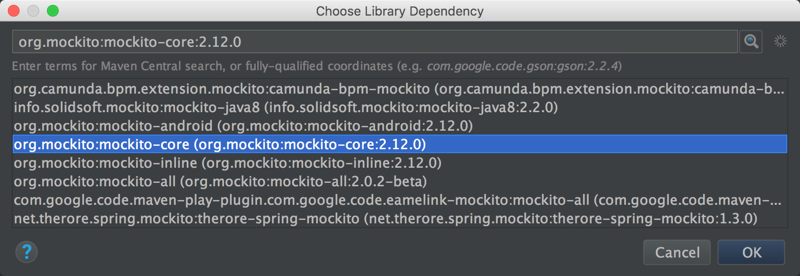
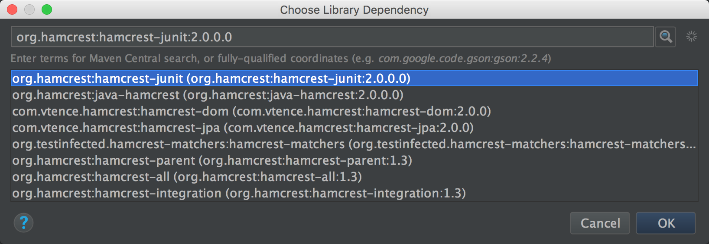
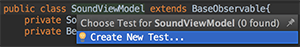
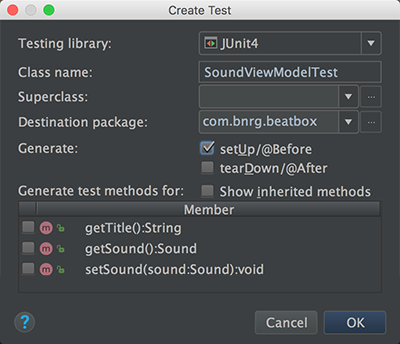
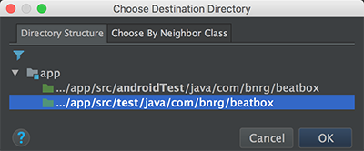
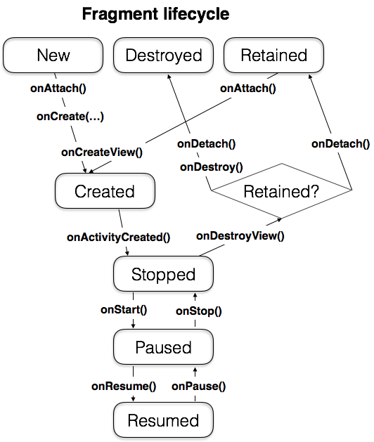

本章的内容有点杂，点击了按钮后可以播放音频了。本章还引入了mockitot、hamcrest等测试框架完成一个简单的单元测试。进一步完善了Data Binding的相关知识，在XML布局文件中为widget关联响应函数。最后还引入了retain Fragment，为转屏重建时保留现场提供了第二种方案。

本章要点：
- 播放音频
- 使用JUnit编写单元测试
- 使用mockito和hamcrest
- 使用Data Binding在XML中为widget关联响应函数
- retain Fragment
<!-- more -->

# 播放音频
SoundPool可以加载多条音频文件，并控制同时播放的数量
``` java
mSoundPool = new SoundPool(MAX_SOUNDS, AudioManager.STREAM_MUSIC, 0);//①
...
AssetFileDescriptor afd = mAssets.openFd(sound.getAssetPath());
int soundId = mSoundPool.load(afd, 1); // ②
sound.setSoundId(soundId);
...

Integer soundId = sound.getSoundId();
mSoundPool.play(soundId, 1.0f, 1.0f, 1, 0, 1.0f); // ③
```
## 1.构造SoundPool实例
SoundPool构造函数中三个参数的含义分别为：
1. 同时播放的数量，如果超过这个数字，SoundPool将停止播放队列中首个音频
2. 音频流类型，安卓定义了多种类型的音频流，每种类型有各自独立的音量设置。当关闭音乐音量时，闹钟音量不受影响，就是因为他们属于不同的音频流类型。
3. 最后一个参数被忽略。

## 2.加载音频文件
`SoundPool::load(...)`加载音频文件，以备播放，它返回一个ID，接下来在播放的时候将使用该ID。

## 3.播放音频文件
`SoundPool::play(...)`播放音频文件，其中6个参数分别为：
1. 由`SoundPool::load(...)`返回的soundID
2. 左声道声音
3. 右声道声音
4. 忽略
5. 是否循环播放
6. 播放速率

## 4.释放音频文件
``` java
// BeatBox.java
public class BeatBox {
    ...
    public void release(){
        mSoundPool.release();
    }
    ...
}

// BeatBoxFragment.java
public class BeatBoxFragment extends Fragment {
    ...
    @Override
    public void onDestroy(){
        super.onDestroy();
        mBeatBox.release();
    }
    ...
}
```
当BeatBoxFragment被销毁时，调用`SoundPool::release()`，如果播放一个相对较长的音频，尚未结束按下Back按钮，它会确保播放停止，并释放资源。

# 使用mockito和hamcrest进行UnitTest
## 引入mockito和hamcrest依赖
mockito库用于创建简单的mock对象；hamcrest库用于条件判断的简化处理。首先要在工程中添加对他们的依赖。右键app > Open Module Settings > app > Dependencies > 添加：

查找并选择mockito和hamcrest：


修改Gradle Scripts/build.gradle(Module:app)：
```
...
dependencies {
    compile 'com.android.support:appcompat-v7:26.0.2'
    compile 'com.android.support:recyclerview-v7:26.0.2'
    ...
    testCompile 'org.mockito:mockito-core:2.12.0'
    testCompile 'org.hamcrest:hamcrest-junit:2.0.0.0'
} 
```
`testCompile`是告诉编译器这两个依赖仅用于项目中的`test`模块，这样就不会在apk中打入不需要的代码。

## 为指定的class添加UT
打开待UT的类文件，`⌘+Shift+T` > Create New Test...

勾选setUp/@Before > OK

选择.../app/src/test/java/com/bnrg/beatbox：

其中androidTest是集成测试，它的case是以APK的形式跑在设备上，它需要Android的运行时库；而test是单元测试，它是跑在本机，不依赖Android运行时库。

## 编写UT
### 1.setUp()函数
对于每个待测class，都需要做一些相似的初始化工作：创建待测类的实例和它依赖的其它实例。JUnit为这类工作提供了一个关键字`@Before`，它标识的函数将确保在每个测试用例执行前被执行一次，我们约定俗成地把它标识的函数取名为`setUp()`。

### 2.使用mocked依赖撰写case
在`SoundViewModelTest::setUp()`函数中，首先要创建`SoundViewModel`实例：
``` java
SoundViewModel viewModel = new SoundViewModel(new BeatBox());
```
它的初始化依赖于BeatBox的初始化，如果后者挂了，它的初始化也将失败。这个时候可以使用一个mocked `BeatBox`实例，这个mocked实例其实是`BeatBox`子类的实例，只不过所有的函数都不会干活，因此也就不会挂掉。
``` java
// SoundViewModelTest.java
public class SoundViewModelTest {
    private BeatBox mBeatBox;
    private Sound mSound;
    private SoundViewModel mSubject;

    @Before
    public void setUp() throws Exception {
        mBeatBox = mock(BeatBox.class); // 创建mock实例
        mSound = new Sound("assetPath");
        mSubject = new SoundViewModel(mBeatBox);
        mSubject.setSound(mSound);
    }
    @Test
    public void exposesSoundNameAsTitle(){
        assertThat(mSubject.getTitle(), is(mSound.getName())); // ①
    }
    @Test
    public void callsBeatBoxPlayOnButtonClicked(){
        mSubject.onButtonClicked();
        verify(mBeatBox).play(mSound);  // ②
    }
}
```
所有的test case函数需要标注为`@Test`。
①`assertThat(...)`和`is(...)`均来自hamcrest库，用来做TC断言。
②验证了`SoundViewModel::onButtonClicked()`函数，该函数定义如下：
``` java
// SoundViewModel.java
public class SoundViewModel extends BaseObservable{
    private Sound mSound;
    private BeatBox mBeatBox;
    ...
    public void onButtonClicked(){
        mBeatBox.play(mSound);
    }
}
```
`verify(mBeatBox).play(mSound);`用来验证是否调用了`mBeatBox.play(...)`并传入`mSound`参数，因为`mSubject::mSound`是一个mock对象，Mockito会跟踪所有mock对象被调用了什么函数以及传入参数。所以可以为之使用`verify(...)`来验证。

### 3.运行testcase
右键app/java/<包名>/ > Run 'Test in "beatbox"'，我遇到了错误 `!!! JUnit version 3.8 or later expected`。
修改Gradle Scripts/build.gradle(Module:app)：
```
dependencies {
    ...
    testCompile 'junit:junit:4.12'
    ...
}
```
把原先的`testImplementation`改为`testCompile`即可。

# 使用Espresso集成测试
在单元测试中，测试的对象是独立的类，测试的目的是验证app按照预期的方式工作；在集成测试中，测试的对象是整个app，测试的目的是验证app做了预期的工作。

Espresso是Google发布的一套UI测试框架，在app/build.gradle中添加：
`androidTestCompile 'com.android.support.test.espresso:espresso-core:3.0.1`
引入该库。

下面是书中给出的一段实例：
``` java
@RunWith(AndroidJUnit4.class)
public class BeatBoxActivityTest{
    @Rule
    public ActivityTestRule<BeatBoxActivity> mActivityRule = new ActivityTestRule<>(BeatBoxActivity.class);

    @Test
    public void showsFirstFileName(){
        onView(withText("65_cjipie")).check(matches(anything()));
    }
}
```
- `@RunWith(AndroidJUnit4.class)`表明这是一个可能依赖Activity和Android运行时库的Android测试程序。
- `@Run`告诉JUnit在每个test case运行前需要启动BeatBoxActivity实例。
- `onView(withText("65_cjipie"))`找到面板文本为“65_cjipie”的view。
- `check(matches(anything())`断言该view存在。
- 常见的操作还有找到view后点击它，可以调用：
`onView(withText("65_cjipie")).perform(click());`

[Esspresso](https://developer.android.com/training/testing/espresso/index.html)有更多关于esspresso的参考文档。

## Mock测试
Mock对象通过冒充与测试无关的模块，将测试工作聚焦在被测模块上。在单元测试中，每个类都有不同的依赖，因此每个类也就有不同的一套mock对象。尽管在每个测试类中的mock对象不同，它们的行为却并不重要，因此常常直接使用mock对象，mock框架提供的复用性非常适合单元测试。
但是在集成测试中，测试的焦点是整个app，mock的作用是将app与外部依赖隔离开，例如mock一个web service来提供模拟数据，此时mock对象的行为对于测试过程就很关键，而且每个case的个性化很强，这个时候就需要派生mock类，实现自己的mock逻辑了。

# Data Binding捆绑交互
上面为SoundViewModel添加了点击响应函数`onButtonClicked()`，为什么要添加到这个类里？原先是由Controller负责消息响应，现在不是MVVM了嘛，Data Binding不仅可以可以在XML和Java代码间互通数据，还可以互通行为和交互：
``` xml
    <Button
        android:layout_width="match_parent"
        android:layout_height="120dp"
        android:onClick="@{()->viewModel.onButtonClicked()}"
        android:text="@{viewModel.title}"
        tools:text="Sound name"/>
```
当按钮被点击，将调用`android:onClick`指定的函数`viewModel.onButtonClicked()`，`->`之前是函数原型，有点像lambda的语法。

# Parcelable类
> 通过实现Parcelable接口而成为Parcelable类，该类的对象可被序列化保存到磁盘上。但是有些对象是不能被Parcelable的，比如本节的SoundPool，你可以记录下已经加载的音频文件列表，确保重建的时候恢复原样，但是正在播放的音频一定会被重建打破。
Non-parcelable是有传染性的，如果一个non-parcelable对象对于另一个对象是个关键对象，那么另一个对象也将是non-parcelable的。
在本节中SoundPool是non-parcelable的，因此BeatBox也是non-parcelable的。

> 书里是这么说的，但是可以在恢复的时候接着上次播放的位置继续播放，为什么就不能Parcelable了呢？而且non-parcelable的定义不是很严谨，什么叫关键对象呢？是根本无法写入磁盘，还是可以写入，只是没有逻辑意义？我认为既可以已写入，也可以具备逻辑意义。

书中引入non-parcelable的概念，其实是为了解决当设备配置发生变化而导致Activity重建，正在播放的音频被中断的问题。无论怎么恢复，只要销毁-重建发生，中断一定会发生。但是这个概念本身确实不严谨，因为即使是parcelable类，也是要销毁-重建的。

为了不让中断发生，又引入了retain fragment的概念。
<font color=red>但是我惊奇地发现当旋转手机时，音频并没有中断，而是等到播放完成后界面才发生调整。不知道是不是系统做出的优化？可以调查一下界面重建的时机。</font>

# Retain fragment
可以在Fragment的`onCreate(...)`函数中调用`setRetainInstance(true)`将它设为retain fragment：
``` java
// BeatBoxFragment.java
public class BeatBoxFragment extends Fragment {
    ...
    @Override
    public void onCreate(Bundle savedInstanceState){
        super.onCreate(savedInstanceState);
        setRetainInstance(true);
        ...
    }
    ...
}
```
当Fragment所在的Activity被重建时，FragmentManager会销毁Fragment内部的view，再根据设备配置重新创建这些view，然后遍历它管理的每一个Fragment，如果retain属性为false，FragmentManager会销毁它；如果retain属性为true，则不会销毁，而是在新的Activity创建完成后，由新的FragmentManager查找被保留的Fragment，并重新attach到它们。于是Fragment的生命周期可修正为：

多出了一个Retained状态，这个状态仅存在于重建的一瞬间。

既然retain属性这么好，为什么默认关闭呢？书中说若非万不得已，不建议开启该属性，原因：1、retained fragment会让逻辑变得更复杂，出了问题更难定位，但是并没有具体讲为什么。2、retained只能用于处理当设备配置发生变化的情况，对其它原因（例如低内存）导致的重建是无能为力的，如果采取Parcel保存的方式，能确保数据不丢失，而retain fragment则会丢数据。

