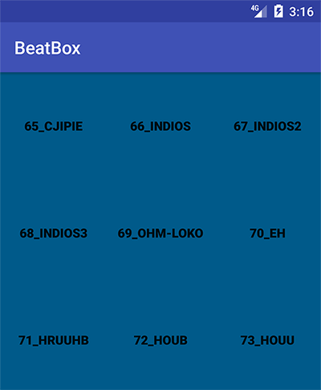

本章
本章要点：
- style的定义和应用
<!-- more -->

# Style
可以简单地修改几个配置完成style的修改。
首先定义style：
styles.xml
``` xml
<resources>
...
    <style name="BeatBoxButton">
        <item name="android:background">@color/dark_blue</item>
    </style>

    <style name="BeatBoxButton.Strong">
        <item name="android:textStyle">bold</item>
    </style>
</resources>
```
在这里添加style，其中`BeatBoxButton.Strong`表示继承自`BeatBoxButton`，还有一种等价的写法是：
``` xml
    <style name="StrongBeatBoxButton"
    parent="@string/BeatBoxButton">
        <item name="android:textStyle">bold</item>
    </style>
```
将定义的应用到Button：
``` xml
    <Button
        style="@style/BeatBoxButton.Strong"
        ...
        tools:text="Sound name"/>
```
很快就能得到背景色为蓝色，字体加粗的按钮：
