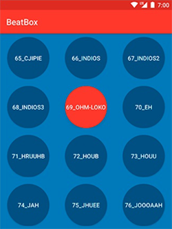

本章通过修改drawables资源，改变按钮形状和交互：按钮变成圆形，点击变成红色背景

仅修改资源文件就能搞定，这一点挺酷的。

本章要点：
- drawable资源的定义和使用
- shape drawable的定义和使用
- State List Drawable资源的定义和使用
<!-- more -->

# shape资源的定义和使用
本节将按钮定义成圆形，首先需要定义drawable资源`res/drawable/button_beat_box_normal.xml`：
``` xml
<shape xmlns:android="http://schemas.android.com/apk/res/android"
       android:shape="oval">
    <solid android:color="@color/dark_blue"/>
</shape>
```
这是一个形状资源，Android还支持更多形状，可参见[《可绘制对象资源》](https://developer.android.com/guide/topics/resources/drawable-resource.htm)

第二步就是在按钮中应用此资源，`res/values/styles.xml`：
``` xml
<resources>
    ...
    <style name="BeatBoxButton" parent="Widget.AppCompat.Button">
        <item name="android:background">@drawable/button_beat_box_normal</item>
    </style>
</resources>
```
轻松得到如下效果：


# State List 资源的定义和使用
按钮是一个两态交互控件，分按下和抬起，如果希望两种状态有不同的展现，则需要用到Stat List Drawable了。
① 创建按下资源`res/drawable/button_beat_box_pressed.xml`：
``` xml
<shape xmlns:android="http://schemas.android.com/apk/res/android"
       android:shape="oval">
    <solid android:color="@color/red"/>
</shape>
```
② 创建state list drawable资源`res/drawable/button_beat_box.xml`：
``` xml
<selector xmlns:android="http://schemas.android.com/apk/res/android">
    <item android:drawable="@drawable/button_beat_box_pressed"
          android:state_pressed="true"/>
    <item android:drawable="@drawable/button_beat_box_normal"/>
</selector>
```
它定义了两态下分别对应的drawable资源。
③ 将state list drawable资源应用到按钮`res/values/styles.xml`：
``` xml
<resources>
    ...
    <style name="BeatBoxButton" parent="Widget.AppCompat.Button">
        <item name="android:background">@drawable/button_beat_box</item>
    </style>
</resources>
```
这就完成了两态不同的效果。state list drawable还支持多种类型的状态，包括disabled、focused、activated等，详情可参见[《状态列表》](https://developer.android.com/guide/topics/resources/drawable-resource.html#StateList)。

# Layer List 资源的定义和使用
Layer List可以令多个资源关联到同一个控件上，比如本节当按钮按下的时候，除了希望背景称为红色，还想在外围加一个灰色的环。具体操作只有一步，在`button_beat_box_pressed.xml`文件中添加layer list即可：
``` xml
<layer-list
    xmlns:android="http://schemas.android.com/apk/res/android">
    <item>
        <shape xmlns:android="http://schemas.android.com/apk/res/android"
               android:shape="oval">
            <solid android:color="@color/red"/>
        </shape>
    </item>
    <item>
        <shape android:shape="oval">
            <stroke android:width="4dp" android:color="@color/gray"/>
        </shape>
    </item>
</layer-list>
```
于是，当按钮被按下时，除了画第一个item，还会在上面再画第二个item。效果如下：

