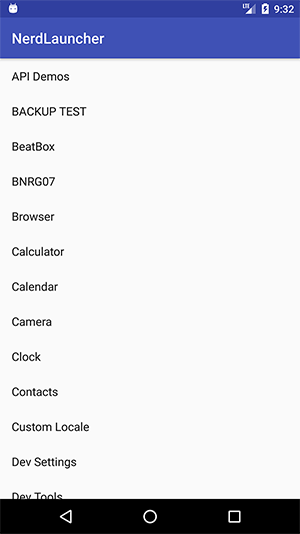
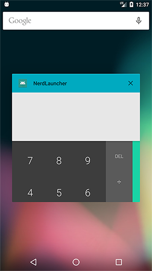
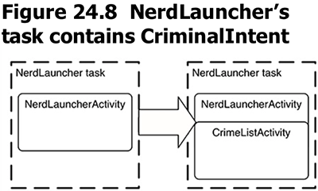
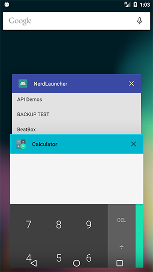
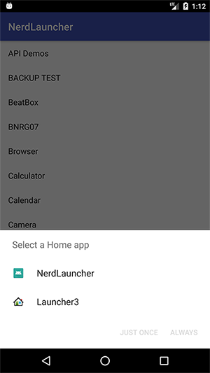

本章是一个新例程：列出系统中所有app，点击后启动。


本章要点：
- 遍历系统所有应用
- 任务和进程
- concurrent documents
<!-- more -->

# 遍历系统所有应用
所谓的“系统所有应用”是指用户点击桌面图标或者launcher图标可以启动的应用。这类应用都有一个可启动的主Activity——即Activity的intent filter包含MAIN action和LAUNCHER category：
``` xml
    <activity android:name=".NerdLauncherActivity">
        <intent-filter>
            <action android:name="android.intent.action.MAIN" />

            <category android:name="android.intent.category.LAUNCHER" />
        </intent-filter>
    </activity>
```
``` java
    // 构造查询的Intent
    Intent startupIntent = new Intent(Intent.ACTION_MAIN);
    startupIntent.addCategory(Intent.CATEGORY_LAUNCHER);
    // 查询MAIN/LAUNCHER的Activity
    PackageManager pm = getActivity().getPackageManager();
    List<ResolveInfo> activities = pm.queryIntentActivities(startupIntent, 0);
    ...
    resolveInfo = activities.get(i)
    PackageManager pm = getActivity().getPackageManager();
    String appName = resolveInfo.loadLabel(pm).toString(); // 获得名字
    mNameTextView.setText(appName);
```

## 在本节中的实现
本节使用了RecyclerView来展现所有应用的名字，代码如下：
``` java
// NerdLauncherFragment.java
public class NerdLauncherFragment extends Fragment {
    private RecyclerView mRecyclerView;
    private static final String TAG = "NerdLauncherFragment";

    public static NerdLauncherFragment newInstance(){
        return new NerdLauncherFragment();
    }

    @Override
    public View onCreateView(LayoutInflater inflater, ViewGroup container,
                           Bundle savedInstanceState){
        View v = inflater.inflate(R.layout.fragment_nerd_launcher,
                container, false);
        mRecyclerView = (RecyclerView)v.findViewById(R.id.app_recycler_view);
        mRecyclerView.setLayoutManager(new LinearLayoutManager(getActivity()));
        setupAdapter();
        return v;
    }

    private void setupAdapter(){
        Intent startupIntent = new Intent(Intent.ACTION_MAIN);
        startupIntent.addCategory(Intent.CATEGORY_LAUNCHER);

        PackageManager pm = getActivity().getPackageManager();
        List<ResolveInfo> activities = pm.queryIntentActivities(startupIntent, 0);
        Collections.sort(activities, new Comparator<ResolveInfo>() {
            @Override
            public int compare(ResolveInfo resolveInfo, ResolveInfo t1) {
                PackageManager pm = getActivity().getPackageManager();
                return String.CASE_INSENSITIVE_ORDER.compare(resolveInfo.loadLabel(pm).toString(),
                        t1.loadLabel(pm).toString());
            }
        });
        Log.i(TAG, "Found " + activities.size() + " activities.");
        // ⑥ 设置Adapter
        mRecyclerView.setAdapter(new ActivityAdapter(activities));
    }

    private class ActivityHolder extends RecyclerView.ViewHolder{
        private ResolveInfo mResolveInfo;
        private TextView mNameTextView;

        public ActivityHolder(View itemView){
            super(itemView);
            mNameTextView = (TextView)itemView;
        }
        // ⑤ 显示app的名字
        public void bindActivity(ResolveInfo resolveInfo){
            mResolveInfo = resolveInfo;
            PackageManager pm = getActivity().getPackageManager();
            String appName = mResolveInfo.loadLabel(pm).toString();
            mNameTextView.setText(appName);
        }
    }
    // ① 创建Adapter
    private class ActivityAdapter extends RecyclerView.Adapter<ActivityHolder>{
        private final List<ResolveInfo> mActivities;

        public ActivityAdapter(List<ResolveInfo> activities){
            mActivities = activities;
        }
        // ② 创建ViewHolder
        @Override
        public ActivityHolder onCreateViewHolder(ViewGroup parent, int viewType){
            LayoutInflater layoutInflater = LayoutInflater.from(getActivity());
            View view = layoutInflater.inflate(android.R.layout.simple_list_item_1,
                    parent, false);
            return new ActivityHolder(view);
        }
        // ③ 绑定ViewHolder
        @Override
        public void onBindViewHolder(ActivityHolder holder, int position){
            ResolveInfo resolveInfo = mActivities.get(position);
            holder.bindActivity(resolveInfo);
        }
        // ④ 返回item的个数
        @Override
        public int getItemCount(){
            return mActivities.size();
        }
    }
}
```
在[笔记八·RecyclerView的设计思想](/2017/10/19/2017/1019AndroidProgrammingBNRG08/#RecyclerView的设计思想)中对RecyclerView已有介绍，此处不再赘述。

## 点击item启动app
``` java
// NerdLauncherFragment.java
    ActivityInfo activityInfo = mResolveInfo.activityInfo;
    Intent i = new Intent(Intent.ACTION_MAIN)
            .setClassName(activityInfo.applicationInfo.packageName,
                    activityInfo.name);
    startActivity(i);
```
其中，mResolveInfo是`PackageManager::queryIntentActivities(...)`返回的List的元素：
`List<ResolveInfo> activities = pm.queryIntentActivities(startupIntent, 0);`。
这里创建了显式Intent，并启动Activity。和之前的显式Intent不太一样，之前的写法为：
``` java
Intent intent = new Intent(getActivity(), CrimePagerActivity.class);
startActivity(intent);
```
以前的写法是应用内调用，给出className即可，如果是应用间调用，需要给出包名和类名。

# 任务和返回栈
在Android下，每个使用default launcher打开的app，Android会为之创建任务；通过本节的NerdLauncher却不会有这样的效果。
点击`□`按钮，清除掉所有正在运行的应用。启动NerdLauncher，再启动计算器，点击`□`按钮，可以看到当前运行的应用只有NerdLauncher：

也就是说`□`看到的卡片栈是任务栈，而不是进程。


<font color=red>但是我发现这种现象不稳定，在有的Android系统上，启动不同的app表现不一样；同一个app在不同的Android系统上表现也不一样，这是为什么？</font>

调用`Intent::setFags(Intent.FLAG_ACTIVITY_NEW_TASK)`可以在新任务中启动Activity，如果该Activity已经在运行，则只是将其切到任务栈顶：
``` java
// NerdLauncherFragment.java
ActivityInfo activityInfo = mResolveInfo.activityInfo;
Intent i = new Intent(Intent.ACTION_MAIN)
        .setClassName(activityInfo.applicationInfo.packageName,
                activityInfo.name).setFlags(Intent.FLAG_ACTIVITY_NEW_TASK);
startActivity(i);
```


# 将NerdLauncher设置为Home Screen
这一节的内容有点炫技了，不过不可思议，居然这么方便就可以更换桌面。修改`AndroidManifest.xml`，为activity添加两个category：
``` xml        
<activity android:name=".NerdLauncherActivity">
    <intent-filter>
        <action android:name="android.intent.action.MAIN" />

        <category android:name="android.intent.category.LAUNCHER" />

        <category android:name="android.intent.category.HOME"/>
        <category android:name="android.intent.category.DEFAULT"/>
    </intent-filter>
</activity>
```
点击`○`键，系统询问选择默认Launcher还是NerdLauncher：


# 进程 vs 任务
进程是管理系统资源的基本单位，如内存、网络、打开的文件等。而任务是一个逻辑概念，仅包含可能来自不同进程的Activity。系统使用应用名来命名进程和任务，这让二者很容易被混淆。

点击`□`删除任务会导致进程也被删除吗？
删除[《任务和返回栈》](/2017/11/04/2017/1104AndroidProgrammingBNRG24/#任务和返回栈)中.setFlags(Intent.FLAG_ACTIVITY_NEW_TASK)的调用——让NerdLauncher每次启动Activity时不要起新任务。
先清空系统正在运行的任务，启动计算器，回到桌面运行NerdLauncher，在其中启动计算器，再点击`□`，删除计算器任务，你会发现NerdLauncher中的计算器还在，这说明系统不会把进程干掉。

# concurrent documents
Android Lollipop及之后的版本支持`concurrent documents`的概念——使用同一个应用打开多个文档，此时你可以在任务栈中看到同一个app Activity的多个实例。有两种方式可以做到这一点：
1. 启动Activity时，对Intent添加`FLAG_ACTIVITY_NEW_DOCUMENT`和`FLAG_ACTIVITY_MULTIPLE_TASK`标记：
``` java
ActivityInfo activityInfo = mResolveInfo.activityInfo;
Intent i = new Intent(Intent.ACTION_MAIN)
        .setClassName(activityInfo.applicationInfo.packageName,
                activityInfo.name).setFlags(Intent.FLAG_ACTIVITY_NEW_DOCUMENT)
        .addFlags(Intent. FLAG_ACTIVITY_MULTIPLE_TASK);
startActivity(i);
```
2. 在NerdLauncher的AndroidManifest.xml中设置Activity的`android:documentLaunchMode`属性：
``` xml
    <activity android:name=".NerdLauncherActivity"
        android:documentLaunchMode="intoExisting">
        <intent-filter>
            <action android:name="android.intent.action.MAIN" />
            <category android:name="android.intent.category.LAUNCHER" />
        </intent-filter>
    </activity>
```

在[《概览屏幕》](https://developer.android.com/guide/components/recents.html)中对这些方法有详细的介绍。