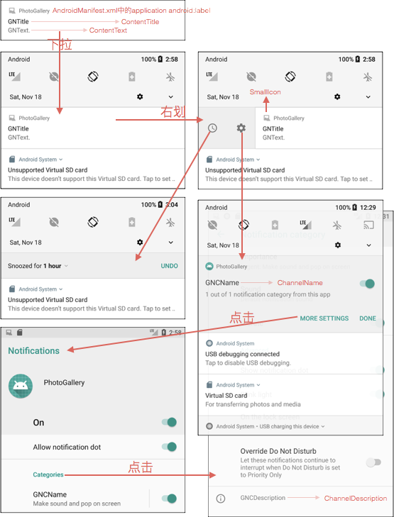

本章引入了一个Service，用来下载缩略图，如果有新的内容则弹出通知。
本章要点：
- Service
- 检测网络是否可用
- AlarmManager
- PendingIntent
- Notifications
<!-- more -->

# Service
Service用于无需界面展现、交互，只需在后台工作的情况。
<font color=red>为什么不使用线程？</font>

## 创建IntentService
### 1.定义IntentService类
``` java
// PollService.java
public class PollService extends IntentService { // ①
    private static final String TAG = "PollService";

    public static Intent newIntent(Context context){
        return new Intent(context, PollService.class);
    }

    public PollService(){ super(TAG); }

    @Override
    protected void onHandleIntent(Intent intent){ // ②
        Log.i(TAG, "Received an intent: " + intent);
    }
}
```
① 定义派生自IntentService的类。
② 实现`onHandleIntent(...)`方法。

Service的Intent被称为命令，命令被发送给Service通知它完成约定的任务。
当收到第一条命令，IntentService被启动，并启动一个后台线程，将命令排队。在后台线程中，IntentService调用`onHandleIntent(...)`方法依次处理队列中的命令。新的命令可以继续入队，当队列中的命令被处理完，Service将终止和销毁。下图展现了这一过程：


### 2.在AndroidManifest.xml声明
和Activity类似，Service需要响应来自内部或外部的intents，所以要在`AndroidManifest.xml`中声明：
``` xml
<manifest ...>
    ...
    <application ...>
        ...
        <service android:name=".PollService"/>
    </application>
</manifest>
```

### 3.调用
``` java
Intent i = PollService.newIntent(getActivity());
getActivity().startService(i);
```
不是说好收到第一个命令后，会自动档调起吗？为什么此处变手动挡呢？自动挡在下面引入定时Alarm的时候会用上，下面是定时向PollService发送请求：
``` java
// 每10秒钟发一次
private static final long POLL_INTERVAL_MS = 
                                    TimeUnit.SECONDS.toMillis(10);
...
Intent i = new Intent(context, PollService.class);
PendingIntent pi = PendingIntent.getService(context, 0, i, 0);

AlarmManager alarmManager = 
        (AlarmManager)context.getSystemService(Context.ALARM_SERVICE);
alarmManager.setRepeating(AlarmManager.ELAPSED_REALTIME, 
        SystemClock.elapsedRealtime(),POLL_INTERVAL_MS, pi);
...
```

## Service是什么
和Activity一样，Service是应用程序的一类组件，它提供生命周期回调函数给应用程序的主线程调用。**注意：这些回调是在主线程中调用的。**大部分的Service都需要配备一个后台线程辅以工作，IntentService提供了后台线程并管理它，所以通常建议使用IntentService。

## Service的生命周期
- `onCreate(...)` 在Service被创建的时候调用。
- `onStartCommand(Intent, int, int)` 每次通过`startService(Intent)`启动service的时候都会被调用。第一个整型参数是一个标志位，表明该Intent是被重复发送还是首次发送；第二个整型参数的值每次都不同，用来区分每次调用的startID。
- `onDestroy()` Service在销毁前被调用。根据不同类型的Service，`onDestroy()`的调用时机会有不同。`onStartCommand(Intent, int, int)`用返回值来表明Service的类型。

### Service的类型
按照是否Sticky分为两类：
- `Non-sticky Service` 该类型的Service主动声明自己停止，`onStartCommand(Intent, int, int)`返回`START_NOT_STICKY`或`START_REDELIVER_INTENT`时，属于这种类型。Service通过调用`stopSelf()`或`stopSelf(int)`来终止自己，前者是无条件终止，不管`onStartCommand(...)`被调用过多少次；后者则根据`onStartCommand(...)`的参数startID，停止与它最接近的那个。
- `Sticky Service` 该类型的Service需要等别人调用`Context.stopService(Intent)`才会停止。`onStartCommand(Intent, int, int)`返回`START_STICKY`时，属于这种类型。

更细的，按照`onStartCommand(...)`的返回值，分为三类：
- `START_NOT_STICKY` 当Service运行的进程被Android系统强制杀掉之后，不会重新创建该Service，如果想重新实例化该Service，就必须重新调用`startService(...)`来启动。如果Service在执行工作中被中断几次无关紧要或者对“Android内存紧张的情况下需要被杀掉且不立即重新创建”也可接受的话，可以设置该值，如定时从服务器中获取最新数据。
- `START_REDELIVER_INTENT` 当Service运行的进程被Android系统强制杀掉之后，Android系统会将再次重新创建该Service，并执行`onStartCommand(...)`回调方法，并将Service在被杀掉之前最后一次传入onStartCommand方法中的Intent再次保留下来并再次传入到重新创建的Service的`onStartCommand(...)`方法中。如果我们的Service需要依赖具体的Intent才能运行（需要从Intent中读取相关数据信息等），并且在强制销毁后有必要重新创建运行，这种情况就适合使用START_REDELIVER_INTENT。
- `START_STICKY` 当Service运行的进程被Android系统强制杀掉之后，Android系统会将该Service依然设置为started状态（即运行状态），但是不再保存onStartCommand方法传入的intent对象，然后Android系统会尝试再次重新创建该Service，并执行`onStartCommand(...)`回调方法，这时该回调的Intent参数为null，即虽然会执行但是获取不到intent信息。如果你的Service可以在任意时刻运行或结束都没什么问题，而且不需要intent信息，就可以使用这种类型，比如一个用来播放背景音乐的Service就适合返回该值。

## bind Service
调用`bindService(Intent, ServiceConnection, int)`，可以有机会直接调用Service的方法。`ServiceConnection`用来接收和binding相关的回调。书中提供这样一段示例：
``` java
private ServiceConnection mServiceConnection = new ServiceConnection(){
    public void onServiceConnected(ComponentName className, IBinder service){
        MyBinder binder = (MyBinder)service;
    }
    public void onServiceDisconnected(ComponentName className){
    }
};
@Override
public void onCreate(Bundle savedInstanceState){
    super.onCreate(savedInstanceState);
    Intent i = new Intent(getActivity(), MyService.class);
    getActivity().bindService(i, mServiceConnection, 0);
}
@Override
public void onDestroy(){
    super.onDestroy();
    getActivity().unbindService(mServiceConnection);
}
```
在Service侧，binding引入了两个生命周期回调：
- `onBind(Intent)` 每次Service被bind，并通过`ServiceConnection::onServiceConnected(...)`返回IBind对象时被调用。
- `onUnbind(Intent)` 每次binding终止时被调用。

### 本地service binding
如果service存在于本进程内，这就是本地binding，此时它会提供直接调用service的函数：
``` java
private class MyBinder extends IBinder{
    public MyService getService(){
        return MyService.this;
    }
    @Override 
    public void onBind(Intent intent){
        return enw MyBinder();
    }
};
```
但是不建议这么用，因为如果MyBinder存在于本地，直接调用就好了，为什么要通过Binder来绕弯子？

### 远端service binding
这是binding Service的主要用途，因为它提供了跨进程调用的机制。
<font color=red>本书没有详细讲解具体用法，稍后应该回过头来把它和android源码的binder打通。</font>

# 检测是否有网络可用
在Android系统下，用户可以关闭后台应用的联网权限，这对于控制手机的低功耗运行非常有帮助。应用程序需要对此作出判断，如果网络不可用，就不要再做后续的联网尝试了。
``` java
private boolean isNetworkAvailableAndConnected(){
    ConnectivityManager cm = (ConnectivityManager)
                            getSystemService(CONNECTIVITY_SERVICE);

    // ①如果系统关闭了“允许后台联网的开关”
    boolean isNetworkAvailable = (cm.getActiveNetworkInfo() != null);
    // ②如果开关是打开的，但网络连不上
    boolean isNetConnected = (isNetworkAvailable &&
                            cm.getActiveNetworkInfo().isConnected());
    return isNetConnected;
}
```

在`AndroidManifest.xml`中声明`ACCESS_NETWORK_STATE`才有权限调用以上函数：
``` xml
<manifest ...>
    ...
    <uses-permission android:name="android.permission.ACCESS_NETWORK_STATE"/>

    <application ...>
        ...
    </application>
</manifest>
```

# 定期被动通知
本节中需要一种机制，能定期发送Service命令，让后台Service工作起来。
一种备选方案是`Handle::sendMessageDelayed(...)`或`Handle::PostDelayed(...)`，这种方案的缺陷在于：如果用户退出了所有Activity，进程也将退出，所有Handle就不会被执行了。
更好的方案是采用`AlarmManager`，它借助系统服务可以向你发送Intents，不管发送方的进程是否还活着。
``` java
private static final long POLL_INTERVAL_MS = TimeUnit.MINUTES.toMillis(1);
...
public static void setServiceAlarm(Context context, boolean isOn){
    Intent i = PollService.newIntent(context);
    PendingIntent pi = PendingIntent.getService(context, 0, i, 0);
    AlarmManager alarmManager = (AlarmManager)
                    context.getSystemService(Context.ALARM_SERVICE);
    if(isOn){
        alarmManager.setRepeating(AlarmManager.ELAPSED_REALTIME,
                SystemClock.elapsedRealtime(),
                POLL_INTERVAL_MS, pi);
    }else{
        alarmManager.cancel(pi);
        pi.cancel();
    }
}
```
## PendingIntent
PendingIntent是一种特殊的Intent，主要的区别在于Intent立刻执行，随所在的activity 消失而消失。而PendingIntent不是立刻执行，可以看作是对intent的包装，它执行的操作实质上是参数Intent传进来的的操作。
通常用`getActivity(...)`、`getBroadcast(...)`、`getService(...)`来得到PendingIntent的实例：
``` java
PendingIntent getService (
    Context context,  // 启动service的context
    int requestCode,  // 用来区分发送端
    Intent intent,    // 描述待启动service的intent
    int flags)        // 控制创建PendingItent的标志位
```
当前Activity并不马上启动PendingIntent所包含的Intent，而是在外部执行PendingIntent时，调用Intent。
由于在PendingIntent中保存了当前App的Context，使它赋予外部App可以如同当前App一样的执行PendingIntent里的 Intent，就算在执行时当前App已经不存在了，也能通过PendingIntent里的Context执行Intent。
Intent一般是用作Activity、Sercvice、BroadcastReceiver之间传递数据，而Pendingintent，一般用在 Notification上。

可以调用`PendingIntent::send()`立刻发出Intent，此时执行发出的是系统，发出者仍然是当前app。可以把PendingIntent转交给其他人发出，此时发出者还是当前app。调用了`cancel()`的PendingIntent，即使`send()`也不会再被发出了。

对于同一个Intentqq请求两次PendingIntent得到的是同一个实例。在flag中传入`PendingIntent::FLAG_NO_CREATE`，当PendingIntent已经存在时，返回该存在的实例，如果不存在则返回null。

## AlarmManager
``` java
void setRepeating (int type,            // alarm类型
                long triggerAtMillis,   // 首次启动alarm的时间
                long intervalMillis,    // 每次间隔毫秒数
                PendingIntent operation)// 要执行的操作
```
其中type可以取值为`RTC_WAKEUP`、`RTC`、`ELAPSED_REALTIME_WAKEUP`或`ELAPSED_REALTIME`。
`RTCxxx`表示绝对时间（System.currentTimeMillis()）
`ELAPSED_REALTIMExxx`表示相对于系统启动的时间（SystemClock.elapsedRealtime()）
`xxx_WAKEUP` 如果设备处于休眠模式，如灭屏时，强制alarm唤醒设备
没有`_WAKEUP` 的版本当设备处于休眠模式时，不会强制唤醒设备

`setRepeating(...)`并不会精确地按照`intervalMillis`唤醒alarm，主要是系统处于功耗的考虑。如果系统有10个应用，分别15分钟唤醒一次，如果他们完全错开，最差的情况会让系统在一小时内被唤醒40次。系统会尽量把他们的唤醒时间安排在一起，比较好的情况是一小时内系统只被唤醒4次了。如果需要绝对精准，可以调用`AlarmManager::setWindow(...)`或`AlarmManager::setExact(...)`

`AlarmManager::Cancel(Pending)`用于取消alarm。

# Notifications
系统顶部有通知栏，下拉显示通知列表。但是按照本书的写法，在AndroidO上不能正常运行，会弹出如下错误：

因为在AndroidO中引入了通知频道（Notification Channel）的概念，开发者为需要发送的每个不同的通知类型创建一个通知渠道，所有发布至通知渠道的通知都具有相同的行为。当用户修改任何`重要性`、`声音`、`光`、`振动`、`在锁屏上显示`、`替换免打扰模式`这些特性的行为时，修改将作用于通知渠道。

先来看一下通知的交互逻辑和对应字段：


创建Notification实例可以发送通知。一个Notification至少需要包含：
<font color=red>此处应该贴个图</font>
具体代码如下：
``` java

private void doNotifiy(){
    Resources resources = getResources();
    Intent i = PhotoGalleryActivity.newIntent(this);
    PendingIntent pi = PendingIntent.getActivity(this, 0, i, 0);

    NotificationManager notificationManager =
            (NotificationManager)getSystemService(Context.NOTIFICATION_SERVICE);
    // 创建通知频道
    String notificationChannelId = getString(R.string.notify_channel_id);
    CharSequence channelName = getString(R.string.notify_channel_name);
    String channelDescription = getString(R.string.notify_channel_description);
    int channelImportance = NotificationManager.IMPORTANCE_HIGH;
    // 传入频道ID、名称和级别
    NotificationChannel notificationChannel = new NotificationChannel(
            notificationChannelId, channelName, channelImportance);
    notificationChannel.setDescription(channelDescription);
    notificationChannel.enableLights(true); // 闪光灯和颜色
    notificationChannel.setLightColor(Color.RED);
    notificationChannel.enableVibration(true);  // 震动和节奏
    notificationChannel.setVibrationPattern(new long[]{100, 200, 300, 400, 500, 400, 300, 200, 400});
    notificationManager.createNotificationChannel(notificationChannel);
    // 创建通知Builder
    Notification notification = new
            Notification.Builder(this)
            .setTicker(resources.getString(R.string.new_pictures_title))
            .setSmallIcon(android.R.drawable.ic_menu_report_image)
            .setContentTitle(resources.getString(R.string.new_pictures_title))
            .setContentText(resources.getString(R.string.new_pictures_text))
            .setContentIntent(pi)
            .setAutoCancel(true)
            .setChannelId(notificationChannelId)
            .build();
    // 弹出通知
    notificationManager.notify(0, notification);
}
```

# JobScheduler 和JobService
Android Lollipop引入了`JobScheduler`和`JobService`，可以更方便地完成诸如本节的“定期跑任务，跑起之前检查是否已经有该任务在跑，检查网络是否可用”这套组合拳。
<font color=red>但是本节讲得太浅，就不在这总结了。回头应该进一步扩展阅读，补上这一节。</font>