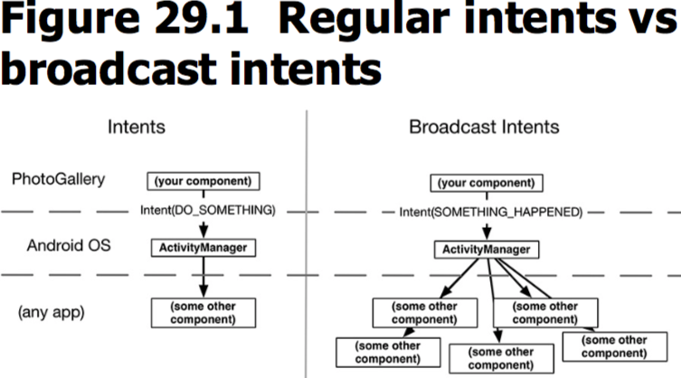
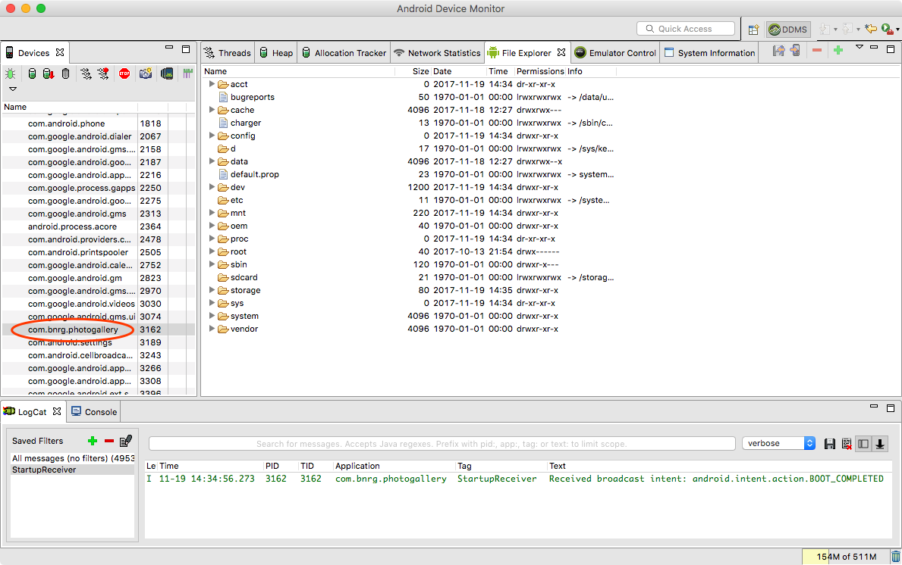
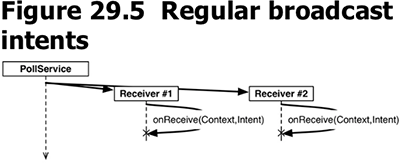
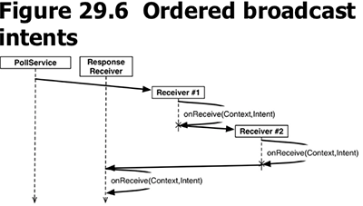
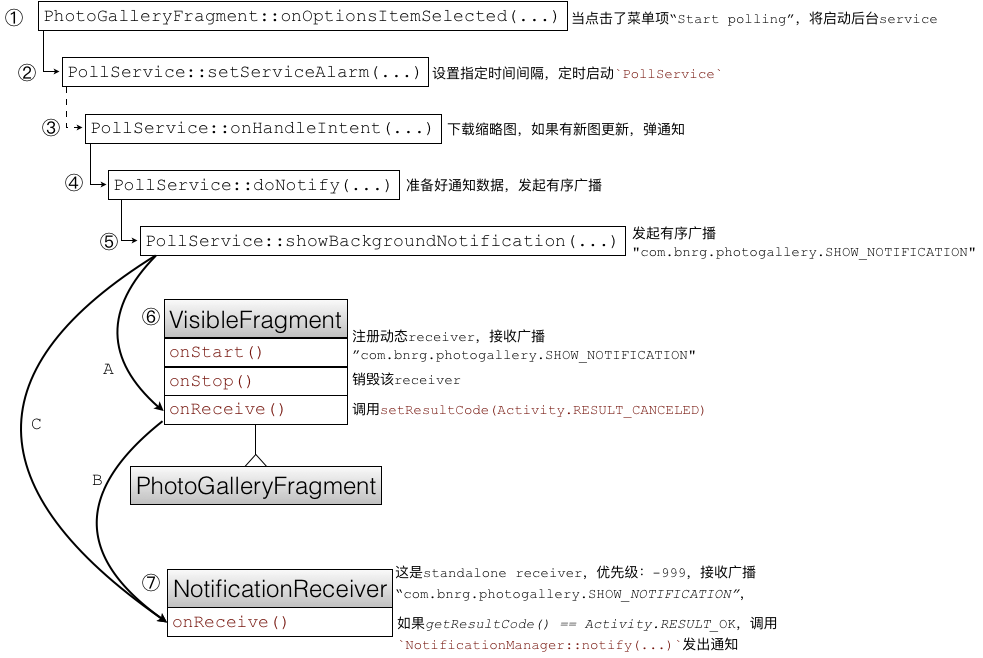

本章引入了各种广播，当后台下载缩略图的线程下到新的数据，会发送有序广播，GalleryFragment在前台时会注册动态receiver，推倒后台则注销，该动态receiver设置广播的resultCode为`Activity.RESULT_CANCEL`。应用程序还有一个低级别的standalone receiver，发现resultCode不等于`Activity.RESULT_OK`时直接退出。通过这样的配合，使得应用程序仅在后台时，广播才有效。
本章要点：
- 创建、注册standalone receiver
- 创建、注册dynamic reciever
- 使用receiver
- 限定broadcast的传播范围
- 有序广播
<!-- more -->

# Broadcast Intents
Broadcast intents和普通的intents类似，不同点在于它可以同时被多个组件接收。


本节引入Boradcast是因为：尽管Alarm可以在进程被杀掉依然存活，但当遭遇系统重启它就只能中断了，因为没有进程启动Alarm。解决的办法就是让app接收系统的`BOOT_COMPLETED`广播。当系统启动完成后，一定会发出一个`BOOT_COMPLETED`广播。app要做的就是注册并创建standalone broadcast receiver，并实现处理逻辑。

`standalone broadcast receiver`需要在manifest声明，这样即使app没有被启动，依然能接收到它声明的broadcast。与之相对的是`dynamic receiver`，它不需要在manifest声明，而是在代码中完成注册，仅在app处于活动状态时，它才能收到broadcast。

## 创建注册standalone receiver
创建broadcast receiver很简单，就是实现其`onReceive(...)`方法，当一个intent被`StartupReceiver(...)`调用，其对应的broadcast receiver的`onReceive(...)`方法将被回调。
``` java
// StartupReceiver.java
public class StartupReceiver extends BroadcastReceiver {
    private static final String TAG = "StartupReceiver";

    @Override
    public void onReceive(Context context, Intent intent){
        Log.i(TAG, "Received broadcast intent: " + intent.getAction());
    }
}
```
和Service和Activity一样，broadcast receiver必须事先向系统注册，这样当广播发生时，系统才知道调用其回调接口。在`AndroidManifest.xml`中完成注册：
``` xml
<manifest ...>
    ...
    <uses-permission android:name="android.permission.RECEIVE_BOOT_COMPLETED"/>

    <application ...>
        ...
        <receiver android:name=".StartupReceiver">
            <intent-filter>
                <action android:name="android.intent.action.BOOT_COMPLETED"/>
            </intent-filter>
        </receiver>
    </application>
</manifest>
```
①添加`receiver`标签，以及`intent-filter`属性，这样`StartupReceiver`就可以监听`BOOT_COMPLETED`事件。②这需要相应的权限，因此添加`uses-permission`标签，声明`RECEIVE_BOOT_COMPLETED`权限。

OK了，当收到filter中指定的broadcast，该receiver将被唤醒，并调用其`onReceive(...)`函数，然后receiver将被销毁。

使用`Android Device Montiro`跟踪这一过程：Android Studio > Tools > Android > Android Device Monitor：

稍后会发现该app会退出。

## 使用receiver
在使用receiver的时候需要注意：
- 不要在`onReceive(...)`中使用异步API，例如注册任何listeners，因为在`onReceive(...)`执行完成后不久，该receiver将被销毁，甚至它所在的app都会退出。
- 不要在`onReceive(...)`中执行长程操作（如网络操作或者大量的I/O），因为该函数是在主线程中执行，长程操作会导致主线程阻塞而引发ANR。

可以将receiver当做逻辑最初的起点，在该函数中启动另一个Activity或者Service等等。

本节在SharedPreference中记录了是否开启alarm，在receiver中判断该记录，如果为true则启动alarm service：
``` java

public class QueryPreferences {
    ...
    private static final String PREF_IS_ALARM_ON = "isAlarmOn";
    ...
    public static boolean isAlarmOn(Context context){
        return PreferenceManager.getDefaultSharedPreferences(context)
                .getBoolean(PREF_IS_ALARM_ON, false);
    }

    public static void setAlarmOn(Context context, boolean isOn){ // ③
        PreferenceManager.getDefaultSharedPreferences(context)
                .edit()
                .putBoolean(PREF_IS_ALARM_ON, isOn)
                .apply();
    }
}

// PollService.java
public class PollService extends IntentService {
    ...
    public static void setServiceAlarm(Context context, boolean isOn){
        ...
        QueryPreferences.setAlarmOn(context, isOn);// ②
    }
    ...
}

// PhotoGalleryFragment.java
public class PhotoGalleryFragment extends Fragment {
    ...
    @Override
    public boolean onOptionsItemSelected(MenuItem item){
        switch(item.getItemId()){
            ...
            case R.id.menu_item_toggle_polling:
                boolean shouldStartAlarm = !PollService.isServiceAlarmOn(getActivity());
                PollService.setServiceAlarm(getActivity(), 
                                        shouldStartAlarm);// ①
                getActivity().invalidateOptionsMenu();
                return true;
            ...
        }
    }
    ...
}

// StartupReceiver.java
public class StartupReceiver extends BroadcastReceiver {
    ...
    @Override
    public void onReceive(Context context, Intent intent){
        ...
        boolean isOn = QueryPreferences.isAlarmOn(context); // ④
        PollService.setServiceAlarm(context, isOn);
    }
}
```
①当用户点击`Start polling`菜单时，设置ServiceAlarm为开启状态。
②③该状态被写入SharedPreference。
④当系统启动后，StartupReceiver收到启动广播，读取SharedPreference，如果ServiceAlarm的启动标记为true，则启动该服务。

## 创建dynamic receiver
dynamic receiver的关键点在于注册/反注册以及实现`onReceive(...)`，本节引入了一个抽象类`VisibleFragment`，并在其`onStart()`和`onStop()`回调中分别完成注册和反注册：
``` java
public abstract class VisibleFragment extends Fragment {
    private static final String TAG = "VisibleFragment";

    @Override
    public void onStart(){
        super.onStart();
        IntentFilter filter = new IntentFilter(PollService.ACTION_SHOW_NOTIFICATION);
        getActivity().registerReceiver(mOnShowNotification, filter);
    }

    @Override
    public void onStop(){
        super.onStop();
        getActivity().unregisterReceiver(mOnShowNotification);
    }

    private BroadcastReceiver mOnShowNotification = new BroadcastReceiver() {
        @Override
        public void onReceive(Context context, Intent intent) {
            Toast.makeText(getActivity(), "Got a broadcast: " + intent.getAction(),
                    Toast.LENGTH_LONG).show();
        }
    };
}
```
在注册dynamic reciever的时候需要传入一个BoradcastReceiver和一个IntentFilter实例。定义内部类并实例化mOnShowNotification，IntentFilter则与XML文件中<intent-filter>等效，相应的可以调用`addCategory(String)`、`addAction(String)`或`addDataPath(String)`来配置。

以上的代码不涉及业务逻辑，具体到本节解决的问题是：
<font color=red>我咋觉得解决的问题和实际方案是反的？他希望仅在应用没有打开的时候得到notification，而到目前为止，必须要求应用在打开的时候才能收到notification！</font>

它在`PollService.java`中当收到新图片时将发送dynamic broadcast：
``` java
// PollService.java
public class PollService extends IntentService {
    ...
    public static final String ACTION_SHOW_NOTIFICATION = "com.bnrg.photogallery.SHOW_NOTIFICATION";
    ...
    @Override
    protected void onHandleIntent(Intent intent){
        ...
        if(resultId.equals(lastResultId)){
            Log.i(TAG, "Got an old result: " + resultId);
        }else{
            Log.i(TAG, "Got a new result: " + resultId);
            doNotifiy();
            sendBroadcast(new Intent(ACTION_SHOW_NOTIFICATION));
        }
        ...
    }
    ...
}
```
再让PhotoGalleryFragment继承自VisibleFragment即可：
``` java
// PhotoGalleryFragment.java
public class PhotoGalleryFragment extends VisibleFragment {
    ...
}
```

## 限定broadcast的传播范围
本节希望应用程序发出的广播仅能被自己接收到，提出了两个方案：
### 1.为receiver添加exported属性
在AndroidManifest.xml的receiver标签中添加`android:exported="false"`属性，以声明该receiver仅用于内部应用。<font color=red>我的疑问是：难道不应该在broadcast源声明仅内部receiver才能接收么？在端处声明我仅能接收内部broadcast阻挡不住应用外的receiver截胡吧？</font>

### 2.使用自定义permission
在AndroidManifest.xml中加入`permission`标签创建自定义权限，接下来使用`uses-permission`来声明使用该权限，和声明使用系统预定义的权限类似，只是该权限是自定义的：
``` xml
<manifest ...>
    <permission android:name="com.bnrg.photogallery.PRIVATE"
        android:protectionLevel="signature"/><!-- 创建自定义权限 -->
    ...
    <uses-permission android:name="android.permission.RECEIVE_BOOT_COMPLETED"/>
    <!-- 使用自定义权限 -->
    <uses-permission android:name="com.bnrg.photogallery.PRIVATE"/>

    <application ...>
        ...
    </application>
</manifest>
```
最后在发送广播的时候，指定接收范围：
``` java
// PollService.java
public class PollService extends IntentService {
    ...
    public static final String ACTION_SHOW_NOTIFICATION = "com.bnrg.photogallery.SHOW_NOTIFICATION";
    public static final String PERM_PRIVATE = "com.bnrg.photogallery.PRIVATE";

    @Override
    protected void onHandleIntent(Intent intent){
        ...
        sendBroadcast(new Intent(ACTION_SHOW_NOTIFICATION), PERM_PRIVATE);
        ...
    }
    ...
}
```
这样，只有声明了该权限的应用才能接收到该广播。<font color=red>如果别的应用知道了我的私有权限，是不是也能盗用监听到我的私有广播呢？能屏蔽吗？</font>

最最后，为了防止我的receiver还能接收到其它应用发送同样的广播，引诱我执行，可以在注册receiver的时候也缀上私有权限：
``` java
public abstract class VisibleFragment extends Fragment {
    ...
    @Override
    public void onStart(){
        ...
        IntentFilter filter = new IntentFilter(PollService.ACTION_SHOW_NOTIFICATION);
        getActivity().registerReceiver(mOnShowNotification, filter,
                PollService.PERM_PRIVATE, null);
    }
```
还是没有太理解，所谓的私有权限只是一个字符串，我理解和广播的名称并没有本质区别吧？如果被泄露了，不一样会被引诱执行吗？这个问题是由protection levels解决的。

### 3.protection levels
在创建自定义权限时，还有一段`android:protectionLevel="signature"`属性，signature表示如果其他应用需要使用该权限，他必须使用和本应用一样的签名。其它的开发者不可能拿到你的签名，因此使用signature是限定应用内权限的有效方式。发出broadcast时，没有相同签名的其它应用的receiver收不到；接收broadcast时，如果发送者没有和我相同的签名，也无法欺骗让我接收。

protection levels的所有取值和含义如下：

<style>
table th:nth-of-type(1){
    width: 80px;
}
table th:nth-of-type(2){
    width: 200px;
}
</style>

取值|含义
---|---
normal|默认值。任何应用都可以申请，安装应用时，不会直接提示用户，点击全部才会展示。
dangerous|任何应用都可以申请，在安装应用时，会直接提示给用户。
signature|只有和该apk用相同的私钥签名的应用才可以申请该权限。
signatureOrSystem|有两种应用可以申请该权限：①和该apk用相同的私钥签名的应用；②在/system/app目录下的应用

## 有序广播
本节要解决的问题是：让前面动态注册的receiver能优先接收到`PollService.ACTION_SHOW_NOTIFICATION`广播，并且不再让广播继续传播。之前介绍的无序广播模型是单向无序的：

本节引入了有序广播

无序广播像是散弹枪，打出去多少人中枪，谁先谁后是不知道的；有序广播则像是击鼓传花，大家排排坐，确保收到广播的顺序，有序广播的接收者还可以再被传递的花中附上自己的返回值。本节正是利用这一特性实现了：当app在前台时不处理广播，仅在app处于后台时才处理广播，弹出通知。

### 设置返回值
在接收端和无序广播的实现是类似的，只是可以通过调用`setResultCode(int code)`来设置自己的返回值。
还可以通过`setResultData(String)`、`setResultExtras(Bundle)`或`setResult(int, String, Bundle)`返回更多种类型的数据，一旦设置了这些返回值，后续所有的receiver都能收到。结合有序性，可以令高级别的receiver在符合一定条件时设置返回值，低级别的receiver在收到广播后根据返回值决定要不要继续处理，这样就能实现广播的过滤，相当于通过高级别的receiver终止了广播的继续处理。

### 发送有序广播
调用`sendOrderedBroadcast(...)`发送有序广播，该函数的参数说明如下：
``` java
void sendOrderedBroadcast (Intent intent,   // 待广播的Intent
        String receiverPermission,  // receiver必须具备的权限
        BroadcastReceiver resultReceiver,  // 最后一个接收广播的receiver
        Handler scheduler, // 自定义的handler，用来执行resultReceiver的回调，如果为null则在主线程执行
        int initialCode,    // resultCode的初始值，通常为null，通常为Activity.RESULT_OK
        String initialData, // resultData的初始值，通常为null
        Bundle initialExtras)// resultExtras的初始值，通常为null
```
和“击鼓传花”类似，有序广播的有序性是通过接收者的座次来实现，receiver有一个android:priority属性，介于(SYSTEM_LOW_PRIORITY, SYSTEM_HIGH_PRIORITY)之间（即-1000 ~ 1000，详情参见[intent-filter](https://developer.android.com/guide/topics/manifest/intent-filter-element.html)）。本节引入了两个receiver，一个是standalone，在`AndroidManifest.xml`中定义如下：
``` xml
<receiver android:name=".NotificationReceiver"
    android:exported="false">
    <intent-filter android:priority="-999">
        <action android:name="com.bnrg.photogallery.SHOW_NOTIFICATION"/>
    </intent-filter>
</receiver>
```
另一个是dynamic receiver，没有显式定义优先级，默认为0。因此在本节中，该dynamic receiver先收到有序广播，之后才是NotificationReceiver。

## 总结
本节的逻辑有点深，读这本书的目的是学习Android系统机制，但在本节中，机制结合逻辑设计共同完成了特定效果，所以最后还是有必要把逻辑梳理一下。

本节的代码和书上不太一样，为了适配AndroidO，我把弹出通知的一坨代码封装成`doNotify(...)`函数，我的代码可以去[PhotoGallery](https://github.com/palanceli/TempAndroid/tree/master/PhotoGallery)下载。
广播发出后，如果PhotoGalleryFragment处于前台，必定调用过`onStart()`函数，注册了动态receiver，它会先收到广播，并且设置resultCode为RESULT_CANCELED，轮到NotificationReceiver接收广播时就不再处理了。此时广播的流向路径是A-B。
如果PhotoGalleryFragment处于后台，必定调用过`onStop()`函数，注销了动态receiver，广播流向直接走C，NotificationReceiver收到广播fA线resultCode为RESULT_OK，则发出通知。

<font color=red>但是我发现如果PhotoGalleryFragment处于后台，当发出第一次有序广播后，就不再继续发送了，理论上来说只要定时器满足应该不断发送才对，我还没搞明白为什么。这个问题以后待查。</font>