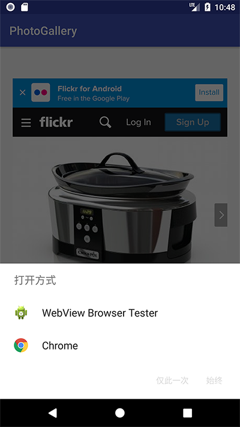

本章继续PhotoGallery，点击图片缩略图后将浏览该图片所在的网页，本章使用两种方法浏览：1、使用系统浏览器；2、使用WebView。

本章要点：
- 
<!-- more -->

# 使用系统浏览器打开缩略图所在网页
这条路径上没有什么新东西，可以复习一下RecyclerView点击item的路径：
① 让PhotoHolder实现接口View.OnClickListener
② 实现接口函数onClick(...)
③ 在构造函数中设置将点击监听设为自己
④ 提供接口设置galleryItem
⑤ 在Adapter::onBindViewHolder(...)将galleryItem赋给Holder
``` java
// PhotoGalleryFragment.java
public class PhotoGalleryFragment extends VisibleFragment {
    ...
    private class PhotoHolder extends RecyclerView.ViewHolder
    implements View.OnClickListener{ // ①
        ...
        private GalleryItem mGalleryItem;

        public PhotoHolder(View itemView){
            ...
            itemView.setOnClickListener(this); // ③
        }

        // ④
        public void bindGalleryItem(GalleryItem galleryItem){
            mGalleryItem = galleryItem;
        }

        @Override
        public void onClick(View v){ // ②
            Intent i = new Intent(Intent.ACTION_VIEW, mGalleryItem.getPhotoPageUri());
            startActivity(i);
        }
    }

    private class PhotoAdapter extends RecyclerView.Adapter<PhotoHolder>{
        ...
        @Override
        public void onBindViewHolder(PhotoHolder photoHolder, int position){
            ...
            photoHolder.bindGalleryItem(galleryItem); // ⑤
            ...
        }
        ...
    }
}
```
使用系统浏览器打开url就在第②步，非常简单，采用ACTION_VIEW对Url构造Intent即可。

# 使用WebView打开网页
## 1.构造布局文件
在布局文件`fragment_photo_page.xml`中添加两个widget——上面是进度条，下面是WebView：
``` xml
<android.support.constraint.ConstraintLayout ...>
    <ProgressBar
        android:id="@+id/progress_bar"
        style="?android:attr/progressBarStyleHorizontal"
        android:layout_width="match_parent"
        android:layout_height="wrap_content"
        android:layout_marginEnd="8dp"
        android:layout_marginStart="8dp"
        app:layout_constraintBottom_toTopOf="@+id/web_view"
        app:layout_constraintEnd_toEndOf="parent"
        app:layout_constraintStart_toStartOf="parent"
        app:layout_constraintTop_toTopOf="parent" />

    <WebView
        android:id="@+id/web_view"
        android:layout_width="368dp"
        android:layout_height="495dp"
        android:layout_marginBottom="8dp"
        android:layout_marginEnd="8dp"
        android:layout_marginStart="8dp"
        android:layout_marginTop="8dp"
        app:layout_constraintBottom_toBottomOf="parent"
        app:layout_constraintEnd_toEndOf="parent"
        app:layout_constraintStart_toStartOf="parent"
        app:layout_constraintTop_toBottomOf="@+id/progress_bar" />
</android.support.constraint.ConstraintLayout>
```

## 2.构造Fragment
该Fragment所在的Activity继承自[SingleFragmentActivity](/2017/10/19/2017/1019AndroidProgrammingBNRG08/#为通用的Fragment配备对应的java文件)，在该Activity的`SingleFragmentActivity::onCreate(...)`中调用`SingleFragmentActivity::createFragment()`，后者再调用`Fragment::newInstance(...)`创建Fragment。这是①提供的作用，他要求创建者必须传入url，并在②中解析。
``` java
// PhotoPageFragment.java
public class PhotoPageFragment extends VisibleFragment {
    private static final String ARG_URI = "photo_page_url";
    private Uri mUri;
    private WebView mWebView;
    private ProgressBar mProgressBar;

    // ①工厂方法，塞入对应图片所在的url
    public static PhotoPageFragment newInstance(Uri uri){
        Bundle args = new Bundle();
        args.putParcelable(ARG_URI, uri);
        PhotoPageFragment fragment = new PhotoPageFragment();
        fragment.setArguments(args);
        return fragment;
    }

    // ②解析url
    @Override
    public void onCreate(Bundle savedInstanceState){
        super.onCreate(savedInstanceState);
        mUri = getArguments().getParcelable(ARG_URI);
    }

    @Override
    public View onCreateView(LayoutInflater inflater, ViewGroup container,
                             Bundle savedInstanceState){
        View v = inflater.inflate(R.layout.fragment_photo_page,
                container, false);
        // ③ 设置进度条
        mProgressBar = (ProgressBar)v.findViewById(R.id.progress_bar);
        mProgressBar.setMax(100);

        // ④ 设置WebView
        mWebView = (WebView)v.findViewById(R.id.web_view);
        mWebView.getSettings().setJavaScriptEnabled(true);  // ④-1
        mWebView.setWebChromeClient(new WebChromeClient(){  // ④-2
            public void onProgressChanged(WebView webView, int newProgress){
                if(newProgress == 100){
                    mProgressBar.setVisibility(View.GONE);
                }else{
                    mProgressBar.setVisibility(View.VISIBLE);
                    mProgressBar.setProgress(newProgress);
                }
            }
            public void onReceivedTitle(WebView webView, String title){
                AppCompatActivity activity = (AppCompatActivity)getActivity();
                activity.getSupportActionBar().setSubtitle(title);
            }
        });
        mWebView.setWebViewClient(new WebViewClient()); // ④-3
        mWebView.loadUrl(mUri.toString());// ⑤加载url
        return v;
    }
}
```
在③中提领到进度条以备后面操纵。
④需要展开看：
- ④-1它打开了JavaScript支持，这个开关默认是关闭的。是否要打开视即将打开的网页内容而定。
- ④-2设置WebChromeClient，它提供了改变浏览器周边界面状态的接口，比如JavaScript提醒，图标，loading进度，当前网页的标题。在本节中覆盖两个接口，分别用来更新loading进度和标题。
- ④-3设置WebViewClient，它提供了渲染事件的接口。如果不设置WebViewClient，直接跳到⑤也可以打开网页，但是如果点击网页中的链接，WebView会请求ActivityManager查找匹配的Activity来打开该网页，如下图；如果在WebView内设置了WebViewClient，该请求将发送给WebViewClient，它会用自己打开该网页。

- ⑤打开网页

# 不随转屏而重构的Activity
通过为Activity设置`android:configChanges`属性，令Activity不随转屏或屏幕变化等设备配置变化而重建：
``` xml
...
    <activity android:name=".PhotoPageActivity"
        android:configChanges="keyboardHidden|orientation|screenSize"/>
...
```
<font color=red>keyboardHidden是什么鬼？书中说是键盘打开或收起，原本也不会导致Activity重建呀？</font>

听起来很美好，但如果不是万不得已，不建议这么做，原因如下：
- 所有基于设备的资源自动适配将无效，你必须自己手动完成适配和加载。
- 即使在低内存发生时，系统需要杀掉进程以回收内存，在此之前Activity也将不会在收到Activity::onSavedInstanceState(...)`回调函数了，也就是说你没机会在销毁前保存数据。

# 延伸内容
## 注入JavaScript对象
通过网页可以调用Android端的代码，在[《官方文档·WebView》](https://developer.android.com/reference/android/webkit/WebView.html)中有介绍。