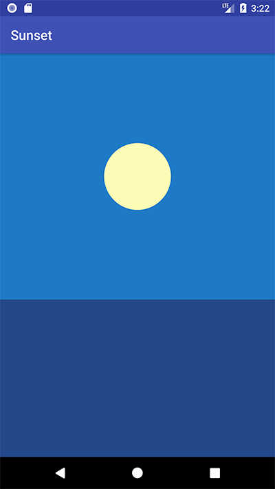
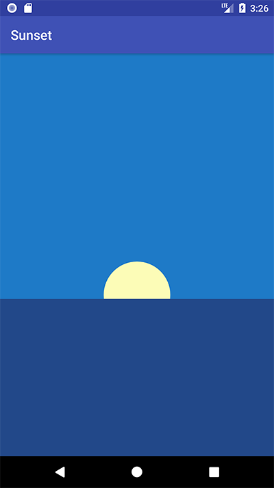
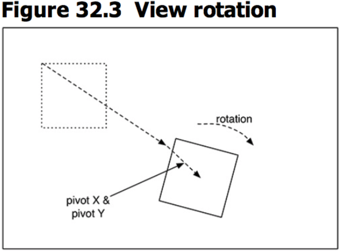
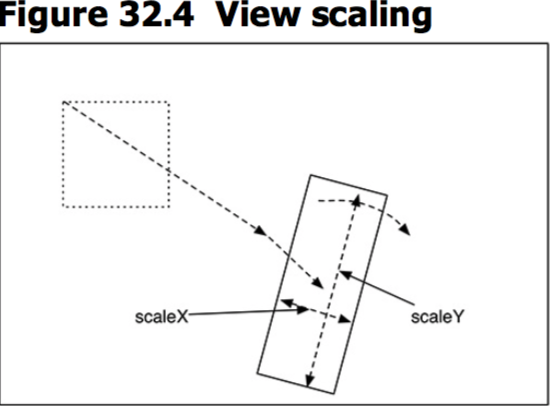
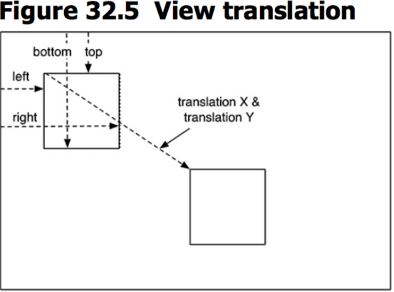

本章
本章要点：
- 
<!-- more -->

# 属性动画
本节引入的动画非常简单，让太阳从天空落到海平面以下，这是初始状态：

点击蓝天背景后，太阳落到海平面以下：


``` java
public class SunsetFragment extends Fragment {
    private View mSceneView;
    private View mSunView;
    private View mSkyView;

    ...
    @Override
    public View onCreateView(LayoutInflater inflater, ViewGroup container,
                             Bundle savedInstanceState){
        View view = inflater.inflate(R.layout.fragment_sunset, container,
                false);
        mSceneView = view;
        mSunView = view.findViewById(R.id.sun);
        mSkyView = view.findViewById(R.id.sky);

        // 点击背景播放动画
        mSceneView.setOnClickListener(new View.OnClickListener(){
            @Override
            public void onClick(View v){
                startAnimation();
            }
        });
        return view;
    }

    private void startAnimation(){
        float sunYStart = mSunView.getTop();
        float sunYEnd = mSkyView.getHeight();
        // 定义动画
        ObjectAnimator heightAnimator = ObjectAnimator.ofFloat(
                mSunView, "y", sunYStart, sunYEnd)
                .setDuration(3000);
        // 设置时间插值
        heightAnimator.setInterpolator(new AccelerateInterpolator());
        heightAnimator.start(); // 执行动画
    }
}
```
其中最关键的是ObjectAnimator实例，它是一个属性动画，本质上就是使用插值重复调用指定对象的setter方法。例如：`ObjectAnimator.ofFloat(mSunView, "y", 0, 1)`就是使用[0, 1]之间的浮点数，重复调用`mSunView.setY(float)`。

除了变换位置坐标，还有三种变换方式：
1. 旋转，X轴偏移，Y轴偏移

2. 横向缩放比例，纵向缩放比例

3. X轴偏移，Y轴偏移


还可以为属性动画添加时间插值，在本节中设置`AccelerateInterpolator`就是一个加速插值器，Android提供了类型丰富的时间插值器。