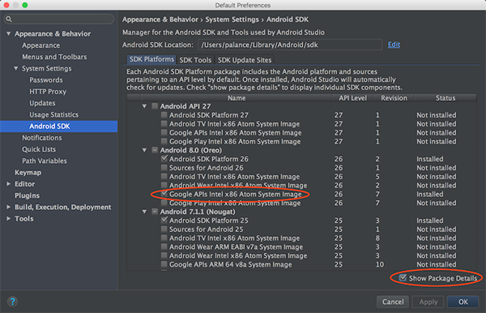
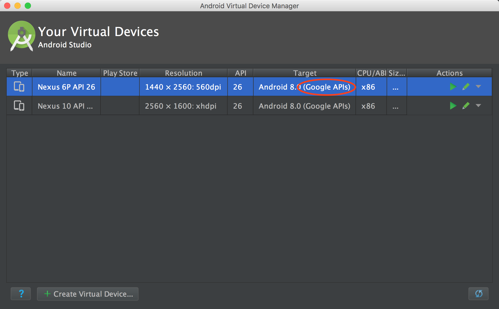
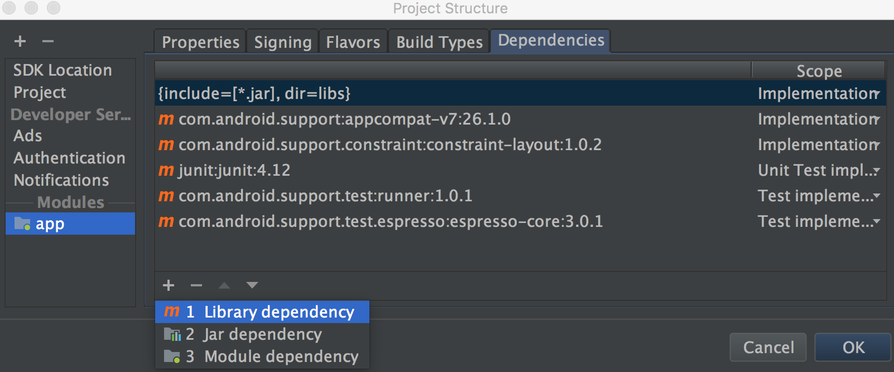
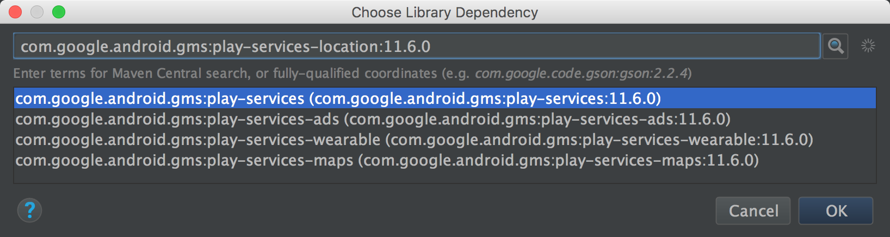
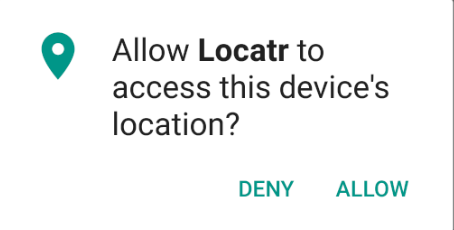
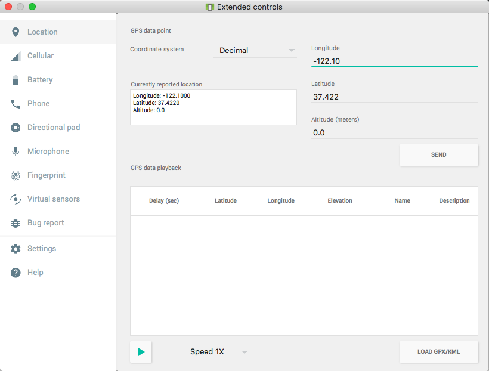

本章
本章要点：
- Play Services
<!-- more -->

# Play Services
除了随Android系统带的标准库外，Android还通过Google Play Service下发和更新API，以确保这类功能的更新速度更快，location service就属于这一类型，被称为`Fused Location Provider`。如果使用这类API，就要求设备必须安装了Google Play Service。

# 在模拟器上安装Play Services
Android Studio菜单Tools > Android > SDK Manager，勾选“Show Package Details”，确保和模拟器对应版本的“Google APIs Intel x86 Atom System Imange”被勾选：

来到Android Virutal Device Manager，确保模拟器Target里有“Google APIs”字样：


# 使用Google Play Services
## 1.添加依赖
在AndroidStudio中，⌘+; > Project Structure > app > Dependencies > + > Library dependency

输入com.agoogle.android.gms，注意我们需要的是com.agoogle.android.gms:play-services-location:11.6.0这在搜索结果里没有，需要自己补上完整的名称：

<font color=red>如果不知道完整的写法该如何是好？</font>

## 2.检查Google Play Services是否可用
我们在Activity即将弹出时检查服务是否可用，如果不可用则弹出提示。
``` java
// LocatrActivity.java
public class LocatrActivity extends SingleFragmentActivity {
    private static final int REQUEST_ERROR = 0;
    ...
    @Override
    protected void onResume(){
        super.onResume();

        GoogleApiAvailability apiAvailability = GoogleApiAvailability.getInstance();

        int errorCode = apiAvailability.isGooglePlayServicesAvailable(this);
        if(errorCode != ConnectionResult.SUCCESS){ // 如果服务不可用，则弹提示
            Dialog errorDialog = apiAvailability.getErrorDialog(this,
                    errorCode, REQUEST_ERROR,
                    new DialogInterface.OnCancelListener() {
                        @Override
                        public void onCancel(DialogInterface dialogInterface) {
                            finish();
                        }
                    });
            errorDialog.show();
        }
    }
}
```
## 3.申请权限
### 在`AndroidManifest.xml`中声明权限
``` xml
<manifest ...>
    <uses-permission android:name="android.permission.ACCESS_FINE_LOCATION"/>
    <uses-permission android:name="android.permission.ACCESS_COARSE_LOCATION"/>
    <uses-permission android:name="android.permission.INTERNET"/>
    <application.../>
</manifest>
```
其中`FINE_LOCATION`来自GPS，信号更精准；`COARSE_LOCATION`来自基站或WiFi，信号精度较差。二者都属于`dangerous`类型的权限，这类权限仅在`AndroidManifest.xml`里声明是不够的，必须在运行时，再实时申请。

### 在运行时申请
`dangerous`类型的权限被归成了几类：
<style>
table th:nth-of-type(1){
    width: 30px;
}
table th:nth-of-type(2){
    width: 80px;
}
table th:nth-of-type(3){
    width: 30px;
}
table th:nth-of-type(4){
    width: 80px;
}
</style>

Permission Group|Permissions|Permission Group|Permissions
---|---
**CALENDAR**|READ_CALENDAR<br>WRITE_CALENDAR|**CAMERA**|CAMERA
**CONTACTS**|READ_CONTACTS<br>WRITE_CONTACTS<br>GET_ACCOUNTS|**LOCATION**|ACCESS_FINE_LOCATION<br>ACCESS_COARSE_LOCATION
**MICROPHONE**|RECORD_AUDIO|**SENSORS**|BODY_SENSORS
**PHONE**|READ_PHONE_STATE<br>CALL_PHONE<br>READ_CALL_LOG<br>WRITE_CALL_LOG<br>ADD_VOICEMAIL<br>USE_SIP<br>PROCESS_OUTGOING_CALLS|**SMS**|SEND_SMS<br>RECEIVE_SMS<br>READ_SMS<br>RECEIVE_WAP_PUSH<br>RECEIVE_MMS
**STORAGE**|READ_EXTERNAL_STORAGE<br>WRITE_EXTERNAL_STORAGE||

申请和授权是按照Permissions操作的，只要申请到了Group中某个权限，该Group中其它权限也就都具备了。运行时检查和申请权限步骤如下：
``` java
// LocatrFragment.java
public class LocatrFragment extends Fragment {
    private static final String TAG = "LocatrFragment";
    private static final String[] LOCATION_PERMISSIONS = new String[]{
            Manifest.permission.ACCESS_FINE_LOCATION,
            Manifest.permission.ACCESS_COARSE_LOCATION,
    };
    private static final int REQUEST_LOCATION_PERMISSION = 0;
    ...
    @Override
    public boolean onOptionsItemSelected(MenuItem item){
        switch (item.getItemId()){
            case R.id.action_locate:
                if(hasLocationPermission()) { // ②
                    findImage();
                }else {// ③
                    requestPermissions(LOCATION_PERMISSIONS, REQUEST_LOCATION_PERMISSION);
                }
                return true;
            ...
        }
    }

    @Override   // ④
    public void onRequestPermissionsResult(int requestCode, String[] permission,
                                          int[] grantResults){
        switch (requestCode){
            case REQUEST_LOCATION_PERMISSION:
                if(hasLocationPermission()){
                    findImage();
                }
                default:
                    super.onRequestPermissionsResult(requestCode, permission,
                            grantResults);
        }
    }

    private void findImage(){ 
        ...     // 使用LocationService
    }

    private boolean hasLocationPermission(){ // ①
        int result = ContextCompat.checkSelfPermission(getActivity(),
                LOCATION_PERMISSIONS[0]);
        return result == PackageManager.PERMISSION_GRANTED;
    }
}
```
①检查是否具备LOCATION权限。
②当点击右上角“定位”图标时，判断如果已经有LOCATION权限，则调用`findImage()`使用Location Service；否则申请LOCATION权限。
③`requestPermissions(...)`是一个异步请求，它会触发Android弹出一个请求权限的对话框。

第一个参数是请求的权限列表；第二个参数是requestCode，用来区分每个请求。当用户选择允许或者拒绝权限申请后，会收到回调，这是④干的事儿了。
④在回调中，首先根据requestCode分辨是哪一个请求。然后判断如果具备了LOCATION权限，说明用户通过了，接下来`findImage()`使用Location Service。也可以根据参数`grantResults`，这是得到授权的权限。

## 使用Location Service
``` java
// LocatrFragment.java
public class LocatrFragment extends Fragment {
    private ImageView mImageView;
    private GoogleApiClient mClient;
    ...
    @Override
    public void onCreate(Bundle savedInstanceState){
        ...
        mClient = new GoogleApiClient.Builder(getActivity())
                .addApi(LocationServices.API)
                .addConnectionCallbacks(
                        new GoogleApiClient.ConnectionCallbacks() {
                            @Override
                            public void onConnected(@Nullable Bundle bundle) {
                                getActivity().invalidateOptionsMenu();
                            }

                            @Override
                            public void onConnectionSuspended(int i) {
                            }
                        })
                .build(); // ①
    }

    @Override
    public View onCreateView(LayoutInflater inflater, ViewGroup container,
                             Bundle savedInstanceState){
        View v = inflater.inflate(R.layout.fragment_locatr, container,
                false);
        mImageView = (ImageView)v.findViewById(R.id.image);
        return v;
    }

    @Override
    public void onStart(){
        super.onStart();
        getActivity().invalidateOptionsMenu();
        mClient.connect(); // ②
    }

    @Override
    public void onStop(){
        super.onStop();
        mClient.disconnect(); // ③
    }

    @Override
    public void onCreateOptionsMenu(Menu menu, MenuInflater inflater){
        super.onCreateOptionsMenu(menu, inflater);
        inflater.inflate(R.menu.fragment_locatr, menu);
        MenuItem searchItem = menu.findItem(R.id.action_locate);
        searchItem.setEnabled(mClient.isConnected());
    }

    @Override
    public boolean onOptionsItemSelected(MenuItem item){
        switch (item.getItemId()){
            case R.id.action_locate:
                if(hasLocationPermission()) {
                    findImage();
                }...
                return true;
            ...
        }
    }

    ...
    private void findImage(){
        LocationRequest request = LocationRequest.create(); // ④
        request.setPriority(LocationRequest.PRIORITY_HIGH_ACCURACY);
        request.setNumUpdates(1);// 更新多少次
        request.setInterval(0); // 更新的频次，0表示尽可能频繁

        LocationServices.FusedLocationApi
                .requestLocationUpdates(mClient, request,
                        new LocationListener() {
                            @Override
                            public void onLocationChanged(Location location) {
                                Log.i(TAG, "Got a fix: " + location);
                            }
                        }); // ⑤
    }
    ...
}
```
①凡使用Play Services，必须先创建一个GoogleApiClient实例，使用GoogleApiClient.Builder完成创建。
①和②③是一套组合拳：由于Play Service来自Google Play Store app，这是另一个应用，Google建议在Fragment的`onStart()`中建立连接，在`onStop()`中释放链接，这就是②和③中做的事情。
一旦连接成功，需要让菜单中的“定位”图标变成enabled状态，否则为disabled状态。因此在创建Client时，调用`addConnectionCallbacks(...)`设置连接成功的回调。
④构造一个LocationRequest，待会儿会把它发送给LocationServices。除了这里设定的更新频次、次数、精度级别外，还可以设置到期时间，触发Location更新的最小移动距离。
⑤将LocationRequest发给LocationServices，如果位置信息发生变化，将收到回调`onLocationChanged(...)`，通过模拟器的设置界面可以修改经纬度，点击`SEND`即可更新到模拟器：
