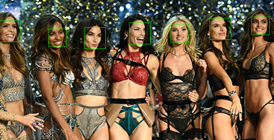
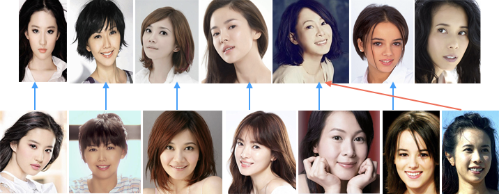

本章要点：
- dlib的安装
- dlib简单使用

<!-- more -->
因为要用dlib做一个人脸识别，昨晚搞了一下dlib python的安装和使用，在macOS下遇到了一些问题。
# dlib的安装
主要安装步骤非常简单，如果pip能自己搞定依赖问题就好了。
## 安装步骤
dlib依赖boost，所以理想情况下只需要
``` bash
$ brew install boost-python
$ sudo pip install dlib
$ sudo pip install scikit-image
```
因为下面要跑一个示例的需要，最后一步安装了scikit-image。

## 关闭SIP
如果系统开启了系统完整性保护SIP（SystemIntegrity Protection），需要：
- 重启OS，按住⌘+R
- 从菜单中进入终端，输入`csrutil disable`，关闭SIP
- 重启OS

完成这些步骤之后再操作前面的dlib安装步骤，安装成功后记得同样的步骤，通过命令`csrutil enable`恢复SIP

## 遇到的问题
折腾最久的是这个错误：
```
#error "DLIB_NO_GUI_SUPPORT is defined so you can't use the GUI code.  Turn DLIB_NO_GUI_SUPPORT off if you want to use it."
     ^
    /usr/local/include/dlib/gui_core/gui_core_kernel_2.h:12:2: error: "Also make sure you have libx11-dev installed on your system"
    #error "Also make sure you have libx11-dev installed on your system"
     ^
```
不知道最根本的原因是啥，尝试了N种办法，最后我更新了一把Xcode：
`$ sudo xcode-select --install`
就OK了。

# dlib的使用
## 检测人脸区域
``` python
img = cv2.imread('images/girls.jpg')
rgbImg = cv2.cvtColor(img, cv2.COLOR_BGR2RGB)
detector = dlib.get_frontal_face_detector() # 正脸检测器
faces = detector(rgbImg, 1) # 返回脸的信息
for face in faces:          # 框出每张脸
    cv2.rectangle(img, (face.left(), face.top()), (face.right(), face.bottom()), (0, 255, 0), 1)
```
如图，输入一个多人图片，通过正脸检测器可以检测出每张脸的矩形区域


## 计算人脸特征
``` python
img = io.imread(imgFile) # 输入单人头像
detector = dlib.get_frontal_face_detector()
# 检测出人脸区域
faces = detector(img, 1)
...
faceRect = faces[0]

# 训练好的人脸关键点检测器数据
predictorPath = 'extdata/shape_predictor_68_face_landmarks.dat'
# 训练好的ResNet人脸识别模型
faceRecModelPath = 'extdata/dlib_face_recognition_resnet_model_v1.dat'
shapePredictor = dlib.shape_predictor(predictorPath) # 人脸关键点监测器
faceRec = dlib.face_recognition_model_v1(faceRecModelPath) # 人脸识别模型

# 关键点检测
shape = shapePredictor(img, faceRect)
# 描述项提取， 128D向量
faceDescriptor = faceRec.compute_face_descriptor(img, shape)
# 转换为numpu array
return numpy.array(faceDescriptor)
```
其中：
`shape_predictor_68_face_landmarks.dat`是已经训练好的[人脸关键点检测器数据](http://dlib.net/files/shape_predictor_68_face_landmarks.dat.bz2)。
`dlib_face_recognition_resnet_model_v1.dat`是已经训练好的[ResNet人脸识别模型](http://dlib.net/files/dlib_face_recognition_resnet_model_v1.dat.bz2)。
提取到的128D向量形式如下：
``` bash
$ python -m unittest sample.DLibUT.test02
14:40 0117 DEBUG    
[ -1.32817209e-01   7.43134990e-02   7.68444687e-02  -1.05091885e-01
  -1.46399811e-01   4.86346148e-03  -1.23881295e-01  -1.71705186e-01
  ...               ...             ...             ...
  -1.90864969e-03   1.68816522e-02  -2.53906399e-01   1.30065437e-02
   1.57092661e-01  -9.88340452e-02   9.43705738e-02   5.99186197e-02]
```

## 人脸识别
现有一堆候选人照片，给定一个待识别人照片，识别出他是候选人中的哪一个，这是人脸识别解决的主要问题。应用上一节计算出的人脸特征，计算待识别人和每位候选人之间的特征差，求最小的那个候选人，就是人脸识别的主要方法。
使用`numpy.linalg.norm(candDesc - testDesc)`可以将128D向量转化成一个数值，求这个最小值即可。在faceRek/sample.DLibUT.test03有完整的代码，识别结果如下，蓝色是识别正确的，红色是识别错误的：

它把莫文蔚识成了ruru 😂

本节涉及的代码放到了[faceRek](https://github.com/palanceli/facemojiSample/tree/master/faceRek)。

# 参考
[dlib github](https://github.com/davisking/dlib)
[dlib 官网](http://dlib.net/)
[scikit-image 官网](http://scikit-image.org)
[scikit-learn 官网](http://scikit-learn.org/stable/)
[《40行代码的人脸识别实践》](http://blog.csdn.net/xingchenbingbuyu/article/details/68482838?ref=myrecommend)