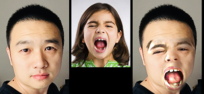
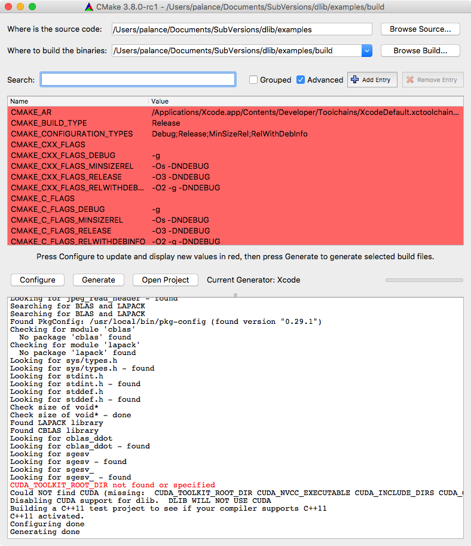
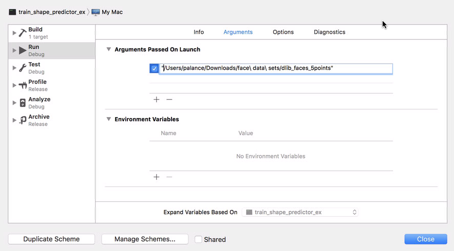
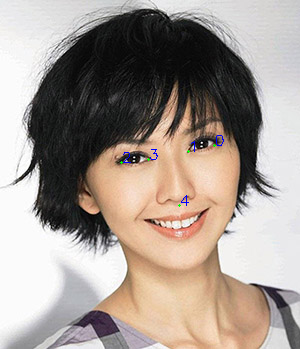

本章要点：
- dlib的安装
- dlib简单使用
- 人脸检测、识别
- 人脸合成
- 训练自己的人脸关键点模型

<!-- more -->
因为要用dlib做一个人脸识别，昨晚搞了一下dlib python的安装和使用，在macOS下遇到了一些问题。
# dlib的安装
主要安装步骤非常简单，如果pip能自己搞定依赖问题就好了。
## 安装步骤
dlib依赖boost，所以理想情况下只需要
``` bash
$ brew install boost-python
$ sudo pip install dlib
$ sudo pip install scikit-image
```
因为下面要跑一个示例的需要，最后一步安装了scikit-image。

## 关闭SIP
如果系统开启了系统完整性保护SIP（SystemIntegrity Protection），需要：
- 重启OS，按住⌘+R
- 从菜单中进入终端，输入`csrutil disable`，关闭SIP
- 重启OS

完成这些步骤之后再操作前面的dlib安装步骤，安装成功后记得同样的步骤，通过命令`csrutil enable`恢复SIP

## 遇到的问题
折腾最久的是这个错误：
```
#error "DLIB_NO_GUI_SUPPORT is defined so you can't use the GUI code.  Turn DLIB_NO_GUI_SUPPORT off if you want to use it."
     ^
    /usr/local/include/dlib/gui_core/gui_core_kernel_2.h:12:2: error: "Also make sure you have libx11-dev installed on your system"
    #error "Also make sure you have libx11-dev installed on your system"
     ^
```
不知道最根本的原因是啥，尝试了N种办法，最后我更新了一把Xcode：
`$ sudo xcode-select --install`
就OK了。

# dlib的使用
## 检测人脸区域
``` python
img = cv2.imread('images/girls.jpg')
rgbImg = cv2.cvtColor(img, cv2.COLOR_BGR2RGB)
detector = dlib.get_frontal_face_detector() # 正脸检测器
faces = detector(rgbImg, 1) # 返回脸的信息
for face in faces:          # 框出每张脸
    cv2.rectangle(img, (face.left(), face.top()), (face.right(), face.bottom()), (0, 255, 0), 1)
```
如图，输入一个多人图片，通过正脸检测器可以检测出每张脸的矩形区域


## 检测人脸特征点
``` python
    img = cv2.imread('images/girls.jpg')
    rgbImg = cv2.cvtColor(img, cv2.COLOR_BGR2RGB)
    detector = dlib.get_frontal_face_detector()
    faces = detector(rgbImg, 1)
    for face in faces:
        # 识别出关键点，keyPts的类型是dlib.points
        keyPts = self.shapePredictor(img, face).parts()
        landmarks = numpy.matrix([[p.x,p.y] for p in keyPts]) 
        # 画出关键点
        pts = numpy.array([landmarks], numpy.int32)
        cv2.polylines(img, pts.reshape(-1, 1, 2), True, (0, 255, 0), 2)
```


## 计算人脸特征
``` python
img = io.imread(imgFile) # 输入单人头像
detector = dlib.get_frontal_face_detector()
# 检测出人脸区域
faces = detector(img, 1)
...
faceRect = faces[0]

# 训练好的人脸关键点检测器数据
predictorPath = 'extdata/shape_predictor_68_face_landmarks.dat'
# 训练好的ResNet人脸识别模型
faceRecModelPath = 'extdata/dlib_face_recognition_resnet_model_v1.dat'
shapePredictor = dlib.shape_predictor(predictorPath) # 人脸关键点监测器
faceRec = dlib.face_recognition_model_v1(faceRecModelPath) # 人脸识别模型

# 关键点检测
shape = shapePredictor(img, faceRect)
# 描述项提取， 128D向量
faceDescriptor = faceRec.compute_face_descriptor(img, shape)
# 转换为numpu array
return numpy.array(faceDescriptor)
```
其中：
`shape_predictor_68_face_landmarks.dat`是已经训练好的[人脸关键点检测器数据](http://dlib.net/files/shape_predictor_68_face_landmarks.dat.bz2)。
`dlib_face_recognition_resnet_model_v1.dat`是已经训练好的[ResNet人脸识别模型](http://dlib.net/files/dlib_face_recognition_resnet_model_v1.dat.bz2)。
我在faceRek/setup.sh中写了工程依赖的外部数据，运行python代码前先执行
`sh setup.sh`

该段代码提取到的128D向量形式如下：
``` bash
$ python -m unittest sample.DLibUT.test02
14:40 0117 DEBUG    
[ -1.32817209e-01   7.43134990e-02   7.68444687e-02  -1.05091885e-01
  -1.46399811e-01   4.86346148e-03  -1.23881295e-01  -1.71705186e-01
  ...               ...             ...             ...
  -1.90864969e-03   1.68816522e-02  -2.53906399e-01   1.30065437e-02
   1.57092661e-01  -9.88340452e-02   9.43705738e-02   5.99186197e-02]
```

## 人脸识别
现有一堆候选人照片，给定一个待识别人照片，识别出他是候选人中的哪一个，这是人脸识别解决的主要问题。应用上一节计算出的人脸特征，计算待识别人和每位候选人之间的特征差，求最小的那个候选人，就是人脸识别的主要方法。
使用`numpy.linalg.norm(candDesc - testDesc)`可以将128D向量转化成一个数值，求这个最小值即可。在faceRek/sample.DLibUT.test03有完整的代码，识别结果如下，蓝色是识别正确的，红色是识别错误的：

它把莫文蔚识成了ruru 😂

## 人脸合成
我本来想找的合成是根据一张面孔的特征去变换另一张面孔，但我只找到了两张面孔特征部分的叠加，暂时也先收着吧。不忍心拿美女开刀，就用我自己的看效果吧🤣


# 训练自己的人脸关键点模型
在[dlib-models](https://github.com/davisking/dlib-models)中Davis King提到：[shape_predictor_68_face_landmarks.dat](http://dlib.net/files/shape_predictor_68_face_landmarks.dat.bz2)所使用的数据集许可证不包括商业用途，因此该训练模型也不能用于商业产品。

而且该模型压缩尺寸有61M，解开后99M，作者在[Real-Time Face Pose Estimation](http://blog.dlib.net/2014/08/real-time-face-pose-estimation.html)的中有大量的答疑，关于性能、和编译等问题，Davis King真是勤奋！
- [这里](http://blog.dlib.net/2014/08/real-time-face-pose-estimation.html?showComment=1445290037220#c6512573392805280310)提到：如果想得到更小的数据模型，可以在原先的数据集上删减一些landmarks，并自己完成训练，原先的训练集数据可以从[http://dlib.net/files/data/ibug_300W_large_face_landmark_dataset.tar.gz](http://dlib.net/files/data/ibug_300W_large_face_landmark_dataset.tar.gz)下载；训练代码参见[http://dlib.net/train_shape_predictor_ex.cpp.html](http://dlib.net/train_shape_predictor_ex.cpp.html)，该代码位于`dlib/examples/train_shape_predictor_ex.cpp`。这里还有一个5 landmarks的训练集[http://dlib.net/files/data/dlib_faces_5points.tar](http://dlib.net/files/data/dlib_faces_5points.tar).
- [这里](http://blog.dlib.net/2014/08/real-time-face-pose-estimation.html?showComment=1410219350404#c1560932319064417228)提到：可以从HELEN数据集[http://www.ifp.illinois.edu/~vuongle2/helen/](http://www.ifp.illinois.edu/~vuongle2/helen/)中获取194 landmarks的训练数据，完成自己的训练。
- [这里](https://github.com/davisking/dlib-models)提到：模型shape_predictor_68_face_landmarks.dat.bz2的数据源来自[https://ibug.doc.ic.ac.uk/resources/facial-point-annotations/](https://ibug.doc.ic.ac.uk/resources/facial-point-annotations/)，这是300万数据集。

作者提供的素材就这些，足够了！我的编译环境是mac OS，git clone dlib到本地，创建目录dlib/examples/build，然后使用cmake：

有一个警告但是可以忽略。使用Xcode打开project，我打算训练数据集dlib_faces_5points，将其目录下的两个xml文件分别改名为：
`test_cleaned.xml` => `testing_with_face_landmarks.xml`
`train_cleaned.xml` => `training_with_face_landmarks.xml`
在Xcode中点击菜单Product > Scheme > Edit Scheme...，设置命令行的输入参数：

然后就可以运行了，不过要做好思想准备，我把`training_with_face_landmarks.xml`中的5000多张图砍到200多张，整个训练和测试过程需要半个小时；如果把5000多张图跑一遍，从log输出的提示上来看，需要24小时！我不知道那300多万张ibug的数据跑完得要多长时间。

训练完成后，会自动跑出评测结果，看起来还不错：
```
mean training error: 0.011435
mean testing error:  0.00745601 
```

接下来用python验证一下：
``` python
class DLibTrainingUT(unittest.TestCase):
    def setUp(self):
        ...
        self.mDetector = dlib.get_frontal_face_detector()   # 正脸检测器

    def getFaceLandmarksFromImg(self, img, predictorPath):
        # 检测出人脸区域
        faces = self.mDetector(img, 1)
        ...
        faceRect = faces[0]

        self.mShapePredictor = dlib.shape_predictor(predictorPath) # 人脸关键点监测器
        # 提取关键点
        keyPts = self.mShapePredictor(img, faceRect).parts()
        landmarks = numpy.matrix([[p.x, p.y] for p in keyPts])
        return landmarks

    def test01(self):
        ''' 验证自己训练的模型效果 '''
        imgFile = 'images/2-0.jpg'
        img = cv2.imread(imgFile)
        modelPath = '/Users/palance/Documents/SubVersions/dlib/examples/build/Debug/sp.dat'
        landmarks = self.getFaceLandmarksFromImg(img, modelPath)

        pts = numpy.array(landmarks, numpy.int32)
        cv2.polylines(img, pts.reshape(-1, 1, 2), True, (0, 255, 0), 2)

        font = cv2.FONT_HERSHEY_SIMPLEX 
        index = 0
        for pt in landmarks:
            x, y = pt[0, 0], pt[0, 1]
            text = '%d' % index
            cv2.putText(img, text, (x, y), font, 0.5, (255, 0, 0))
            index += 1

        self.waitToClose(img)
```
结果如下：

虽然只用了200多张图片，结果好像还不错！

# 参考
[dlib github](https://github.com/davisking/dlib)
[dlib 官网](http://dlib.net/)
[scikit-image 官网](http://scikit-image.org)
[scikit-learn 官网](http://scikit-learn.org/stable/)
[《40行代码的人脸识别实践》](http://blog.csdn.net/xingchenbingbuyu/article/details/68482838?ref=myrecommend)
[《OpenCV实践之路——用dlib库进行人脸检测与人脸标记（Python）》](http://blog.csdn.net/xingchenbingbuyu/article/details/51116354)
[《One Millisecond Face Alignment with an Ensemble of Regression Trees》](http://www.csc.kth.se/~vahidk/papers/KazemiCVPR14.pdf)
[《Orthogonal Procrustes problem》](https://en.wikipedia.org/wiki/Orthogonal_Procrustes_problem)
[《Transformation matrix》](https://en.wikipedia.org/wiki/Transformation_matrix#Affine_transformations)
[《Switching Eds: Face swapping with Python, dlib, and OpenCV》](http://matthewearl.github.io/2015/07/28/switching-eds-with-python/)
[《教你用200行Python代码“换脸”》](http://geek.csdn.net/news/detail/36873)
[《手把手：使用OpenCV进行面部合成— C++ / Python》](https://mp.weixin.qq.com/s?__biz=MjM5MTQzNzU2NA==&mid=2651641340&idx=1&sn=29e39cb6113120fe73b3c397f1c9d555)
[https://github.com/iamwx/FaceMorph](https://github.com/iamwx/FaceMorph)
[人脸关键点检测器的训练](http://blog.csdn.net/elaine_bao/article/details/53054533)


> 本文涉及的所有代码都已提交到github上：
[https://github.com/palanceli/facemojiSample/tree/master/faceRek](https://github.com/palanceli/facemojiSample/tree/master/faceRek)。