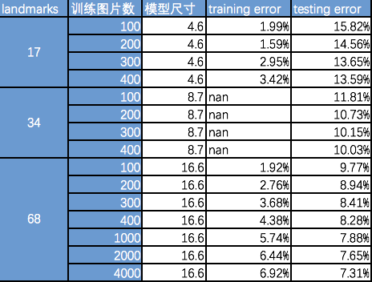

本章要点：
- dlib提取人脸关键点的时间性能和尺寸

<!-- more -->
来单独聊聊dlib提取人脸关键点的时间、空间性能。作者训练的[http://dlib.net/files/shape_predictor_68_face_landmarks.dat.bz2](http://dlib.net/files/shape_predictor_68_face_landmarks.dat.bz2)模型压缩后有61M，解压后99M，跑在服务端这不算什么，但是如果放在一个客户端产品里这么大的尺寸是不能接受的。

# 时间性能优化
时间性能开销更是慢得像屎一样，我在mac book pro 2013下，用python在每个视频帧上标出landmarks，我发现每次提取关键点需要700ms左右。代码如下：
``` python

class DLibHelper(object):
    def __init__(self):
        self.mParams = {'predictorPath':'extdata/shape_predictor_68_face_landmarks.dat', 
        'faceRecModelPath':'extdata/dlib_face_recognition_resnet_model_v1.dat'}
        self.ReloadFunctions()

    def ReloadFunctions(self):
        self.funcShapePredictor = dlib.shape_predictor(self.mParams['predictorPath'])
        self.funcFaceRecognize = dlib.face_recognition_model_v1(self.mParams['faceRecModelPath'])
        self.funcDetector = dlib.get_frontal_face_detector()

    def GetFaces(self, img):    # 返回所有脸盘
        return self.funcDetector(img, 1)

    def GetFaceLandmarks(self, img, faceRect):  # 返回指定脸盘的landmarks
        keyPts = self.funcShapePredictor(img, faceRect).parts()
        landmarks = numpy.matrix([[p.x, p.y] for p in keyPts])
        return landmarks

class DLibPerfUT(unittest.TestCase):
    def setUp(self):
        logFmt = '%(asctime)s %(lineno)04d %(levelname)-8s %(message)s'
        logging.basicConfig(level=logging.DEBUG, format=logFmt, datefmt='%H:%M',)

    def test02(self):
        ''' 从摄像头读取图像并显示 '''
        dlibHelper = DLibHelper()
        cap = cv2.VideoCapture(0)
        img = cap.read()[1]
        while True:
            img = cap.read()[1]
            t0= timeit.default_timer()

            faceRects = dlibHelper.GetFaces(img)  # 检测人脸rect
            if len(faceRects) == 0:
                continue

            t1= timeit.default_timer()
            faceRect = faceRects[0]

            landmarks = dlibHelper.GetFaceLandmarks(img, faceRect)  # 提取landmarks
            t2 = timeit.default_timer()
            logging.debug('GetFaces:%5.3f, GetFaceLandmarks:%5.3f' % (t1-t0, t2-t1))

            pts = numpy.array(landmarks, numpy.int32)
            cv2.polylines(img, pts.reshape(-1, 1, 2), True, (0, 255, 0), 2)

            cv2.imshow('image', img)
            key = cv2.waitKey(1)
            if key == 27:
                break
```
这段代码的输出结果如下：
``` bash
$ python -m unittest sample.DLibPerfUT.test02
23:36 0096 DEBUG    GetFaces:0.719, GetFaceLandmarks:0.004
23:37 0096 DEBUG    GetFaces:0.730, GetFaceLandmarks:0.004
23:37 0096 DEBUG    GetFaces:0.703, GetFaceLandmarks:0.004
23:37 0096 DEBUG    GetFaces:0.699, GetFaceLandmarks:0.004
23:37 0096 DEBUG    GetFaces:0.724, GetFaceLandmarks:0.004
23:37 0096 DEBUG    GetFaces:0.733, GetFaceLandmarks:0.004
23:37 0096 DEBUG    GetFaces:0.691, GetFaceLandmarks:0.004
23:37 0096 DEBUG    GetFaces:0.695, GetFaceLandmarks:0.004
23:37 0096 DEBUG    GetFaces:0.684, GetFaceLandmarks:0.004
23:37 0096 DEBUG    GetFaces:0.684, GetFaceLandmarks:0.004
23:37 0096 DEBUG    GetFaces:0.685, GetFaceLandmarks:0.004
```
这么慢的速度根本没法应用到实时视频上，不过很容易关注到瓶颈点是在人脸识别上，即脸部矩形的检测上，关键点检测倒是挺快的。

## 修改人脸检测器的参数
我在[face_detector.py](https://github.com/davisking/dlib/blob/master/python_examples/face_detector.py)中找到如下一段代码：
``` python
...
    img = io.imread(f)
    # The 1 in the second argument indicates that we should upsample the image
    # 1 time.  This will make everything bigger and allow us to detect more
    # faces.
    dets = detector(img, 1)
    ...
```
这段注释是说：`detector的第二个参数1表示会把图片扩大1倍，以便发现更多的面孔`，这也意味着要付出更大的性能代价。如果应用场景确定是单面孔，其实没必要扩大，因此我把这个数值改为0，发现时间消耗只剩原来的1/4！
``` bash
palancedeMacBook-Pro:faceRek palance$ python -m unittest sample.DLibPerfUT.test02
23:47 0096 DEBUG    GetFaces:0.171, GetFaceLandmarks:0.007
23:47 0096 DEBUG    GetFaces:0.165, GetFaceLandmarks:0.004
23:47 0096 DEBUG    GetFaces:0.164, GetFaceLandmarks:0.004
23:47 0096 DEBUG    GetFaces:0.162, GetFaceLandmarks:0.004
23:47 0096 DEBUG    GetFaces:0.163, GetFaceLandmarks:0.004
23:47 0096 DEBUG    GetFaces:0.160, GetFaceLandmarks:0.004
23:47 0096 DEBUG    GetFaces:0.159, GetFaceLandmarks:0.004
23:47 0096 DEBUG    GetFaces:0.164, GetFaceLandmarks:0.004
```

## 在小图上做人脸检测
已经很棒了，但是还不够。一般视频每秒钟在20~30帧，因此每帧的处理时间必须控制在30ms才能保证视频流畅。既然缩小图片尺寸可以有效减少时间开销，可以进一步沿着这个思路做优化。如果应用的场景中面孔不是很多，可以进一步缩小图片尺寸，使用缩小的图片做人脸检测，然后再等比扩大到初始尺寸，做landmark提取。由于人脸在图片中的面积通常比较大，所以缩放几乎不会影响人脸识别的精度，landmarks提取还是在原始图片上做的，精度也不受影响。我把代码改成这样：
``` python
...
    def test02(self):
        ''' 从摄像头读取图像并显示 '''
        dlibHelper = DLibHelper()
        cap = cv2.VideoCapture(0)
        img = cap.read()[1]
        while True:
            img = cap.read()[1]
            
            t0= timeit.default_timer()
            imgZoomed = cv2.resize(img, None, fx=0.25, fy=0.25, interpolation=cv2.INTER_CUBIC) # 缩小四分之一
            t1= timeit.default_timer()

            faceRects = dlibHelper.GetFaces(imgZoomed)  # 检测人脸rect
            if len(faceRects) == 0:
                continue

            t2= timeit.default_timer()
            faceRect = faceRects[0]
            faceRect = dlib.rectangle(faceRects[0].left()*4, faceRects[0].top()*4, 
                faceRects[0].right()*4, faceRects[0].bottom()*4)
            cv2.rectangle(img, (faceRect.left(), faceRect.top()), (faceRect.right(), faceRect.bottom()), (0, 255, 0), 1)

            landmarks = dlibHelper.GetFaceLandmarks(img, faceRect)  # 提取landmarks
            t3 = timeit.default_timer()
            logging.debug('GetFaces:%5.3f, GetFaceLandmarks:%5.3f' % (t2-t1, t3-t2))

            pts = numpy.array(landmarks, numpy.int32)
            cv2.polylines(img, pts.reshape(-1, 1, 2), True, (0, 255, 0), 2)

            cv2.imshow('image', img)
            key = cv2.waitKey(1)
            if key == 27:
                break
```
输出结果如下：
``` bash
$ python -m unittest sample.DLibPerfUT.test02
23:58 0095 DEBUG    GetFaces:0.013, GetFaceLandmarks:0.009
23:58 0095 DEBUG    GetFaces:0.012, GetFaceLandmarks:0.004
23:58 0095 DEBUG    GetFaces:0.011, GetFaceLandmarks:0.004
23:58 0095 DEBUG    GetFaces:0.012, GetFaceLandmarks:0.004
23:58 0095 DEBUG    GetFaces:0.012, GetFaceLandmarks:0.004
23:58 0095 DEBUG    GetFaces:0.012, GetFaceLandmarks:0.004
23:58 0095 DEBUG    GetFaces:0.012, GetFaceLandmarks:0.004
23:58 0095 DEBUG    GetFaces:0.011, GetFaceLandmarks:0.004
23:58 0095 DEBUG    GetFaces:0.012, GetFaceLandmarks:0.004
23:58 0095 DEBUG    GetFaces:0.017, GetFaceLandmarks:0.004
23:58 0095 DEBUG    GetFaces:0.011, GetFaceLandmarks:0.004
23:58 0095 DEBUG    GetFaces:0.012, GetFaceLandmarks:0.004
23:58 0095 DEBUG    GetFaces:0.011, GetFaceLandmarks:0.004
```
哈哈简直健步如飞！播放视频已经没问题了。

## 使用correlation_tracker跟踪脸部区域
还发现另一种更快的方式：使用dlib.correlation_tracker()跟踪，它的使用方式大致是：在第一帧采用常规方式抓取脸部区域，之后使用tracker基于前一帧判断当前帧的脸部区域。代码如下：
``` python
    def test03(self):
        ''' 从摄像头读取图像并显示 '''
        dlibHelper = DLibHelper()
        cap = cv2.VideoCapture(0)
        img = cap.read()[1]
        tracker = dlib.correlation_tracker()    # 初始化tracker
        faceRect = None
        while True:
            img = cap.read()[1]
            
            # logging.debug(tracker.get_position())
            t0 = timeit.default_timer()

            if faceRect is None:
                faceRects = dlibHelper.GetFaces(img)    # 首帧采用常规方法抓取脸部区域
                if len(faceRects) == 0:
                    continue
                faceRect = dlib.rectangle(faceRects[0].left(), faceRects[0].top(), faceRects[0].right(), faceRects[0].bottom())
                tracker.start_track(img, faceRect)
            else:
                tracker.update(img)     # 非首帧采用跟踪器
                rect = tracker.get_position()
                faceRect = dlib.rectangle(int(rect.left()), int(rect.top()), int(rect.right()), int(rect.bottom()))
            t1 = timeit.default_timer()
            cv2.rectangle(img, (faceRect.left(), faceRect.top()), (faceRect.right(), faceRect.bottom()), (0, 255, 0), 1)

            landmarks = dlibHelper.GetFaceLandmarks(img, faceRect)
            t2 = timeit.default_timer()
            logging.debug('GetFaceRect:%5.3f, GetFaceLandmarks:%5.3f' % (t1-t0, t2-t1))

            pts = numpy.array(landmarks, numpy.int32)
            cv2.polylines(img, pts.reshape(-1, 1, 2), True, (0, 255, 0), 2)

            cv2.imshow('image', img)
            key = cv2.waitKey(1)
            if key == 27:
                break
```
我把图片缩放的代码去掉，执行结果如下：
``` bash
$ python -m unittest sample.DLibPerfUT.test03
19:48 0131 DEBUG    GetFaceRect:0.123, GetFaceLandmarks:0.004
19:48 0131 DEBUG    GetFaceRect:0.009, GetFaceLandmarks:0.001
19:48 0131 DEBUG    GetFaceRect:0.009, GetFaceLandmarks:0.001
19:48 0131 DEBUG    GetFaceRect:0.010, GetFaceLandmarks:0.001
19:48 0131 DEBUG    GetFaceRect:0.009, GetFaceLandmarks:0.001
19:48 0131 DEBUG    GetFaceRect:0.009, GetFaceLandmarks:0.001
19:48 0131 DEBUG    GetFaceRect:0.009, GetFaceLandmarks:0.002
19:48 0131 DEBUG    GetFaceRect:0.009, GetFaceLandmarks:0.001
19:48 0131 DEBUG    GetFaceRect:0.009, GetFaceLandmarks:0.001
```

## 移植到Android
这个优化方法移植到Android需要修改dlib-android的代码并重新编译so，所以这里把移植方法也做一遍。
``` bash
$ git clone --recursive https://github.com/tzutalin/dlib-android.git
$ cd dlib-android
$ ./envsetup
```
`./envsetup`会下载[opencv-android](https://sourceforge.net/projects/opencvlibrary/files/opencv-android/)，这个过程特别慢，建议自己下载最新版本，将opencv-<version>-android-sdk.zip文件放到`dlib-android/thrid_party/`，并修改envsetup，将函数`def downloadPrebuiltOpencv(prefix='.', out_prefix='.', version='3.3.1')`参数version的默认值改为对应的版本号。
`envsetup`还会clone`dlib-android-app`，也可以自己通过下载工具把它下到本地，在解压到`dlib-android/androidstudio-examples/dlib-android-app`。
然后再执行`./envsetup`。

去[Android website](https://developer.android.com/ndk/downloads/index.html)下载Android-NDK，在~/.bashrc中添加：
``` bash
export ANDROID_NDK_HOME=[NDK_PATH]/android-ndk-[version]
export PATH=$PATH:$ANDROID_NDK_HOME
```
保存退出并执行：`source ~/.bashrc`

执行
``` bash
$ cd dlib-android
$ python build.py
```
搞定！

### 编译dlib-android-app
打开`dlib-android/androidstudio-examples/dlib-android-app`，编译遇到如下问题：
``` bash
Error:A problem occurred configuring project ':app'.  
> android-apt plugin is incompatible with the Android Gradle plugin.  Please use 'annotationProcessor' configuration instead.  
```
解决办法：
1、在app/build.gradle中删除`classpath 'com.neenbedankt.gradle.plugins:android-apt:1.4'`和`apply plugin: 'com.neenbedankt.android-apt'`
2、将`apt "org.androidannotations:androidannotations:$AAVersion"`替换为`annotationProcessor "org.androidannotations:androidannotations:$AAVersion"`

再编译遇到如下问题：
``` bash
.../dlib-android/androidstudio-examples/dlib-android-app/app/build/intermediates/res/merged/debug/raw_shape_predictor_68_face_landmarks.dat.flat
Error:error: failed to read data meta data.
Error:failed parsing overlays.
Error:java.util.concurrent.ExecutionException: java.util.concurrent.ExecutionException: com.android.tools.aapt2.Aapt2Exception: AAPT2 error: check logs for details
Error:java.util.concurrent.ExecutionException: com.android.tools.aapt2.Aapt2Exception: AAPT2 error: check logs for details
Error:com.android.tools.aapt2.Aapt2Exception: AAPT2 error: check logs for details
Error:Execution failed for task ':app:processDebugResources'.
> Failed to execute aapt
```
这是AAPT的bug，当raw文件超过68M就会出这个问题，关于bug的讨论详见[这里](https://issuetracker.google.com/issues/68425589)，解决方案有两个：
1、修改`gradle.properties`文件，添加`android.enableAapt2=false`，这个方案在[这里](https://stackoverflow.com/questions/46961577/android-studio-error-failed-to-read-metadata-after-update-to-3-0-0)有讨论。
2、把`dlib-android/androidstudio-examples/dlib-android-app/app/src/main/res/raw/shape_predictor_68_face_landmarks.dat`替换为一个更小的模型

继续编译终于搞定了。

# 尺寸性能优化
最大的瓶颈在模型数据上，所以只能先从模型入手训练不同数据集的模型，看看`数据`、`特征点`、`尺寸`之间是个什么关系。训练模型的方法在[《训练自己的人脸关键点模型》](http://localhost:4000/2017/11/26/2017/1126dlib/#训练自己的人脸关键点模型)已经说过了。这里使用的训练数据是[http://dlib.net/files/data/ibug_300W_large_face_landmark_dataset.tar.gz](http://dlib.net/files/data/ibug_300W_large_face_landmark_dataset.tar.gz)，结果如下：

结论：landmarks对于模型的大小有着决定性作用，而且成正比，增加图片数量对于模型几乎没有影响，对于准确率有提升。
但是作者号称ibug有300万的数据，应该指的是landmarks点，我把图片全部下载也就6000多张。
为什么我跑完了所有数据也只有16.6M呢？[这里](http://blog.dlib.net/2014/08/real-time-face-pose-estimation.html?showComment=1416144989345#c5823830982307347300)作者提到他修改了学习深度从10改到15，我猜测跟这个有关，没验证过。
对于一般的娱乐应用，能达到90%的准确率，在直观体验上已经没问题了，这是我在实时视频下圈出landmarks的感受。

# 参考
[Speeding up Dlib’s Facial Landmark Detector](https://www.learnopencv.com/speeding-up-dlib-facial-landmark-detector/)
[dlib-android](https://github.com/tzutalin/dlib-android)
[Real-Time Face Pose Estimation](http://blog.dlib.net/2014/08/real-time-face-pose-estimation.html?showComment=1445290037220#c6512573392805280310)