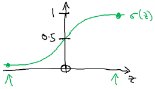
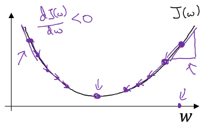
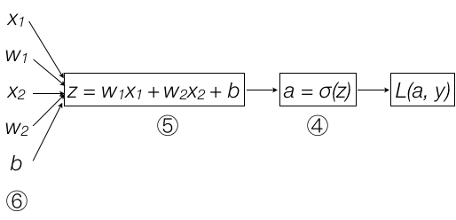

网上关于[神经网络和深度学习](http://mooc.study.163.com/course/2001281002#/info)的笔记、作业很多，也很有价值。这版笔记这是针对我自己学习过程中的感悟、重点做个记录，便于自己快速查阅。本文的标题号和课程号保持一致，以方便查阅。
<!-- more -->

# 2.1 样本的表示

题目的目标是判断图片中是否有猫，假设一张图是64×64像素，3通道，即R、G、B分别对应一个64×64的矩阵：

R = $\left\lgroup \matrix{R_{1\,1} & R_{1\,2} & ... & R_{1\,64} \cr R_{2\,1} & R_{2\,2} & ... & R_{2\,64} \cr ... & ... & ... \cr R_{64\,1} & R_{64\,2} & ... & R_{64\,64} } \right \rgroup$ $\;$ G = $\left\lgroup \matrix{G_{1\,1} & G_{1\,2} & ... & G_{1\,64} \cr G_{2\,1} & G_{2\,2} & ... & G_{2\,64} \cr ... & ... & ... \cr G_{64\,1} & G_{64\,2} & ... & G_{64\,64} } \right \rgroup$ $\;$  B = $\left\lgroup \matrix{B_{1\,1} & B_{1\,2} & ... & B_{1\,64} \cr B_{2\,1} & B_{2\,2} & ... & B_{2\,64} \cr ... & ... & ... \cr B_{64\,1} & B_{64\,2} & ... & B_{64\,64} } \right \rgroup$ 

需要将该样本转换成一个一维数组，以方便后面的运算。因此将该样本转换成：
 
x = $\left\lgroup \matrix{R_{1\,1} \cr R_{1\,2} \cr ... \cr R_{2\,1} \cr R_{2\,2} \cr ... \cr G_{1\,1} \cr G_{1\,2} \cr ... \cr B_{1\,1} \cr B_{1\,2} \cr ... } \right \rgroup$ 它包含64×64×3=12288个元素，写作n=$n_{x}$=12288，这是样本的维数。

假设共有m个样本，样本空间可以写作：

$X=\begin{bmatrix}\mid&\mid&&\mid\\x^{(1)}&x^{(2)}&\cdots&x^{(m)}\\ \mid&\mid&&\mid\end{bmatrix} , Y=[y^{(1)} y^{(2)} ... y^{(m)}] \;$ 

其中: $x^{(i)}\in \mathbb{R}^{n_{x}}，y^{(i)}\in \{0, 1\}; X\in\mathbb{R}^{n_{x}×m}，X.shape=(n_{x}, m);  Y\in \mathbb{R}， Y.shape=(1, m)$

# 2.2 逻辑回归问题

对一张图片判猫的问题是一个逻辑回归问题，即给定x，求解ŷ=P(y=1|x)，即y=1的概率。

对于图片$x\in(n_{x}, 1)$，可令$ŷ=σ(w^{T}x+b)$， 其中$w\in\mathbb{R}^{n_{x}}, b\in\mathbb{R}$

该函数将图片中的像素点映射为介于(0, 1)之间的一个数字，该数字就表示其中是否包含猫的概率，函数的图像如下：

其中$z=w^{T}x+b ，\; \; \; σ(z)=\frac{1}{1+e^{-z}}$

当$z->+\infty, \; σ(z)≈\frac{1}{1+0}=1$

当$z->-\infty, \; σ(z)≈\frac{1}{1+\infty}=0$

于是本节题目就是要找到合适的w和b使得对于所有样本x，计算出的ŷ都能逼近y。

# 2.3 逻辑回归的损失函数和成本函数

对于给定样本$ŷ=σ(w^{T}x+b) \;, where \, σ(z)=\frac{1}{1+e^{-z}}$定义损失函数：

$L(ŷ, y)=\frac{1}{2}(ŷ-y)^{2}$

只需要找到令成本函数值最小的w和b即可。但由于该函数是个非凸函数，找它的全局最优解比较困难，通常采用变通的方式，令损失函数：

$L(ŷ, y)=-(y\logŷ + (1-y)\log(1-ŷ))$

当y=1时$L(ŷ, y)=-\logŷ$， 希望L(ŷ, y)非常小，这就要求$\logŷ$足够大，这要求ŷ足够大，但ŷ是σ函数，最大也就无限接近1；

当y=0时$L(ŷ, y)=-\log(1-ŷ)$， 希望L(ŷ, y)非常小，这就要求$\log(1-ŷ)$足够大，这要求ŷ足够小，但ŷ是σ函数，最大也就无限接近0；

从上面的趋势分析上来看，“ŷ无限接近y”和“L(ŷ, y)足够小”的趋势是一致的。

> 我的问题是：应该让损失函数L(ŷ, y)趋近于0，而不是无限小到负数吧？因为从直观意义上来看损失函数表示ŷ和y之间的差距，太大和太小都不对呀？

损失函数是作为单样本而言的，对于整个样本空间，则要考察成本函数

$J(w, b) = \frac{1}{m}\sum_{i=1}^{m} [y^{(i)}\logŷ^{(i)} + (1-y^{(i)})\log(1-ŷ^{(i)})]$

# 2.4 梯度下降法

对于一维凸函数

$Repeat\{ \\ 　w := w - \alpha\frac{dJ_{(w)}}{dw} \\ \}$

先随机找一个点，计算函数在此处的导数，再不断重复运算$w := w - \alpha\frac{dJ_{(w)}}{dw}$直到函数与前一个点的差值小于某个阈值。α叫做学习率，是每次迭代的步长。通过这种方法找到函数的最小值，这就是梯度下降法。

对于成本函数，它有多个变量，与一维函数不同之处在于原来的求导运算要改成求偏导，原理和一维函数是一样的。对于J(w, b)：

$Repeat\{ \\ 　w := w - \alpha\frac{dJ(w, b)}{dw} \\ 　b := b - \alpha\frac{dJ(w, b)}{db} \\ \}$

> 对于一维函数，为啥不让α对应一个几何意义？我直观理解认为α本应是弦长，但不幸的是$\frac{dJ(w)}{dw}$是斜率而不是cos！因此所谓的步长α只是一个数值，其乘数$\frac{dJ(w)}{dw}$也只表明一个大致的方向。

# 2.8 导数计算之计算图

> 本节首次提到了“正向传播”和“反向传播”，正向传播就是将各变量组织成复合函数，反向传播就是对复合函数逐级求导。这么简单的过程为什么称为“正向传播算法”和“反向传播算法”呢？

# 2.9 逻辑回归中的梯度下降法

给定

$z = w^{T}x+b  　　　　　　　　　　　　... ① \\ ŷ = a = σ(z)=\frac{1}{1+e^{-z}} 　　　　　　... ② \\ L(a, y) = -(y\log(a) + (1-y)\log(1-a)) 　... ③$

接下逐级组织复合函数：

再利用计算图求导：
④ $da = \frac{dL(a, y)}{da} = -\frac{y}{a} + \frac{(1-y)}{(1-a)}$

⑤ $dz = \frac{dL}{dz} = \frac{dL}{da} \frac{da}{dz}$

 　　$= (-\frac{y}{a} + \frac{(1-y)}{(1-a)}) (-1)(1+e^{-z})^{-2}(-1)e^{-z}$ 　　【将④代入$\frac{dL}{da}$，并对②求导】

 　　$= (-\frac{y}{a} + \frac{(1-y)}{(1-a)}) \frac{1}{1+e^{-z}} \frac{e^{-z}}{1+e^{-z}}$

 　　 $=(-\frac{y}{a} + \frac{(1-y)}{(1-a)})a(1-a)$ 　　　　　【将②代入】

 　　$=-y(1-a) + a(1-y) \\ =a - y$

⑥ $dw_{1} = \frac{dL}{dw_{1}} = \frac{dL}{dz} \frac{dz}{dw_{1}} = dz x_{1} = x_{1} dz$

 　$dw_{2} = x_{2} dz$

 　$db = dz$
  

将⑥代入梯度下降法得到：

$Repeat\{ \\ w_{1} := w_{1} - α · dw_{1} \\ w_{2} := w_{2} - α · dw_{2} \\ b := b - α · db \\ \}$

# 2.10 有m个样本的梯度下降法

结合上一节结论，当有m个样本时，成本函数：

$J(w, b) = \frac{1}{m} \sum_{i=1}^{m}L(a^{(i)}, y^{(i)})$

其中$a^{(i)} = ŷ^{(i)} = σ(z^{(i)} = σ(w^Tx^{(i)} + b)$

于是$\frac{dJ(w,b)}{dw} = \frac{1}{m}\sum_{i=1}^{m}\frac{d}{dw}L(a^{(i)}, y{(i)})$

应用梯度下降的伪代码表为：

$J=0; dw_{1}=0; dw_{2}=0; db=0; \\ For i=1..m   　　 【循环I】 \\ 　z^{(i)}=w^{T}x^{(i)}+b  \\ 　a^{(i)} = σ(z^{(i)}) \\ 　J += -[y^{(i)}\log a^{(i)} + (1-y^{(i)})\log(1-a^{(i)})] \\ 　dz^{(i)} = a^{(i)} - y^{(i)} 　　【将⑤代入】　 \\ 　dw_{1} += {x_{1}}^{(i)}dz^{(i)}  　 【将⑥代入】 【循环II】 \\ 　dw_{2} += {x_{2}}^{(i)}dz^{(i)} \\ 　db += dz^{(i)} \\ J=J/m; \; dw_{1}=dw_{1}/m; \; dw_{2}=dw_{2}/m; \; db=db/m; \\ w_{1} := w_{1} - α·dw_{1} \\ w_{2} := w_{2} - α·dw_{2} \\ b := b - α·db$

这只应用了一轮梯度下降，其中包含两个循环：【循环I】是遍历所有样本，【循环II】是遍历每个样本里的所有特征。

# 2.11向量化

理论已经讲完了，剩下的工作就是如何通过向量化消除前一小节中的两个循环，让代码跑得更有效率。
``` python
import numpy as np

a = np.random.rand(100000)
b = np.random.rand(100000)

c = np.dot(a, b)    # ①

for i in range(100000):  # ②
    c += a[i]*b[i]
```
代码①和②在结果上是等价的，前者就是向量化的写法，更简洁且更有效率。

对于$z=w^{T}x+b$，其中$w=\left\lgroup \matrix{w_{1} \cr w_{2} \cr ... \cr w_{n_{x}} }\right \rgroup$，$x=\left\lgroup \matrix{x_{1} \cr x_{2} \cr ... \cr x_{n_{x}} }\right \rgroup$， $w\in\mathbb{R}^n_{x}, \;x\in\mathbb{R}^n_{x}$

求解z非向量化的写法：
``` python
z=0
for i in range(nx):
    z += w[i] * x[i]
z += b
```
向量化的写法只需要：
``` python
import numpy as np
z = np.dot(w, x) + b
```

CPU和GPU都有并行化的指令，又叫SIMD（单指令流多数据流 single instruments multiple data），在python中有使用SIMD的内置函数，如`np.function`，GPU更擅长执行SIMD。

# 2.12 更多向量化的例子
尽量使用np的向量画函数来取代for循环，例如：

$v=\left\lgroup \matrix{v_{1} \cr v_{2} \cr ... \cr v_{n} }\right \rgroup$，求$u=\left\lgroup \matrix{e^{v_{1}} \cr e^{v_{2}} \cr ... \cr e^{v_{n}} }\right \rgroup$

``` python
u = np.zeros((n, 1))
for i in range(n):    # 非向量化的写法
    u[i] = math.exp(v[i])
    
u = np.exp(v)      # 向量化的写法
```
接下来利用向量化将2.10伪码中的for循环消除掉：

$J=0; \\ dw_{1}=0; dw_{2}=0; 　【替换为dw = np.zeros((n_x, 1))】 \\ db=0; \\ For i=1..m \\ 　z^{(i)}=w^{T}x^{(i)}+b  　【替换为Z=W.T * X + b = np.dot(W.T, X) + b】 \\ 　a^{(i)} = σ(z^{(i)})   　 　 　【替换为A = sigmoid(Z)】 \\ 　J += -[y^{(i)}\log a^{(i)} + (1-y^{(i)})\log(1-a^{(i)})] \\ 　dz^{(i)} = a^{(i)} - y^{(i)} 　【替换为dZ = A - Y】 \\ 　dw_{1} += {x_{1}}^{(i)}dz^{(i)}  　 【替换为dW = (1/m) * X * dZ】 \\ 　dw_{2} += {x_{2}}^{(i)}dz^{(i)} \\ 　db += dz^{(i)}  　   　 　　 　【替换为db = (1/m) * np.sum(dZ)】 \\ J=J/m; \\ dw_{1}=dw_{1}/m; \; dw_{2}=dw_{2}/m;    　 【替换为dW /= m】 \\ db=db/m; \\ w_{1} := w_{1} - α·dw_{1} \\ w_{2} := w_{2} - α·dw_{2} \\ b := b - α·db$

# 2.13 有m个样本的向量化逻辑回归

对于有m个样本：

$z^{(1)} = w^{T}x^{(1)} + b \; \; \; z^{(2)} = w^{T}x^{(2)} + b \; \; ... \; z^{(m)} = w^{T}x^{(m)} + b \; \; \;$

$a^{(1)}=σ(z^{(1)}) \; \; \; \; \; \; \; a^{(2)}=σ(z^{(2)}) \; \; \; \; \; \; ... \; a^{(m)}=σ(z^{(m)}) \; \; \;$

可令$X=\begin{bmatrix}\mid&\mid&&\mid\\x^{(1)}&x^{(2)}&\cdots&x^{(m)}\\ \mid&\mid&&\mid\end{bmatrix} \; \in \mathbb{R}^{n_{x}×m}$ 

则$Z = [Z^{(1)} \; Z^{(2)} \; ... \; Z^{(m)}] = W^{T}·X + [b, b, ..., b] $

使用向量化的代码写作
``` python
Z = np.dot(W.T, X) + b
```
实数b被自动扩展为矩阵，这在python中被称作广播。

$A = [a^{(1)}, a^{(2)}, ..., a^{(m)}] = σ(Z)$

# 2.14 向量化逻辑回归成本函数的梯度下降法
继续向量化2.12中的伪码：

$A = [a^{(1)}, a^{(2)}, ..., a^{(m)}] \; \; \; \\ Y = [y^{(1)}, y^{(2)}, ..., y^{(m)}] \\ Z = W^{T}X + b = np.dot(W.T, X) + b \\ A = σ(Z) \\ dZ = A - Y \\ dW = \frac{1}{m}XdZ^{T} \\ db = \frac{1}{m} np.sum(dZ) \\ W := W - α·dW \\ b := b - α·db$

以上是一次梯度下降的迭代，若要进行n轮迭代，还是需要一个n的循环，这个最外层循环是无法避免的。

# 作业

作业题目以及相关的数据在网上可以找得到，由于数据量太大，就不上传了。

## 题目
给定209个训练样本和50个测试样本，每个样本包含一张图片并标注了该图中是否包含猫，使用梯度下降法训练一个模型，用来识别给定的图片中是否包含猫。训练样本和测试样本文件格式一样，都包含三个dataset：
```
/list_classes, shape:(2, )
    value:[b'non-cat' b'cat']　　　# 标注词典，表示没猫和有猫的文字表述
 
/train_set_x, shape:(209, 64, 64, 3)   # 共209张图片，每张图片是64 * 64 * 3
    value:[[[[ 17  31  56]        # 图片数据
    [ 22  33  59]
    [ 25  35  62]
    ...,
    [  1  28  57]
    [  1  26  56]
    [  1  22  51]]
    ...
    
/train_set_y, shape:(209,)        # 共209个标注
    value:[0 0 1 ... 0 0 0]
```
## 主干逻辑
主干代码如下：
``` python
# 返回训练样本和测试样本的数据、标注，classes是标注对应的含义
train_set_x_orig, train_set_y, test_set_x_orig, test_set_y, classes = self.load_dataset()

m_train = train_set_x_orig.shape[0]     # 训练样本的个数：209
m_test = test_set_x_orig.shape[0]       # 测试样本的个数：50
num_px = train_set_x_orig.shape[1]      # 图片的宽、高像素数：64

# 将训练和测试样本扁平化，对于每一张图，将 (64, 64, 3) 的图片转成(64*64*3, 1)
# 对于整个训练样本，将(209, 64, 64, 3)转成(209, -1).T，注意有个转置，转置后每一列是一个样本，
# 某列的每一行是图片的一个特征。训练集共209行（个样本），12288个特征。参见笔记2.1。
train_set_x_flatten = train_set_x_orig.reshape(train_set_x_orig.shape[0],-1).T
test_set_x_flatten = test_set_x_orig.reshape(test_set_x_orig.shape[0],-1).T

# 标准化数据，让每个元素∈[0, 1]
train_set_x = train_set_x_flatten / 255.
test_set_x = test_set_x_flatten / 255.

# 训练出模型 🏁
d = self.model(train_set_x, train_set_y, test_set_x, test_set_y, num_iterations = 2000, learning_rate = 0.005, print_cost = True)

# 验证模型
fname = os.path.join(self.imagesDir, 'my_image2.jpg')
image = np.array(ndimage.imread(fname, flatten=False))
my_image = scipy.misc.imresize(image, size=(num_px, num_px)).reshape((1, num_px*num_px*3)).T
my_predicted_image = self.predict(d['w'], d['b'], my_image)
logging.info(my_predicted_image)
```
## 训练模型
主干逻辑非常简单，无需过多解释，深入模型训练部分：
``` python
def model(self, X_train, Y_train, X_test, Y_test, num_iterations = 2000, learning_rate = 0.5, print_cost = False):
    w, b = self.initialize_with_zeros(X_train.shape[0]) # w元素个数等于特征数，b是一个实数，将他们初始化为0

    # 学习率为learning_rate，经过num_iterations轮迭代，获得模型参数 🏁
    parameters, grads, costs = self.optimize(w, b, X_train, Y_train, num_iterations, learning_rate, print_cost=True)

    w = parameters["w"]
    b = parameters["b"]

    # 验证模型在训练集和测试集上的准确率
    Y_prediction_test = self.predict(w, b, X_test)
    Y_prediction_train = self.predict(w, b, X_train)
    print("train accuracy: {} %".format(100 - np.mean(np.abs(Y_prediction_train - Y_train)) * 100))
    print("test accuracy: {} %".format(100 - np.mean(np.abs(Y_prediction_test - Y_test)) * 100))

    # 这是构成模型的全部元素，对未来有用的就是w和b
    d = {"costs": costs,
         "Y_prediction_test": Y_prediction_test, 
         "Y_prediction_train" : Y_prediction_train, 
         "w" : w, 
         "b" : b,
         "learning_rate" : learning_rate,
         "num_iterations": num_iterations}

    return d
```
### 多轮迭代
所谓“模型”核心就是经过若干轮梯度下降法的迭代，得到令成本函数最小的w和b，训练的核心逻辑在函数`optimize(...)`中：
``` python
def optimize(self, w, b, X, Y, num_iterations, learning_rate, print_cost = False):
    costs = []

    for i in range(num_iterations):
        grads, cost = self.propagate(w, b, X, Y) # 一次梯度下降🏁

        dw = grads["dw"]
        db = grads["db"]

        w = w - learning_rate * dw
        b = b - learning_rate * db

        # Record the costs
        if i % 100 == 0:
            costs.append(cost)

        ...

    params = {"w": w, "b": b}

    grads = {"dw": dw, "db": db}

    return params, grads, costs
```
### 梯度下降
`propagate(...)`中是梯度下降的核心逻辑，对应笔记的2.14：
``` python
def propagate(self, w, b, X, Y):
    m = X.shape[1]

    A = self.sigmoid(np.dot(w.T,X) + b)            # compute activation
    cost = -(np.sum(np.dot(Y,np.log(A).T)+np.dot((1-Y),np.log(1-A).T)))/m      # compute cost

    dw = (np.dot(X,(A-Y).T))/m
    db = (np.sum(A-Y))/m

    ...
    cost = np.squeeze(cost)

    grads = {"dw": dw, "db": db}

    return grads, cost
```

过程还是非常清晰的，模型训练完成后，将训练样本和测试样本代入模型，可以得到训练样本的精度是99%，测试样本的精度是70%：
```
train accuracy: 99.04306220095694 %
test accuracy: 70.0 %
```
随便找张图，带入`predict(...)`函数，即可验证有效性。

# 思考
确实和传统的编程思路完全不同：传统的编程思路中对/错是个确定的值，正如if/else或true/false，非此即彼的。当结果和预期发生不一致，那叫bug，顺着代码往里查，一定能查到不一致的原因。

而深度学习似乎更靠近真实世界，因为真实世界中很多判断不是非黑即白，而是概率的，我认为这是世界的本质。但这给问题的解决带来麻烦——当结果和预期不一致时，你没有可顺藤摸瓜的逻辑点来表明到底哪里出了问题。最多只能确认“梯度下降”的算法是不是正确，模型产生的是一批神经元，针对具体的一张图片，无法人肉判断某个神经元的权重是否正确。

作业里images/中的图片，模型都能判断正确，但我从网上随便找几张猫图扔给模型，结果是错误的。我不知道该如何改进才能让新图识别正确。直观的想法可能是喂给模型更多的训练样本，可是如何做出一个量化的预测呢？需要喂多少？能达到什么样的水平？不同的人类大脑对于新事物的学习效率也是不一样的，对于同一批样本，有没有可能改进模型，令其效果得到提升呢？怎么改进？

我相信这些问题在未来的课程中会有解答，继续学习吧！

------
本文代码参见[https://github.com/palanceli/MachineLearningSample/blob/master/DeepLearningAIHomeWorks/mywork.py](https://github.com/palanceli/MachineLearningSample/blob/master/DeepLearningAIHomeWorks/mywork.py)的`class Coding1_1`部分。