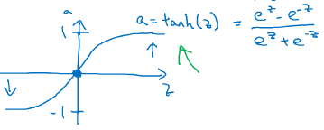
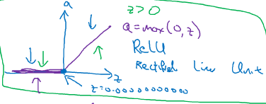
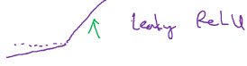

本节的题目是浅层神经网络，开始接触多层结构，此时才真正接触到了神经网络模型。其实运用到的理论知识和上一节的逻辑回归相比，几乎没有新东西。

为了便于描述，我把前一节运算出来的a称为一个神经元（这是我的直观理解，并无出处~），该神经元与输入数据直接关联，并直接输出为二分结果。真实世界人脑的思考过程通常没有这么简单，有很多与之相关的成语比如“深思熟虑”、“三思而行”、“深谋远虑”……都是指有深度、反复的思考。本节课程正是通过增加神经元的层次、以及每一层的个数来增强思考的深度和广度。
<!-- more -->

# 3.1 神经网络概览

神经网络通常是具备两层以上的结构，但在原理上，仅是上一节内容的应用，并没有增加新的理论知识。在符号表示上使用方括号上标$z^{[1]}、a^{[1]}$来表示第几层，这与上一节的$x^{(i)}$是不同的，后者表示第i个样本。

在概念上，中间层的每一个节点都是应用了上一节的算法计算出来的，对于单样本逻辑回归，模型如下：

由此根据正向算法那计算神经元和成本函数：

神经网络则在逻辑回归的基础上增加了中间的z/a层，以及每一层的多个节点：

其中每个节点对上一层节点均使用了逻辑回归的正向算法，最后通过梯度下降法计算成本函数$L(a^{[2]}, y)$：

# 3.2 神经网络表示
这是一个最简单的神经网络，它具有双层结构，这两层指的是隐藏层和输出层：

输入层通常不作为一层，因为$a^{[1]}$是通过输入层X与构造出的参数$W^{[1]}和b^{[1]}$叠加运算而成，而$a^{[2]}$是$a^{[1]}$与构造出的参数$W^{[2]}和b^{[2]}$叠加运算而成。W和b构成了模型的本质，它们只有两层，因此说这是一个双层的神经网络模型。
对于单样本，假设输入层共$n^{[0]}$个特征，隐藏层共$n^{[1]}$个节点，输出层共$n^{[2]}$个节点，显然$n^{[2]}$=1，则

$X= \left\lgroup \matrix{x_{1} \cr x_{2} \cr ... \cr x_{n_{[0]}} } \right \rgroup \\ z_{1}^{[1]} = w_{1}^{[1]}·X + b^{[1]} = [w_{1}, w_{2}, ..., w_{n^{[0]}}] · \left\lgroup \matrix{x_{1} \cr x_{2} \cr ... \cr x_{n^{[0]}} } \right \rgroup + b^{[1]} \in \mathbb{R} \\ 隐藏层共有n^{[1]}个节点，于是：z^{[1]}=\left\lgroup \matrix{z_{1}^{[1]} \cr z_{2}^{[1]} \cr ... \cr z_{n^{[1]}}^{[1]} } \right \rgroup \in \mathbb{R}^{n^{[1]}\,× 1} 　　\; w^{[1]}=\begin{bmatrix}—w_{1}—\\—w_{2}—\\\vdots\\—w_{n^{[1]}}—\end{bmatrix} \in \mathbb{R}^{n^{[1]}\,×n^{[0]}}$

# 3.3 计算神经网络的输出
计算神经网络的输出就是应用神经元的计算法则，逐个节点求解：

$z^{[1]}=\left\lgroup \matrix{z_{1}^{[1]} \cr z_{2}^{[1]} \cr ... \cr x_{n_{[1]}}^{[1]} } \right \rgroup=\left\lgroup \matrix{w_{1}^{[1]}·X + b_{1}^{[1]} \cr w_{2}^{[1]}·X + b_{2}^{[1]} \cr ... \cr w_{n^{[1]}}^{[1]}·X + b_{n^{[1]}}^{[1]} } \right \rgroup=\begin{bmatrix}—w_{1}^{[1]}— \cr —w_{2}^{[1]}— \cr ... \cr —w_{n^{[1]}}^{[1]}— \end{bmatrix}·X + \begin{bmatrix}b_{1}^{[1]} \cr b_{2}^{[1]} \cr ... \cr b_{n^{[1]}}^{[1]} \end{bmatrix}$

$a^{[1]} = \begin{bmatrix}a_{1}^{[1]} \cr a_{2}^{[1]} \cr ... \cr a_{n^{[1]}}^{[1]} \end{bmatrix}=σ(z^{[1]})$

同理总结如下：

$z^{[1]}=w^{[1]}·x + b^{[1]} \\ a^{[1]} = σ(z^{[1]}) \\ z^{[2]}=w^{[2]}·a^{[1]} + b^{[2]} \\ a^{[2]} = σ(z^{[2]})$

# 3.4 多样本的向量化
当有m个样本时，需要遍历每一个样本，当然实际操作是使用向量化而不是循环，再利用前面的方法求解ŷ。循环的伪码形式和向量化的表达分别为：

$for \, i \, in \, range(1, m): 　\\　z^{[1](i)} = w^{[1]}· x^{(i)} + b^{[1]} 　　　【向量化】 Z^{[1]} = W^{[1]}·X + b^{[1]} \\ 　a^{[1](i)} = σ(z^{[1](i)})  　　　　　　　【向量化】A^{[1]} = σ(Z^{[1]})\\ 　z^{[2](i)} = w^{[2]}·a^{[1](i)} + b^{[2]}  　　【向量化】Z^{[2]}=W^{[2]}·A^{[1]}+b^{[2]}\\ 　a^{[2](i)}=σ(z^{[2](i)}) 　　　　　　【向量化】A^{[2]}=σ(Z^{[2]})$

于是得出$Z^{[1]}=\begin{bmatrix}\mid&\mid&&\mid\\Z^{[1](1)}&Z^{[1](2)}&\cdots&Z^{[1](m)}\\ \mid&\mid&&\mid\end{bmatrix}$，横向表示不同样本的处的神经元，个数等于样本数；纵向表示不同特征的权重，个数等于上一层的节点数。

# 3.5 向量化实现的解释

$Z^{[1]}=\begin{bmatrix}\mid&\mid&&\mid\\Z^{[1](1)}&Z^{[1](2)}&\cdots&Z^{[1](m)}\\ \mid&\mid&&\mid\end{bmatrix} \\ =\begin{bmatrix}w_{1}^{[1]}·x^{(1)}+b^{[1]} &  w_{1}^{[1]}·x^{(2)}+b^{[1]} & ... & w_{1}^{[1]}·x^{(m)}+b^{[1]} \cr w_{2}^{[1]}·x^{(1)}+b^{[1]} &  w_{2}^{[1]}·x^{(2)}+b^{[1]} & ... & w_{2}^{[1]}·x^{(m)}+b^{[1]} \cr ... & ... & ... & ... \cr w_{1}^{[1]}·x^{(1)}+b^{[1]} &  w_{1}^{[1]}·x^{(2)}+b^{[1]} & ... & w_{1}^{[1]}·x^{(m)}+b^{[1]} \end{bmatrix} \\ =\begin{bmatrix}—w_{1}^{[1]}— \cr —w_{2}^{[1]}— \cr ... \cr —w_{n^{[1]}}^{[1]}— \end{bmatrix}·\begin{bmatrix}\mid&\mid&&\mid\\x^{(1)}&x^{(2)}&\cdots&x^{(m)}\\ \mid&\mid&&\mid\end{bmatrix} + b^{[1]} \\ =W^{[1]}·X+b^{[1]}$

# 3.6 激活函数
在以前的章节中，都采用σ函数作为激活函数，在实际应用中通常使用它的变种$tanh(z)=\frac{e^{z}-e^{z}}{e^{z}+e^{z}}$来作为激活函数，它是将σ函数向下平移0.5：

我们用g(z)来表示激活函数。

还有一个更常用的激活函数是ReLU（修正线性单元 Rectified linear unit），g(z)=max(0, z)：

以及它的变种Leaky ReLU，gz(z)=max(0.01z, z)：

tanh和σ函数有一个共同的缺陷是当z取值过大时，g的变化率过小，这会导致每轮训练效果不明显，学习速度很慢。ReLU系函数则没有这样的缺点。一般情况下，当不确定隐藏层的激活函数该用什么时，通常就采用ReLU。

尽管对于ReLU当z＜0时斜率为0，但在实践中有足够多的隐藏单元令z＞0，所以通常使用ReLU就足够了。

# 思考
神经网络一方面增加了神经元的层次，提高思考的深度，另一方面也在同一层次上布局了多个神经元，提高了思考的广度。这些神经元彼此连接便成了“神经网络”。再次申明，这都是我的直观理解，并没有理论依据。这么做增加了思考的抽象程度，但是也更加让思考过程变得越发不可理解。为什么经过这么多层的运算就比简单“神经元”有效？每一层的含义是什么？神经网络的深度、每一层的神经元个数与模型的效果是什么关系？我不知道！继续学习吧。