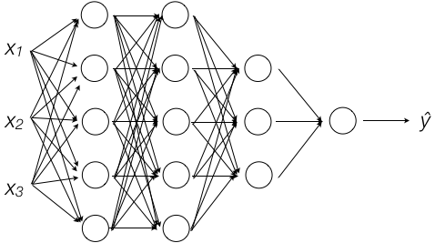

本节的题目是深层神经网络，只是把网络的层数延展为变量。使用的方法还是前两节的方法——梯度下降、正向传播、反向传播。
<!-- more -->

# 4.1 深层神经网络
本节内容是在上一节双层神经网络的基础上将网络层数扩展为变量。讨论L层神经网络的正向和反向传播算法，因此也并没有引入什么新知识。  
在命名体系中引入了L表示神经网络的层数，$n^{[l]}$表示第l层节点的个数，$a^{[l]}$表示第l层的激活函数。  
在下图中：

L=4， $n^{[1]}=5, n^{[2]}=5, n^{[3]}=3, n{[4]}=1$

# 4.2 深层神经网络的前向传播
输入X：  
$\begin{cases}z^{[1]}=w^{[1]}·x + b^{[1]}=w^{[1]}·a^{[0]} + b^{[1]} \\ 
a^{[1]} = g^{[1]}(z^{[1]}) \end{cases}\\ 
\begin{cases}z^{[2]}=w^{[2]}·a^{[1]} + b^{[2]} \\ 
a^{[2]} = g^{[2]}(z^{[2]})\end{cases}\\ 
... \\
\begin{cases}z^{[L]}=w^{[L]}·a^{[L-1]} + b^{[L]} \\ 
a^{[L]} = g^{[L]}(z^{[L]})=ŷ\end{cases}$  

向量化后：  
$\begin{cases}Z^{[1]}=W^{[1]}·X + b^{[1]}=W^{[1]}·A^{[0]} + b^{[1]} \\ 
A^{[1]} = g^{[1]}(Z^{[1]}) \end{cases}\\ 
\begin{cases}Z^{[2]}=W^{[2]}·A^{[1]} + b^{[2]} \\ 
A^{[2]} = g^{[2]}(Z^{[2]})\end{cases}\\ 
... \\
\begin{cases}Z^{[L]}=W^{[L]}·A^{[L-1]} + b^{[L]} \\ 
A^{[L]} = g^{[L]}(Z^{[L]})=Ŷ\end{cases}$  

# 4.3 核对矩阵的维数
$X=\begin{bmatrix}x_{1}\\x_{2}\\\cdots\\x_{(n^{[0]})}\end{bmatrix}\in\mathbb{R}^{n^{[0]}×1}，\; W^{[1]}=\begin{bmatrix}—w_{1}^{[1]}— \cr —w_{2}^{[1]}— \cr ... \cr —w_{n^{[1]}}^{[1]}— \end{bmatrix}\in\mathbb{R}^{n^{[1]}×n^{[0]}}，\; b^{[1]}\in\mathbb{R}^{n^{[1]}×1}\\
于是W^{[1]}·X\in\mathbb{R}^{n^{[1]}×1} ，\; Z^{[1]}=W^{[1]}·X + b^{[1]}\in\mathbb{R}^{n^{[1]}×1} ，\; A^{[1]}\in\mathbb{R}^{n^{[1]}×1}$  
$W^{[2]}=\begin{bmatrix}—w_{1}^{[2]}— \cr —w_{2}^{[2]}— \cr ... \cr —w_{n^{[2]}}^{[2]}— \end{bmatrix}\in\mathbb{R}^{n^{[2]}×n^{[1]}}，\; b^{[2]}\in\mathbb{R}^{n^{[2]}×1}\\
于是W^{[2]}·A^{[1]}\in\mathbb{R}^{n^{[2]}×1} ，\; Z^{[2]}=W^{[2]}·A^{[1]} + b^{[2]}\in\mathbb{R}^{n^{[2]}×1} ，\; A^{[2]}\in\mathbb{R}^{n^{[2]}×1}$  
$同理W^{[l]}·A^{[l]}\in\mathbb{R}^{n^{[l]}×1} ，\; Z^{[l]}=W^{[l]}·A^{[l-1]} + b^{[l]}\in\mathbb{R}^{n^{[l]}×1} ，\; A^{[l]}\in\mathbb{R}^{n^{[l]}×1}$

# 4.4 为什么使用深层表示
本节以图像识别为例，神经网络中，浅层神经元反映的是图像的细部特征，比如棱角、边缘，越往深层，越反应图像的整体特征，例如无关、以及再往深了反映出相貌特征。  
所以直观地理解，如果识别“图像是关于人、狗、还是猫”，可能是用较浅层的神经网络即可，如果要识别具体是哪个人、哪条狗，则需要更深层网络。  
不过我觉得这个解释依然是骗直觉的。为什么层次越深越能抽象整体特征？以及究竟需要多深，本文并没有给出解释。

# 4.5 搭建深层神经网络块
根据本节4.2已经得出正向传播：  
$\begin{cases}Z^{[l]}=W^{[l]}·A^{[l-1]} + b^{[l]}  …①\\ 
A^{[l]} = g^{[l]}(Z^{[l]}) 　　　　…②\end{cases}$

再看反向传播，回顾在[逻辑回归的损失函数和成本函数](/2018/03/11/2018/0311DeepLearningAI02/#逻辑回归的损失函数和成本函数)中引入的损失函数：  
$L(ŷ, y)=-(y\logŷ + (1-y)\log(1-ŷ))$  
因此对于L层神经网络来说，损失函数是关于y和输出层的函数：  
$L(a, y)=-(y\log{a} + (1-y)\log{(1-a)})$  
其中a即$A^{[L]}$的结果，由[逻辑回归中的梯度下降法](http://localhost:4000/2018/03/11/2018/0311DeepLearningAI02/#逻辑回归中的梯度下降法)可知：  
$da^{[L]}=-\frac{y}{a^{[L]}} + \frac{(1-y)}{(1-a^{[L]}}$  
$dZ^{[L]}=\frac{dL}{da^{[L]}}·\frac{da^{[L]}}{dZ^{[L]}}=da^{[L]}·g^{[L]}\prime(Z^{[L]})　　后半部分是根据②得出$  
$dW^{[L]}=\frac{dL}{dZ^{[L]}}·\frac{dZ^{[L]}}{dW^{[L]}}=\frac{1}{m}dZ^{[L]}·A^{[L-1]}　　后半部分是根据①得出$
$db^{[L]}=\frac{1}{m}np.sum(dZ^{[L]}, axis=1, keepdims=True)$  
$dA^{[L-1]}$怎么求呢？它是$\frac{dL}{dA^{[L-1]}}$的缩写，可是dL是关于$A^{[L]}$的函数，看不出与$A^{[L]}$的关系，但是由①和②可得到$A^{[L]}和A^{[L-1]}$的关系，根据链式法则：  
$dA^{[L-1]}=\frac{dL}{dA^{[L]}}·\frac{dA^{[L]}}{dA^{[L-1]}}\\
=\frac{dL}{dA^{[L]}}·\frac{dA^{[L]}}{dZ^{[L]}}·\frac{dZ^{[L]}}{dA^{[L-1]}}　　根据②\\
=\frac{dL}{dZ^{[L]}}·\frac{dZ^{[L]}}{dA^{[L-1]}}　　合并前两项\\
=dZ^{[L]}·W^{[L]}　　根据①\\$  

反向传播总结如下：  
$\begin{cases}dZ^{[l]}=da^{[l]}·g^{[l]}\prime(Z^{[l]})\\ 
dW^{[l]}=\frac{1}{m}dZ^{[l]}·A^{[l-1]} \\
db^{[l]}=\frac{1}{m}np.sum(dZ^{[l]}, axis=1, keepdims=True)\\
dA^{[l-1]}=dZ^{[l]}·W^{[l]}\end{cases}$  

正向传播算法就是构造Z和A的形式，反向传播算法就是根据Z、A计算dW和db的形式，神经网络的算法主体则是根据超参数循环计算W和b：


# 4.6 前向传播和反向传播
上一节已经把两向传播算法推导出来了。

# 4.7 参数VS超参数
在神经网络算法中，参数是指：$W^{[1]}、b^{[1]}、W^{[2]}、b^{[2]}……$  
超参数是指：学习率α、迭代次数#iterations、隐藏层数 #hidden layers、激活函数

# 4.8 这和大脑有什么关系
本节解释了神经网络中的神经元与大脑神经元的形似之处，但Andrew也提到这种形似被越来越少得提及，因为人脑的神经元是如何工作的，至今并未完全弄清楚。“神经网络”只是一个听起来很高大上的名字，其实与人脑并没有太大关系。

# 作业
## 神经网络算法的基本框架


- 第一步，初始化参数W和b
- 第二步，完成正向传播，计算各层的Z和A：  
$Z^{[l]}=W^{[l]}·A^{[l-1]}，\; A^{[l]}=g^{[l]}(Z^{[l]})$  
- 第三步，计算成本函数，$cost=-\sum(Y\log{A^{[L]} + (1 - Y)log{(1-A^{[L]})}}$
- 第四步，完成反向传播，计算各层的dW、db和后一层dA：    
$dW^{[l]}=\frac{1}{m}dZ^{[l]}， \; db^{[l]}=\frac{1}{m}np.sum(dZ^{[l]})， \; dA^{[l-1]}=dZ^{[l]}· W^{[l]}$ 
- 第五步，更新W和b：  
$W := W - α·dW， \; b := b - α· db$  
- 第六步，跳到第二步不断循环，直到成本函数的变化率低于某个阈值
- 第七步，使用迭代训练出的W和b，输入待预测的数据，计算输出层，得到预测结果。

其中，第二步正向传播算法的目的是为了从输入层到输出层逐层计算出各层各节点的A，以便在下一步计算出成本函数。计算成本函数的目的是为了比较两次迭代的成本函数的变化率，以决定是否可以停止学习。反向传播算法的目的是为了从输出层到输入层逐层计算各层各节点的dW和db，以便计算出下一轮迭代的W和b。

## 参数初始化
该函数传入各层节点的个数，生成各层节点的W、b的初始化值：

``` python
def initialize_parameters_deep(self, layer_dims):
    """
    Arguments:
    layer_dims -- 每一层的节点个数[n0, n1, ..., nl]
    
    Returns:
    parameters -- {'W1':n1×n0的数组, 'b1':n1×1的数组, 'W2':n2×n1的数组, 'b2':n2×1的数组, ...}
                    W数组使用randn*0.01填充，b数组使用0填充
    """
    
    np.random.seed(3)
    parameters = {}
    L = len(layer_dims)            # number of layers in the network

    for l in range(1, L):
        parameters['W' + str(l)] = np.random.randn(layer_dims[l],layer_dims[l-1]) * 0.01
        parameters['b' + str(l)] = np.zeros((layer_dims[l], 1))
        ... 
    return parameters
```
## 前向传播
前向传播算法由三个函数完成：`linear_forward`、`linear_activation_forward`、`L_model_forward`。  
`L_model_forward`是前向传播的主函数，它接收输入层参数X和各层W、b，从左向右遍历，根据前一层的A计算后一层的A，并缓存各层(Z、W和b)：
``` python
def L_model_forward(self, X, parameters):
    """
    实现前向算法，根据输入层X和各层W、b计算各层Z、A。隐藏层使用RELU、输出层使用sigmoid。
    
    Arguments:
    X -- 输入层
    parameters -- 各层W和b
    
    Returns:
    AL -- 输出层A
    caches -- 各层(Z, prev_A, W, b)
    """

    caches = []
    A = X
    L = len(parameters) // 2                  # number of layers in the neural network
    
    # Implement [LINEAR -> RELU]*(L-1). Add "cache" to the "caches" list.
    for l in range(1, L):
        A_prev = A 
        ...
        A, cache = self.linear_activation_forward(A_prev, parameters["W" + str(l)], parameters["b" + str(l)], activation = 'relu')
        caches.append(cache)
    
    ...
    AL, cache = self.linear_activation_forward(A, parameters["W" + str(L)], parameters["b" + str(L)], activation = 'sigmoid')
    caches.append(cache)
    ...
    return AL, caches
```
隐藏层使用的是RELU激活函数，在输出层使用sigmoid作为激活函数，最后返回输出层的A和各层(Z, prev_A, W, b)

## 成本函数
成本函数是连接前向传播和后向传播的枢纽，因为梯度下降的核心就是通过迭代  
$W:=W-α·dW \\
b:=b-α·db$  
不断计算成本函数$cost = -Σ(Y\log{A^{[L]}} + (1-Y)\log{(1-A^{[L]})})$是指变化率达到某个阈值以下。
``` python
def compute_cost(self, AL, Y):
    ...
    m = Y.shape[1]
    ...
    cost = -np.sum(np.multiply(Y, np.log(AL)) + np.multiply(1-Y, np.log(1-AL))) / m
    
    cost = np.squeeze(cost)      
    ...
    return cost
```

## 后向传播
后向传播的核心算法就是，从右向左逐层遍历，根据各层$dA^{[l]}$计算$dW^{[l]}、db^{[l]}和dA^{[l-1]}$。根据成本函数可知：  
$dA^{L} = -\frac{Y}{A^{L}} - \frac{1-Y}{1-A^{L}}$  
在后向传播中要使用的公式是：  
$dW^{[l]} = \frac{1}{m}dZ^{[l]}·A^{[l-1]}$  
$db^{[l]} = \frac{1}{m}np.sum(dZ^{[l]})$  
$dA^{[l-1]} = dZ^{[l]}·W^{[l]}$

``` python
def L_model_backward(self, AL, Y, caches):
    """
    根据AL和Y计算各层dA、dW和db
    """
    grads = {}
    L = len(caches) # the number of layers
    m = AL.shape[1]
    Y = Y.reshape(AL.shape) # after this line, Y is the same shape as AL

    dAL = - (np.divide(Y, AL) - np.divide(1 - Y, 1 - AL))
    ...
    current_cache = caches[L - 1]
    grads["dA" + str(L)], grads["dW" + str(L)], grads["db" + str(L)] = self.linear_activation_backward(dAL, current_cache, activation = "sigmoid")
    
    # 从右到左，逐层遍历，计算每一层的dA、dW和db
    for l in reversed(range(L - 1)):
        ...
        current_cache = caches[l]
        dA_prev_temp, dW_temp, db_temp = self.linear_activation_backward(grads["dA" + str(l + 2)], current_cache, activation = "relu")
        grads["dA" + str(l + 1)] = dA_prev_temp
        grads["dW" + str(l + 1)] = dW_temp
        grads["db" + str(l + 1)] = db_temp
        
    return grads
```
前向传播和后向传播的主逻辑都很清晰，这里就不再往子函数里深入了。


<font color=red>在计算dAL时使用了矩阵的除法，这是怎么算的呢？</font>

## 更新参数
正向传播+反向传播完成一轮的最终目的是为了更新参数：$W:=W-α·dW ，\; b:=b-α·db$  
``` python
def update_parameters(self, parameters, grads, learning_rate):
    ...
    L = len(parameters) // 2 # number of layers in the neural network
    ...
    for l in range(L):
        parameters["W" + str(l+1)] = parameters["W" + str(l+1)] - learning_rate * grads["dW" + str(l+1)]
        parameters["b" + str(l+1)] = parameters["b" + str(l+1)] - learning_rate * grads["db" + str(l+1)]
        
    return parameters
```

## 模型主体逻辑
模型的主体逻辑非常简单和清晰：
``` python
def L_layer_model(self, X, Y, layers_dims, learning_rate = 0.0075, num_iterations = 3000, print_cost=False):#lr was 0.009
    np.random.seed(1)
    costs = []                         # keep track of cost
    # 初始化参数
    parameters = self.initialize_parameters_deep(layers_dims)
    
    # 经过num_iterations轮的梯度下降
    for i in range(0, num_iterations):
        # 前向传播
        AL, caches = self.L_model_forward(X, parameters)
        # 成本函数
        cost = self.compute_cost(AL, Y)
        # 后向传播
        grads = self.L_model_backward(AL, Y, caches)
        # 更新参数
        parameters = self.update_parameters(parameters, grads, learning_rate)     
        ...     
    ...
    return parameters
```
## 问题
由此可见，神经网络算法其实和业务逻辑并没有太大关联，他要做的就是按照固定的算法，选择超参数，喂入数据。
一段代码，一劳永逸！但是别高兴太早了，也正因为此，跑这样的代码总感觉有点像撞大运，如果得不到预期的结果，完全不知道从何下手来改进。

我最初跑这段代码得到的结果如下：
``` bash
$ python3 -m mywork Coding1_3.tc3
Cost after iteration 0: 0.693148
Cost after iteration 100: 0.678011
Cost after iteration 200: 0.667600
Cost after iteration 300: 0.660422
Cost after iteration 400: 0.655458
Cost after iteration 500: 0.652013
Cost after iteration 600: 0.649616
Cost after iteration 700: 0.647942
Cost after iteration 800: 0.646770
Cost after iteration 900: 0.645947
Cost after iteration 1000: 0.645368
Cost after iteration 1100: 0.644961
Cost after iteration 1200: 0.644673
Cost after iteration 1300: 0.644469
Cost after iteration 1400: 0.644325
Cost after iteration 1500: 0.644223
Cost after iteration 1600: 0.644151
Cost after iteration 1700: 0.644100
Cost after iteration 1800: 0.644063
Cost after iteration 1900: 0.644037
Cost after iteration 2000: 0.644019
Cost after iteration 2100: 0.644006
Cost after iteration 2200: 0.643997
Cost after iteration 2300: 0.643990
Cost after iteration 2400: 0.643985
21:33 1236 INFO     Accuracy: 0.655502392344
21:33 1236 INFO     Accuracy: 0.34
```
成本死活下不去，我尝试调整学习率和迭代次数，收效甚微。好在我跑jupyter notebook版本的assignment4_2的时候能得到正确的结果。  
我最初想到的debug方法是给我的代码灌入和jupyter版本一样的初始参数值，理论上应该得出一样的结果。但是参数太多，迭代的次数也很多，一一比较非常麻烦。  
后来我尝试用jupyter版中的初始化函数、前向传播、后向传播等模块替换我的代码中的模块，因为神经网络的每个模块非常独立，这种替换是很方便的。果然很快发现问题：我发现在assignment4_1中在初始化W时是这么写的：
``` python
parameters['W' + str(l)] = 
np.random.randn(layer_dims[l],layer_dims[l-1]) * 0.01
```
而在assignment4_2中改成了酱紫：
``` python
parameters['W' + str(l)] = 
np.random.randn(layer_dims[l], layer_dims[l-1]) / np.sqrt(layer_dims[l-1])
```
前者也是比较小的数，而且比后者更小，后者是在标准正态分布的随机数上除以layer_dims[l-1]的开方，为什么后者学习效率高出这么多？本例是有一个正确的示范告诉我怎么做，如果是我自己来解这个问题，遇到学习效率太低的情况，该怎么解决呢？

修改完成后，效果立刻显现出来了：
``` bash
$ python3 -m mywork Coding1_3.Main
Cost after iteration 0: 0.715732
Cost after iteration 100: 0.674738
Cost after iteration 200: 0.660337
Cost after iteration 300: 0.646289
Cost after iteration 400: 0.629813
Cost after iteration 500: 0.606006
Cost after iteration 600: 0.569004
Cost after iteration 700: 0.519797
Cost after iteration 800: 0.464157
Cost after iteration 900: 0.408420
Cost after iteration 1000: 0.373155
Cost after iteration 1100: 0.305724
Cost after iteration 1200: 0.268102
Cost after iteration 1300: 0.238725
Cost after iteration 1400: 0.206323
Cost after iteration 1500: 0.179439
Cost after iteration 1600: 0.157987
Cost after iteration 1700: 0.142404
Cost after iteration 1800: 0.128652
Cost after iteration 1900: 0.112443
Cost after iteration 2000: 0.085056
Cost after iteration 2100: 0.057584
Cost after iteration 2200: 0.044568
Cost after iteration 2300: 0.038083
Cost after iteration 2400: 0.034411
22:05 1238 INFO     Accuracy: 0.995215311005
22:05 1238 INFO     Accuracy: 0.78
```
初始值的选取对于训练结果有着决定性的作用！该怎么调参、优化？继续学习吧！

> 本节作业可参见[https://github.com/palanceli/MachineLearningSample/blob/master/DeepLearningAIHomeWorks/mywork.py](https://github.com/palanceli/MachineLearningSample/blob/master/DeepLearningAIHomeWorks/mywork.py)`class Coding1_3`。