本节主要从如何初始化W、b参数，正则化正反向传播和梯度检查三方面来讨论如何优化一个神经网络模型。
<!-- more -->

# 1.2 偏差/方差
**偏差**描述的是算法预测的平均值和真实值的关系，体现算法的你和能力。  
**方差**描述同一算法在不同数据集上的预测值和所有数据集的平均预测值之间的关系，体现算法的稳定性。  


# 1.3 机器学习基础
训练的目标是希望得到低方差，低偏差的模型。当模型呈现高偏差时，应展开更大的网络，层次更深或者节点更多，这个时候提供更多训练数据的帮助就不大了。如果模型呈现高方差，则应提供更多训练数据，如果数据的获取成本太高，也可以通过正则化来解决这个问题。
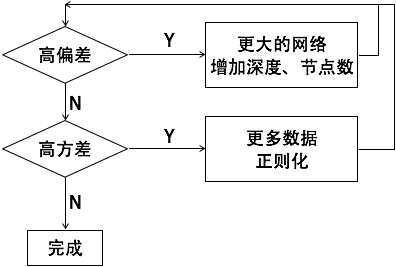

# 1.4 （L2）正则化
解决高方差的有效手段是训练更多数据，但当数据源有限时，可以采用正则化的方式来解决问题。本节介绍L2正则化。  

对于逻辑回归，定义成本函数为：
$J(w, b) = \frac{1}{m}\sum_{i=1}^{m}L(ŷ, y) + \frac{λ}{2m}\Vert{w}\Vert_{2}^{2}$  
其中$\Vert{w}\Vert_{2}^{2}=\sum_{j=1}^{n_{x}}w_{j}^{2}=w^{T}·w$称为$L_2$范数  
该方法称为**$L_2$正则化**。λ被称为**正则化参数**，它是一个超参数。  

也存在**$L_1$正则化**：  
$J(w, b) = \frac{1}{m}\sum_{i=1}^{m}L(ŷ, y) + \frac{λ}{2m}\Vert{w}\Vert_{1}$  
其中$\frac{λ}{2m}\Vert{w}\Vert_{1}=\frac{λ}{2m}\sum_{j=1}^{n^x}|w_j|$  
但它远没有$L_2$正则化常用。

对于神经网络，  
$J(W^{[1]}, b^{[1]}, ..., W^{[L]}, b^{[L]}) = \frac{1}{m}\sum_{i=1}^{m}L(ŷ^{(i)}, y^{(i)}) + \frac{λ}{2m}\sum_{l=1}^{L}\Vert{W^{[l]}}\Vert_{F}^2$  
其中$\Vert{W^{[l]}}\Vert_{F}^2=\sum_{i=1}^{n^{[l-1]}}\sum_{j=1}^{n^{[l]}}(W_{ij}^{[l]})^2$　　该矩阵范数被称为**弗罗贝尼乌斯范数**。  
于是在计算$dW^{[l]}$时，$dW^{[l]}=(原先的后向算法) + \frac{λ}{m}W^{[l]}$  
更新参数：  
$W^{[l]} := W^{[l]} - α·dW^{[l]}\\
=W^{[l]} - α·[(from \, backpop) + \frac{λ}{m}W^{[l]}]\\
=(1-\frac{αλ}{m})W^{[l]} - α·(from \, backpop)$

# 1.5 为什么正则化可以减少过拟合
本节从两个角度来解释。  
来看成本函数$J(W{[l]}, b{[l]}) = \frac{1}{m}\sum_{i=1}^{m}L(ŷ^{(i)}, y^{(i)}) + \frac{λ}{2m}\Vert{W^{[l]}}\Vert_F^2$，正则化参数λ越大，为了令成本函数越小，$W{[l]}$应该越小，当$W{[l]}$趋近于0时，网络中的部分节点失效，网络退化成线性回归，这就是下图所表达的情况：
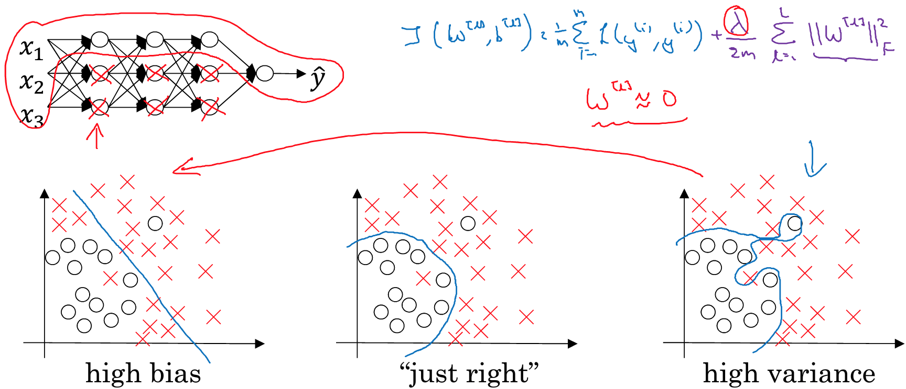  

另一个角度的理解是，当激活函数为tanh函数时，λ越大，$W^{[l]}$越小，$z^{[l]}=w^{[l]}·a^{[l-1]}+b^{[l]}$，故$z^{[l]}$越小，在接近0的区间内tanh(z)呈线性，如果网络中每一层都呈线性，整个网络也可表达为线性回归，也就不会呈现出过拟合的复杂函数。

# 1.6 Dropout正则化
Dropout正则化是随机将网络中的隐藏层节点置为0，并删除与之关联的计算路径，从而得到一个节点更少、规模更小的网络，然后使用该网络进行训练。如下图就是将每层节点失活50%：
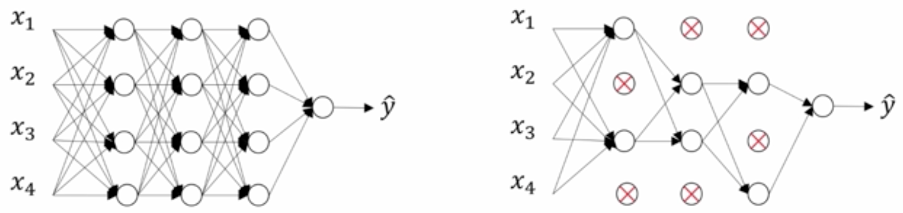  

实施Dropout正则化的方法：  
$d_i=np.random.rand(a_i.shape[0], a_i.shape[1])$  
$d_i=(di<keep\\_prob)$　　keep_prob∈[0, 1]是该层节点存活的概率，于是$d_i$就是一个布尔型矩阵  
$a_i=np.multiply(a_i, d_i)$  做乘法时，$d_i$中的布尔值被当做0/1处理，它将$a_i$按keep_prob概率失活  
$a_i /= keep\\_prob$  　　由于第i层只剩下keep_prob的节点，这个除法是为了确保$a_i$的期望值不变  

需要注意：该方法生成失活神经网络是用于训练模型。在测试和预测阶段，则应使用完整网络，因为随机失活会导致结果不稳定。

# 1.7 理解Dropout
Dropout的直观理解是“不要过度依赖任何一个特征”，从而使得结果不会对某一个特征过度拟合。  
我的直观理解是：极端的Dropout会让网络中的节点被砍掉，导致网络退化成线性回归，这很像是L2正则化的效果。简单的线性回归有助于减少过拟合的现象。  
在具体操作的时候，节点数越多的层，可设置越高的失活比例（较小的keep_prob)。

# 1.8 其它正则化方法
对于图片类资源，可以通过水平翻转，任意裁切来增加样本。虽然这种“假数据”没有那么多信息量，但是它几乎没有获取成本，而且对于训练模型依然有效。  
类似的方法还可以应用与光学识别文字的数据中，例如随意旋转或扭曲文字图片来扩充数据。

# 1.9 归一化输入
归一化输入包括两部分：
1. 零均值化。$μ=\frac{1}{m}\sum_{i=1}^{m}x^{(i)},　　x:=x-μ$  
2. 归一化方差。$σ^2=\frac{1}{m}\sum_{i=1}^{m}x^{(i)}**2,　x /= σ^2$   

注意：在训练集和测试集上应使用相同的μ和$σ^2$。  
归一化输入可以令成本函数延展更均匀，而不是在一个方向上梯度变化慢，在另一个方向上变化快。这种延展可以有效提升学习效率。

# 1.10 梯度消失与梯度爆炸
本节介绍了梯度消失和梯度爆炸的现象，在一个非常深的神经网络中，为了便于理解，将维度设为2，令激活函数简化为g(z)=z，于是
$ŷ=W{[L]}·a{[L-1]} \\
= W{[L]}·(W{[L-1]}·a{[L-2]}) \\
= ... \\
= W{[L]}·W{[L-1]}·...·W{[2]}·W{[1]}·X$  
为了便于说明问题，可观察极端情况，令$W{[l]}$为对角线矩阵：$W{[l]}= \left\lgroup \matrix{i&0 \cr 0&i} \right \rgroup$，于是$ŷ=i^l·x$  
如果L非常大，i稍微大于1就会导致ŷ呈指数级放大，i稍微小于1也会导致ŷ趋近于0。前者就是梯度爆炸，后者就是梯度消失。  
下一节将给出应对梯度爆炸和梯度消失的解决办法。

# 1.11 神经网络的权重初始化
解决梯度消失和梯度爆炸没有万能的解决办法，本节给出一些思路，未必全部有效，但可以在遇到问题时作为备选方案来尝试。  
观察$z=w_1x_1 + w_2x_2 + ... + w_nx_n$  
$w$过大和过小会导致梯度爆炸或消失，我们希望给它赋一个适中的初值。在上一周的[作业中](/2018/03/17/2018/0317DeepLearningAI04/#问题)我已经注意到，老师使用下面的方式来初始化w：  
$W{[l]}=np.random.randn(shape...)\times np.sqrt(\frac{2}{n^{[l-1]}})$  
其中$n^{[l-1]}$是上层节点的个数。该方法适用于激活函数为RELU的情况。  
如果激活函数是tanh，则使用下面的方法初始化w更合适：  
$W{[l]}=np.random.randn(shape\dots)\times np.sqrt(\frac{1}{n^{[l-1]}\;})$  
或  
$W{[l]}=np.random.randn(shape\dots)\times np.sqrt(\frac{2}{n^{[l-1]}\; + \;n^{[l]}})$  
# 1.12 梯度的数值逼近
本节只是讲了一个简单结论：双边公差比单边公差更接近导数，即：  
$f_{(x)}^{\prime}=\mathop{lim}\limits_{ε→0}\frac{f(x+ε) - f(x-ε)}{2ε}$比  
$f_{(x)}^{\prime}=\mathop{lim}\limits_{ε→0}\frac{f(x+ε) - f(x)}{ε}$  更精准。

# 1.13 梯度检验
将$W^{[1]}, b^{[1]}, ..., W^{[L]}, b^{[L]}$ reshape成一个大向量θ，  
将$dW^{[1]}, db^{[1]}, ..., dW^{[L]}, db^{[L]}$ reshape成一个大向量dθ，  
通过计算：  
$for \; each i:\\
　dθ_{approx}^{[i]}=\frac{J(θ_1, θ_2, ..., θ_{i+ε}, ...) - J(θ_1, θ_2, ..., θ_{i-ε}, ...)}{2ε}\\
dθ^{[i]}=\frac{\partial{J}}{\partial{θ_i}}$  
如果$dθ_{approx}^{[i]}≈dθ^{[i]}$，则说明计算过程正确，否则既可能有bug。  
$dθ_{approx}^{[i]}和dθ^{[i]}$都是矩阵，怎么判断相似性呢？可以考察它们的欧式距离：  
$\frac{\Vert{dθ_{approx}^{[i]} \;\;\; - \; dθ^{[i]}}\Vert_2}{\Vert{dθ_{approx}^{[i]} \;\;\;\Vert_2 + \; \Vert{dθ^{[i]}}}\Vert_2}$  
如果$ε的量级在10^{-7}$，该欧氏距离量级和ε一致，则说明结果正确，如果高出几个量级，就应该仔细检查和调试了。

# 1.14 梯度检验需要注意的事项
- 梯度检验仅应用于调试，不要在训练中使用它，因为计算成本太高了。
- 如果算法的梯度检验失败，应检查所有项。
- 在使用正则化时，切记要在成本函数中包含正则项。
- 梯度检验不能与Dropout同时使用，如果非要使用，可以先将keep_prob设为1，即关闭Dropout，检验算法正确后，再应用Dropout。

# 作业
## 初始化参数
在上一节的[作业中](/2018/03/17/2018/0317DeepLearningAI04/#问题)我就遇到了因初始参数选择不合适导致梯度下降的成本函数很快趋平，但精度只有34%的情况。将初始化参数稍微调整一下就能在同样的迭代轮数内，精度达到了78%！可见初始化参数对训练结果有着决定性的影响。

### 将W、b初始化为0
梯度下降完全下不来：
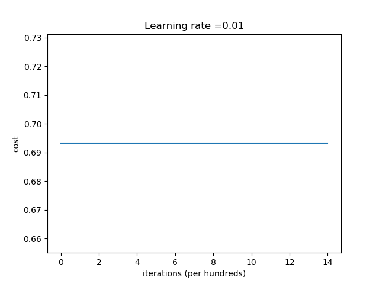  
注意这是训练出来的模型等高线图：
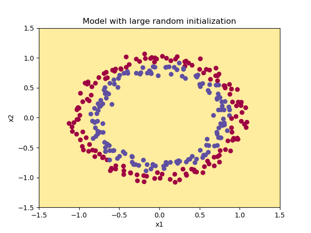  
也就是说所有的样本都被判为一个结果，看输出：
``` bash
On the train set:
Accuracy: 0.5
On the test set:
Accuracy: 0.5
```
准确率只有50%。文中指出如果把所有W初始化为0，会产生参数的对称性，从而使每一层所有节点训练出的值都相等，这使得多节点无效，和只有一个节点是等效的。

<font color=red>
不过我还是有点疑问：  
$Z_1^{[1]}=W_1^{[1]}·X+b_1^{[1]}, \; Z_2^{[1]}=W_2^{[1]}·X+b_2^{[1]}$，如果W为全0而b不为全0，则  
$A_1^{[1]}=g(Z_1^{[1]}) = g(b_1^{[1]}), \; A_2^{[1]}=g(Z_2^{[1]}) = g(b_2^{[1]})$  
由于$dW[l] = \frac{1}{m}dZ^{[l]} · A^{[l-1]} = \frac{1}{m}dA[l]·g[l]\prime(Z^{[l]})A^{[l-1]}$　　参见[此处](http://localhost:4000/2018/03/17/2018/0317DeepLearningAI04/#搭建深层神经网络块)  
这么推导下来，如果b也为0，会导致dW各项完全相等，如果b不为0，应该dW的个元素不会像等啊，如果不相等，就导致下一轮的W个元素也就不相等了吧？
</font>

我尝试将W初始化为0，而b初始化为非零，训练的结果如下：
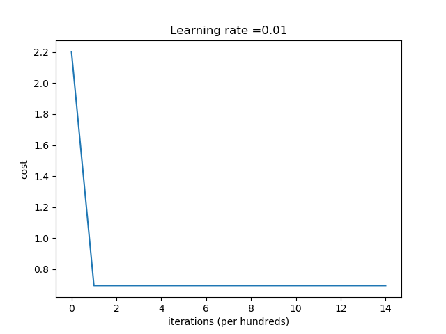  
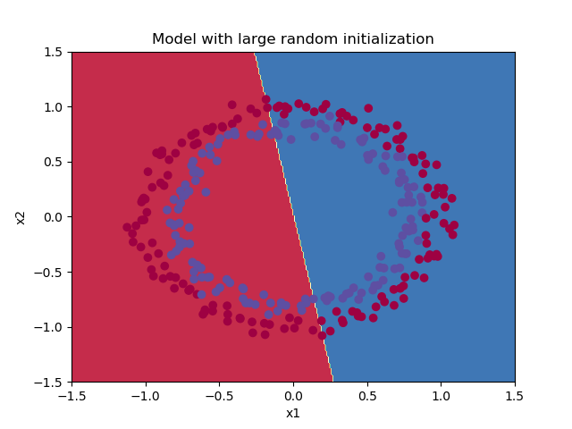
确实没有本质差别。

因此得到结论：
- W应当初始化为随机数，以打破对称性
- b可以初始化为0，对称性是由W决定的

### 将W初始化为随机数
文中使用`np.random.randn(layers_dims[l], layers_dims[l-1]) * 10`来初始化W，其中`np.random.randn(...)` 生成的随机数服从正态分布，即：均值为0，方差为1。  
为了让每次生成的数据和他相同以便于调试，在生成随机数之前先执行了`np.random.seed(3)`。它的作用是指定随机数的生成种子，对于相同的种子，之后生成的随机数序列是相同的，如果不指定种子，将以系统时间作为种子。结果比前一轮有进步：  
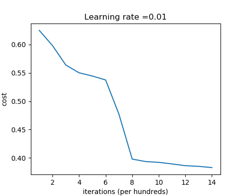  
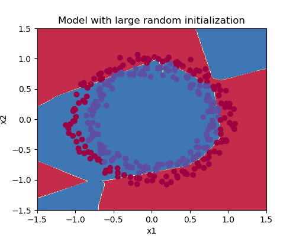

### He初始化
本节在上一节正态分布随机数的基础上乘以$\sqrt{\frac{2}{n^{[l-1]}}}$因子：  
`np.random.randn(layers_dims[l], layers_dims[l-1]) * np.sqrt(2./layers_dims[l-1])`  
仅仅是初始化参数不同，就产生了质的飞跃：
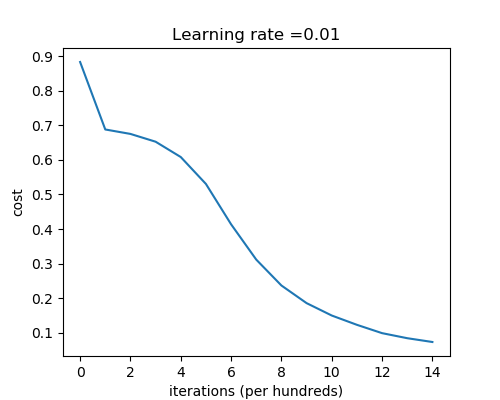  
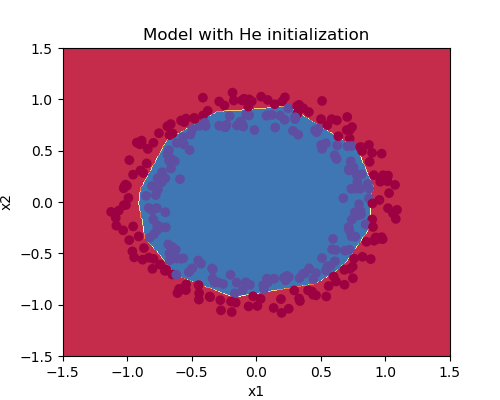

本节给出最重要一条结论是：
**He初始化方法最适用于当激活函数为ReLU的情况**

> 本节作业可参见[https://github.com/palanceli/MachineLearningSample/blob/master/DeepLearningAIHomeWorks/mywork.py](https://github.com/palanceli/MachineLearningSample/blob/master/DeepLearningAIHomeWorks/mywork.py)`class Coding2_1_init`。

## 正则化
正则化主要用来解决过拟合的问题，尤其是当数据量不够大，训练出的模型能很好地拟合训练集，但泛化能力比较弱，不能很好地预测从没见过的数据。  

本节的题目是：当法国队门将开球的时候，给他一个球落点的建议，以确保该球总能被法国队员顶到。题目给出了前10场的所有落点以及是否被本球队队员顶到的历史记录，点的坐标表示球的落点，蓝色代表法国队控球，红色代表对方控球：
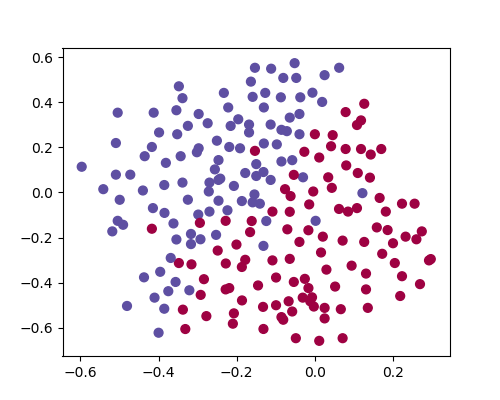

### 不使用正则化的版本
执行`Coding2_1_reg.tc2`，它设置`keep_prob=1`，`lambd=0`，这将不使用任何正则化方法：
``` python
$ python3 -m mywork Coding2_1_reg.tc2
```

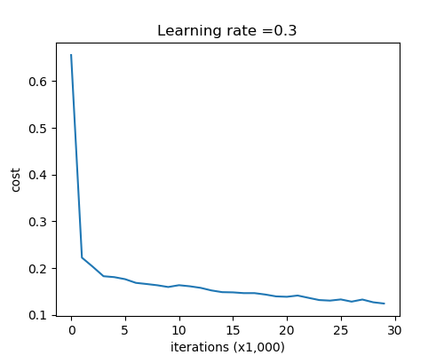
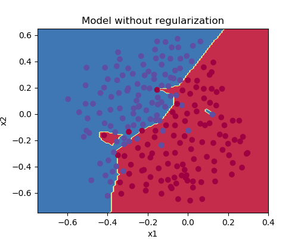

### 使用L2正则
接下来使用L2正则，和base版本相比，它有两处变化：在正向传播计算成本函数的时候需要加上正则参数：
$$J_{regularized} = \small \underbrace{-\frac{1}{m} \sum\limits_{i = 1}^{m} \large{(}\small y^{(i)}\log\left(a^{[L](i)}\right) + (1-y^{(i)})\log\left(1- a^{[L](i)}\right) \large{)} }_\text{cross-entropy cost} + \underbrace{\frac{1}{m} \frac{\lambda}{2} \sum\limits_l\sum\limits_k\sum\limits_j W_{k,j}^{[l]2} }_\text{L2 regularization cost}$$
在反向传播的时候，这会影响到对$dW^{[l]}$的计算：
$$dW^{[l]} = \frac{1}{m}dZ^{[l]}·A^{[l-1]} + \underbrace{\frac{λ}{m}W^{[l]}}_\text{为成本函数添加正则参数引起的变化}$$
使用L2正则化之后的效果如下：
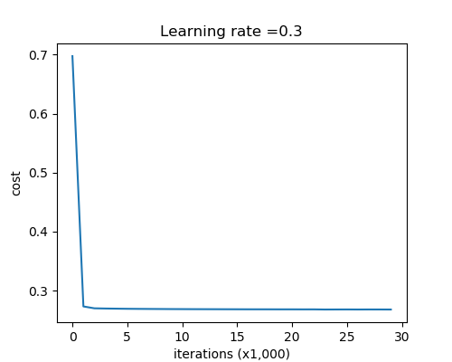
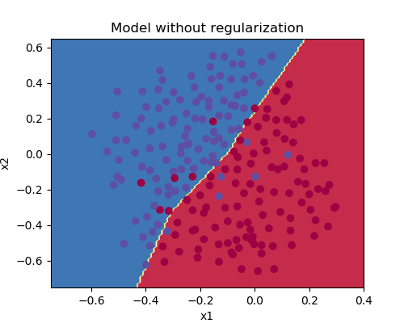

L2正则化引入了一个超参数λ，本节课程并没有介绍如何设置合理的λ。可以理解一个趋势：λ越大，导致W越小，导致模型越倾向于线性，也就有更小的方差，同时可能会放大偏差。

### 使用Dropout正则
在前面的笔记部分已经讲解了Dropout的原理，具体实现方法分两步：一、在正向传播时使用四个步骤：
``` python
D1 = np.random.rand(A1.shape[0], A1.shape[1]) # 1、用随机数初始化矩阵D，每个元素∈[0, 1]
D1 = (D1 < keep_prob)                         # 2、使用keep_prob将矩阵转成0/1值
A1 = np.multiply(A1, D1)                      # 3、通过和D1相乘让A1中的节点失活
A1 = A1 / keep_prob                           # 4、除以keep_prob确保A1期望值不变
```
二、在反向传播时，除了正常的步骤完成计算后，要使用同样的方法对A实施Dropout：
``` python
dZ3 = A3 - Y
dW3 = 1./m * np.dot(dZ3, A2.T)
db3 = 1./m * np.sum(dZ3, axis=1, keepdims = True)
dA2 = np.dot(W3.T, dZ3)

dA2 = np.multiply(dA2, D2)              
dA2 = dA2 / keep_prob              
```
既然在正向传播的时候已经将相关的节点做过失活处理了，那么整个网络不就应该是“阉割”掉这些节点的么？为什么反向传播还要再做失活手术呢？原因是失活手术并没有把节点摘除掉，而是通过失活因子令其不能起作用，其实节点还在。而在反向传播时，dA是由W和dZ相乘而得，W并没有被失活，因此还需要再对dA做一次失活手术。
这是使用了Dropout正则后的结果，比L2正则略好一些：
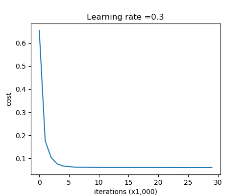
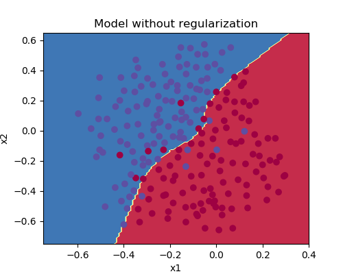
注意：Dropout正则是在每轮迭代时都随机失活某些节点，以确保模型不过度依赖任何一撮节点。

> 本节作业可参见[https://github.com/palanceli/MachineLearningSample/blob/master/DeepLearningAIHomeWorks/mywork.py](https://github.com/palanceli/MachineLearningSample/blob/master/DeepLearningAIHomeWorks/mywork.py)`class Coding2_1_reg`。

## 梯度检查