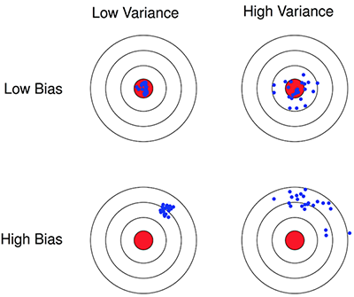

本节主要从如何初始化W、b参数，正则化正反向传播和梯度检查三方面来讨论如何优化一个神经网络模型。
<!-- more -->

# 1.2 偏差/方差
**偏差**描述的是算法预测的平均值和真实值的关系，体现算法的你和能力。  
**方差**描述同一算法在不同数据集上的预测值和所有数据集的平均预测值之间的关系，体现算法的稳定性。  

# 初始化
在上一节的例子中我就遇到了因初始参数选择不合适导致梯度下降的成本函数很快趋平，但精度只有34%的情况。将初始化参数稍微调整一下就能在同样的迭代轮数内，精度达到了78%！可见初始化参数对训练结果有着决定性的影响。

> 本节作业可参见[https://github.com/palanceli/MachineLearningSample/blob/master/DeepLearningAIHomeWorks/mywork.py](https://github.com/palanceli/MachineLearningSample/blob/master/DeepLearningAIHomeWorks/mywork.py)`class Coding1_3`。