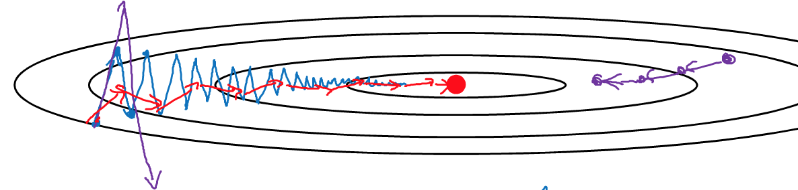

本节主要从模型的心连方法上给出一些可优化的点，包括可以将数据分而治之的Mini-Batch、防止梯度下降方向变化率过大的指数加权平均以及RMSprop和Adam优化算法。

<!-- more -->
# 2.1 Mini-Batch梯度下降法
当样本量巨大时，有必要将海量样本拆分成更小的子集。因为海量样本的向量化会收到内存限制，拆分让分布式并行成为可能。  
例如，当有5,000,000样本时，可令1000个样本为一组，拆分成5000个子集：
$$X = [\underbrace{x^{(1)} \; x^{(2)} \;  ... \; x^{(1000)}} _{x^{\{1\}}\;\in\mathbb{R}^{n_x\;×1000}} \; | \; \underbrace{x^{(1001)} \; x^{(1002)} \; ... } _{x^{\{2\}}\;\in\mathbb{R}^{n_x\;×1000}} \; | \;...\;| \; \underbrace{ \; ...\; x^{(m)}} _{x^{\{5000\}}\;\;\in\mathbb{R}^{n_x\;×1000}} \; ]$$
$$Y = [\underbrace{y^{(1)} \; y^{(2)} \;  ... \; y^{(1000)}} _{y^{\{1\}}\;\in\mathbb{R}^{n_x\;×1000}} \; | \; \underbrace{y^{(1001)} \; y^{(1002)} \; ... } _{y^{\{2\}}\;\in\mathbb{R}^{n_x\;×1000}} \; | \;...\;| \; \underbrace{ \; ...\; y^{(m)}} _{y^{\{5000\}}\;\;\in\mathbb{R}^{n_x\;×1000}} \; ]$$
使用符号$x^{\{t\}}\;y^{\{t\}}$来表示第t个样本子集。

> 目前接触过三种上角标：  
$x^{(i)}表示第i个样本\\z^{[l]}表示第l层节点\\x^{\{t\}}表示第t个样本子集$

于是Mini-Batch梯度下降法可以写作：  
$Repeat \{\\
\;for \; t=1, ... , 5000\{\\
\;\;执行正向传播，由X^{\{t\}}计算$  
$\;\;Z^{[1]}=W^{[1]}·X^{\{t\}}+b^{[1]}$  
$\;\;A^{[1]}=g^{[1]}(Z^{[1]})\\\;\;...$  
$\;\;A^{[L]}=g^{[L]}(Z^{[L]})$  
$\;\;计算成本函数J^{\{t\}} = \frac{1}{1000}\sum_{i=1}^{L}L(ŷ^{(i)}, y{(i)}) + \frac{λ}{2·1000}\sum_l\Vert{W^{[l]}}\Vert_F^2$  
$\;\;执行反向传播$  
$\;\;W^{[l]}:=W^{[l]} - α·dW^{[l]}$  
$\;\;b^{[l]}:=b^{[l]} - α·db^{[l]}$  
$\;\}$  
$\}$ 

# 2.2 理解Mini-Batch梯度下降法
之前没有分割小批量的梯度下降叫Batch梯度下降法，和Mini-Batch梯度下降法相比，二者的成本函数曲线不同： 

观察Mini-Batch每个子集的尺寸，当在极端情况下  
Size=m，Mini-Batch退化为batch梯度下降，它会沿着等高线切线方向直奔最小值，但是当样本量极大时，机器会承担不了海量样本向量化的内存开销，这导致计算性能下降。  
Size=1，Mini-Batch退化为m个单样本的梯度下降，又称随机梯度下降（Stochastic gradient descent）。它导致梯度下降的方向更加曲折，虽然总体会像最低点演进，但中间会走很多冤枉路，这会增加训练的轮数，降低学习性能。  
因此应当在1和m之间取一个合理的值，既能有效利用机器的计算资源，又不让梯度下降的路径过于曲折。如下图所示蓝色是size=m的梯度下降路径，紫色是size=1的梯度下降路径，绿色的size介于二者之间：

一般情况下Mini-Batch的size取值在64， 128， 256， 512中选取。  
> 本节讨论的是size的取值范围及影响，并没有涉及对Mini-Batch的理解。  

# 2.3 指数加权平均
本节引入的方法貌似和前文没有什么关系，其实在后面会用到。它的核心思想是：当数据前后之间有连续性的关联关系时，令每条数据在基于前序若干数据的加权值基础上再加一个变量。本节举的例子是给定一年的气温样本，预测某一天的温度，令样本值为：$θ_1 \,θ_1 \,θ_1 \,...\,θ_{365}$ ，建立预测模型：
$v_0=0$
$v_1=β·v_0+(1-β)·θ_1$
$v_2=β·v_1+(1-β)·θ_2$
...
$v_t=β·v_{t-1}+(1-β)·θ_t$  
该模型可以近似的理解为：它取了$\frac{1}{1-β}$个前序样本的加权平均值。  
当β=0.9，即10个前序样本的加权平均；  
当β=0.98，即50个前序样本的加权平均； 
当β=0.5，即2个前序样本的加权平均；   
这只是一个近似的理解，并没有给出数学证明。

# 2.4 理解指数加权平均
当β=0.9：  
$v_{100}=0.1θ_{100} + 0.9v_{99}\\
= 0.1θ_{100} + 0.9(0.1θ_{99} + 0.9v_{98})\\
= 0.1θ_{100} + 0.1×0.9θ_{99} + 0.9^2(0.1θ_{98} + 0.9v_{97})\\
= 0.1θ_{100} + 0.1×0.9θ_{99} + 0.1×0.9^2θ_{98} + 0.9^3(0.1θ_{97} + 0.9 v_{97})\\
=...$  
我理解这个加权平均核心是因为系数0.1，它表达的含义是取最近$\frac{1}{1-β}$个样本，每个样本的权重是(1-β)，且随着样本越远，按照β的指数级递减，这应该是“指数加权平均”的含义。  

文中指出$0.9^{10}≈0.35≈\frac{1}{e}$，我没明白他的用意是什么。我的直观理解应该是想说过了这个值$\frac{1}{e}$以后，其权重可忽略不计了，但是为什么呢？  

> e是自然对数的底数，$e=\mathop{lim}\limits_{n→∞}{1+\frac{1}{n}}^n≈2.71828$，在科学计算中通常不使用以10为底的对数。使用以e为底，能让许多算式得到简化，用它最“自然”，因此称为自然对数。btw:$\frac{1}{e}≈0.367879$  

实现指数加权平均的算法：
$v_θ=0 \\
Repeat \{\\
　get　next　θ_t\\
　v_θ:=β·v_θ+(1-β)·θ_t\\
\}$

# 2.5 指数加权平均的偏差修正
上一节的实现算法有一个缺陷：在算法初期，由于初值被置为0，且没有更多的前序数据拿进来做加权平均，这会导致初值偏小。等到$\frac{1}{1-β}$个前序样本都加入进来才回归正常。本节引入一个修正系数来解决这个问题：  
$v_t=\frac{β·v_{t-1} \;+\; (1-β)·θ_t}{1-β^t}$  
在初期t很小，$β^t→1$，分母放大了结果；t越大，$β^t→0$，分母的作用就越小。通过这种方式修正了初期数据。

# 2.6 动量梯度下降法
本节是对指数加权平均的应用，大致思想是：w:=w-α·dw，dw决定了下一步的方向，减缓每一步dw的变化率，有利于抵消折返的角度，提升学习的效率。如下图：

直观理解是，如果能把原本蓝线走过的梯度下降，修正为红线，即减缓每次迭代的方向变化率，学习率将得到提升。在算法上，将原先**w:=w-α·dw; b:=w-α·db**修正为：  
$v_{dw} = β·v_{dw} + (1-β)·dw\\
v_{db} = β·v_{db} + (1-β)·db\\
w:=w - α·v_{dw}\\
b:=b - α·v_{db}$  
算法的核心思想就是采用指数加权平均来作用于原先的dw和db，从而使得变化率的连续性更强，防止梯度下降中的折返消耗。

# 2.7 RMSprop
接下来两节介绍的优化方法，在思想上和动量梯度下降法是一致的，都是希望减小方向的变化率。直接上算法：  
$S_{dw} = β_2·S_{dw} + (1 - β_2)·(dw)^2\\
S_{db} = β_2·S_{db} + (1 - β_2)·(db)^2\\
w:=w - α·\frac{dw}{\sqrt{S_{dw} \;+\; ε}}\\
b:=b - α·\frac{db}{\sqrt{S_{db} \;+\; ε}}$  
> 但本节并没有讲该算法的出处和思想起源，为什么取平方呢？这和加权平均差异有点大。不过也没关系，知道意图并知道这么做是有效的就好了~  

# 2.8 Adam优化算法
和前两节是一样的思路，并且把前两节的优化方法结合在一起了。直接上代码：  
$v_{dw}=0, \; S_{dw}=0, \; v_{db}=0, \; S_{db}=0\\
on \, iteration \, t:\\
使用mini-batch方法计算dw, db\\
v_{dw}=β_1·v_{dw} + (1-β_1)·dw 　　　v_{db}=β_1·v_{db} + (1-β_1)·db\\
S_{dw}=β_2·S_{dw} + (1-β_2)·(dw)^2　S_{db}=β_2·S_{db} + (1-β_2)·(db)^2\\
v_{dw}=\frac{v_{dw}}{1-β_1^t}　　　v_{db}=\frac{v_{db}}{1-β_1^t}\\
S_{dw}=\frac{S_{dw}}{1-β_2^t}　　　S_{db}=\frac{S_{db}}{1-β_2^t}\\
w:=w-α·\frac{v_{dw}}{\sqrt{S_{dw}} \;+\; ε}　　　b:=b-α·\frac{v_{db}}{\sqrt{S_{db}} \;+\; ε}$  
通常超参数选择：$ε:10^{-8} \; \; \; β_1:0.9 \; \; \; β_2:0.999$，  
α则根据业务调整。

# 2.9 学习率衰减
学习率衰减的思想是：随着梯度下降的进行，距离成本最低点越来越近，应该逐步衰减每一轮的学习步长，以避免大幅在最低点附近震荡消耗。此时缩减步长有助于逼近极值点。从图上很容易理解这一点：

蓝线在到达了极值点附近还是以同样的步长来回震动，这导致后期的震荡对于学习不再有效；而绿线的步长越来越小，有助于逼近极值点。理解了思想，算法就很容易看懂了。  
方法一：$α:=\frac{1}{1+decay\\_rate×epoch\\_num}$，其中decay_rate为衰减率，epoch_num为迭代的代次。  
方法二：$α:=0.95^{epoch\\_num}·α$  
方法三：$α:=\frac{k}{\sqrt{epoch\\_num}}·α \;或\; α:=\frac{k}{\sqrt{t}}·α$  
最土的办法是手动调节，总之就是让后期的α能逐步衰减。

# 作业

> 本节作业可参见[https://github.com/palanceli/MachineLearningSample/blob/master/DeepLearningAIHomeWorks/mywork.py](https://github.com/palanceli/MachineLearningSample/blob/master/DeepLearningAIHomeWorks/mywork.py)`class Coding2_2`。