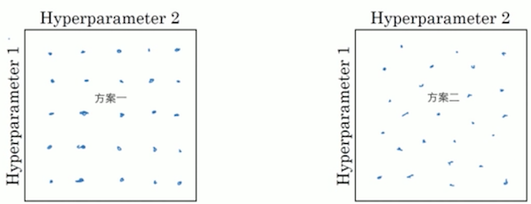
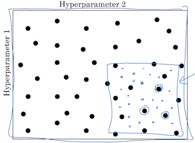
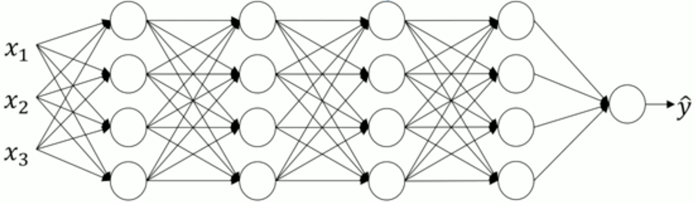
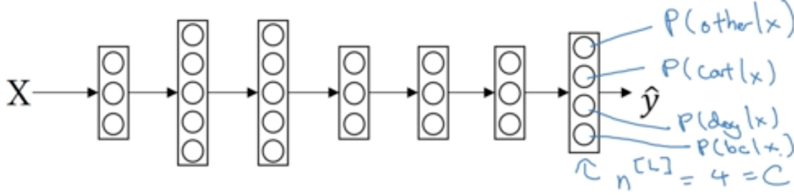

本节是神经网络破茧成蝶的一节课。因为之前一直讲解理论，从零开始搭建正向传播、反向传播、梯度下降以及各个环节的优化方法。现实应用中，基于成熟的机器学习库，通常只需几行调用就能完成这些工作。本节终于开始介绍TensorFlow，然而在使用高级玩意儿之前，还得再学习一周的超参数调试方法，并把逻辑回归方法扩展到多分类问题的解决上来。

<!-- more -->
# 3.1 调试处理
到目前接触过的超参数有：学习率α、指数加权平均参数β、$β_1、β_2、ε$、层数#layers、各隐藏层节点数#hidden units、学习衰减率learning rate decay、每个Mini-Batch子集规模Mini-Batch size。按照重要程度（经常调试的频率），将它们排序如下：  
α  
β、#hidden units和Mini-Batch  
\#layers、learning rate decay  
几乎从来不会调试$β_1、β_2、ε$  

本节介绍了两个选取超惨的原则：  
1. 随机选取。假设系统中有两个超参，事先不知道哪个超参更重要时，应当随机选取，采用方案二。因为同样的点数，假如超参2对系统的影响微不足道，那么方案一相当于只选了5个点，而方案二则是所有点在纵轴上的投影个数，显然多于方案一，而它们的运算成本是相等的。

2. 粗调-微调。这一条很好理解，如果在某个区域训练效果比较好，接下来应该在这一区域更密集地尝试超参。

原理很容易理解，我认为难点在于数据的可视化，尤其有更多超参需要调试，在多维数据上，怎么体现出取值和结果的规律性是有难度的。  

# 3.2 为超参选择合适的范围
有的超参比如每层节点个数或层数，他们的取值范围不跨越量级，可以在范围内线性均匀取点。而另一类超参，如学习率α或指数加权平均的β，跨越量级比较大，则应先选择量级范围，再在每个范围内均匀取点。  
如α的范围在0.0001~0.1之间，首先划分量级范围：

再在每个范围内取点：

代码如下，即在指数级上选取随机数：
``` python
n = 4
np.random.seed()
r = -1 * n * np.random.rand(n)
alpha = 10 ** r
for i in range(n):
    logging.info('%.5f' % alpha[i])
```

指数加权平均的超参β也类似，它的取值范围在0.9~0.999，它表达的含义是向前追溯$\frac{1}{1-β}$个样本的加权平均值，因此其实应当先考虑$\frac{1}{1-β}$或1-β的量级范围，再计算β：

代码如下：
``` python
np.random.seed()
r = 1 + 2 * np.random.rand(4)
logging.info('1-β：')
for i in range(4):
    logging.info('%.5f' % (10 ** (-r[i])))
beta = 1 - 10 **(-r)
logging.info('β：')
for i in range(4):
    logging.info('%.5f' % beta[i])
```
结果如下：
``` bash
1-β： 0.00219 0.02956 0.01752 0.00592
β：   0.99781 0.97044 0.98248 0.99408
```
综上所述，对于量级跨越比较大的超参，有必要先理解超参背后的含义，再确定它的选取策略。

# 3.3 超参训练的实践：Pandas VS Caviar
本节介绍了两种训练模型的流派：熊猫和鱼。前者不断打磨一个模型，不断精进；后者同时训练多个模型，优胜略汰。  
我的理解是：模型的本质就是在指定的超参数之下迭代出的参数序列。为什么作者在介绍熊猫派时也提到在精进过程中可能会修改超参数，那不就成训练不同的模型了吗？  
我想到的答案是：差异在于是否并行。前者也并非始终都在训练同一个模型，因为在示意图上，魔性的成本函数并不是完全连续的。熊猫派的做法是在同一段时间只训练一个模型，鱼派则是同时并行多个模型。显然，只要计算资源足够，肯定选后者。我理解这其实不是流派问题，地主老财有钱当然多办事咯~

# 3.4 正则化网络的激活函数
前面章节介绍过，正则化输入层有利于将原本狭长的成本函数等高线图拉伸成各方向均匀的等高线图，它的本质其实等效于“避免梯度下降每一步的方向变化率夹角太大”。既然在输入层有效，想必在隐藏层应该也是有效的，因为每个隐藏层也是下一层的输入层。所不同的是，通常对隐藏层的z而非a做正则化。  
对于某个指定的隐藏层，其z节点分别为$z^{[1]\(1\)}, z^{[1]\(2\)}, z^{[1]\(3\)}, ..., z^{[1]\(m\)}$，简写为$z^{\(1\)}, z^{\(2\)}, z^{\(3\)}, ..., z^{\(m\)}$  
$μ=\frac{1}{m}\sum_{i=1}^{m}z^{\(i\)}\\
δ^2=\frac{1}{m}\sum_{i=1}^{m}(z^{\(i\)}-μ)^2\\
z_{norm}^{\(i\)}=\frac{z^{\(i\)}-μ}{\sqrt{δ^2+ε}}　　增加ε是防止分母为0\\
\tilde{z}^{\(i\)} = γ·z_{norm}^{\(i\)}+β$  
有的情况下，不希望正则化后的z均值为0，方差为1，因此在加入两个超参数γ和β来控制正则化后的均值和方差。   
当$γ=\sqrt{δ^2+ε}， β=μ$时，$\tilde{z}^{\(i\)}$就退化成了$z^{\(i\)}$。

# 3.5 将Batch Norm拟合进神经网络
下面的流程图很清晰地描述了引入Batch Norm后的神经网络算法：  

需要注意的是，$z^{[l]}=w{[l]}·α^{[l-1]}+b^{[l]}$  
由$z^{[l]} \;→\; z_{norm}^{[l]}$时需要减去均值μ，因此$b^{[l]}$会失效，  
由$z_{norm}^{[l]} \;→\; \tilde{z}^{[l]}$时，通过$β^{[l]}$体现出偏移：$\tilde{z}^{[l]}=γ^{[l]}·z_{norm}^{[l]}+β^{[l]}$  
因此，引入Batch Norm方法后，每一层的b参数就不需要了。

# 3.6 Batch Norm为什么奏效？
除了前面讲到的正则化可以令成本函数等高线图更均匀，Batch Norm还有更深层的作用——它可以让网络中每一层有更强的适应性。神经网络的本质是经过训练得出的每一层W、b参数:

如果样本的参数不够均匀，有较大的方差，它们会传导影响到后面每一层的参数，使得网络受噪声数据影响就比较大。至于课件中讲的用黑猫训练的模型是否能识别黄猫，我表示怀疑。不太符合直觉，因为只是训练样本以及由训练样本所传导生成的一系列参数做了归一化。测试数据或被预测数据是不可能参与归一化的。  
我有一种基于直觉的猜测：归一化可能令颜色这个维度的数据变得不那么重要了，而放大了形态、质感
whatever……等维度的特征，从而使网络的适应性增强。可是疑问还是有的：放大什么特征、抑制什么特征，又怎么通过如此抽象的数据来把控呢？为什么受抑制的不是其它特征而是颜色呢？

# 3.7 测试是的Batch Norm

# 3.8 Softmax回归
在以往的章节中，训练样本仅被标注为两类结果，如猫或非猫。现实世界常常要识别更多的分量，如猫、狗、鸡等等。Softmax正是用来解决此类问题。
和解决二分问题的神经网络非常相似，差异仅在于Softmax在输出层有多个节点，而非1个：

每个节点表示他对应分类的概率，因此该层节点的和应为1。这就需要在输出层的计算上需做一些额外处理：
$z^{[L]}=w{[L]}·a^{[L-1]}+b^{[L]}$  
引入临时变量$t_i=e^{z_i^{[L]}}$，令$a^{[L]}=\frac{e^{z^{[L]}}}{\sum_{j=1}^{n^{[L]}}t_i}$  
假设输出层有4个节点：$z^{[4]}=\begin{bmatrix}5\\2\\{-1}\\3\end{bmatrix}$，于是$t=\begin{bmatrix}e^5\\e^2\\e^{-1}\\e^3\end{bmatrix}=\begin{bmatrix}148.4\\7.4\\0.4\\20.1\end{bmatrix}$  
$\sum_{j=1}^4t_i=148.4+7.4+0.4+20.1=176.3$，于是$a^{[L]}=\begin{bmatrix}148.4/176.3\\7.4/176.3\\0.4/176.3\\20.1/176.3\end{bmatrix}=\begin{bmatrix}0.842\\0.042\\0.002\\0.114\end{bmatrix}$

# 3.9 训练一个Softmax分类器
Softmax正向传播算法输出的是命中个分类的概率$ŷ=\begin{bmatrix}0.842\\0.042\\0.002\\0.114\end{bmatrix}$，而样本标注的是确定的标签$y=\begin{bmatrix}0\\1\\0\\0\end{bmatrix}$。二者貌似不是一个量纲，损失函数怎么计算呢？  
和二分的损失函数略有不同，定义损失函数：$L(ŷ, y)=-\sum_{j=1}^{n^{[L]}}y_j\log{ŷ_j}$。  
在上例中，y通过0过滤掉非目标的选项，要让成本函数尽量小，则应ŷ尽量大。  
故成本函数为：$J(W^{[1]}, b^{[1]}, ...)=\frac{1}{m}\sum_{i=1}^{m}L(ŷ^{\(i\)}, y^{\(i\)})$  
> 但在后向传播算法中，课件给出$dz^{[L]}=ŷ-y$这是怎么得出来的呢？

# 作业
## 执行Tensorflow的基本步骤
1. 创建Tensors变量
2. 创建基于这些变量的操作
3. 初始化Tensors
4. 创建一个Session
5. 运行Session

来看第一个例程：
``` python
y_hat = tf.constant(36, name='y_hat')      # 定义常量 ŷ=36
y = tf.constant(39, name='y')              # 定义常量 y=39
loss = tf.Variable((y - y_hat)**2, name='loss')  # 定义变量，损失函数L=(y-ŷ)^2

init = tf.global_variables_initializer()   # 初始化Tensors，此时还没有开始执行任何运算
with tf.Session() as session:              # 创建Session
    session.run(init)                      # 初始化变量
    print(session.run(loss))               # 运行损失函数，并打印
```
函数、值都可以定义为变量，本例子中就把损失函数定义为变量。

## placeholder
感觉placeholder有点格式化输出的意思：
``` python
x = tf.placeholder(tf.int64, name='x')  # 定义占位符
init = tf.global_variables_initializer()
with tf.Session() as session:
    logging.info(session.run(2*x, feed_dict={x:3})) # 用的时候再赋值
```
通过字典`feed_dict`来定义实际值。

## 问题
自己写的第一段代码就未获通过：
``` python
x = tf.Variable(3, dtype=tf.float32)
f = tf.Variable(x**2, name='function')
init = tf.global_variables_initializer()
with tf.Session() as session:
    session.run(init) # 问题出在这里！！！
    logging.info(session.run(train))
```
<font color=red>提示说是使用了未初始化的变量，先写在这备忘，待查到原因再来解答。</font>

> 本节作业可参见[https://github.com/palanceli/MachineLearningSample/blob/master/DeepLearningAIHomeWorks/mywork.py](https://github.com/palanceli/MachineLearningSample/blob/master/DeepLearningAIHomeWorks/mywork.py)`class Coding2_3`。