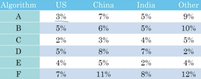

《结构化机器学习项目》第一周《机器学习（ML)策略（1）》。
本课没有编程作业，老师在开篇提到本课提供更快速、高效地优化机器学习系统的思路，很多大学机器学习的课程是不包含这些内容的。

<!-- more -->

# 1.2 正交化
显示器的控制开关通常由若干个：控制显示区宽度、高度、梯度、角度和亮度等。每个开关或旋钮控制一个指标，调解其中一个不会改变另一个，这就是正交化，机器学习也是如此，我们希望当训练的结果不如人意的时候，能诊断出一些正交的问题，并针对每一个问题找到确定的方法，来单独调节。  
我曾经面试过一人，跟我描述说机器学习更像是玄学，完全不可预期它能运算出什么结果。我觉得正是因为在调优阶段没有做到正交化所致。如果一个旋钮在控制高度的同时，也在控制角度和亮度，操作这样一台机器恐怕必须要靠烧香乞求它产生一个靠谱的结果了。  

通常进行机器学习的操作链条如下：  
① 系统在训练集上表现良好 →  
② 系统在开发机上表现良好 →  
③ 系统在测试机上表现良好 →  
④ 系统在实际应用中表现良好  
当在每一环节出现问题时，希望找到正交化的解决方案来优化，方案的方向如下：  
① 训练更大的网络或切换更好的优化算法，如Adam等  
② 正则化或增大训练集  
③ 可能是对开发集过拟合了，需要更大的开发集  
④ 要么开发集分布设置不正确，要么成本函数测量的指标不对，改变开发集或成本函数  

正交化的作用就是确定在链条中哪个阶段出了问题，并确定可以调节哪些不同的参数来解决该问题。

# 1.3 单一数字评估指标
本节的观念是：让系统的评价指标统一到一个单一的数值上来。例如我们常常陷入**查准率**和**查全率**的两难境地上来，两个都想要，可是二者就是此消彼长的关系。在机器学习的学术界常采用二者的调和平均值=$\frac{2}{\frac{1}{P}+\frac{1}{R}}$来将指标单一化。  
再如，当训练了6个识猫模型，把它们应用到从不同区域采样上来的数据后，表现各不相同：

指标不单一，很难从这个二维表格中评价哪个模型表现最好。因此建议将四个区域的表现取平均值，从而使指标单一化到该均值上来：

# 1.4 满足和优化指标
本节还是在讲单一数字评估指标的方式有时候，指标过多且不一个维度，不好捏在一起或者捏在一起显得很不自然，但仍然要这么做。随便定一个目标也胜过没有目标，当指标过多时，单一化会不可避免地掺入一些主观的价值判断，这是确定产品方向或设定任务目标是必须的。  
例如，分类器的性能表现除了精度，还要考虑运行时间：

可以设定公式：`性能指标=精度-0.5×运行时间`，作为单一化的评价指标。于是本例中  
A=90-0.5×80=50  
B=92-0.5×95=44.5  
C=95-0.5×1500=-655  
故A是最优解。  

还有一种思路是，将精度指定为`优化指标`，将运行时间指定为`满足指标`，模型的训练目标是在达到满足指标（≤100ms）的基础上，尽量提升优化指标。于是上面的例子中B就是最优解。这同样要求优化指标是单一化的。

# 1.5 训练/开发/测试集的划分
开发集又称保留交叉验证集。  
机器学习的工作流程是：尝试很多思路，用训练及训练不同的模型，然后使用开发集评估这些不同的思路，然后选择一个；然后再不断迭代模型，改善其在开发集上的性能，直到最后得到一个满意的成本，最后再用测试集去验证评估。  
本节第一个例子是为来自多个区域的样本训练“识猫”模型：  
①选取开发集+单实数评估指标  
②迭代不同的想法跑实验，根据①评估不同的分类器，选出最好的那个  
③不断调优，迭代生成模型  
④在测试集上验证  

我的理解：训练集就是练习册，开发集就是真题模拟考，测试集就是大考，最终的应用就是就业了。不是每次都用大考来验证模型是担心过拟合，因为模型最终的目的是应用，对测试集过拟合可能会导致“高分低能”，所以不能轻易祭出测试集。用真题模拟考来把关，就要求真题模考和大考的集合必须是同分布的，如果这两个数据集不同分布，就好比学了三年文科，大考时却被扔到理科考场，不傻逼才怪！  

还回到“识猫”的案例，绝对不能随机抽取区域作为开发、测试集：

而应该将这些来自不同区域的数据重新洗牌，随机抽取出开发集和测试集。  

本节末尾给出的指导意见是：在选择开发集和测试集时，要让它们能够反映未来将应用于实际的数据，并要求开发集和测试集必须同分布。这里没有讲训练集，有时候出于现实的限制，可能很难做到训练集与开发/测试集同分布，这种情况会在后面的章节讲到。

# 1.6 开发集和测试集的大小
以往当数据规模较小时（比如100、1,000、10,000……这样的量级），训练集占70%，测试集占30%或训练集60%，开发集20%，测试集20%是合理的。  
而现代机器学习的数据规模常常在百万量级，采用1%作为开发集，1%作为测试集就足够了，更多的数据用于训练。  

我理解，对于开发集和测试集，只要与未来的应用场景是同分布的，其有效性更多取决于量级而非占总数据的比重，万级别对于评测通常都足够了。  

# 1.7 什么时候该改变开发/测试集和指标
针对这个标题其实很好回答：那就是设错目标的时候。课件举了两个例子：  

一个是对总目标的分量考虑不周全，只考虑了判猫的精度，没考虑到如果把色情图片误判为猫推送给用户，比判错一个猫后果严重得多。这在很多产品的应用场景中很常见，比如输入法的纠错候选做对10个带来的加分体验，可能都不及将一个正确候选纠成错误的带来的负分多。在判猫的案例中，原本的成本指标是：  
$\frac{1}{m}\sum_{i=1}^{m}I\{y_{pred}^{(i)}≠y^{(i)}\}$  
需要引入一个权重$w^{(i)} = \begin{cases}1 与色情图片无关的误判\\10　把色情图片识别为猫\end{cases}$  
新的成本指标修正为$\frac{1}{\sum{w^{(i)}}}\sum_{i=1}^{m}w^{(i)}·I\{y_{pred}^{(i)}≠y^{(i)}\}$  

另一个例子是对应用场景的数据评估不准确，导致训练、开发和测试集不能反映实际的应用情况。  

听起来这两个例子都比较弱，我猜测之所以独立一节，应该是因为工程师或者研究员拿到数据后往往会一头扎到训练的工作中去了，交作业时才发现文不对题，这种情况可能比较典型。传统的开发很少会出现这种情况，因为开发周期没那么长，而且经常开发一半就能有可体验的中间版本供演示了，如果出现和需求不一致，不论是工程师还是产品很容易在早期发现。而机器学习因为其过程的抽象性，且周期动辄以周、月计，一旦目标设定出现偏差，往往发现比较晚，损失会比传统的工程方法大得多。

# 1.8 为什么是人的表现
机器学习的表现通常呈现如下的态势：起初发展很快，可以追上甚至超越人，之后便进入瓶颈，而且任凭时间推移继续优化算法，尽管模型越来越大，数据越来越多，但性能再也无法超越某个理论上限，这条线就称为贝叶斯最优误差。

贝叶斯误差线不会达到100%，因为比如语音识别，背景噪声很大时，理论上也达不到完美识别；比如图像识别，如果图片特别模糊，也会导致无法识别。  

而机器学习在超越人类之后，往往进展也就慢了下来，原因有二：  

1. 在有些领域，人类的能力已经接近贝叶斯误差，比如看图听声，也就是说机器学习超越人来后也就达到了理论极限。
2. 只要表现比人类更差，就总能找到一些工具帮助提升。比如喂入更多数据，标注更多数据，或人工误差分析查找原因，如分析偏差/方差以针对性解决。而一旦表现超越了人类，这些方法也就失效了。  

我对第2点前半段有质疑：超越人类的能力后可以继续喂入数据，这和是否是否超越人类无关。关于后半段的更详细解释在下一节有介绍。

# 1.9 可避免偏差