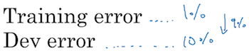

《结构化机器学习项目》第二周《机器学习（ML)策略（2）》。
本课主要讨论数据，标注错误、训练集和开发/测试集不同分布，遇到这些情况该怎么应对。后半部分进一步扩展了机器学习的方法，引入迁移学习、多任务学习、端到端学习的概念。

<!-- more -->

# 2.1 进行误差分析
本节核心思想是：在误差分析时应分清主要矛盾和次要矛盾，从而集中力量解决主要矛盾，这需要付出一些人工成本，但对解决问题的方向起着至关重要的作用，因此这个人工投入是非常值得的。  

本节依然以识猫为例，需要把在开发集上识别错误的图人工扫一遍，记录错误的原因并归纳统计，然后优先解决占比最大的问题。

在本例中，显然最应该做的是在训练集中增加低分辨率图片的占比，而不是增加狗图的占比。

# 2.2 清除标注错误的数据
机器学习算法有较好的鲁棒性来抵御随机的标注错误，但对于系统性错误却没有免疫力。比如把所有的白狗都标注为猫，那训练出来的模型就会把白狗认定成猫。因此在训练集中出现的少量随机性错误，通常可以不用花时间修改。而对于开发集和测试集中出现的标注错误，则应判断这些错误是否严重影响了在开发集上评估算法的能力。此时上一节的人工分析就非常重要，如果发现标注错误占比在总误差中较低则可以忽略，否则就应该修正。例如，

第一组标注误差仅占总误差的0.6/10=6%，不会对开发集的评估能力造成严重影响；而第二组标注误差占总误差0.6/2=30%，这就比较严重了。假设两个分类器的误差分别为2.1%和1.9%，你就无法区分开究竟因为标注误差带来的性能差异还是两个分类器真有这样的差距。  

确定了是否应该清除标注错误后，下一步就要确定具体在清除时应遵循的原则。  
1. 清除工作要对开发/测试集做同样的处理，以确保两个集合必须服从同分布。
2. 强烈建议同时检验算法判断正确和判断错误的例子。因为有`标注错误&&判断不符合标注`的假阳性，就有`标注错误&&判断符合标注`的假阴性，只修正一种可能会导致系统性偏差，对算法评估不公平。但检验算法判断正确的所有例子确实成本很高。
3. 修正训练集通常是个超高代价的事，通常不会这么做，不修正问题也不大。但要了解这会令训练集与开发/测试集产生一些分布偏差，这个问题后面会专门讲解。  

最后老师再次重申花一些人工精力去做误差分析的重要性，亲自看错误的例子是非常必要且值得的。

# 2.3 快速搭建你的第一个系统，并进行迭代
本节的建议并不是让尽快找一个框架，让代码跑起来，而是：
- 尽快确定目标和方向，划出开发/测试集。前者是单一数字评估指标
- 搭建初始系统，让训练跑起来，从简单的系统逐步优化
- 使用偏差/方差分析和误差分析，确认每轮迭代后主要问题出在哪，针对性调整，从而进入下一轮迭代

在有的领域，行业已经有了很多成熟的论文和解决方案，比如图像识别。这种情况下，可以基于它们搭建更复杂的神经网络。  

我的理解，老师的核心精神是搭建一个你能掌控的学习框架，而且尽量简单，让它在迭代中针对主要矛盾再改进，防止过度设计，防止让复杂的系统变得不可控。尤其应当避免的是把机器学习系统搞成一个玄学系统，不知从哪里拷一坨代码，不了解背后的思想，更没有能力对中间环节做出调节，这比工程时代的拷贝粘贴导致的后果会更令人崩溃。

# 2.4 在不同分布的数据上进行训练并测试
很多时候训练集和开发/测试集是不同分布的，例如在识猫的案例中，只有10,000张图来自实际的用户，这些图的分辨率、亮度、角度可能都不好，但这来自实际的应用场景；又有200,000张图来自网络爬虫，它们很容易获取，而且数据量巨大，但和用户上传的图片却有很大差异。这个时候该如何分配训练集、开发集和测试集呢？  

老师不建议将200,000+10,000混合后随机抽取开发/测试集，这虽然能令所有数据同分布，实际上却设定了错误的“靶心”。因为模型最终的应用场景是识别用户上传图片。  
建议的做法是：将10,000张用户上传图片分两半，一半给训练集，即200,000+10,000/2=205,000，将剩余5,000再随机分两半，给开发集和测试集。

# 2.5 不匹配数据划分的偏差和方差
本节讨论当训练集和开发集分布不一致时分析偏差和方差的方法。  
当看到下面一组数据，如果训练集和开发集属于同一个分布，可以确认模型的方差过大。

但如果二者不同分布，就不能确认这9%的差距是由于模型方差过大导致的还是数据分布不同导致的。  

首先应该把二者区分开，方法是从训练集中再选取与训练集同分布的一部分数据作为训练-开发集：

训练-开发集不参与训练，而是当开发集使用，每次使用开发集检验模型同时也用训练-开发集验证一下。以下面的数据为例，第一组模型在训练集误差比较小，而在同分布的训练-开发集上的误差较大，说明模型对训练集过拟合了；第二组模型在同分布的训练集和训练-开发集上的误差很接近，而在开发集上的误差较大，则说明这是由于数据不同分布导致的。

因此当训练集和开发集不同分布时，通常的分析步骤是列出五个误差，并计算他们之间的差距，找到差距最大的优先解决：

课件的结尾给出分析的一般性原则：

对于系统解决“数据分布不同”的问题，并没有很好的通用方法，下一节会给出一些尝试的办法。

# 2.6 定位数据不匹配
当训练集与开发集不同分布即数据不匹配时，老师的建议是人工观察数据，感受数据的差异点在哪里，然后想一些人工合成数据的办法。  
例如车载系统的语音识别，如果训练集是正常环境下的语音，而实际应用是有车噪背景的，二者的差异会导致模型在后者环境下误差较大，可以尝试采集少量车噪，再与训练集合成带车噪的语音。  

但是合成不一定完全有效，因为合成的数据可能存在人工无法察觉的偏向性，比如将1小时的车噪与10,000小时语音合成，而这1小时车噪可能在所有车噪特征中存在系统性偏差，人耳是无法分辨的，但训练出的模型就会对这1个小时车噪产生过拟合。而且车厢内说话的回声特征与合成的也不一样，不同品牌的车，车噪也不同，麦克风放在不同的位置上收集到的车噪也不同，这些都可能导致合成的数据过拟合，且人工无法直接分辨。图片数据的合成也有一样的问题，总的来说就是“骗”过了人，却“骗”不过机器。因此老师说没有系统的解决方案，只能试试看了。

# 2.7 迁移学习
当任务A和任务B有着相同的输入，例如：  
$\begin{cases}任务A:识猫\\任务B:识别X光片中的病理特征\end{cases}$或$\begin{cases}任务A：语音识别\\任务B:识别智能音箱唤醒音\end{cases}$  
任务A比任务B的训练数据多出很多，此时A的低级特征或许对B的学习有用，可以将A的神经网络嫁接给B来使用。具体做法是删掉A神经网络的输出层，然后为输出层重新赋予随机权重，将标注样本替换为B，重新训练该网络。

如果B的样本量非常小，可以在新的训练中只替换最后一层$W^{[L]}、b^{[L]}$；如果B的样本量比较大，可以多迭代几层；如果B的样本量非常大，也可以得到所有层，但这就没必要使用迁移学习了。  

迁移学习有效性的直观理解是神经网络越靠前面的隐藏层学到的是领域内越低层次的特征，比如从边缘检测→五官→形态。低层特征在相关领域内是可以复用的，比如图像识别、声音识别，越靠后的隐藏层越与具体业务相关，因此可以根据数据量的情况替换掉。

# 2.8 多任务学习
多任务学习是指在一个神经网络中同时判断多个特征。比如自动驾驶在视觉处理中同时判断图片中是否存在车辆、路标、信号灯等。由于这些特征存在于相同的输入样本，且具有类似的低层特征，因此它们可以复用同一个神经网络，这也是多任务学习的必要条件。它的网络结构和Softmax有点类似，所不同的是它不要求输出层个节点和为1：

其中ŷ是4维向量，定义损失函数：  
$L(ŷ, y) = \frac{1}{m}\sum_{i=1}^{m}\sum_{j=1}^{n^{[L]}}L(ŷ_j^{(i)}, y_j^{(i)})\\
=\frac{1}{m}\sum_{i=1}^{m}\sum_{j=1}^{n^{[L]}}[-y_j^{(i)}\log{ŷ_j^{(i)}} - (1-y_j^{(i)})\log{(1-ŷ_j^{(i)})}]$  
有时会遇到这种情况：有的样本只标注了部分特征，未标注的不能确定是或否，此时成本函数则只对标注的数据求和即可。  

多任务学习的使用场景：

- 训练的一组任务可以共用底层特征，这种场景其实并不是很多，图像识别是一类。
- 每个任务的数据量很接近，老师说这一点并不是必须。
- 可以训练一个足够大的网络同时做好所有任务。

# 2.9 什么是端到端的深度学习
以语音识别为例，传统做法从音频到文本要经历若干阶段：

而端到端的学习则是构造一个巨大的神经网络，输入一段音频，直接输出文本：

端到端的学习需要大量的数据才能让系统表现良好。以门禁系统中的人脸识别为例，传统方法分两步：

1. 识别出图片中人脸的位置
2. 识别该人脸的ID  

传统方法的好处在于，分解后的每个子任务都更纯粹和简单，而且样本数据可能都更多。而组合后相当于叠加了更多条件，样本量可能就没那么大了。  
端到端的好处也显而易见，它省略了中间过程中很多繁琐的过程，让更多的工作交给机器，让人从业务逻辑的细节中解脱出来。

# 2.10 是否要使用端到端的深度学习
本节分析了端到端的深度学习的优缺点。  
优点：  
① 只让数据说话。只要有足够多的数据，就能让神经网络自己搞清楚从X到Y的映射关系，而不必人为地引入人的理解，比如语音识别中音位的概念。  
② 手工设计的组件更少。  
缺点：  
① 需要更海量的数据。  
② 它排除了可能有用的手工设计组件。这是一把双刃剑，仍以语音识别中音位的概念为例，尽管它是人为创造的概念，但在目前它是有效的。端到端的方法使得中间过程不能再接受人工干预。但是人类无法断定现在有效的手工设计是否就是终极方法，也许随着数据规模扩大和运算能力提升，深度学习网络会更贴近客观的X→Y映射关系。  

所以我认为端到端的深度学习是机器学习长期值得探索的方向。