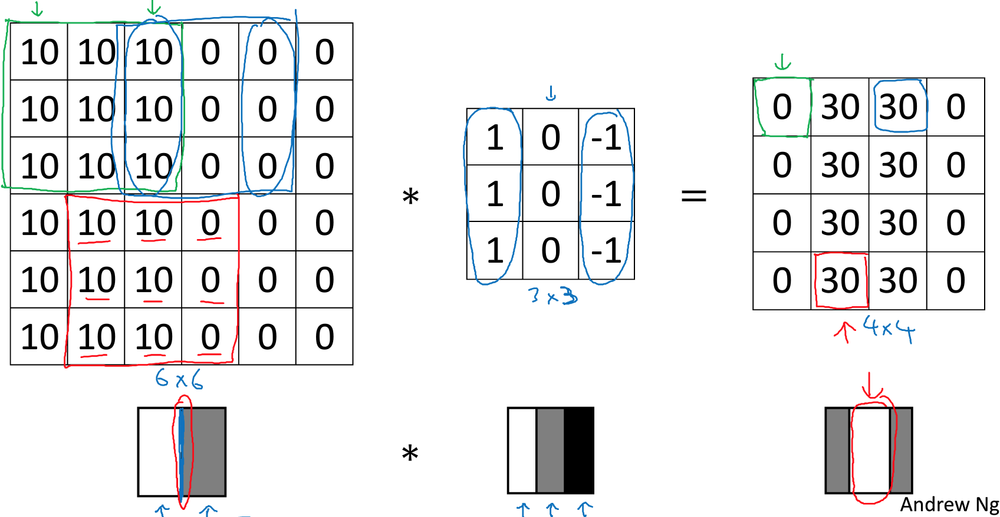
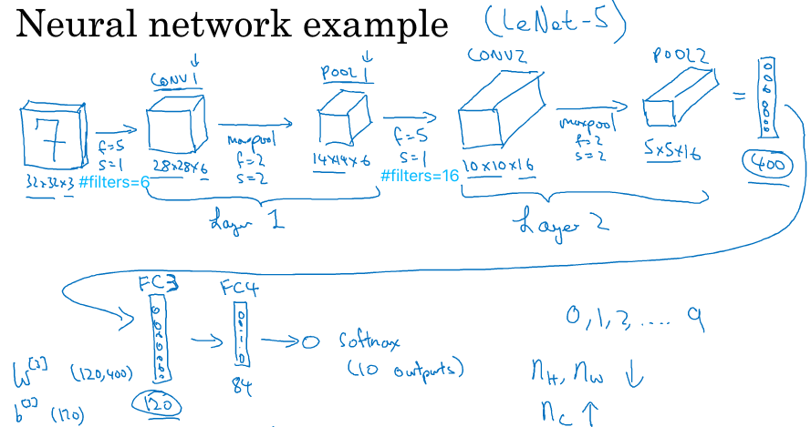

《卷积神经网络》第一周《卷积神经网络》。  
本门课程《卷积神经网络》主要应用于计算机视觉。本周课程介绍了卷积神经网络的基本模块，基本结构。包括卷积计算的概念及相关的参数策略如Padding、步长；卷积层、池化层、全连接层及各层之间的关系。主要为接下来的应用打好理论基础。

<!-- more -->
# 1.2 边缘检测示例
卷积算法规则：卷积的乘数成为过滤器，或卷积核。将过滤器叠加到被运算矩阵的左上角，两个矩阵的叠加元素相乘求和，得到新矩阵的一个元素。然后将过滤器从左向右移动，从上向下移动，每次移动做一次相乘求和的运算。这个过程就是卷积运算。

在Python中使用conv-forward表示卷积
在TensorFlow中使用tf.nn.conv2d表示卷积
在keras中使用Conv2D表示卷积

为什么卷积可以用于边缘检测呢？通过不同的过滤器，卷积操作能把不同的边缘特征检测出来。例如下面是一个竖直过滤器，经过卷积操作，可以在结果中得到一个竖直的亮条。

不过我觉得此处没有讲透彻：竖直边缘是因为在竖直方向上，有差异较大的两列元素，无论在原矩阵还是运算后得到的矩阵上，检测竖直边缘都是要去发现有对比度的列，计算方法并没有差别，为什么说卷积就能检测边缘呢？  
我猜测也许是经过对过滤器卷积的正负运算可以放大对比度，但直觉上我总感觉这个不够。

# 1.3 更多边缘检测内容
不同的过滤器可以检测出不同的图像边缘特征，例如不同的明暗变化、不同的方向变化等。上一节例子如果被检测的图片左右翻转一下，运算得到的矩阵也就有不同的特征：

同理，将竖直过滤器转置就可以得到水平过滤器。

尽管我对卷积在特征识别中的作用理解还不是很透彻，但这在机器学习中似乎并不重要，你只要知道运算结果一定是有着某种被放大的特征的，至于特征是什么，叫个神经网络自己去发现吧。课件中这张图道出了卷积在卷积神经网络中的作用：

卷积神经网络就是构造神经网络框架，不断迭代过滤器，通过梯度下降令卷积结果不断逼近标注样本。人不必费心归纳和抽象特征和比较函数了，通过成本函数完成评价。而且我理解，特征检测的原理貌似确实不重要了，因为在不同层面有不同的特征性质，人工处理需要分门别类地归纳，而这些在机器学习看来，都是一样的，机器学习完成了更好的抽象。

# 1.4 Padding
卷积运算有两个特点：
1. 令被卷积的矩阵长宽均为n，卷积过滤器长宽均为f，则运算后的矩阵长宽为n-f+1。只要过滤器长宽大于1，则每次卷积运算都会让矩阵变小，比如6×6矩阵 * 3×3过滤器 = 4×4矩阵。
2. 在被卷积矩阵中，位于边缘或角落的像素对于卷积结果的影响较小。例如四个角的像素在卷积运算中只参与一次，而中心点能参与$f^2$ 次。

以上的两个特点会令图片在神经网络的层层运算中，边缘特征被逐步扔掉，而且层层向中心侵蚀。
可以沿着图片边缘增加一层像素，通常用0填充，这种方法称为padding。令Padding的层数为p，则卷积运算后的矩阵为(n+2p-f+1)×(n+2p-f+1)。还以6×6的图，3×3的过滤器为例，增加一层边缘，卷积后得到的矩阵仍是6×6。

在卷积神经网络中，卷积运算通常有两种策略:

- 一种称为Valid卷积，即：不做Padding；
- 另一种称为Same卷积，即：使矩阵尺寸在卷积操作前后保持相等。于是$n+2p-f+1=n，p=\frac{(f−1)}{2}$ 。这就要求过滤器的尺寸应为奇数，在实际应用中确实如此。

# 1.5 卷积步长
步长是在卷积运算过程中，每计算一个元素后向右或向下移动的单元数，通常用s来表示。令运算前矩阵宽高为n，过滤器宽高为f，Padding宽度为p，步长为s，则运算后的矩阵宽高为$⌊\frac{(n+2p−f)}{s+1}⌋$，向下取整表示如果过滤器超出矩阵边缘，则不再运算。

在一些数学教材中，对卷积操作的定义是先给过滤器沿着右上左下对角线转置，再按照前面的规则做运算。在机器学习中不需要转置步骤。

# 1.6 卷积为何有效
本节内容并没有解释为什么有效，而是进一步扩展卷积的操作，讲解了多通道卷积和多过滤器卷积的操作规则。
前面的例子中，被操作的图片都是灰度图，因此是2维矩阵，有时候我们可能希望对RGB三个色值通道单独做边缘检测，这就需要为3通道图引入3通道的过滤器。如下，它的运算规则是将各通道运算结果再相加，得到结果中的一个元素：

它要求过滤器的通道数必须等于被运算矩阵的通道数，运算得到的结果是一个2维矩阵。

在过滤器的选取上，如果希望对某一个颜色通道做检测，可以在过滤器中将其它通道置0，如第一种过滤器；如果不关心具体是什么颜色，则可以将过滤器中各通道设为一样，如第二种过滤器。

当对一张图片需要做多种类型检测时，就需要在卷积运算中引入多个过滤器。比如过滤器A用于检测水平边缘，过滤器B用于检测竖直边缘。原始图片和每个过滤器运算后都得到一个二维矩阵，最后将这些矩阵组成一个多通道立方体。这就是在卷积神经网络中的运算规则。

令待检测的图片为n×n×n_c，过滤器为f×f×n_c，过滤器的个数为#filters，则卷积运算后的结果为(n−f+1)×(n−f+1)×(#filters)。

# 1.7 单层卷积网络
上一节已经基本把单层卷积网络的轮廓勾画出来了，本节画龙点睛：

过滤器就是$w^([l])$，卷积运算就是$w^[l] ·a^[l−1]$ ，在此基础上加上偏移b_i，再取一个非线性激活函数，就是一个正向传播算法了。
可以引入一些常用的特征检测矩阵作为过滤器，通常一层卷积网络会用到十几到几十个过滤器不等。假设每个过滤器为3×3×3再加上偏移共28个参数，10个过滤器也只有280个参数，而一张图片的大小假设1000×1000×3，如果按照之前讲的常规神经网络，把它扁平化后每层需要3M个参数，显然卷积网络要比常规神经网络运算规模小很多。

总结一下卷积神经网络的符号，对于第l层，令：
过滤器的个数：$f^{[l]}$  
卷积padding层数：$p^{[l]}$  
卷积步长：$s^{[l]}$  
输入层为：$n_H^[l−1] ×n_W^[l−1] ×n_C^[l−1]$ ，对于di第0层，输入就是原始图片长宽及通道数
输出层为：$n_H^[l] ×n_W^[l] ×n_C^[l]$   
则  $n_H^{[l]}=⌊(n_H^{[l−1]}+2p^{[l]}−f^{[l]})/s^{[l]} +1⌋， \; n_W^{[l]}=⌊(n_W^{[l−1]}+2p^{[l]}−f^{[l]})/s^{[l]} +1⌋$，  
$n_C^{[l−1]}$  就是上一层过滤器的个数  
过滤器的通道数必须等于上一层输出层的通道数，故过滤器的维数是：$f^{[l]} ×f^{[l]} ×n_C^{[l−1]}$   
再考虑过滤器的个数，即权重层的维度：$f^{[l]} ×f^{[l]} ×n_C^{[l−1]} ×n_C^{[l]}$  
第l层的激活值即输出层，维度为：$a^{[l]}→n_H^{[l]}×n_W^{[l]}×n_C^{[l]}$  
第l层偏差值维度为：$b^{[l]}→ 1×1×1×n_C^{[l]}$ 

# 1.8 简单卷积网络示例
课件里的草图已经能清晰地反应示例：

输入层为$39×39×3，n_H^[0] =n_W^[0] =39，n_C^[0] =3$  
过滤器为$3×3×3，f^{[1]} =3$  
过滤器个数：10  
步长$s^{[1]} =1$  
padding $p^{[1]} =0$  

第一个隐藏层为$37×37×10， \frac{(39+0−3)}{1}+1=37，n_H^{[0]} =n_W^{[0]} =37，n_C^{[0]} =10$  
过滤器为$5×5×10，f^{[1]} =5$  
过滤器个数：20  
步长$s^{[1]} =2$  
padding $p^{[1]} =0$  

第二个隐藏层为$17×17×20， \frac{(37+0−5)}{2}+1=17，n_H^{[0]} =n_W^{[0]} =17，n_C^{[0]} =20$  
过滤器为$5×5×20，f^{[1]} =5$ 
过滤器个数：40  
步长$s^{[1]} =2$  
padding $p^{[1]} =0$  

第三个隐藏层为$7×7×40， \frac{(17+0−5)}{2}+1=7，n_H^{[0]} =n_W^{[0]} =7，n_C^{[0]} =40$  
最后将该层扁平化为7×7×40个节点或者生成逻辑回归的输出层，或者直接作为softmax的输出层。

关于如何选取过滤器，步长、个数会在后面的章节里详细介绍。本节只要对总体形态有个印象即可，即随着层数的增加，每层输出的维度在缩小，通道数增加。完整的卷积神经网络除了卷积层外，在后面还会接上Polling层和全连接层（Fully connected），在接下来的章节会详细介绍。

# 1.9 池化层
池化也是将一个矩阵与过滤器做运算，过滤器运行的轨迹和卷积一样，不同点在于每次运算，最大池化是取过滤器覆盖到的矩阵中所有元素的最大值作为输出元素。

池化也有两个超参数，尺寸和步长。和卷积不同，池化不是和变量的运算，只要过滤器的尺寸和步长确定，结果就确定了，其实算是一个单目运算。因此在池化环节不需要梯度下降迭代参数。

多通道的池化与卷积规则不同，多通道池化是将每个通道独立做池化运算，再将各通道结果组合成多通道，因此池化前后通道数是不变的。

还有一种池化叫做平均池化，它和最大池化仅有一点不同，就是原本取最大值的操作改成取平均值。平均池化没有最大池化那么常用。

我理解池化的作用是缩减数据量的一种方式，它尽量保留原矩阵的对比度特征，当然有所衰减，但也让数据量得到大幅的压缩。

# 1.10 卷积神经网络示例
课件中给出了一个常见的卷积神经网络示例，这是应用在手写数字识别上的一个例子：

它有2个卷积层，每个卷积层包括1个卷积运算和1个池化运算，第2个卷积层之后，将结果扁平化为400维向量，然后接入的两个全连接层就是标准的神经网络层了。随着层次的加深，卷积层的维度数在下降，信道数在增加。
该框架还可变形为：多个卷积运算后面跟着一个池化运算，再有多个卷积运算后面跟着一个池化运算，然后是若干个全连接层。

# 1.11 为什么使用卷积
使用卷积最大的好处就是把常规神经网络的运算量降低了很多个量级。之所以能够降低原因有二：

- 参数共享。一个过滤器将走遍图片的每一块区域，一个水平边缘过滤器既能检测到图片左上角的水平边缘，也能检测到右下角的，这与全连接计算需要提供高维w因子相比节省了大量参数量。
- 稀疏连接。运算结果中的每一个元素仅与被乘矩阵中的局部有关，这个局部的大小就是过滤器大小，过滤器大小决定了参数规模。但我觉得这个逻辑并没有将完整，应该是说运算结果矩阵的每个像素本不该与原图的较远像素有关，而是由相邻的一个区域的像素决定的，这个性质使得不必使用同等量级的乘数w。但问题是：运算的结果代表什么？为什么它的每个元素仅与源图中的局部像素相关呢？这里需要一个直觉解释。

# 作业
本节的作业是使用TensorFlow搭建一个最基本的卷积神经网络，用来识别从0到5的手势。网络框架用不了几行代码，关键是理解每一层的策略及输入输出矩阵的维度。

核心点在正向传播算法上：
``` python
def forward_propagation(self, X, parameters):
    ...
    # 获取第1层和第2层过滤器
    W1 = parameters['W1']
    W2 = parameters['W2']
    
    # 第一个卷积层。执行卷积操作，Z1 = X * W1
    # 由于X →(m, n_H0, n_W0, n_C0)，strides在指定padding步长时需定义每个维度
    Z1 = tf.nn.conv2d(X,W1, strides = [1,1,1,1], padding = 'SAME')
    # A1 = RELU(Z1) # A1 → (m, n_H1, n_W1, n_C1)
    A1 = tf.nn.relu(Z1)
    # MAXPOOL: window 8x8, sride 8, padding 'SAME'
    P1 = tf.nn.max_pool(A1, ksize = [1,8,8,1], strides = [1,8,8,1], padding = 'SAME')

    # 第二个卷积层
    Z2 = tf.nn.conv2d(P1,W2, strides = [1,1,1,1], padding = 'SAME')
    # RELU
    A2 = tf.nn.relu(Z2)
    # MAXPOOL: window 4x4, stride 4, padding 'SAME'
    P2 = tf.nn.max_pool(A2, ksize = [1,4,4,1], strides = [1,4,4,1], padding = 'SAME')

    # FLATTEN
    P2 = tf.contrib.layers.flatten(P2)
    # 全连接层。注意：此处不要调用softmax，TensorFlow中softmax和成本函数被合成了一个函数，将在下一步调用
    Z3 = tf.contrib.layers.fully_connected(P2, 6, activation_fn = None)

    return Z3
```

<font color=red>
我不太理解的是：为什么全连接层的激活函数为None呢？全连接层的作用是将P2通过神经网络正向传播成一个维度为6的向量，在这个过程中必然经历`A = g(W · A_prev + b)`的运算，为什么激活函数为空呢？</font>

执行的结果并不理想，训练精度只有65.8%，测试集精度只有54.2%，远低于不使用卷积神经网络的99.9%和71.7%。在视觉领域既然优选卷积神经网络，它一定不会只是这么个操性，想让卷积神经网络牛逼起来，还需要学会调整超参数。继续学习吧！

> 本节作业可参见[https://github.com/palanceli/MachineLearningSample/blob/master/DeepLearningAIHomeWorks/mywork.py](https://github.com/palanceli/MachineLearningSample/blob/master/DeepLearningAIHomeWorks/mywork.py)`class Coding4_1`。