《卷积神经网络》第二周《深度卷及网络：实例探究》。  
本周课程前半部分对卷积神经网络作了进一步延伸介绍，领略了LeNet-5、AlexNet、VGG-16等经典网络和残差网络、Inception网络。这些介绍略显枯燥，因为每个网络体系都更加复杂，你很难从网络体系架构图上理解他为什么这么做。课程并没有讲解思想起源，而是建议大家阅读论文。好消息是，如果只是应用，不需要读懂论文，可以去寻找开源的实现，不仅是算法，连同前人已经训练好的模型都可以一并拿来，通过迁移学习的方法嫁接到自己的应用中。这是本周课程的后半部分讲解的内容。

<!-- more -->
# 2.1 为什么要进行实例探究？
# 2.2 经典网络
本节介绍了卷积神经网络中几个典型的框架。
LeNet-5的作者是法国人LeCun，哥们虽然是CNN鼻祖，但学术上并非石破天惊一鸣惊人，他在1980年底提出“人工神经网络”的时候，甚至很不受学术界待见。靠着死磕精神坚持到21世纪，他的理论才逐步变的热门。他的个人网站是[http://yann.lecun.com/](http://yann.lecun.com/)在这里可以找到LeNet-5的[论文](http://yann.lecun.com/exdb/publis/index.html#lecun-98)。在今年（2018年）的GMIC大会上，LeCun做了开场的主题演讲：


LeNet-5的结构如下：
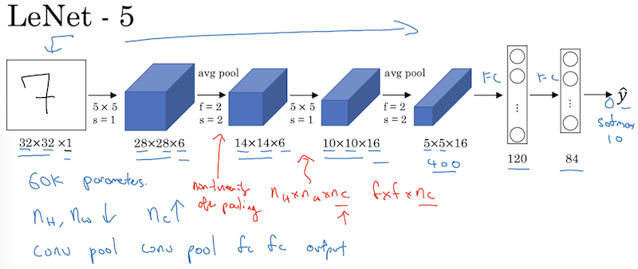
本例适用于数字的识别，
第1层输入32×32×1的图片，过滤器5×5，于是  
$n^{[0]}=32, p^{[0]}=0, s^{[0]}=1 ，f^0=5 \\
结合公式得到第二层维度为：⌊(n+2p−f)/s+1⌋=⌊(32+0−5)/1+1⌋=28$  
在论文提出的年代，**平均池化**更常用，因此这里都采用**平均池化**的策略，而在今天大多使用**最大化池化**了。
池化层不改变原矩阵的通道数，继续使用$⌊(n+2p−f)/s+1⌋$，得到池化后的矩阵为14×14。  
第二个卷积层采用5×5过滤器，使用$⌊(n+2p−f)/s+1⌋$得到结果矩阵为10×10。
再应用f=2,s=2矩阵池化，得到矩阵结果为5×5。将该矩阵扁平化为400个节点，经过2个全连接层输出为10个节点的输出层，对应10个数字。  

第二个经典架构是AlexNet，论文详见2012年发表在NIP的[《Imagenet classification with deep convolutional neural networks》](https://papers.nips.cc/paper/4824-imagenet-classification-with-deep-convolutional-neural-networks.pdf)，作者Alex Krizhevsky。
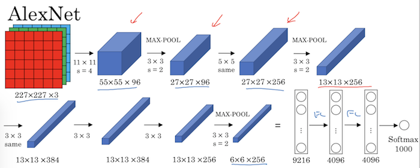
它的层次比LeNet-5多很多，参数也达到6000万（LeNet-5只有6000多个）。这里的池化就已经采用最大化策略了。

第三个架构是VGG-16，这是牛津大学 visual geometry group（VGG）Karen Simonyan 和Andrew Zisserman 于14年撰写的论文，在[Deep Learning Papers Translation](https://github.com/SnailTyan/deep-learning-papers-translation)有以上论文的中英文对照。
网络结构如下：
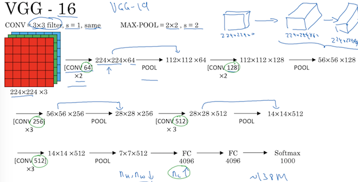
层次越来越深，VGG-16中的数字16就是指网络共有16个卷积层和池化层，共有1.38亿个参数！

<font color=red>以上三个经典网络结构都不算太复杂，一张图就能描述清楚。但是这些结构是怎么搭建起来的呢？层次数、过滤器的尺寸、规模等这些超参数是怎么制定出来的呢？为什么16层有效而19层几乎就没什么提升了？每一层分别起到的效果又是什么？如果说方法的有效性全靠尝试，那这和挖矿几乎没啥差别了，课程始终也没有对此做出解释。当我们面临一个新问题，需要重新搭建网络的时候，应遵循什么样的原则？这些是我内心的疑团。不过本门课程能把这么一个宽广深厚的学科巨细靡遗地呈现出来，告诉我们该怎么操作，已经非常难得了。</font>

# 2.3 残差网络
什么是残差块？
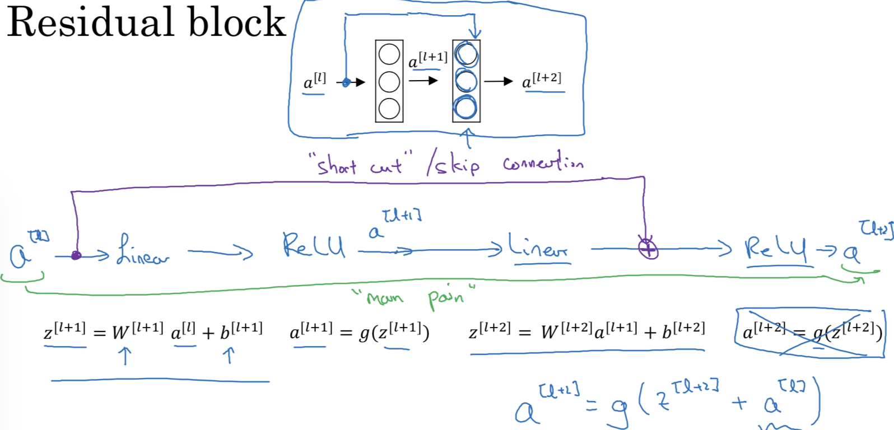
传统的神经网络是按照底部的黑字执行正向传播。而残差网络则是将$a^{[l+2]}=g(z^{[l+2]})$
改为$a^{[l+2]}=g(z^{[l+2]} +a^{[l]})$，即将激活节点直接跳远接入两层后的激活函数，称加上的这个$a^{[l]}$  为一个残差块。
图形可以表示为被上边蓝框框住的流程图。
使用残差块能训练更深的神经网络，残差网络就是将这些残差块堆积在一起，形成的深度神经网络。
残差网络的论文原文在[这里](https://arxiv.org/abs/1512.03385)，也可以在[Deep Learning Papers Translation](https://github.com/SnailTyan/deep-learning-papers-translation)中找到中英文对照。

本节后半段介绍一个现象，对于普通的神经网络，尽管理论上希望随着网络层次的加深，训练集的误差能越来越少，而实际上则是到达一定层次之后，误差会回升，正如左下方的曲线。而引入残差网络之后，训练集误差表现更符合预期，一路向下。
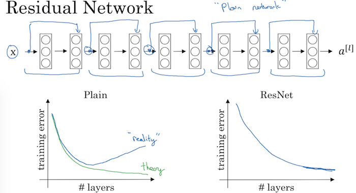

# 2.4 残差网络为什么有效？
本节分析了在极端情况下，可能导致$a^{[l+2]} =a^{[l]}$   
我能理解它表达的含义是尽量让上一层的激活节点延续到下一层，从而使得节点的影响不被复杂的层次消磨掉。既然这样为什么要引入那么复杂的层次呢？老师的说法是希望算法在每一层学习的过程中提升性能，但是我的老问题又来了：<font color=red>为什么这种嫁接方式刚好能保留二者的优点呢？既通过多层次的学习提升了性能，又不会因为层次过多而减弱原始数据的影响。两个优点全占了，为什么不是两个缺点全占了呢？</font>
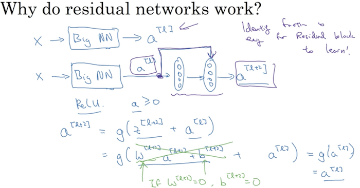
好困惑……  

# 2.5 网络中的网络以及1×1卷积
在单通道矩阵中，1×1卷积似乎看不出有什么用，仅仅是将每个元素乘以同样的倍数。但在多通道矩阵中，这么做相当于为每一个点在所有通道上组成的向量执行了一次全连接操作。
此处我有疑问：根据卷积的定义，是在每个通道上完成被操作矩阵和过滤器之间的运算，而不会跨通道执行乘法，所以应该形成32个平行线，而非32×32的网络吧？因此**所谓的全连接并不是被操作矩阵和某一个过滤器组成的，而是被操作矩阵和n_c个过滤器的第i个通道的所有节点之间形成的**。
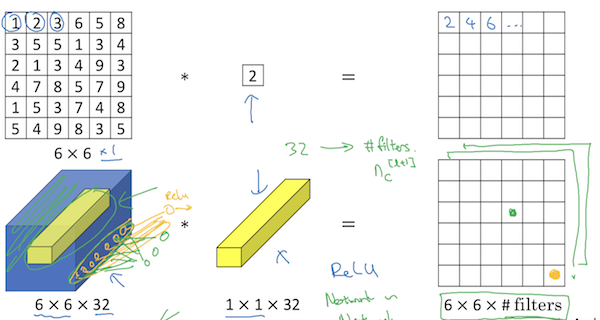
以上表达了在多通道中1×1卷积远比在单通道中有更深刻的含义，那么这个深刻含义究竟能起到什么作用呢？在下图的应用中，老师讲到1×1卷积可以压缩、保持或扩大矩阵的信道数。
我的思考：如果是压缩或保持，池化也能做到，是不是可以把1×1卷积和池化都理解为压缩数据的手段？
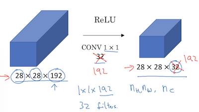

# 2.6 谷歌Inception网络简介
Inception的核心思想是：原先由人来设计的过滤器、层数，这些超参数，现在都作为参数，交给机器来学习。例如下图中从左侧输入到右侧输出经历的过滤器和池化参数均成为了参数，让他们的运算结果拼接在一起，为了让不同的结果拼接在一起，需要确保每次运算所得结果的维度相同。
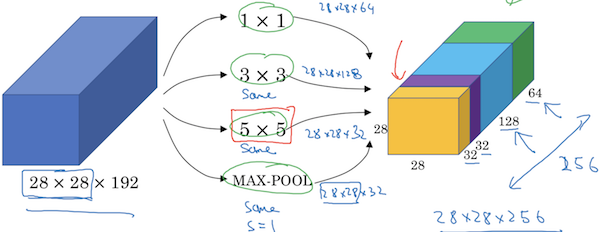
本节并没有深入讨论怎么搭建这样的网络，只是展开了一个细节：在28×28×192矩阵上做多个过滤器的卷积运算时，运算量是巨大的。以上图中紫块的运算为例，结果矩阵中每一个通道上的一个节点都是5×5×192次乘法运算，于是一个通道就有5×5×192×28×28次运算，所有通道加起来就是5×5×192×28×28×32=1.2亿次：
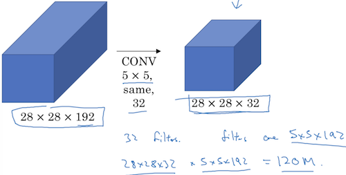
在Inception网络中先对输入矩阵做了1×1卷积，实现压缩通道，然后再执行卷积运算：
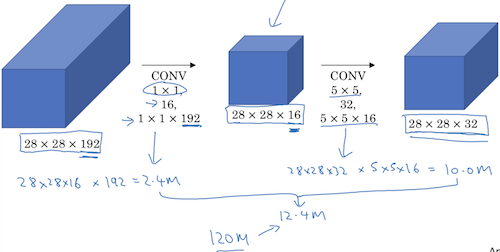
于是两个部分共执行28×28×192×1×1×16 + 28×28×16×28×28×32 = 1240万次
通过这种方式将运算成本降低一个量级。

# 2.7 Inception 网络
这张图展现了通过普遍引入上一节的1×1卷积减小Inception的运算规模：
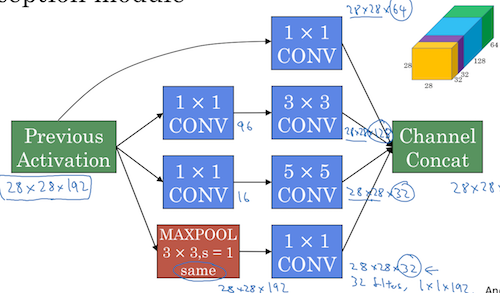
但从这张图上并不能看出他是怎么把过滤器这些超参数变成参数的。
即使在完整的Inception网络结构图中，也看不出参数化的痕迹，而是堆积了很多个类似的子网：
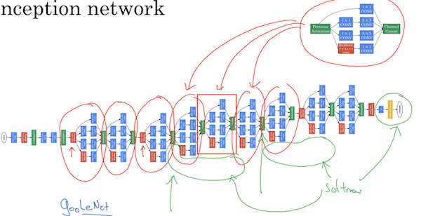

# 2.8 使用开源的实现方案

# 2.9 迁移学习

前面章节中介绍过迁移学习的基本概念，计算机视觉研究社区有很多现成的数据集，以及基于这些数据集训练出来的现成的模型，可以在这些模型的基础上继续正对自己的业务逻辑训练自己的模型，这样可以节省数周甚至数月的时间。这类数据集包括[ImageNet](http://www.image-net.org/index)、[MS COCO](http://cocodataset.org/#home)、[Pascal VOC](http://host.robots.ox.ac.uk/pascal/VOC/)等，前人在这些数据集上动用大量计算资源训练、调优，应该形成积累效应，每一步都能让模型更优化。  
本节之给出了一个操作的原则，在前面章节也都讲到过：

- 如果训练集很少，则建议将现有模型的除softmax以外的层次全部保留并冻结，删除softmax层并重新训练该层。很多开源框架支持冻结操作。
- 如果有一定的训练集，则可以保留和冻结一部分隐藏层，删除靠后的隐藏层和softmax层，重新训练。
如果训练集非常大，则可以把现有的模型作为初始参数，完全重新训练。
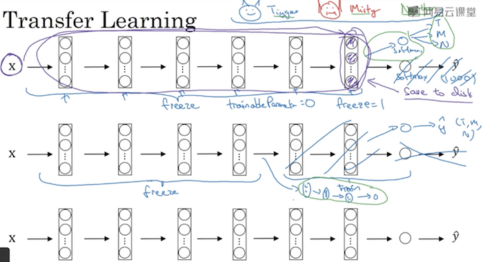

# 2.10 数据扩充
前面章节也介绍过当数据量不够的时候，数据扩充的手段：

- 几何变换，包括：对称复制、随机修剪、旋转、扭曲
- 色彩变换，包括：例如(R, G, B)分别做(+20, -20, +20)的运算、PCA颜色增强


# 2.11 计算机视觉现状
这一节的技术性就更不强了，主要从语音、图片识别、物体检测等几个门类陈述了当前行业的现状：相对于要解决的问题，语音这个行业积累的数据已经足够多了，图片识别其次、物体检测最少。主要原因在于标注成本：一个语音输入法天然就是一个标注工具，可以利用用户自己选择候选完成标注，这几乎没有什么成本，而且拥有海量的标注用户。而物体检测则需要堆专人来干标注的活。
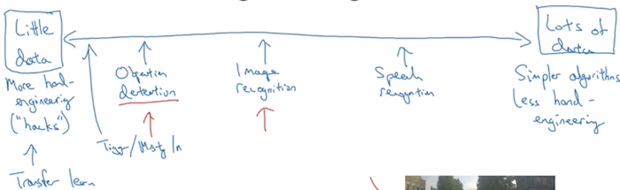

对于有大量数据的行业，比如语音，更多依靠机器完成工作，很少嵌入人工组件；而对于数据量不足的行业，就需要有大量的人工工作，比如设计网络、超参，嵌入公共组件，注入人工知识等。当然还可以利用迁移学习。

本周的课程略显水，主要扩展了眼界，领略了当下经典的神经网络，深入理解还需要自己去看论文。希望作业的部分包含迁移学习的具体练习。

# 作业
## Keras Tutorial Happy House
这一节介绍Keras的基本用法，Keras是一套适合用于快速建模的高级工具。高度的抽象使得Keras特别适合用一些标准模块快速拼出一个神经网络框架，适合前期快速验证一个网络结构。Kearas不擅长做更复杂的定制。具体用法可参见[Keras开发文档](http://keras-cn.readthedocs.io/en/latest/)

本节例子训练集是600张64×64×3的图片，开发集是150张64×64×3的图片。最核心的代码是`HappyModel(...)`，该函数构建了卷积神经网络：
``` python
def HappyModel(self, input_shape):
    ...
    X_input = Input(input_shape) # 在本例中=(64, 64, 3)
    
    # 参数第1个3表示在矩阵前后行均加3行0，第2个3表示在前后列均加3列0
    X = ZeroPadding2D((3, 3))(X_input)
    
    # 32个7×7的卷积核，步长为1×1，我没找到name参数的含义
    X = Conv2D(32, (7, 7), strides = (1, 1), name = 'conv0')(X)
    # 正则化，参见《笔记六》3.4正则化网络的激活函数
    X = BatchNormalization(axis = 3, name = 'bn0')(X)
    # 定义激活函数为RELU
    X = Activation('relu')(X) 

    # MAXPOOL，Pooling的尺寸为2，步长为2
    X = MaxPooling2D((2, 2), name='max_pool')(X)

    X = Flatten()(X)
    X = Dense(1, activation='sigmoid', name='fc')(X)

    ...
    model = Model(inputs = X_input, outputs = X, name='HappyModel')
    ...
    
    return model
```
Pooling可参见[笔记九-Padding](/2018/04/04/2018/0404DeepLearningAI11/#padding)  
BatchNormalization可参见[笔记六-正则化网络的激活函数](/2018/03/29/2018/0329DeepLearningAI07/#正则化网络的激活函数)  
MaxPooling可参见[笔记九-池化层](/2018/04/04/2018/0404DeepLearningAI11/#池化层)  
生成的神经网络如下：
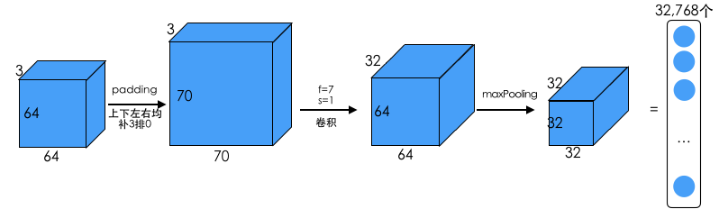

本节末尾可以通过代码生成算法结构图：
``` python
plot_model(happyModel, to_file='HappyModel.png')
SVG(model_to_dot(happyModel).create(prog='dot', format='svg'))
```
这段代码使用了graphviz，需要先安装Graphviz:
```
brew install graphviz
```
生成的结构图为：
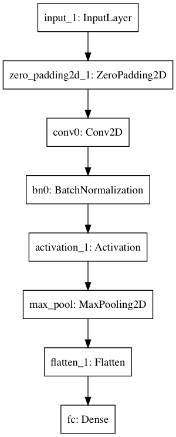

> 本节作业可参见[https://github.com/palanceli/MachineLearningSample/blob/master/DeepLearningAIHomeWorks/mywork.py](https://github.com/palanceli/MachineLearningSample/blob/master/DeepLearningAIHomeWorks/mywork.py)`Coding4_2_KerasTutorial`。

## Residual Networks
残差网络中的残差块有两种形式。  
恒等块如下

卷积块如下

差异在于在shortcut路径上是否执行了卷积运算。如果`x(shortcut)`和`经过三个组件运算后的x`具有相同的维度，二者可以直接相加，就采用恒等块。否则由于纬度不同不能直接相加，需要采用卷积块运算后再相加。

代码没太多要说的，我觉得写神经网络主要是画好结构图，并培养从网络结构到代码范式的直观记忆。

本节提供了一个在GPU上训练好的残差网络模型`ResNet50.h5`，<font color=red>应该掌握下怎么保存模型文件，怎么读取并继续训练。</font>

> 本节作业可参见[https://github.com/palanceli/MachineLearningSample/blob/master/DeepLearningAIHomeWorks/mywork.py](https://github.com/palanceli/MachineLearningSample/blob/master/DeepLearningAIHomeWorks/mywork.py)`Coding4_2_ResidualNetworks`。

本节需要记住：

- 非常深的“普通”网络会因为梯度消失而难以训练，因此在实践中不起作用。
- 跳过连接有助于解决梯度消失问题，使ResNet模块可以轻松学习识别功能。
- 有两种主要类型的块：恒等块和卷积块。
- 通过将这些块堆叠在一起来可以构建非常深的残差网络。
