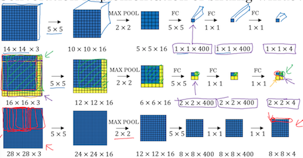

《卷积神经网络》第三周《目标检测》。  

<!-- more -->
# 3.1 目标定位
图片分类是判断图片中是否包含要寻找的目标。
定位分类不仅要判断是否包含目标，还要在图片中标记出它的位置。
对象检测则是在单张图片中定位分类多个对象。

和常规的卷积神经网络相比，定位分类在输出层除了输出softmax结果外，还应增加4个字段，分别表示定位到的中心坐标和宽、高。下面在左边的原图中标出了坐标系及bx、by、bh、bw的含义：

在标注时，向量y包含8个维度：如果包含目标，则Pc=1，bx by bh bw是目标位置，c1 c2 c3是目标类型

定位分类问题仅讨论图片中只有一个目标的情况，如果有多个目标，则是对象检测的范畴，在后面会讨论。

# 3.2 特征点检测
特征点检测和定位分类问题的原理完全一样，以人脸特征点检测为例，需要针对人脸定义出若干个关键点，如左右外眼角、左右内眼角，并在标注中依次标出，如下面中间图所示。然后在卷积网络的输出层输出相应的：是否有人脸，以及各特征点的位置，这在人脸识别中成为landmarks，在前面研究DLib时有所涉及。


人体特征点也是类似的，定义出肢体中的关键节点，并在标注、以及CNN中输出对应的结果。

# 3.3 目标检测
本节介绍滑动窗口目标检测的基本思路：  
1、针对要检测的目标手机样本并训练CNN。如下图所示，假设要检测的是道路中的汽车，首先应采集只有汽车的图片，而且尽量令汽车占满整个图片。完成标注，并针对这些样本做训练。

2、对于给定的被检测图片，定义一个窗口，如下面左图，将窗口在被检测图片中按照固定的步长从左上角依次移动到右下角，每移动一步都应用前面训练的CNN做一次目标检测，如果检测到结果则结束；如果整张图都检测不到结果，则增大窗口尺寸，再做一轮，如中间和右侧图片。

窗口尺寸越小，计算成本越大，而且如果被检测目标比窗体大时可能检测不到目标。
窗口尺寸越大，计算成本越小，但是检测的性能也会下降。
所以理想情况是当窗体与目标大小一致时，并且滑动到目标中心，则可以检测出目标。

这只是滑动窗口的大致思想，具体操作时常常要应用到实时视频检测中，显然不能在每张图上执行这么多次运算，还需要做更多的优化。

# 3.4 卷积的滑动窗口实现
上一节滑动窗口目标检测只是引入个概念，本节继续在性能上改善和提升，使它成为工程上可用的方法。  
第一步先将原先卷积神经网络的全连接部分也用卷积的方式来运算，把全连接层输出的向量以1×1矩阵的形式输出，二者其实是完全等价的，只是表示方式有所不同：

接下来一步是实质性的优化，在16×16×3的图片上做步长为2的窗口滑动运算，相当于对4个图片做了CNN，最后生成4×4×softmax类别的矩阵，这4个CNN的乘数是完全一样的，被乘数又有大量的重合，因此可以等效于用1个CNN输出4×4×softmax类别的矩阵：

不论窗口滑动多少次，只要一个CNN就全都搞定了。

# 3.5 Bounding Box预测
上一节卷积滑动窗口可以在窗口尺寸固定时，只做一次CNN，但是它解决不了一个问题是：当窗口和目标框不重合的时候，还是需要通过缩放窗口进行多轮的循环运算。例如下图的情况，目标窗是红框，滑动窗口是紫框，按照这个尺寸滑动下去，二者是无法重合的：

本节引入YOLO方法，论文在[《You Only Look Once: Unified, Real-Time Object Detection》](https://arxiv.org/abs/1506.02640)，也可在[Deep Learning Papers Translation](https://github.com/SnailTyan/deep-learning-papers-translation)找到中英翻译。

算法的思想是从标注开始的：将训练样本分割成3×3的格子，在每个格子内分别标注，如下图中紫、绿、黄色向量所示，因此标签数据就是3×3×8的矩阵。在建立CNN时，以该3×3×8 的矩阵作为结果y。如果目标超出格子，bx、by以它的重心所在格子为准，bh、hw则可以大于格子。

下图更详细地描述了标注的原则：

我的理解：YOLO是和卷积滑动窗口完全不同的解决办法，它不仅实现了CNN的一次运算，也解决了目标超出窗体的问题。让机器学习去解决“半个车该属于哪个窗口”的问题。

# 3.6 交并比
将训练完成的模型应用在训练集、开发集或测试集的时候，结果不像二分那样直观。有可能会出现下图的情况，紫框是预测结果，红框是标注结果，他们有一部分重合了，怎么评价这个预测正确与否呢？

本节引入交并比（Intersection Over Union IoU）的概念，即：`两个框的交集÷两个框的并集`，可以人为给结果设定一个合理的阈值，比如大于0.5表示预测正确，小于0.5表示预测错误。也可以设定更严格的阈值，比如0.6。

# 3.7 非极大值抑制
按照YOLO算法，结果可能有多个格子声称自己检测到了目标，需要一种方法来筛选出最可能包含目标中心的格子。这就是非极大值抑制算法。
它的核心思想可以用如下伪码表示：
```
while 图片中还有目标框:
  挑选pc最大的作为预测命中框A
  删除与框A的IoU≥0.5的所有框
  记录框A并从图片中删除
```

其中pc是指在CNN中输出命中某目标的概率。针对上图，算法第一轮循环首先找到右车0.9的框，删除0.6、0.7的框，第二轮循环找出左车0.8的框，删除0.7的框。

我的问题是：在一张图中有两个同类型的目标，该怎么标注呢？答案非常简单：YOLO算法是把图片切成3×3，每个格子独立标注，所以上图标注和输出都是3×3×8，不是问题。
问题是如果两个目标挤在1个格子里怎么处理？这是下一节讨论的问题，貌似也只能解决两个形状差异比较大的目标挤在一个格子里的情况，如果形状像似，Anchor Boxes应该也搞不定。

# 3.8 Anchor Boxes
Anchor Boxes用来解决两个对象落在一个格子里的情况，不过Anchor Boxes能解决的问题还是有一些局限，比如只能解决两个形状差异比较大的物体。
基本思想就是：事先预设两个形状差异比较大的格子，比如细高和短粗两种，在标注时将标注结果由原先`3×3×8`改成`3×3×16`：

CNN的网络结构和训练方法都不变。这个思想很容易理解，但是他为什么不能解决形状相似的两个目标在一个格子里的情况呢？我想原因是因为这种标注会让机器晕掉——两个对象高重合，人可能都难以分辨两个框分别对应的是哪个对象，机器就更难了。

# 3.9 YOLO算法
本节从训练和预测两个环节介绍YOLO算法的流程。


# 3.10 （选修）RPN网络