《卷积神经网络》第四周《特殊应用：人脸识别和神经风格转换》。  
本周内容从标题反应很清楚了，人脸识别和普通的CNN不同之处在于在实际应用场景中，被识别的人脸可能无法事先收到很多数据。比如门禁系统，每个人仅上传几张头像，就要求能够分辨当前刷脸的是谁。

<!-- more -->
# 4.1 什么是人脸识别？
人脸的验证是输入人脸图片和ID，判断该图片是不是ID所声称的那个人。
而人脸识别则是保留K个人的数据库，根据输入图片识别出他是哪个人。
而这虽然使用的技术是一致的，但在结果要求上有量级的差异。比如人脸验证的误差率是1%，同样的技术如果应用在人脸识别上，相当于对k个人执行k次验证，这会把误差率放大k倍，1%的验证误差率显然就不能接受了。

# 4.2 One-Shot学习
人脸识别的难点在于解决一次学习的问题：系统接收很少的采样就能在未来的检测中准确判断被验证的人是否合法。通常搭建公司的门禁系统，每个人也就上传一张头像，就要求系统可以工作，如果采用常规的CNN对样本进行训练，性能肯定不会太理想。而且如果每新增一名员工就要重新训练模型，也是很不现实的。

在实际的人脸识别应用中，训练出来的其实是人脸diff函数，它接收两个参数分别为两张头像，返回这两个头像的相似度，小于等于某个阈值则认为是同一个人，否则是不同的人。于是函数不依赖具体的头像，并且增减员工就不需要重新训练模型，也不会影响到函数的性能。

# 4.3 Siamese网络
Siamese网络用来解决人脸识别的问题，它的主要思想是：通过CNN训练出一个向量，该向量可以理解为图片的唯一编码。定义函数d为两个向量的范数，如果两个图片是同一个人，则
$d(x^{(1)} , x^{(2)} )$很小，如果不是同一个人则很大，使用这样的逻辑来训练CNN。
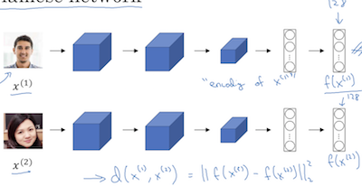

# 4.4 Triplet损失
本节介绍怎么定义三元组损失函数来应用梯度下降。先引入几个概念：首先定义标的图片为Anchor，然后在训练的时候希望有一张和标的同一个人的图片Positive，以及和标的不同人的图片Negative，从而使得`Anchor-Positive的范数`＜`Anchor-Negative的范数`。即$||f(A)−f(P)||^2+α≤||f(A)−f(N)||^2$
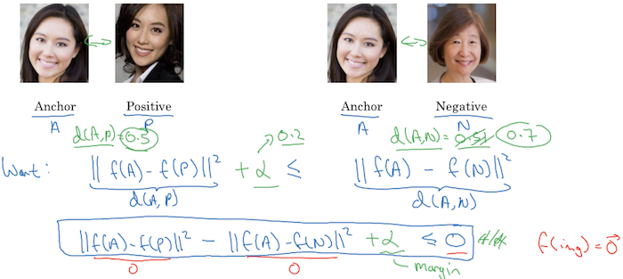
于是可以定义`损失函数L`和`成本函数J`如下：
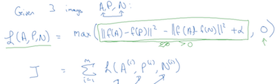
在网络训练期间，还是需要喂入多张(A, P, N)元组，也就是说需要在训练集中具备同一个人的多张照片，但是由于他产出的是不依赖具体图片的d函数，所以在应用的时候就没有这个限制的了，可以做到仅在库中为每个人保留一张照片。

在训练的时候有一个细节需要特别注意，(A, P, N)三元组的选择不能在训练集中随机选取，因为差异很大的图片，很容易满足$||f(A)−f(P)||^2+α≤||f(A)−f(N)||^2$，要想让模型有效，必须在训练期间尽可能喂入不容易辨别的图片，这也很好理解——只有相似的不同人能区分出来，模型在未来的应用准确率才更高。
怎么挑选(A, P, N)在论文[《FaceNet: A Unified Embedding for Face Recognition and Clustering》](https://arxiv.org/abs/1503.03832)中有介绍。

根据d函数的设计思想，其实人脸识别的模型无需自己去做，至少没必要从头做，在前人的基础上喂入更多数据，令这个d函数更精准，最后大家在各自的图片库中共用这个d函数就可以了。

# 4.5 脸部验证与二分类
本节介绍了另一种人脸识别的方法，和Tripple损失不同，它把人脸识别当成了一个二分问题。将图片分为目标图片s和待识别的图片d，算法对这两张图片分别完成CNN运算，输出128维向量，再以这两个向量作为输入，训练另一个模型输出二分结果：
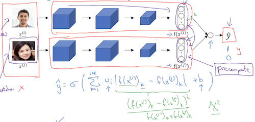
它其实是两个神经网络的叠加，前一个NN训练从图片到128参数的映射关系，后一个NN训练两个128参数的比较，在后一个网络中，绝对值的部分也可以定义成其它形式，如绿色的X平方公式。

这么训练出的网络，可以事先对员工照片执行一遍NN运算，缓存他们的128特征向量，这样以后需要识别门口的人脸时，只需要对该人脸执行一次NN运算即可。极大地降低了每次识别的运算成本。

论文参见[《deepface closing the gap to human level performance》](https://www.cs.toronto.edu/~ranzato/publications/taigman_cvpr14.pdf)

# 4.6 什么是神经风格转换？
风格转换就是将内容图片和风格图片合成一张图片，取前者的内容和后者的画风：
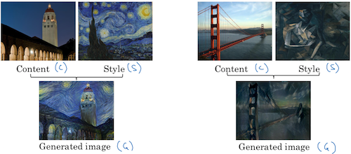

# 4.7 深度卷积网络在学什么？
这一节将神经网络各隐藏层的输出以可视化的形式展现出来，概念上理解更深入，但在细节上有个很大的疑惑。先说明白的部分吧。它遍历每一层，找到能将该层最大化激活的9张图片的片段，结果如下：
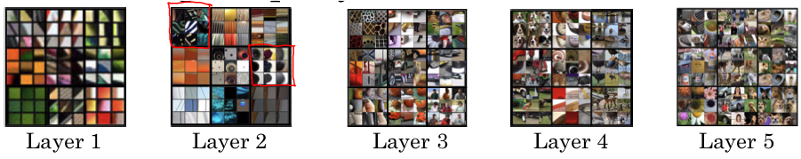
这张图清晰地解释了越浅层的隐藏层，识别的是越底层的图像特征，比如竖直边缘、水平边缘等；越深层的隐藏层，识别的是越高级的图像特征，比如第二层是圆、条纹等几何形状，第三层是网格、车轮；第四层第五层则是更完整的物体。因此待识别物体越复杂，需要越深的神经网络来识别。

但是什么是“将某一层最大化激活”，怎么找到这样的图片片段？这应该是论文[《visualizing and understanding convolutional networks》](https://cs.nyu.edu/~fergus/papers/zeilerECCV2014.pdf) 介绍的内容。在本节中并没有深入解释，我觉得将神经网络每一层可视化的方法很重要，因为它有助于加深对神经网络的直观理解。看来啃这篇论文是必须要做的事。

# 4.8 代价函数
风格转换代价函数的定义很容易理解：它是两部分的和，前者是与内容图片的内容偏差，后者是与风格图片的风格偏差，α和β是二者的权重：
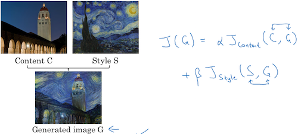
训练过程也非常直观，令G为合成图片，首先给G随机赋初值，利用梯度下降找到令成本函数最低的结果：
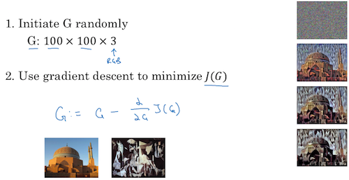

# 4.9 内容代价函数
结合神经网络可视化的内容，结果图片G和内容图片C如果在网络的浅层激活节点很相似，表明两张图在像素级上有很多共同点，比如水平、竖直边缘；如果二者在网络的深层激活节点上很相似，表明两张图在宏观物体上有很多共同点，比如都有狗或人。要令二者内容相似则需要在中间的隐藏层上让二者的激活节点距离最小，这就是内容代价函数要做的工作。即
$J_{content} (C, G)=\frac{1}{2} ||a^{[l](C)} −a^{[l](G)}||^2$
其中$a^{[l](C)}  和a^{[l](G)}$  分别表示内容图片和合成图片在网络第l层的激活节点。

至于为什么是中间隐藏层，不能太浅也不能太深，这是论文[《A neural algorithm of artistic style》](https://arxiv.org/abs/1508.06576) 解释的问题。

# 4.10 风格损失函数
相比内容损失函数，风格损失函数更难理解一些。基于“不同层次的隐藏层能够识别不同层面上的图片特征”这一性质，风格还是要从隐藏层的激活节点来挖掘。本节将图片的风格定义为：第l层中各个通道之间激活项的相关系数，即同一层中不同通道同一个激活位置上激活点的相关性。

课件给出的直觉解释是这样的，假设红色通道和黄色通道对应图片中红色框和黄色框的内容，红色通道探测的是竖直条纹，黄色通道探测的是橙色色调。如果竖直条纹大多是橙色的，说明这两个通道有高度的相关性，否则就没有相关性。通道的相关性为图片风格的量化提供了一种手段。
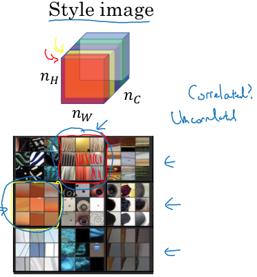
在得到风格图片的各通道相关性后，按照这种相关性要求去生成G图片。
我的疑惑是：假设S图片1、3、5通道高度相关，这种相关性只是一种必要条件吧？G图片是随机生成的，有可能也做到了1、3、5通道高度相关，但是相关内容却不同于S图片呢？比如G图片的1通道是水平条纹，3通道是绿色，而S图片的1通道是竖直条纹，3通道是橙色。

按照上面的概念，定义风格矩阵$G_{kk^′}^{[l]}$，表示第l层网络中k通道和k'通道之间的相关性，如果该层网络有$n_c^{[l]}$个通道，则该层风格矩阵有$n_c^{[l]} ×n_c^{[l]}$个元素。

有了风格矩阵对图片的风格做度量，风格损失函数的定义就比较好理解了——是S图和G图的风格矩阵的范数：
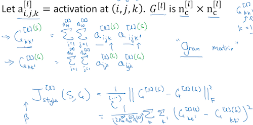
以上只是在某一层上计算风格损失，老师建议在每一层上都计算，能让风格迁移更完整，于是完整地风格损失函数是各层损失函数乘以各层权重λ之和，把最近几节的损失函数乘以权重相加就得到了最终的损失函数：
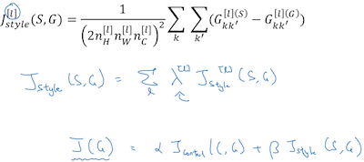

# 4.11 一维到三维推广
二维矩阵的卷积神经网络算法也可以应用到一维或三维。
本节举了心电图作为一维的例子，应用于一维数组的过滤器也是一个一维数组，卷积运算规则和二维的完全一样，只是过滤器只需要从左向右移动运算一遍。
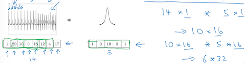
三维数组的运算也类似，只是由原来n_h×n_w×n_c扩展成了n_h×n_w×n_l×n_c：
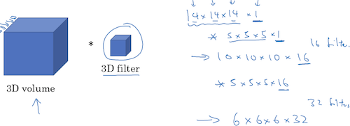
其实不管是几维数组，都可以看作是由数字组成的序列，只是组织的形式不同而已，运算的本质是一样的。