《序列模型》第一周《循环序列模型》。  

<!-- more -->
# 1.1 为什么选择序列模型？
本节简述了序列模型适用的范围：从一个序列到另一个序列的转换，比如语音识别、翻译；仅输入端或输出端是一个序列，比如从一段评价文字中判断评价的等级
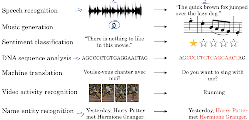

# 1.2 数学符号
以查找一段文本中的人名为例，在运算之前，将输入按照单词划分成单元，每个单元记作$x^{<t>}$
标注是在输入的基础上完成的，将人名单元标注为1，否则标注为0，每个标注单元记作$y^{<t>}$
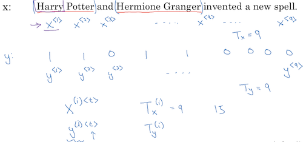
计算机在存储$x^{<t>}$ 时也不再保存具体的单词，而是先建立词典——对每个单词编号，再以one−hot的方式记录$x^{<t>}$在词典中的编号：
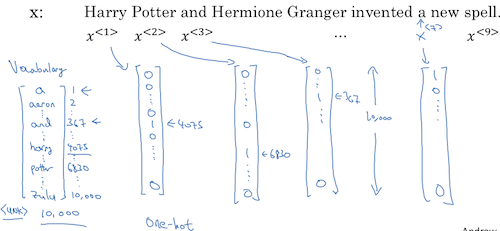

# 1.3 循环神经网络模型
还以给一个句子标注人名为例，如果使用常规的神经网络，结构如下：
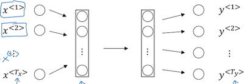
它有两个问题：

1. 神经网络的输入层节点个数是固定的，而每个句子的长度却是变化的，显然固定的NN网络无法适用于变化的句子。
2. 词和位置特征绑死在一起了，从一个位置学到的特征无法复用到另一个位置上，这和常规NN解决图像遇到的问题是类似的，图像识别卷积解决了该问题。

因此引入循环神经网络，模型如下：
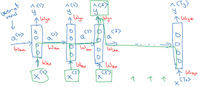
先看纵向，每一列是一个神经网络，输入一个单词，输出是否为人名；再看横向，又是一个神经网络，考虑了单词的先后顺序。纵向NN训练出一套参数，横向NN训练出另一套参数，这些参数不依赖纵向NN的个数，即不依赖一个句子的单词个数。
我不太确定对于模型解决第二个问题的理解是否正确：它通过一套参数训练单词在不同位置上的特征，而不像常规NN在不同位置对应不同的w参数。从而解决了复用的问题。但我总觉得有点不对劲，循环神经网络的模型看起来一样有和序列绑死的问题呀，也就是说Waa会记忆序列信息。

正向传播算法如下：
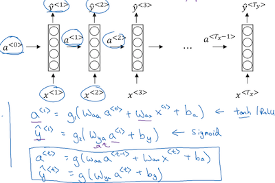
可以做一个简化，将Waa和Wax横向排列称为Wa，将$a^{<t−1>}$ 和$x^{<t>}$ 纵向排列称为$[a^{<t−1>},  x^{<t>}]$
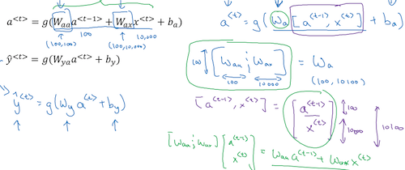

# 1.4 通过时间的反向传播
反向传播算法是基于正向传播和损失函数的，先来看损失函数。每一个节点的损失函数和常规NN定义是一样的，其中$y^{<t>}$  是标注值，用0/1表示该词是否为人名，$ŷ^{<t>}$是计算所得该词是否为人名的概率。总的损失函数是将这些分量相加：
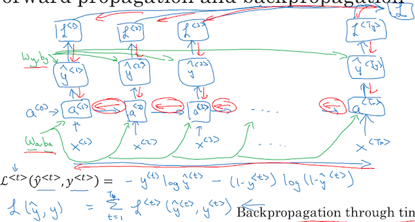
有了损失函数就可以逆向计算各个环节的偏导数，最终的目的是为了求Wa、ba、Wy、by的偏导，从而再执行梯度下降更新得到下一轮迭代的值。

# 1.5 不同类型的循环神经网络
本周课程开始提到过，大部分循环神经网络要解决的问题都不是输入输出个数相等且一一对应的，比如翻译、语义分析等，本节主要介绍循环神经网络的几个变型。
首先是多对一——多个输入，一个输出。根据一段评论的文字，分析它对应的评分就属于类应用。他的RNN结构如下，仅在最后一个单元有输出：
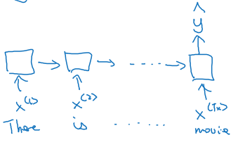
下面是一个一对多的RNN，输入可能只有一个元素，或者没有，输出是一段乐谱。和常规RNN稍有不同在于它每个单元的输出都作为下一个单元的输入：
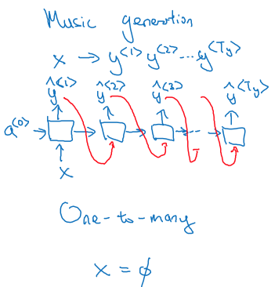
下面是多对多的RNN模型，翻译是这类的典型应用，他的输入和输出的节点个数没有关系。输入部分作为编码器是一个RNN网络，输出部分作为解码器是另一个RNN网络：
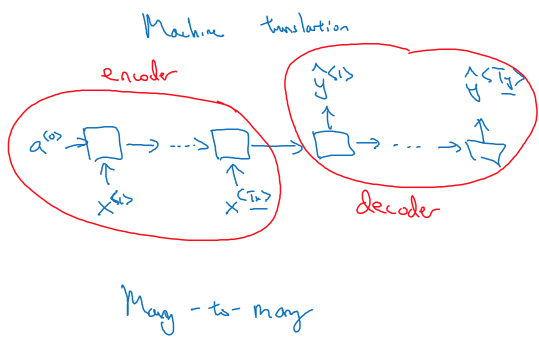

# 1.6 语言模型和序列生成
语音识别系统通常要配合语言模型才能输出比较靠谱的候选，前者根据输入语音生成与之匹配的单词序列，后者为每一个序列计算概率从而选择最可能的句子。RNN就可以用来生成语言模型。语言模型的输出就是一个单词序列出现的概率：
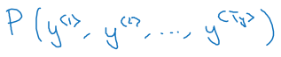
为语言模型生成RNN的步骤如下：  
1、将语料库中每一个句子的每个单词转成one-hot矩阵，并加入结尾标记，对于字典中没有的单词，给他一个特殊标记<UNK>：
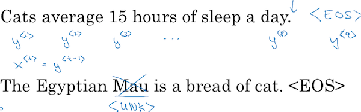
2、对语料库中每个样本训练如下网络：
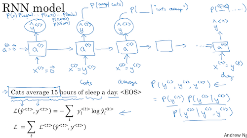
该网络每个单元的输入是当前第i个单词，输出则是在前面输入序列的情况下，各个单词出现的概率。比如y^1 表示没有任何输入时，P(a)、P(anron)、……、P(\<UNK\>)、P(\<EOS\>)的概率，这是一个向量；y^2表示当输入Cats时，P(a)、P(anron)、……、P(\<UNK\>)、P(\<EOS\>)的概率，即P(a|Cats)、P(anron|Cats)、……、P(\<UNK\>|Cats)、P(\<EOS\>|Cats)的概率。以此类推。

定义每个单元的损失函数，将它们加和即为总算是函数。

# 1.7 对新序列采样
本节介绍如何看一个训练完成的RNN都学到了什么，本节的方法似乎只能用来做写作机器人，除此之外我想不到还能用来做什么，不清楚这个采样还有哪些用途。

方法很简单，就是在什么也不输入的情况下看，在RNN第一单元的输出中随机选择一个单词，作为下一单元的输入，再在下一单元的输出中随机选择一个单词，持续操作直至结束。

网络结构很简单，当然每个单元的输出可以是单词，也可以是字母，这取决于在训练的时候的输入输出粒度。本节貌似只讲了以单词为字典的RNN的优点：天然保证了不会输出一个无意义的单词；更容易捕捉单词与单词之间的上下文关系；计算成本比较低。**我的直观感受，以字母为字典的RNN似乎在自然语言处理中不是个好的做法，毕竟语言是基于单词而不是字母的。**
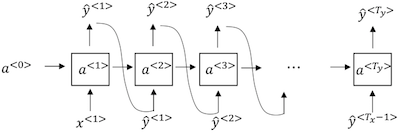

# 1.8 带有神经网络的梯度消失
本节介绍了常规RNN的一个缺陷——梯度消失，以自然语言处理为例，当网络层次较深时它，网络很难学到距离比较远的两个节点之间的关系，比如一个长句主语是单数或复数，会影响到谓语was或were的形式，当网络较深时，很难学到这种关系。
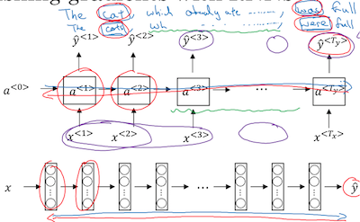
本节仅介绍了梯度消失的情况，具体怎么解决需要继续往下学习。

# 1.9 GRU（Gated Recurrent Unit）门控单元
本节是我学过的最难理解的一节课。先简单地描述下我的理解：为了解决深层网络会丢失相隔较远单元之间的相关性，本节引入了记忆单元，相当于给每一个单元的输出再增加一个向量，用来记忆它到远端单元的相关性，这个记忆单元本身也是需要学习的，而且它的表示形式非常复杂，这导致了该方法不好理解。
本节有两篇相关的论文：[《On the properties of neural machine translation: Encoder-decoder approaches》](https://arxiv.org/abs/1409.1259) 和[《Empirical Evaluation of Gated Recurrent Neural Networks on Sequence Modeling》](https://arxiv.org/abs/1412.3555)。

接下来我尝试着理解一下这个算法。先看右下角，GRU为每个RNN单元引入一个记忆细胞$c^{<t>}$ 和记忆门$Γ_u$
记忆细胞$c^{<t>}$ 用来记录当前单元和前一个单元的相关度，记忆门$Γ_u$ 用来调整相关度的权重。$Γ_u$ 越接近0，表明本层记忆细胞越倾向于直接沿用上一个单元的记忆细胞；越接近1，表明越倾向于使用上一层记忆细胞和本层输入的调和值$\tilde{c}^{<t>}$
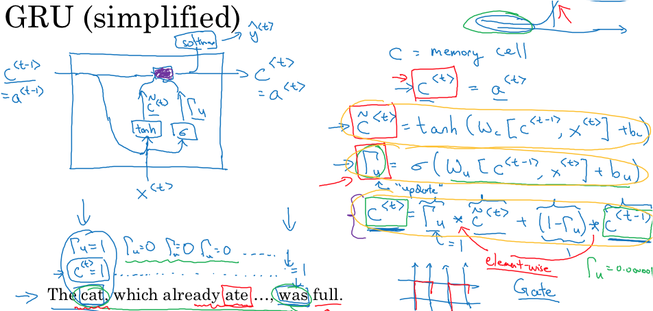
到这里就已经够复杂了，但这还只是GRU的简化版本，常规版本还要在调和值$\tilde{c}^{<t>}$ 的运算中再加入一个相关系数$Γ_r$
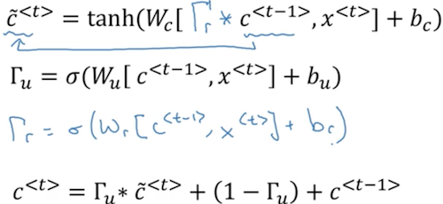
惊叹于这么复杂的公式，数学家们是怎么知道为这些矩阵添加什么参数，七搞八搞就搞出一个可以拟合现实的算式！

# 1.10 长短期记忆（LSTM）
长短期记忆的论文是[《Long short-term memory》](http://www.bioinf.jku.at/publications/older/2604.pdf) 它是在GRU的基础上演化出来的。理解了GRU之后，向LSTM的演化就不是很难理解了。GRU通过一个门$Γ_u$ 来控制使用前一个记忆单元还是使用调和值，这两个选择是此消彼长的；而LSTM的思路是用两个门分别控制二者的权重，它认为记忆和忘却不是此消彼长的关系，因此它使用记忆门$Γ_u$ 和忘却门$Γ_f$ 分别控制$\tilde{c}^{<t>}$ 和$c^{<t−1>}$ 的权重，最后再用一个输出门$Γ_o$ 控制总权重。
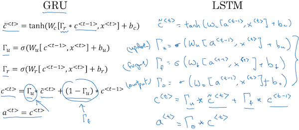
逻辑还是挺清晰的，而且从公式上更简洁地反映了这个逻辑，课件配的图示反而有些复杂，这里就不看了。

GRU和LSTM的思想都是为不同的单元之间牵了一根线，并且通过学习来决定线的长短，这让我想起前面课程里讲的残差网络，我感觉二者有着同样的目的。

# 1.11 双向序列神经网络BRNN
常规RNN有一个缺陷，就是每一个单元的输出仅依赖前一个单元。本节举的例子：  
He said, "Teddy bears are on sale!"  
He said, "Teddy Roosevelt was a great President!"  
这两句话中Teddy是不是一个人名，仅从前面的单词无法判断，还需要看后面的单词是什么。这种情况就需要双向序列神经网络BRNN来解决了。

BRNN的结构图如下：
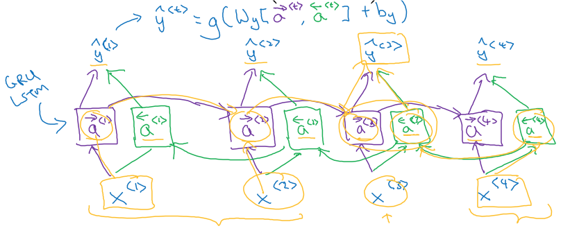
在每个单元不仅放置了正向激活节点，也放置一个反向激活节点。在执行正向传播算法时，需要沿着正方向计算到末节点，再反方向计算到初节点，得出两个方向的a，再执行反向传播。

还记得正向的a是由前一个a和x计算出来的：
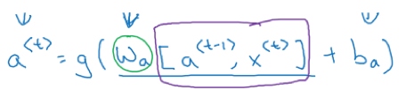
反向的a也需要由前一个a和x计算出来，这就意味着无论是在训练还是在预测时，都要求所有节点都就绪了才能开始运算。因此这种算法无法满足边说边出词的语音输入，必须等一句话说完了才能开始运算。

# 1.12 深层循环神经网络
下面是一个常见的深层RNN结构图，在每个单元分别是一个多层的神经网络，这些层次的横向和纵向连成一张计算网。如果应用在NLP上，其运算负荷可想而知，通常这样的网络在网状的部分最多也就三层，在根深的层次上就不再横向连接了。
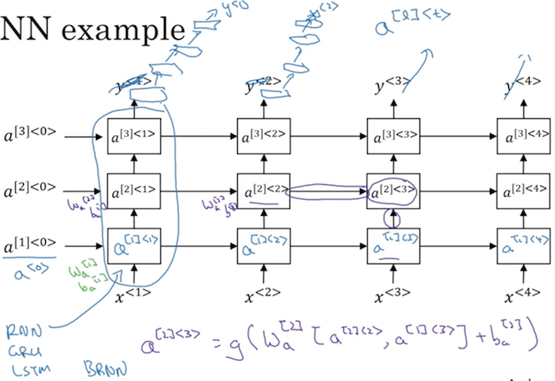
在每个单元以及横向关系上，他们可以是GRU、LSTM或者BRNN。
