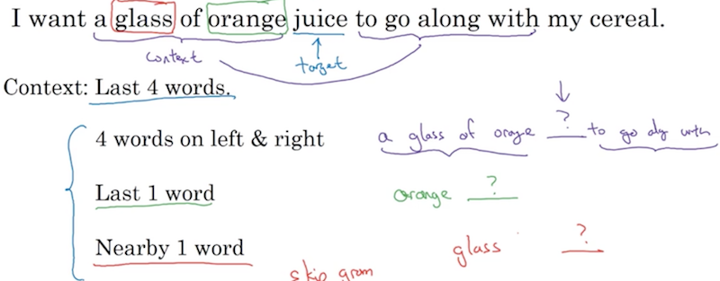

《序列模型》第二周《自然语言处理与词嵌入》。  

<!-- more -->

# 2.1 词汇表征
之前的课程中都是采用one-hot的方式来表示一个词，在这种表示法下，假设词典共10000个单词，每个单词就是一个10000维的稀疏向量，词与词之间是正交的，因此每个词之间是孤立、没有关系的。这使得算法的泛化能力不强。课件中举的例子是：  
I want a glass of orange ________.  
模型可能学会了将空白处填为juice，但是如果题目改为：  
I want a glass of apple ______.  
这对于模型来说就变成了另一道完全不相关的题目了，而实际上苹果和桔子有高度的相关性，应该考虑利把两个单词向量中的稀疏部分利用起来，以体现出两个单词的相关性。

按照不同的维度将每个单词重新编码，每个向量表示该单词在该维度上的得分，如下：

这就将原先稀疏向量的one-hot表示法修改成不同维度属性的向量表示，这就是词汇的词嵌入法。这种方法使得词的ID直接体现出其属性，因此也就能体现出词与词之间的关系，可以使模型有更好的泛化能力。

课件中提到的数据可视化的论文是[《visualizing data using t-sne》](http://www.jmlr.org/papers/volume9/vandermaaten08a/vandermaaten08a.pdf)

# 2.2 使用词嵌入
本节介绍了使用词嵌入后RNN的效果：

如果训练集中有Sally Johnson is an orange farmer.
当预测Robert Lin is an apple farmer.时，由于apple farmer和orange farmer词性接近，模型就知道Robert Lin也是人名了。

本节给出了用词嵌入做迁移学习的步骤：  
1、先从大量文本集中学习词嵌入  
2、把这些词嵌入模型迁移到新的只有少量标注训练集的任务中  
3、可选操作：在新数据上继续优化词嵌入模型，通常只有在第2步的训练数据量比较大时才会这么做  

本节最后提到，词嵌入和前面讲到的人脸识别中的人脸编码是非常类似的。所谓嵌入和编码只是同一个过程的不同表述。两个应用场景的差异在于人脸编码的操作对象是个开放集——要对从来没见过的人脸做识别；而词嵌入则是在一个封闭的词典集合内对所有词做一个N维编码。

# 2.3 词嵌入的特征
本节介绍了词嵌入的一点很牛逼的特性——类比推理。如下图，向量man和womwan的差非常接近于向量king和queen的差，

这个特性使得在有Man对Woman的句子中，可以类比推理替换成King对Queen。这篇论文是[《linguistic regularities in continuous space word representations》](https://www.aclweb.org/anthology/N13-1090)

两个词向量相似的直观理解可以用一张二维图来表示，queen对king和woman对man只是沿着某一个方向做了平移，于是当已知man、woman和king的时候，只需要找到和king组成的夹角与woman和man最接近的点即可。不过这个解释有点极端理想，因为词嵌入的向量通常在上百维，投影到二维平面后就损失了很多信息，很难保证它们在与投影平面平行的角度还能保持上面的性质。

回到算法思想上来，我们要找到的就是与king-man+woman相似度最大的词向量，sim称为相似度函数。

相似度函数sim可以有多种计算方式，其中一种称为余弦相似度函数，公式如下：

之所以称为余弦相似度是因为两个向量的角度越小，值越大，越垂直，值越小。这和余弦的性质非常相似。

# 2.4 嵌入矩阵
本节介绍了单词词嵌入向量的求解思路。令单词i的one-hot向量为$O_i$，词嵌入向量为$e_i$，如果词嵌入向量是300维，词典是10000维，那么只需要求解一个300×10000维的嵌入矩阵E使得  
$E·O_i = e_i$  
可以用机器学习的方法求得E，具体方法将在下一节介绍。

# 2.5 学习词嵌入
训练一个语言模型是学习词嵌入的好方法。如下假设我们有一批训练语料，填空处是标注内容，神经网络的输入是句子的单词O序列，输出是填空单词。O序列经过与嵌入矩阵相乘得到e序列，再继续向下一层传递，计算输出。

因此从o到e可以看做是语言模型神经网络的一层，于是学习词嵌入就成了学习语言模型的副产品。当然图中的网络只是个概念产品，因为神经网络输入节点的个数应该是固定的，所以实际操作中通常只取固定窗口的上下文。这个窗口大小就是学习词嵌入的超参数。

如果训练一个模型的目的是为了得到语言模型，则上下文只能取前文，因为语言模型的主要应用场景是预测，即输入前半部分，预测后半部分。所以训练只能取前文。

但是如果训练的目的是为了学习词嵌入，上下文的范围就可以更自由了，既可以取前文，也可以取后文，还可以取最近的一个实体词。即课件中蓝色大括号括住的部分：

# 2.6 Word2Vec
Word2Vec的论文在[《efficient estimation of word representations in vector space》](https://arxiv.org/abs/1301.3781)
算法思想和上一节讲的类似，在具体操作上做出了一些优化：  
1、随机选一个词作为上下文词。  
2、随机在一定词距之内选另一个词作为目标词，比如上下文词前后10个词以内。  
3、构造监督学习算法，给定上下文词，预测目标词。  

在构造神经网络时，课件中貌似只有一层运算，所以在计算成本函数时e的指数是$θ_e$，θ相当于w的作用，老师说这里省略了偏移，如果想加，也可以加上：

显然这个算法在计算成本函数时，分母的运算量非常大，因此可以引入一些改进措施，比如先把词典分两堆，先预测输出词属于哪一堆，通过这种递归二分的做法可以减少运算量：

最后在上下文词的采样上需要注意：不能使用均衡随机来取上下文词，因为很多虚词the is a of等，大部目标词都会在一定词距内和他们有关系，这就导致学出的嵌入词向量没有区分度了。应该避开这些高频词，以保持嵌入词向量的区分度。

# 2.7 负采样
本节介绍的方法论文是[《distributed representations of words and phrases and their compositionality》](https://papers.nips.cc/paper/5021-distributed-representations-of-words-and-phrases-and-their-compositionality.pdf)

具体操作步骤是：  
1、在训练集句子中随机选一个词作为上下文词Context，再随机在一定词距之内选另一个词Word，这和上一节介绍的方法一模一样，增加一个字段Target表示Context-Word是否在训练语料某个句子中选取，如果是为1。  
2、为同一个Context在字典里随机选取k个词Word，令Target 为0。其中k是个超参数，需要特别注意的是：即使Word碰巧也出现在了当前句子中，也仍然把Target标为0。如果训练集比较小，k可以稍微大一些比如[5,20]；如果训练集比较大，k应该小一些比如[2, 5]  
3、在网络的训练部分，我没有看明白，它是说将Context的O作为输入，乘以词嵌入矩阵E，得到词嵌入向量e，在经过softmax运算得到k+1个输出，分别对应正例和负例：  

我的问题是：  
1、我没有看到负例中t在网络的什么部分有所体现，他们怎么参与塑造网络呢？  
2、采样是只采这k+1个数据还是要采m*(k+1)？

# 2.8 GloVe词向量
GloVe的论文详见[《GloVe: Global Vectors for Word Representation》](https://nlp.stanford.edu/pubs/glove.pdf)
首先定义$X_{ij}$  
表示在所有语料中，单词i出现在单词j的上下文中的次数。对于“出现在上下文”的不同解释，$X_{ij}$  的值是不一样的，比如：
i出现在j的上下文 = i出现在j前后10个单词内，此时$X_{ij}=X_{ji}$
i出现在j的上下文 = i出现在j前1个单词，此时$X_{ij}≠X_{ji}$

如果词典是一个m维向量，则X_ij 是一个m×m的矩阵，采用梯度下降法求  
$minimize \sum_{i=1}^{10000}  \sum_{j=1}^{10000}  (θ_i^T e_j − logX_{ij})^2$  
的最小值，得到θ和e即为词向量的相关值，当然这个算式表达的是求解思想，完整的算式为：  
$minimize \sum_{i=1}^{10000}  \sum_{j=1}^{10000}  f(X_{ij})(θ_{i}^T e_j+b_i+b_j^′−logX_{ij})^2$  
其中f(X_ij)是一个权重函数，当logX_ij=0时，为避免括号内的算式为无穷小，令f(X_ij)=0，于是整体算式为0；
此外，对于this, is, of, a等常用词f()函数会适当降权；对于生僻词，f()函数会适当提权。
最终得到的θ和e是两个对称的数值，即若θ=a时e=b，则θ=b时e=a，因此定义词嵌入的最终值为：
$e_w^{final}   =\frac{e_w+θ_w}{2}$  

# 2.9 情绪分类
情绪分类要解决的问题是根据一段话，判断它表达的评分是多少。采用常规的神经网络结构如下：  

但是它的缺陷是对于否定或否定的否定，判断是不准确的。采用RNN结构如下：  

它考虑了单词的前后顺序，因此对于双重否定有更准确的判断。同时词嵌入可以有效地识别同义词，即使它们没有出现在训练样本中。

# 2.10 词嵌入除偏
本节除偏的意思是指性别、种族歧视，例如：  
Man : Computer Programmer as Woman : Homemaker  
Man : Doctor as Woman : Nurse  
老师认为这是种族歧视，应该被纠正。但我觉得这是训练集本身体现出的特征，在训练集中存在就说明它是现实的客观存在，在结果中把它“纠正”过来没有任何意义。显示不会因此改变。