《序列模型》第三周《序列模型和注意力机制》。  

<!-- more -->
# 3.1 基础模型
本节以翻译和为图片生成标题为例，他们都可以采用序列模型来解决。
翻译是序列模型应用的一个典型场景，其中前一段RNN称为编码网络，后一段称为解码网络：
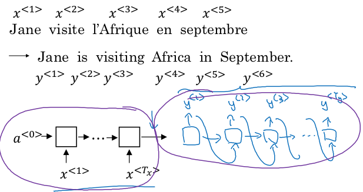
为图片生成标题和翻译就成了同一类问题，只不过翻译的输入是一串单词编码，而为图片生成标题的输入是图片的数据流：  
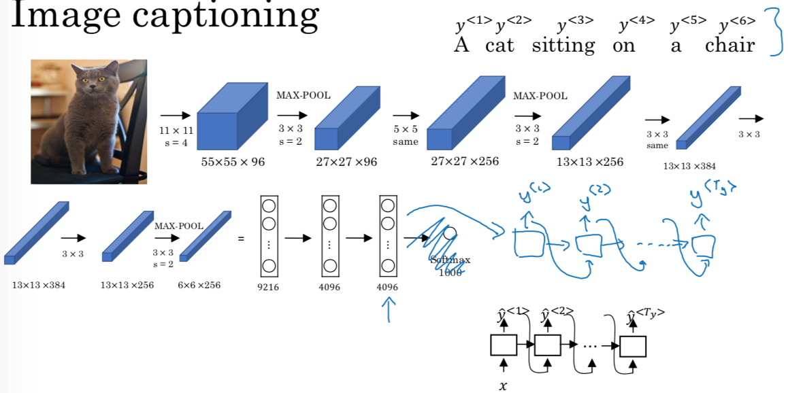
# 3.2 选择最可能的句子
本节第一部分比较了语言模型和机器翻译的网络结构：  
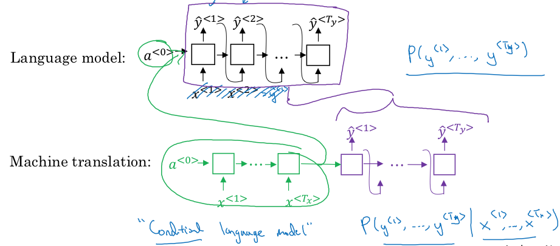
语言模型是用来回答一个句子出现的概率是多少；而机器翻译则是回答当给定一个单词序列后，它对应的句子出现的概率是多少。语言模型的网络输入为空，而机器翻译的网络输入为被翻译的句子。语言模型的网络结构和机器翻译的解码部分一模一样，因此机器翻译又称为条件语言模型。

机器翻译的RNN网络输出可能输出多个结果，我们希望取概率最大的句子作为最佳翻译：  
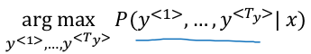
再选取策略上，本节后一半解释了为什么不能采用贪心算法
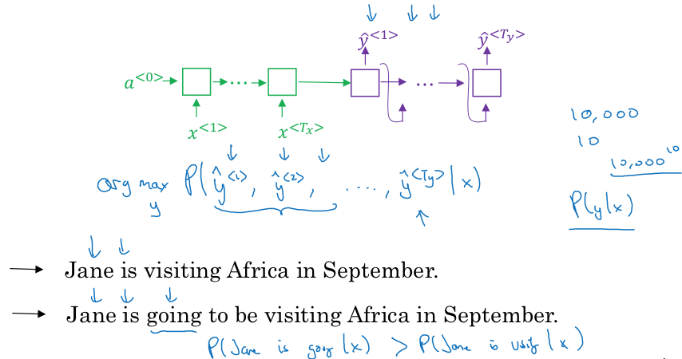
所谓贪心算法是指在每个输出节点ŷ^(<i>) 上都取最大值，最终结果是由这些最大值节点拼凑而成的句子。
这样得到的结果未必是最佳翻译，因为我们希望得到的是句子整体的概率值最大。比如在上例中，Jane is后面跟着going的概率要比visiting的概率更高，而显然第一条句子更简洁，是更好的翻译结果。

假如词典中单词的个数是10000，假设一个翻译网络的输出节点为10，要取得句子最大值，需要比较$10000^{10}$ 个句子的概率，这个计算成本显然不可接受。下一节将介绍解决的办法。

# 3.3. 集束搜索算法
为了解决贪心算法的剪枝操作可能导致全局最优解被过早减掉，本节引入集束搜索算法。思想很简单：始终缓存TopN的概率最大解，直到最后取这N个解中的最优解。当然这个最优解并不一定是完美解，它仍然有可能只是个局部最优。集束搜索算法只是增加了获得完美解的概率。N称为集束宽度。

按照上一节介绍的方法，在解码网络的第一个节点，它输出字典中每个元素出现的概率，取TopN个作为该节点的输出和下一个节点的输入。复制N个网络，
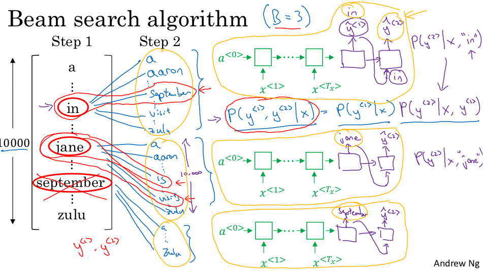
求解码网络的下一个节点，继续只取概率最高的TopN个网络，以此类推，直到完成整个翻译：
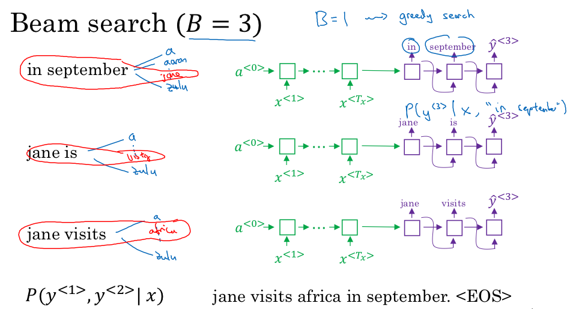
# 3.4 改进定向搜索
集束搜索是为了求得整句概率最大化的解，即使该概率最大化
$arg 　max \prod_{t=1}^{T_y} P(y^{<t>} |x, y^{<1>}, …, y^{<t−1>})$   
由于该算式中每一个因子都＜1，因此乘积结果过小，我们采用log求合来做个等效：
$arg 　max⁡ \prod_{t=1}^{T_y} log⁡ P(y^{<t>} |x, y^{<1>}, …, y^{<t−1>})$  
继续观察第一个求积算式，由于每个因子都＜1，这会导致该评价函数会倾向于字数较短的结果，因为字数越短，输出结果越少，因子就越少。为了弥补该不足，给该算式再除以翻译结果的单词数量：
$\frac{1}{T_y^α} \sum_{t=1}^{T_y} log⁡ P(y^{<t>} |x, y^{<1>}, …, y^{<t−1>})$   
以减少对输出长的结果的惩罚。其中α是个经验值，通常取0.7。
不过我有点不明白，结果越长，$\frac{1}{T_y^α}$ 不就越小吗？这显然加大了对输出长的结果的惩罚呀？

本节最后讨论选取集束宽度B的原则：显然B越大，结果越精确，但时空消耗也就越大，运算越慢；B越小，结果就可能越差，但时空消耗越小，运算越快；当B=1就退化到了贪心算法。通常在产品的实际研发中，取[10, 100]的一个数，在学术研究中为了榨取最好的结果，也会取到[1000, 3000]。

# 3.5 集束搜索的误差分析
集束搜索误差分析的目的是为了划分清楚误差主要是由RNN造成的还是集束算法造成的，从而可以对症下药进行改进。原理非常简单：假设待翻译的句子为x，人工翻译结果为y\*，算法翻译结果为ŷ，将该结果代入RNN网络，计算P(y\*|x)和P(ŷ|x)：
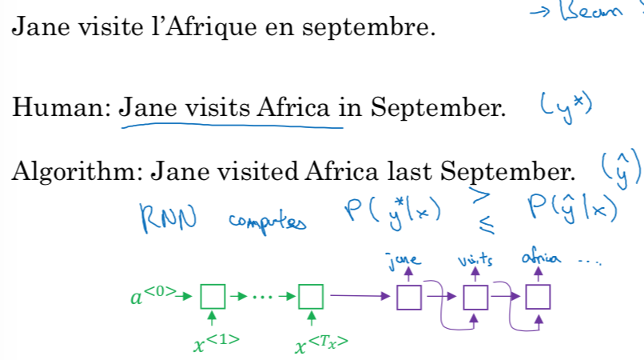
如果P(y\*|x)>P(ŷ|x)，说明RNN的计算结果是正确的，问题出现在集束搜索，标记为Fault(B)
如果P(y\*|x)≤P(ŷ|x)，说明问题出现在RNN，标记为Fault(R)

于是可以对开发集中的错误结果随机选取若干条，统计Fault(B)和Fault(R)的个数，哪个大，说明就应该优先改进哪个环节。

# 3.6 Bleu得分（选修）

# 3.7 注意力模型和直观理解
对于时下比较流行的同声传译，机器需要一边接收输入，一边完成局部翻译。常规的RNN不足以很好地解决这类问题。此外如果待翻译的句子很长，RNN的表现也不是很好，它不擅长记忆过长的上下文。针对这类问题引入了注意力模型，本节给出注意力模型的直观理解。注意力模型论文参见[《Neural machine translation by jointly learning to align and translate》](https://arxiv.org/abs/1409.0473)。

注意力模型的原理很简单，常规的双向RNN解决翻译问题，如黑色部分的网络所示。注意力模型是在该网络的基础上再引入一个RNN网络，在原网络中设置一个滑动窗口用来覆盖N个节点的输出$（ŷ^{<1>} 、ŷ^{<2>} 、ŷ^{<3>}...）$，新网络的每一个节点接纳滑动窗口内的输出作为输入，窗口从左向右滑动，从而产生新网络的节点，直至输出为\<EOS\>   
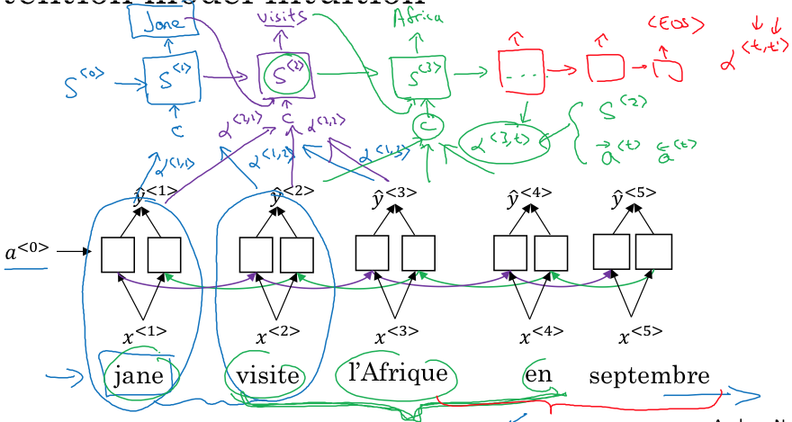
由于在窗口内不同位置的节点起到的作用可能不同，因此我们给每个节点赋予不同的权重：$(α^{<1, 1>}, α^{<1, 2>}, α^{<1,  3>}, ), (α^{<2, 1>}, α^{<2,2>}, α^{<2, 3>}, ),…$  

注意力模型是将注意力集中在句子的一定范围内，建立局部的RNN网络，逐步向后推移完成全局解。避免了一次性记忆过长输入导致的记忆力衰退。

我的疑问是：如果它是基于双向RNN，就必须将整个句子读入后才能滑动窗口，这似乎并不能具备一边输入一边输出的能力吧？

# 3.8 注意力模型
本节给出了注意力模型中规范的符号化表示，以及量化细节。
1、对于原双向RNN部分，两个方向的特征值合记作$a^{<t′>}  = (\overrightarrow{a}^{<t′>}  ,\overleftarrow{a}^{<t′>} )$  
2、令$y^{<t>}$ 需要关注临近t'范围内的双向RNN特征值，则给每个特征值赋予权重$α^{<t, t^′>}$，于是$\sum_{t′} α^{<t, t^′>}=1$  
3、第t个节点的输出y^(<t>) 是由双向RNN临近t'个输出乘以权重作之和C为输入，$C^{<t>}=\sum_{t′} α^{<t, t′>} a^{t′}$   
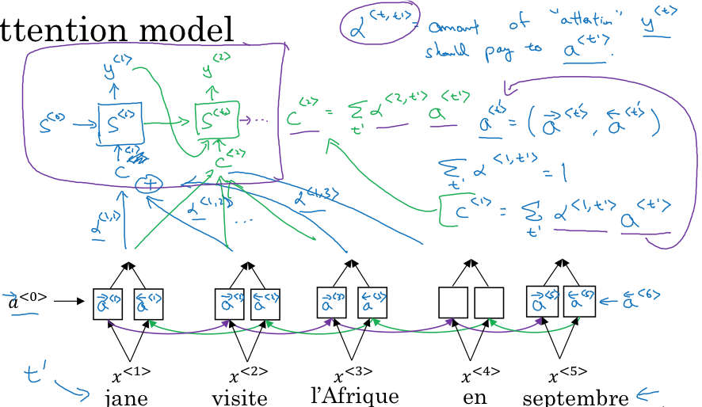
4、关于$α^{<t, t^′>}$ 的计算，是我并不是很理解的地方。$e^{<t, t^′>}$ 是原双向RNN中，在计算$ŷ^{<t>}$ 时t′ 的权重，那么它应该只和$a^{<t′>}$ 有关，为什么还和$s^{<t−1>}$ 有关呢？  
计算e的小型神经网络的成本函数怎么设定呢？  
通过$e^{<t, t^′>}$ 计算$α^{<t, t^′>}$ 的softmax过程是比较容易理解的。
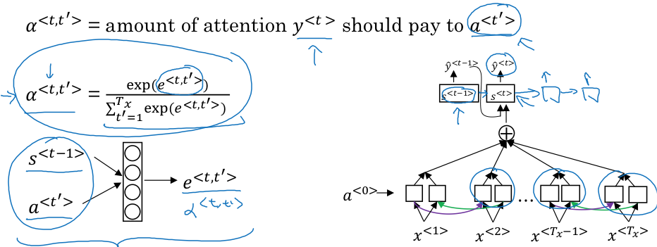
# 3.9 语音辨识
采用注意力模型来解决语音识别的网络结构很容易理解：
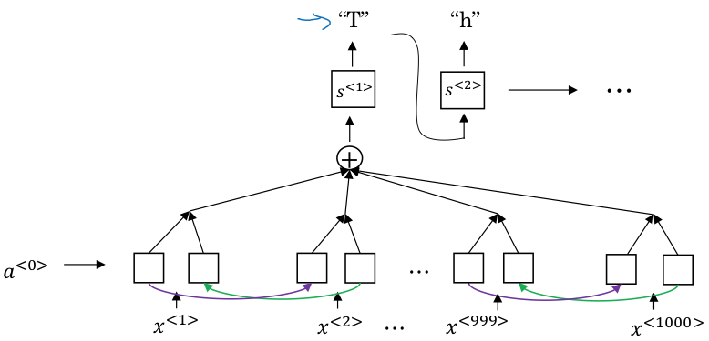
本节还给出了另一种思路——[《Connectionist Temporal Classification: Labeling unsegmented sequence data with recurrent neural networks》](http://citeseerx.ist.psu.edu/viewdoc/download?doi=10.1.1.75.6306&rep=rep1&type=pdf)
它的要点在于：它采用了常规的RNN网络，假设一段音频有10秒，每10毫秒有一个采样，那么总共1000个采样，输出显然不会有1000个单词，在标注时，可以将每一个字符重复填充到它所在单词的输出节点上：
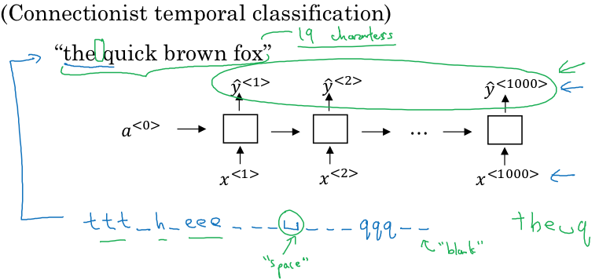
于是，该网络计算出的翻译结果，只需要将重叠的字符合并起来，就成为了正常的句子。

# 3.10 触发字检测
触发字检测是现在很多智能音箱都有的功能，在输入指令前，需要先喊一声：“OK Google”，以便唤醒音响。唤醒的这一嗓子就是触发字检测。
在训练方法上，假设标蓝的声波是触发字，那么在对应输出节点上，需要将触发字完成之前的节点标注为0，完成时的那个节点标注为1。
这么做有一个缺陷，就是样本中的0远大于1，一个弥补的办法是把触发字完成后的若干个节点都标注为1：
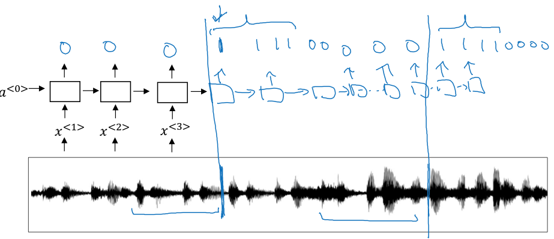

# 3.11 结论和致谢