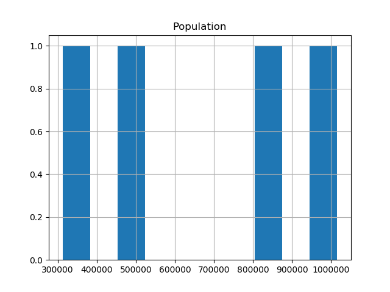

# 基本概念
pandas中的主要数据结构被实现为以下两类：

- DataFrame，可以将它想象成一个关系型数据表格，其中包含多个行和已命名的列。
- Series，它是单一列。

DataFrame 中包含一个或多个 Series，每个 Series 均有一个名称。

<!-- more -->

## 构造Series和DataFrame
``` python
import pandas as pd

def tc1(self):
    ''' 构造数据 '''
    city_names = pd.Series(['San Francisco', 'San Jose', 'Sacramento'])
    population = pd.Series([852469, 1015785, 485199, 312342])

    df = pd.DataFrame({ 'City name': city_names, 'Population': population })
    logging.info(df)
```
如果 Series 在长度上不一致，系统会用特殊的 NA/NaN 值填充缺失的值。上例的输出为：
```
    City name       Population
0  San Francisco      852469
1       San Jose     1015785
2     Sacramento      485199
3            NaN      312342
```
## 从文件中加载数据
``` python
import pandas as pd

def tc2(self):
    ''' 从文件中加载数据 '''
    city_names = pd.Series(['San Francisco', 'San Jose', 'Sacramento'])
    population = pd.Series([852469, 1015785, 485199, 312342])

    df = pd.DataFrame({ 'City name': city_names, 'Population': population })
    df.to_csv('temp.csv', sep=',', index=0) # 不保留索引列
    df2 = pd.read_csv('temp.csv', sep=',')
    logging.info(df2)
```

## 统计
``` python
import pandas as pd

def tc3(self):
    ''' 统计数据 '''
    city_names = pd.Series(['San Francisco', 'San Jose', 'Sacramento'])
    population = pd.Series([852469, 1015785, 485199, 312342])

    df = pd.DataFrame({ 'City name': city_names, 'Population': population })
    logging.info(df.describe()) # 统计数据
    logging.info(df.head())     # 前几行数据
```
它的输出为：
```
Population
count  4.000000e+00 # 记录的条数
mean   6.664488e+05 # 平均值
std    3.239765e+05 # 标准差
min    3.123420e+05 # 最小值
25%    4.419848e+05 # 四分位数
50%    6.688340e+05 # 二分位数
75%    8.932980e+05 # 75%分位数
max    1.015785e+06 # 最大值

City name  Population
0  San Francisco      852469
1       San Jose     1015785
2     Sacramento      485199
3            NaN      312342
```
## 画直方图
``` python
import pandas as pd
import matplotlib
import matplotlib.pyplot as plt

def tc4(self):
    ''' 画出直方图 '''
    city_names = pd.Series(['San Francisco', 'San Jose', 'Sacramento'])
    population = pd.Series([852469, 1015785, 485199, 312342])

    df = pd.DataFrame({ 'City name': city_names, 'Population': population })
    df.hist()
    plt.show()
```
显示直方图为：


# 访问数据
``` python
import pandas as pd

def tc7(self):
    city_names = pd.Series(['San Francisco', 'San Jose', 'Sacramento'])
    population = pd.Series([852469, 1015785, 485199, 312342])
    df = pd.DataFrame({ 'City name': city_names, 'Population': population })
    logging.info(df['City name'])       # 访问一列
    logging.info(df['City name'][1])    # 访问指定列的指定行
    logging.info(df[0:2])               # 访问前2行
```
输出为：
```
18:06 0088 INFO     
0    San Francisco
1         San Jose
2       Sacramento
3              NaN
Name: City name, dtype: object

18:06 0089 INFO     San Jose

18:06 0090 INFO            
City name  Population
0  San Francisco      852469
1       San Jose     1015785
```

# 控制数据
可以对一列直接执行算术运算和逻辑运算：
``` python
import pandas as pd

def tc8(self):
    city_names = pd.Series(['San Francisco', 'San Jose', 'Sacramento'])
    population = pd.Series([852469, 1015785, 485199, 312342])
    df = pd.DataFrame({ 'City name': city_names, 'Population': population })
    logging.info(population/1000)   # 将整列除以1000
    logging.info(population.apply(lambda val: val > 1000000)) # 返回该列是否大于100万
```
它的输出为：
```
18:11 0096 INFO     
0     852.469
1    1015.785
2     485.199
3     312.342
dtype: float64

18:11 0097 INFO     
0    False
1     True
2    False
3    False
dtype: bool
```

可以对DataFrame直接插入列：
``` python
import pandas as pd

def tc9(self):
    ''' 控制数据：插入列 '''
    city_names = pd.Series(['San Francisco', 'San Jose', 'Sacramento'])
    population = pd.Series([852469, 1015785, 485199, 312342])
    df = pd.DataFrame({ 'City name': city_names, 'Population': population })
    df['Area square miles'] = pd.Series([46.87, 176.53, 97.92]) # 插入面积字段
    df['Population density'] = df['Population'] / df['Area square miles']   # 插入单位面积人口字段
    logging.info(df)
```
它的输出为：
```
18:16 0108 INFO            
        City name  Population  Area square miles  Population density
0  San Francisco      852469              46.87        18187.945381
1       San Jose     1015785             176.53         5754.177760
2     Sacramento      485199              97.92         4955.055147
3            NaN      312342                NaN                 NaN
.
```

# 索引
Series和DataFrame对象均定义了index属性，该属性会向每行记录赋一个整型id。调用`.reindex`可以手动重新为各行定义index：
``` python
import pandas as pd

def tc10(self):
    ''' 索引 '''
    city_names = pd.Series(['San Francisco', 'San Jose', 'Sacramento'])
    population = pd.Series([852469, 1015785, 485199, 312342])
    df = pd.DataFrame({ 'City name': city_names, 'Population': population })
    logging.info(df)
    logging.info(df.reindex([2, 1, 0, 3]))
```
它的输出为：
```
20:08 0115 INFO            
        City name  Population
0  San Francisco      852469
1       San Jose     1015785
2     Sacramento      485199
3            NaN      312342

20:08 0116 INFO            
        City name  Population
2     Sacramento      485199
1       San Jose     1015785
0  San Francisco      852469
3            NaN      312342
```


# 参考
[十分钟搞定 pandas](https://apachecn.github.io/pandas-doc-zh/10min.html)  
[pandas: powerful Python data analysis toolkit](http://pandas.pydata.org/pandas-docs/stable/index.html)
[](https://github.com/apachecn)
[Pandas 简介](https://colab.research.google.com/notebooks/mlcc/intro_to_pandas.ipynb?hl=zh-cn#scrollTo=TIFJ83ZTBctl)