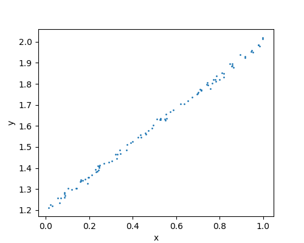

上了这么多节课，当自己动手使用TensorFlow写机器学习的代码时，还是觉得有点晕，经常在一个点上要琢磨半天。实在是机器学习的思想和传统的编程方式差别太大了，需要不断地训练，并在思想和代码间去做磨合，才能达到自然过渡。本节就从一个最简单的Tensorflow代码来理解它和背后梯度下降之间的关系。  
<!-- more -->

# 题目
给定若干个(x, y)的散点，它们大致符合`y = w·x + b`的关系，但是会在上下浮动，通过梯度下降求出w和b的值。

# 生成数据
``` python
import numpy as np
import tensorflow as tf
import matplotlib.pyplot as plt

def createData(self, m=100, D=1):
    ''' 
    m 样本数
    D 每个样本的维度
    构造训练数据 y = 0.8x + 1.2 ± epsilon
    '''
    epsilon = 0.01
    X = np.float32(np.random.rand(m, D))    
    Y = np.dot(0.8, X) + 1.2 + np.random.randn(m, D) * epsilon
    return X.T, Y.T
```
X是生成了m个D维随机数，需要注意的是：`np.random.rand(...)`生成的随机数是`float64`，而在随后通过`tf.random_uniform(...)`生成的是`float32`，二者不能直接运算，因此这里做了一个强制转换。X为m×D，为m×1，在返回时需要做转置：  
$X=\begin{bmatrix}\mid&\mid&&\mid\\x^{(1)}&x^{(2)}&\cdots&x^{(m)}\\ \mid&\mid&&\mid\end{bmatrix} , Y=[y^{(1)} y^{(2)} ... y^{(m)}] \;$ 

把数据显示在坐标系中，
``` python
def tc1(self):
    ''' 在图表中显示数据 '''
    X, Y = self.createData()

    plt.ylabel('y')
    plt.xlabel('x')
    plt.scatter(X, Y, s=1, cmap=plt.cm.Spectral)
    plt.show()
```
展现如下：  


# 解题
``` python
def tc2(self):
    m = 100 # 样本数
    D = 1   # 每个样本的维度
    xData, yData = self.createData(m=m, D=D)

    # 构造线性模型 y = W·x + b
    b = tf.Variable(tf.zeros([1]))
    W = tf.Variable(tf.random_uniform([1, D], minval=-1.0, maxval=1.0, dtype=tf.float32))
    y = tf.matmul(W, xData) + b

    # 定义损失函数：最小化方差 loss = ∑(y-ŷ)²
    loss = tf.reduce_mean(tf.square(y - yData))
    optimizer = tf.train.GradientDescentOptimizer(0.5) # α=0.5
    train = optimizer.minimize(loss)

    with tf.Session() as sess:
        sess.run(tf.initialize_all_variables())
        for step in range(0, 101):
            sess.run(train)     # 执行梯度下降，训练模型
            if step % 20 == 0:
                evalW = sess.run(W)
                w = evalW[0][0]
                logging.info('03d: W = %.2f, b = %.2f' % (step, w, sess.run(b)))
```
最核心需要琢磨的代码是第20行`sess.run(train)`，它执行的是`train = optimizer.minimize(loss)`。根据[《DeepLearning.ai笔记（一）》](http://localhost:4000/2018/03/11/2018/0311DeepLearningAI02/#逻辑回归中的梯度下降法)中的理论，它执行了两步：

1. 正向传播算法：根据W和b的当前值，将X代入损失函数，求L
2. 反向传播算法：求$dW=\frac{dL}{dW}和db=\frac{dL}{db}$，并代入  
$W:=W-α·dW和b:=b-α·db$更新这两个值

执行的结果为：
```
13:46 0105 INFO     000: W = 0.26, b = 2.07
13:46 0105 INFO     020: W = 0.60, b = 1.31
13:46 0105 INFO     040: W = 0.75, b = 1.23
13:46 0105 INFO     060: W = 0.78, b = 1.21
13:46 0105 INFO     080: W = 0.79, b = 1.20
13:46 0105 INFO     100: W = 0.80, b = 1.20
```
# 验证精度
如果只是为了算出W和b的值，就可以就此打住了，而通常还需要根据开发集或测试集验证模型的精度，因此需要把训练代码稍作修改：
``` python
def tcMain(self):
    m = 100 # 样本数
    D = 1   # 每个样本的维度
    xTrain, yTrain = self.createData(m=m, D=D)

    # 构造线性模型 y = W·x + b
    x = tf.placeholder("float", [1, None])
    y = tf.placeholder("float", [1, None])
    b = tf.Variable(tf.zeros([1]))
    W = tf.Variable(tf.random_uniform([1, D], minval=-1.0, maxval=1.0, dtype=tf.float32))
    yHat = tf.matmul(W, x) + b

    # 定义损失函数：最小化方差 loss = ∑(y-ŷ)²
    loss = tf.reduce_mean(tf.square(yHat - y))
    optimizer = tf.train.GradientDescentOptimizer(0.5) # α=0.5
    train = optimizer.minimize(loss)

    with tf.Session() as sess:
        sess.run(tf.initialize_all_variables())
        for step in range(0, 101):
            sess.run(train, feed_dict={x:xTrain, y:yTrain})     # 执行梯度下降，训练模型
            if step % 20 == 0:
                evalW = sess.run(W)
                w = evalW[0][0]
                logging.info('%03d: W = %.2f, b = %.2f' % (step, w, sess.run(b)))

        # 评估模型
        xDev, yDev = self.createData(m=10, D=D)
        correct_prediction = tf.reduce_mean(tf.abs(yHat - yDev)/yDev)
        accuracy = float(1 - sess.run(correct_prediction, feed_dict={x: xDev})) * 100.
        logging.info('accuracy=%.2f%%' % accuracy)
```
两段代码在构造模型时作了修改：前者直接将训练集代入模型公式，进入训练，这样就把模型和训练集绑死了。尔后在评估模型的时候，需要再次将开发集代入模型公式，为了提高复用性，上例将数据集改为占位符，在训练和验证的时候分别传入训练集和开发集。  
把精度公式定义为：$∑|(y-ŷ)/y|$。  
这段代码的输出为：
```
16:31 0107 INFO     000: W = 0.56, b = 2.04
16:31 0107 INFO     020: W = 0.65, b = 1.29
16:31 0107 INFO     040: W = 0.76, b = 1.22
16:31 0107 INFO     060: W = 0.79, b = 1.20
16:31 0107 INFO     080: W = 0.80, b = 1.20
16:31 0107 INFO     100: W = 0.80, b = 1.20
16:31 0114 INFO     accuracy=99.29%
```

# 总结
这段代码没什么实质用处，但是所有的机器学习代码大致都是这么个结构，当遇到费解的情况时，回过头来看看这段代码，能迅速找到理论和代码之间的桥。

本节代码可参见：  
[https://github.com/palanceli/MachineLearningSample/blob/master/TensorFlow/s01baseGD.py之LinearRegression](https://github.com/palanceli/MachineLearningSample/blob/master/TensorFlow/s01baseGD.py)