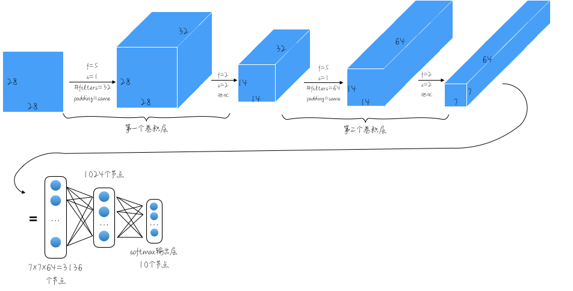
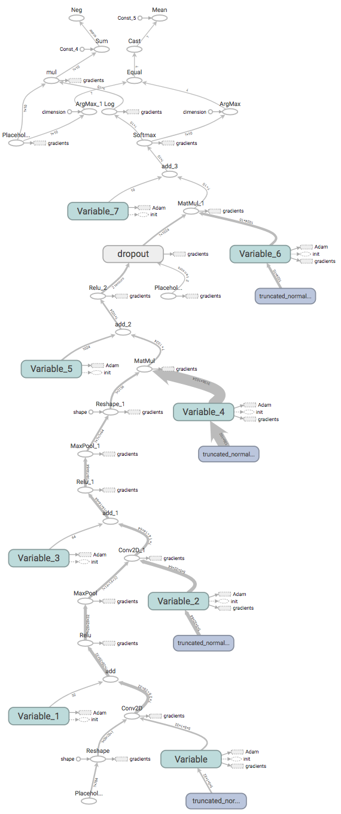

[Deep MNIST for Experts](https://www.tensorflow.org/versions/r1.1/get_started/mnist/pros#evaluate_the_model)是TensorFlow `Get Started`中HelloWorld级别的的例子。它分两个版本：`MNIST For ML Beginners`和`Deep MNIST for Experts`。前者采用没有隐藏层的梯度下降，结合上一篇笔记很容易看明白；后者使用了深度神经网络，本节重点分析它。   

<!-- more -->
# 代码
代码在框架上很简单，和上一节的例子相比，只不过多了几层运算的叠加，我将分析插入到代码注释中了：
``` python
def tcMain(self):
    mnist = self.loadData()
    sess = tf.InteractiveSession()

    x = tf.placeholder("float", shape=[None, 784]) # ?×784
    y_ = tf.placeholder("float", shape=[None, 10]) # ?×10
    # 第一层卷积：卷积核为5×5，通道数为1，共32个卷积核
    W_conv1 = self.weight_variable([5, 5, 1, 32])
    b_conv1 = self.bias_variable([32])

    # 为了用卷积层，把x变成一个4d向量，其第2、第3维为宽、高，最后一维为颜色通道数
    # (因为是灰度图所以这里的通道数为1，如果是rgb彩色图，则为3)。
    x_image = tf.reshape(x, [-1,28,28,1])
    # 构造本层运算
    h_conv1 = tf.nn.relu(self.conv2d(x_image, W_conv1) + b_conv1)
    h_pool1 = self.max_pool_2x2(h_conv1)

    # 第二层卷积
    W_conv2 = self.weight_variable([5, 5, 32, 64])
    b_conv2 = self.bias_variable([64])

    h_conv2 = tf.nn.relu(self.conv2d(h_pool1, W_conv2) + b_conv2)
    h_pool2 = self.max_pool_2x2(h_conv2)

    # 全连接层
    W_fc1 = self.weight_variable([7 * 7 * 64, 1024])
    b_fc1 = self.bias_variable([1024])

    h_pool2_flat = tf.reshape(h_pool2, [-1, 7*7*64])
    h_fc1 = tf.nn.relu(tf.matmul(h_pool2_flat, W_fc1) + b_fc1)

    # Dropout
    # 为了减少过拟合，在输出层之前加入dropout。用一个placeholder来代表一个神经元的
    # 输出在dropout中保持不变的概率。在训练过程中启用dropout，在测试过程中关闭dropout。
    # TensorFlow的tf.nn.dropout操作除了可以屏蔽神经元的输出外，还会自动处理神经元输
    # 出值的scale。所以用dropout的时候可以不用考虑scale。
    keep_prob = tf.placeholder("float")
    h_fc1_drop = tf.nn.dropout(h_fc1, keep_prob)

    # 输出层
    W_fc2 = self.weight_variable([1024, 10])
    b_fc2 = self.bias_variable([10])

    y_conv=tf.nn.softmax(tf.matmul(h_fc1_drop, W_fc2) + b_fc2)

    cross_entropy = -tf.reduce_sum(y_*tf.log(y_conv))
    train_step = tf.train.AdamOptimizer(1e-4).minimize(cross_entropy)
    correct_prediction = tf.equal(tf.argmax(y_conv,1), tf.argmax(y_,1))
    accuracy = tf.reduce_mean(tf.cast(correct_prediction, "float"))
    sess.run(tf.initialize_all_variables())

    train_writer = tf.summary.FileWriter('summary', sess.graph)  
    # 训练网络
    for i in range(2000):
        batch = mnist.train.next_batch(50)
        if i%100 == 0:
            train_accuracy = accuracy.eval(feed_dict={
                x:batch[0], y_: batch[1], keep_prob: 1.0})
            train_accuracy = float(train_accuracy) * 100.
            logging.info("step %d, training accuracy: %.2f%%"%(i, train_accuracy))
        train_step.run(feed_dict={x: batch[0], y_: batch[1], keep_prob: 0.5})
    # 验证测试集
    test_accuracy = accuracy.eval(feed_dict={
            x: mnist.test.images, y_: mnist.test.labels, keep_prob: 1.0})
    test_accuracy = float(test_accuracy) * 100.
    logging.info("test accuracy: %.2f%%"%test_accuracy)

    train_writer.close()
```
在卷积运算中采用了SAME策略：
``` python
def conv2d(self, x, W):
    ''' 构造卷积层 '''
    # strides的含义是[batch, height, width, channels]，此处表示向右、向下的滑动步长均为1
    # 该卷积运算前后，矩阵尺寸不变
    return tf.nn.conv2d(x, W, strides=[1, 1, 1, 1], padding='SAME')
```
因此每次卷积运算后，矩阵的尺寸不变，通道数变成卷积核的个数。  

池化策略则是先通过padding，是的前后运算的矩阵尺寸不变，但是由于设定了步长为2，因此，每次池化后矩阵尺寸缩减为原来的一半：
``` python
def max_pool_2x2(self, x):
    ''' 构造池化层 '''
    # ksize定义池化窗口大小：2×2；strides定义步长：2×2
    return tf.nn.max_pool(x, ksize=[1, 2, 2, 1],
                    strides=[1, 2, 2, 1], padding='SAME')
```

无论卷积还是池化，[DeepLearning.ai笔记（九）](http://localhost:4000/2018/04/04/2018/0404DeepLearningAI11/#卷积步长)中引入的卷积前后矩阵尺寸的关系公式：$n_{new} = \frac{n+2p-f}{s+1}$  
（其中：n为被运算矩阵长、宽，p为padding宽度，f为卷积核长、宽，s为步长）  
似乎用不到了。

从代码得到网络的结构图并不容易：



# 使用tf.summary生成网络结构图
在网络构建完成后，有一行代码  
`train_writer = tf.summary.FileWriter('summary', sess.graph)`  
这是用tf自动生成网络结构。在代码运行完成后，它会在`./summary`目录下生成NN网络信息。执行命令：
``` bash
$ tensorboard --logdir=./summary
TensorBoard 1.6.0 at http://palancedeMacBook-Pro.local:6006 (Press CTRL+C to quit)
```
然后在浏览器中输入：http://localhost:6006，可以看到自动生成的网络结构图：



# 参考资料
[Deep MNIST for Experts](https://www.tensorflow.org/versions/r1.1/get_started/mnist/pros#evaluate_the_model)  
[深入MNIST](http://www.tensorfly.cn/tfdoc/tutorials/mnist_pros.html)
[TensorBoard：可视化学习](https://www.tensorflow.org/programmers_guide/summaries_and_tensorboard)  
本节代码可参见：  
[https://github.com/palanceli/MachineLearningSample/blob/master/TensorFlow/s02mnist.py之MnistAdv](https://github.com/palanceli/MachineLearningSample/blob/master/TensorFlow/s02mnist.py)