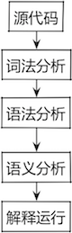
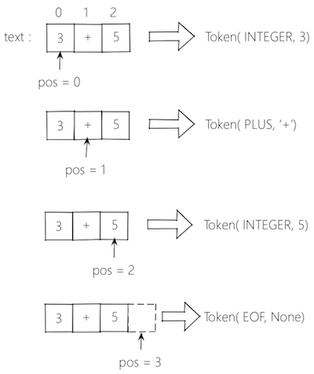

从
[https://github.com/rspivak/lsbasi](https://github.com/rspivak/lsbasi)
看到了这篇文章，它不仅深入浅出地讲述了怎么从头写一个编译器、解释器，其中有不少闪光的观点值得品味。

<!-- more -->
文章系列共14篇，首篇开头就引入[Steve Yegge](http://steve-yegge.blogspot.com/)牛的一句话——“如果你不知道编译器是如何工作的，你就不会理解计算机是如何工作的。如果你不能100%确认你深刻理解编译器的工作原理，那么你多半是不理解的”。关于[Steve Yegge](http://steve-yegge.blogspot.com/)又是一个有意思的大牛，他有很多博客文章被翻译成中文。

# 我为什么关注它？
通常学习一门技能都会被教育为什么要学习，而我一般都不看这类陈述，一方面因为我在学习之前对于为什么要学已经想得很清楚，另一方面这类描述像拉客的广告一样没啥新意。但在这篇文章里关于“为什么”我还是读了两遍：

1. 写一个编译器和解释器，需要组合使用很多种技术，这些技术在写任何软件的时候都是有用的。这有助于你提升这些技能，并成为更牛逼的软件工程师。
2. 帮助你深刻理解计算机是如何工作的。编译器和解释器在外部看来就像魔术一样，但是你不应该满足于这种境界，而应该揭开构建它们的神秘面纱，理解内部机制让一切尽在掌控。
3. 如果你要创建自己的编程语言，或者特定领域的编程语言，你就必须自己写解释器和编译器。最近新的编程语言不断涌现，Elixir, Go, Rust等等。

第1点是我在读完全部文章后感同身受的，本来不打算在这个层面花太多精力，因为我在今年学习的路线图是机器学习，了解编译器是为了解决iOS下使用OC热更新的问题。但是读了这一系列的文章之后，不仅决定再深入精读一遍，还有必要跟着一起动手玩玩，这是一段有趣、有料的旅程。

第3点听起来有点牵强，尽管编程语言层出不穷，但这世界上需要自己设计编程语言并且有价值的仍是凤毛麟角。但最近还真是遇到了这类的挑战——我的目标不是设计一门被广泛应用的编程语言，而是要设计一个OC的编译器和解释器，以支持iOS下代码的热更新。

# 什么是编译器和解释器？

翻译器和解释器的作用都是将高级语言写的源代码翻译成更低级的形式。**编译器Compiler**直接将它翻译成机器语言，而**解释器Interpreper**则是将它翻译成介于高级语言和机器语言的中间形式。参考《计算机系统要素——从零开始构建现代计算机》的插图：


图中的**编译器+虚拟机+汇编编译器**是本文说的编译器，图中的**编译器**是本文中的解释器。

解释器处理代码的完整流程如下：


**词法分析lexical analyzer**是将输入的字符流分割成token，这是解释其处理代码的第一步，它将输入字符流转成token流。  
**token**是具有类型和值的对象，用来描述编译后的基本单位。
**词位lexeme**是形成一个token的字符序列。  
从token流中查找符合预期的语法结构的过程称为**解析parsing**也称为**语法分析syntax analysis**，执行解析的部分称为**解析器parser**也称为**语法分析器syntax analyzer**。

# 词法分析器
函数`Interpreper::get_next_token()`承担**词法分析器lexical analyzer**的角色，每次调用从输入字符流中解析一个token并返回：


在Part1中，主逻辑写在函数`Interpreper::expr()`中：

`Interpreper::get_next_token()`负责解析一个token，`Interpreper::eat(...)`负责确认该token是否符合预期，并执行下一次`Interpreper::get_next_token()`。  
`Interpreper::expr()`承担**语法分析器syntax analyzer**的角色，它写死了解析的顺序是：`INTEGER - PLUS - INTEGER`——这就是符合预期的语法规范。将`get_next_token()`和`eat(...)`分开是为了将词法分析和语法分析分离——词法分析只关注输入串的合法性，而语法分析则关注token流的顺序是否符合业务逻辑。
``` python
class Interpreter(object):
    ...
    def get_next_token(self):
        ''' 只负责解析出一个合法的Token字串 '''
        ...
        if current_char.isdigit():
            token = Token(INTEGER, int(current_char))
            self.pos += 1
            return token

        if current_char == '+':
            token = Token(PLUS, current_char)
            self.pos += 1
            return token
        ...

    def eat(self, token_type):
        ''' 如果dangqianToken符合预期，则继续执行词法分析 '''
        ...
        if self.current_token.type == token_type:
            self.current_token = self.get_next_token()
        ...

    def expr(self):
        ''' 以此获取：INTEGER - PLUS - INTEGER，完成计算 '''
        ...
        self.current_token = self.get_next_token()
        ...
        left = self.current_token
        self.eat(INTEGER)
        ...
        op = self.current_token
        self.eat(PLUS)
        ...
        right = self.current_token
        self.eat(INTEGER)
        ...
        result = left.value + right.value
        return result

```
## Part2
在第二篇中添加了三个功能：  
①处理空格  
②支持多位数字  
③支持减法  
显然这三部分都与词法分析器相关。在`Interpreper::get_next_token()`过程中如果发现当前符号是空格，就继续向后解析；如果发现是数字，则继续向后解析，直到非数字，再把刚刚缓存的字窜转成数值；如果发现是符号`-`，则返回Token。
``` python
def skip_whitespace(self): # ①
    while self.current_char is not None and self.current_char.isspace():
        self.advance()

def integer(self):          # ②它和①的实现非常相似
    ...
    result = ''
    while self.current_char is not None and self.current_char.isdigit():
        result += self.current_char
        self.advance()
    return int(result)

def get_next_token(self):
    ...
    while self.current_char is not None:
        if self.current_char.isspace():
            self.skip_whitespace()   # ①
            continue

        if self.current_char.isdigit():
            return Token(INTEGER, self.integer())
        ...
        if self.current_char == '-': # ③
            self.advance()
            return Token(MINUS, '-')
        ...
```
最后在`Interpreper::expr()`中更新语义分析逻辑：
``` python
def expr(self):
    ...
    self.current_token = self.get_next_token()
    ...
    left = self.current_token
    self.eat(INTEGER)
    ...
    op = self.current_token
    if op.type == PLUS:
        self.eat(PLUS)
    else:
        self.eat(MINUS) # 支持减号运算
    ...
    right = self.current_token
    self.eat(INTEGER)
    ...
    if op.type == PLUS:
        result = left.value + right.value
    else:
        result = left.value - right.value
    return result
```

# 语法分析器
学习词法分析器时已经接触到了语法分析器`Interpreper::expr()`，那是一个极其简陋的版本，它hard code了“整型数 → 加/减 → 整型数”的语法逻辑。在文章的[Part3](https://ruslanspivak.com/lsbasi-part3/)对语法分析器做了扩展，使之支持没有括号的整型数值的加减运算：


由于只涉及到语法规则的变化，因此在代码上只需要修改语法分析器即可。这里就显示出了把词法、语法分开的好处。
``` python
def term(self):
    ''' 只接受INTEGER一种term '''
    token = self.current_token
    self.eat(INTEGER)
    return token.value

def expr(self):
    ...
    self.current_token = self.get_next_token()

    result = self.term()
    while self.current_token.type in (PLUS, MINUS):
        token = self.current_token
        if token.type == PLUS:
            self.eat(PLUS)
            result = result + self.term()
        elif token.type == MINUS:
            self.eat(MINUS)
            result = result - self.term()

    return result
```
而且语法分析器的代码和语法图是直接对应的，非常直观。

# 上下文无关文法和BNF表示法
`上下文无关语法context-free grammars`或`BNF（Backus-Naur Form）表示法`是一套用来表示语法规则的协议，形如：  
```
expr    : factor((MUL|DIV) factor)*
factor  : INTEGER
```
BNF表示法的优点在于：它更紧凑，也是更文档化的表述方式，从该表述法到代码的转换比较容易。  
如上例所示，一个语法由一系列规则组成。一条规则冒号左端由一个非终结符组成，称为**头部**或**左侧**，冒号右端由一系列终结符或非终结符组成，称为**主体**或**右侧**。  
上例中像MUL, DIV和INTEGER这样的变量称为**终结符**，像exp, factor这样的变量称为**非终结符**。  
第一条规则左侧的非终结符称为**开始符号**，上例中的开始符号是expr。  
本文使用的BNF表示法是一类变种，其中的符号含义为：  

- `|`表示或
- `(...)`表示一组终结符或非终结符的组合
- `(...)*`表示0个或多个组合

通过解释语法形成的句子来定义一种语言，解释的流程为：从开始符号为起点，反复使用规则主体替换非终结符，直到生成的句子仅包含终结符。该句子就构成了语法所定义的语言。  
按照这种规则，如果语法无法派生出某个表达式，那么就说明该表达式不符合该语法。  

以下是将语法映射成代码的规则：  

1. 为语法中定义的每条规则`R`，定义一个同名函数`R()`，函数的实现遵循该条语法规则的定义。例如将`expr  : factor((MUL|DIV)factor)*`转为：
``` python
def expr(self):
    self.factor()
    ...
```
2. 或规则（如(a1|a2|...an)）映射为`if-elif-else`语句。例如将`(MUL|DIV)`转为：
``` python
token = self.current_token
if token.type == MUL:
    ...
elif token.type == DIV:
    ...
```
3. `(...)*`规则映射为while语句。例如将`((MUL|DIV)factor)*`转为：
``` python
while self.current_token.type in (MUL, DIV):
    ...
```
4. 将规则中的每个token引用T映射为一个`eat(T)`的函数调用。`eat(T)`函数确认当前token的类型是否为T，如果是则继续解析下一个token，并赋给`current_token`。例如将`INTEGER`转为：
``` python
self.eat(INTEGER)
```
于是对于本节初给出的语法例子：
```
expr    : factor((MUL|DIV) factor)*
factor  : INTEGER
```
转成代码就是：
``` python
def expr(self):
    self.factor()
    while self.current_token.type in (MUL, DIV):
        token = self.current_token
        if token.type == MUL:
            self.eat(MUL)
            self.factor()
        elif token.type == DIV:
            self.eat(DIV)
            self.factor()

def factor(self):
    self.eat(INTEGER)
```

Part4的代码用于解析上例中的语法，它将词法分析器和语法分析器分成两个类来定义，也使二者的职责更加明晰：
``` python
class Lexer(object):    # 词法分析器
    ...
    def advance(self): # 步进一个字符
        ...

    def skip_whitespace(self):
        ...

    def integer(self): # 解析一个整型数
        ...

    def get_next_token(self):
        ...
        while self.current_char is not None:
            if self.current_char.isspace():
                self.skip_whitespace()
                continue

            if self.current_char.isdigit():
                return Token(INTEGER, self.integer())

            if self.current_char == '*':
                self.advance()
                return Token(MUL, '*')

            if self.current_char == '/':
                self.advance()
                return Token(DIV, '/')
            ...
        return Token(EOF, None)

class Interpreter(object):  # 语法分析器
    def __init__(self, lexer):
        ...
    def eat(self, token_type):
        ...
        if self.current_token.type == token_type:
            self.current_token = self.lexer.get_next_token()
        ...

    def factor(self):
        ...
        token = self.current_token
        self.eat(INTEGER)
        return token.value

    def expr(self):
        ...
        result = self.factor()

        while self.current_token.type in (MUL, DIV):
            token = self.current_token
            if token.type == MUL:
                self.eat(MUL)
                result = result * self.factor()
            elif token.type == DIV:
                self.eat(DIV)
                result = result / self.factor()

        return result
```
其中词法分析器`Lexer`的实现和前面章节没什么变化；主要是`Interpeter::expr(...)`使用了映射规则。

# 考虑运算优先级
乘除法的优先级高于加减法，怎么在语法中体现出该优先级呢？可以总结出2条规则：

1. 对每一级的运算，定义一条规则，左侧为本级非终结符，规则体包含本级的运算和更高级别的非终结符。
2. 为最基本的元素创建一条规则，左侧为非终结符，右侧为该基本元素，如INTEGER。于是对于N级运算共有N+1条规则，每个级别一条+基本元素一条。

将这两条规则应用于加减乘除四则运算，定义其语法为：
```
expr    : term((PLUS|MINUS)term)*
term    : factor((MUL|DIV)factor)*
factor  : INTEGER
```
于是应用上一节由语法到代码的映射规则，转换代码为：
``` python
class Lexer(object):
    ...
    def get_next_token(self):
        ...
        while self.current_char is not None:

            if self.current_char.isspace():
                self.skip_whitespace()
                continue

            if self.current_char.isdigit():
                return Token(INTEGER, self.integer())

            if self.current_char == '+':
                self.advance()
                return Token(PLUS, '+')

            if self.current_char == '-':
                self.advance()
                return Token(MINUS, '-')

            if self.current_char == '*':
                self.advance()
                return Token(MUL, '*')

            if self.current_char == '/':
                self.advance()
                return Token(DIV, '/')
            ...

class Interpreter(object):
    ...
    def term(self):
        result = self.factor()

        while self.current_token.type in (MUL, DIV):
            token = self.current_token
            if token.type == MUL:
                self.eat(MUL)
                result = result * self.factor()
            elif token.type == DIV:
                self.eat(DIV)
                result = result / self.factor()

        return result

    def expr(self):
        result = self.term()

        while self.current_token.type in (PLUS, MINUS):
            token = self.current_token
            if token.type == PLUS:
                self.eat(PLUS)  # 14 + 2 * 
                result = result + self.term() 
            elif token.type == MINUS:
                self.eat(MINUS)
                result = result - self.term()

        return result
```
重点是`Interpreter::term()`和`Interpreter::expr()`的变化。有了映射规则，代码很容易看懂；如果抛开规则直奔代码，难度将高出一个量级。

# 注重学习原理
在Part2的开头，作者引用了Burger 和 Starbird在《The 5 Elements of Effective Thinking》这本书中讲述的一则故事。享誉世界的小号演奏家Tony Plog在一次大师班培训中，让学生们先演奏一首复杂的音乐片段，学生们演奏的很好；之后再让他们演奏一段非常基本简单的音乐，和前面的演奏相比听起来显得非常幼稚。演奏结束后，老师也演奏了一遍同样的乐段，但是老师的演奏却听不出幼稚——差异是明显的。Tony解释道：只有掌握演奏简单乐句的技巧，才能在演奏复杂乐句时更有掌控力。这则故事很有启发性：要培养真正的技艺，必须注重掌握简单的基本思想。正如艾默生所说：“如果你只学习方法，你将被绑死到方法上。如果你学习原理，你将可以自己设计适合自己的方法。”

正是出于这段文字，我才决定深入消化包含这14篇文章的编译器系列。