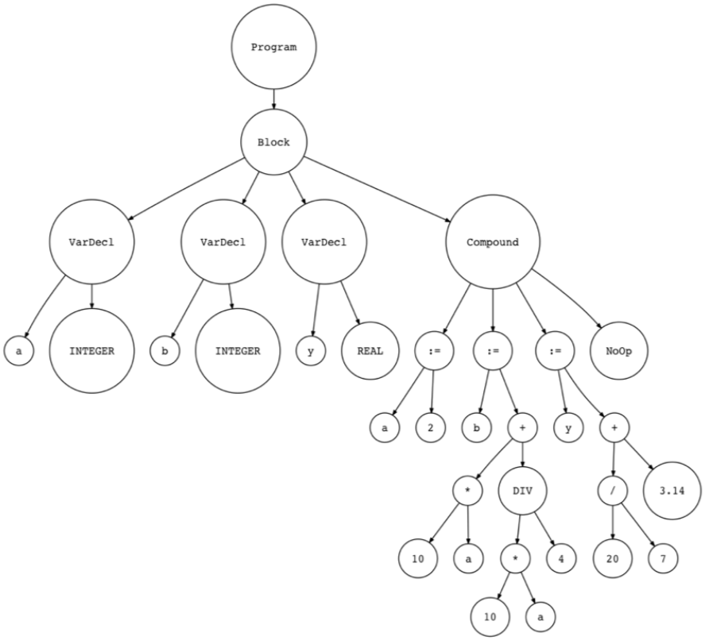

上一节基于四则运算的计算器，引入了词法分析器、语法分析器和解释运行器的概念，他们分工明确，相互协作，根据语法规则完成源代码的解释执行。本节将这一规则应用到实际的编程语言中，以Pascal为例完成编译和解析。从业务跨度上，本节相比上一节是一次跨越，但从底层技术来说，不过是上一节基本概念的又一次应用而已。 

<!-- more -->
# 支持Pascal语法规则
给一门新语言写解释器，完成它的语法规则是难度最大也是应该最先完成的工作。本节引入的Pascal语法描述为：
```
program : compound_statement DOT

compond_statement   : BEGIN statement_list END

statement_list  : statement
                | statement SEMI statement_list

statement   : compound_statement
            | assignment_statement
            | empty

assignment_statement    : variable ASSIGN expr

empty   :

expr    : term((PLUS | MINUS) term)*

term    : factor ((MUL |DIV) factor)*

factor  : PLUS factor
        | MINUS factor
        | INTEGER
        | LPAREN expr RPAREN
        | variable

variable    : ID
```
在`statement_list`规则中也可写作
```
statement _list : statement | (statement SEMI)*
```
有了上一节词法解析器、语法解析器和解释器的分工，接下来只需考虑在每个职责上应做的变化。

## 词法解析
词法分析的中枢是`Lexer::get_next_token()`，和四则运算的词法分析器相比，Pascal的词法分析器只是多了几种符号的解析，包括①变量；②长度大于1的保留符号
``` python
class Lexer(object):
    ...
    def _id(self):
        """Handle identifiers and reserved keywords"""
        result = ''
        while self.current_char is not None and self.current_char.isalnum():
            result += self.current_char
            self.advance()

        token = RESERVED_KEYWORDS.get(result, Token(ID, result))
        return token

    def get_next_token(self):
        ...
        while self.current_char is not None:
            ...
            if self.current_char.isalpha(): # ①
                return self._id()

            if self.current_char.isdigit():
                return Token(INTEGER, self.integer())

            if self.current_char == ':' and self.peek() == '=': # ②
                self.advance()
                self.advance()
                return Token(ASSIGN, ':=')

            if self.current_char == ';':
                ...
            if self.current_char == '+':
                ...
            if self.current_char == '-':
                ...
            ...

        return Token(EOF, None)
```
## 语法分析
结合上一节[从语法到代码的映射](/2018/06/18/2018/0618BuildASimpleInterpreter1/#从语法到代码的映射)，将每条规则写成一个函数：
``` python

class Parser(object):
    ...
    def program(self): # 这里是语法解析的起点
        """ program : compound_statement DOT """
        node = self.compound_statement()
        self.eat(DOT)
        return node

    def compound_statement(self):
        """ compound_statement: BEGIN statement_list END """
        self.eat(BEGIN)
        nodes = self.statement_list()
        self.eat(END)

        root = Compound()
        for node in nodes:
            root.children.append(node)

        return root

    def statement_list(self):
        """ statement_list : statement | (statement SEMI)* """
        node = self.statement()

        results = [node]

        while self.current_token.type == SEMI:
            self.eat(SEMI)
            results.append(self.statement())
        ...
        return results

    def statement(self):
        """ statement : compound_statement
                  | assignment_statement
                  | empty
        """
        if self.current_token.type == BEGIN:
            node = self.compound_statement()
        elif self.current_token.type == ID:
            node = self.assignment_statement()
        else:
            node = self.empty()
        return node

    def assignment_statement(self):
        """ assignment_statement : variable ASSIGN expr """
        left = self.variable()
        token = self.current_token
        self.eat(ASSIGN)
        right = self.expr()
        node = Assign(left, token, right)
        return node

    def variable(self):
        """ variable : ID """
        node = Var(self.current_token)
        self.eat(ID)
        return node

    def empty(self):
        """An empty production"""
        return NoOp()

    def expr(self):
        """ expr : term ((PLUS | MINUS) term)* """
        ...

    def term(self):
        """ term : factor ((MUL | DIV) factor)* """
        ...

    def factor(self):
        """ factor : PLUS factor | MINUS factor | INTEGER
                  | LPAREN expr RPAREN | variable
        """
        ...

    def parse(self):
        ...
        node = self.program()
        ...
        return node
```
在AST节点选取上，叶子节点是由终结符组成，根据Pascal的语法表，还需要添加变量variable；非叶子节点的选取，我认为有不同的选法，因为语法规则的左部引入了`compound_statement`、`statement_list`、`statement`和`assignment_statement`，而在Part9中仅引入了`Compound`、`Assign`和`Var`，它在`Compound`中保存了`statement`的集合：
``` python
class AST(object):
    pass

class BinOp(AST):
    def __init__(self, left, op, right):
        ...

class Num(AST):
    def __init__(self, token):
        ...

class UnaryOp(AST):
    def __init__(self, op, expr):
        ...

class Compound(AST):
    """Represents a 'BEGIN ... END' block"""
    def __init__(self):
        self.children = []

class Assign(AST):
    def __init__(self, left, op, right):
        self.left = left
        self.token = self.op = op
        self.right = right

class Var(AST):
    """The Var node is constructed out of ID token."""
    def __init__(self, token):
        self.token = token
        self.value = token.value

class NoOp(AST):
    pass
```

## 解释执行
解释器的执行是根据语法分析器产出的节点类型，配套对应的访问函数。显然他必须增加对`Compound`、`Assign`和`Var`的访问，需要注意Var可能出现在赋值语句的左侧，此时的作用是提领，也可能出现在右侧，此时的作用是取值。
``` python

class NodeVisitor(object):
    def visit(self, node):
        method_name = 'visit_' + type(node).__name__
        visitor = getattr(self, method_name, self.generic_visit)
        return visitor(node)
    ...
class Interpreter(NodeVisitor):

    GLOBAL_SCOPE = {}
    ...
    def visit_Compound(self, node):
        for child in node.children:
            self.visit(child)

    def visit_Assign(self, node):
        var_name = node.left.value # 左部是Var，但不再走visit_Var逻辑
        self.GLOBAL_SCOPE[var_name] = self.visit(node.right)

    def visit_Var(self, node):
        var_name = node.value
        val = self.GLOBAL_SCOPE.get(var_name)
        ...
        return val

    def visit_NoOp(self, node):
        pass

    def interpret(self):
        tree = self.parser.parse()
        ...
        return self.visit(tree)
```
这里引入了一个GLOBAL_SCOPE用来保存符号表，符号表示用来跟踪源代码中各种符号的抽象数据类型，目前只是用一个字典保存了变量。

# 增强版Pascal语法规则
Part10支持了更完备的Pascal语法规则，包括：  

1. PROGRAM头，  
2. 变量声明，  
3. 引入DIV作为整除运算符，/作为浮点除法运算符，  
4. 支持注释。

语法表为：  
```
program : PROGRAM variable SEMI block DOT                   ①

block   : declarations compound_statement                   ②

declarations    : VAR (variable_declaration SEMI) +         ③
                | empty

variable_declaration    : ID (COMMA ID)* COLON type_spec    ④

type_spec   : INTEGER

compound_statement  : BEGIN statement_list END              ⑤

statement_list  : statement
                | statement SEMI statement_list

statement   : compound_statement
            | assignment_statement
            | empty

assignment_statement    : variable ASSIGN expr

empty   :

expr    : term ((PLUS |MINUS) term)*

term    : factor ((MUL | INTEGER_DIV | FLOAT_DIV) factor)*

factor  : PLUS factor
        | MINUS factor
        | INTEGER_CONST
        | REAL_CONST
        | LPAREN expr RPAREN
        | variable

variable : ID
```
对应一段代码
``` pascal
PROGRAM Part10;     {①}
VAR                 {②③}
    number      :INTEGER;   {④}
    a, b, c, x  : INTEGER;  
    y           : REAL;

BEGIN {Part10}      {⑤}
    BEGIN
        number := 2;
        a := number;
        b := 10 * 1 + 10 * number DIV 4;
        c := a - - b
    END;
    x := 11;
    y := 20 / 7 + 3.14;
END. {Part10}
```
看起来复杂了很多，接下来是流程化的工作，依次修改词法分析、语法分析和解释器。

## 词法分析

代码越来越多，但复杂度其实没有增加，在词法分析部分的更改是：  
1. 增加新的保留字。识别变量的`Lexer::_id()`逻辑没有变，只是在`RESERVED_KEYWORDS`中添加了新的item
2. `Lexer::skip_comment()`处理注释，逻辑非常简单，类似`Lexer::skip_whitespace()`
3. 解析数字，支持浮点型数字。逻辑也不过是用`.`分两截解析数字。

``` python
RESERVED_KEYWORDS = {
    'PROGRAM': Token('PROGRAM', 'PROGRAM'),
    'VAR': Token('VAR', 'VAR'),
    'DIV': Token('INTEGER_DIV', 'DIV'),
    'INTEGER': Token('INTEGER', 'INTEGER'),
    'REAL': Token('REAL', 'REAL'),
    'BEGIN': Token('BEGIN', 'BEGIN'),
    'END': Token('END', 'END'),
}
class Lexer(object):
    ...
    def skip_comment(self):
        while self.current_char != '}':
            self.advance()
        self.advance()  # the closing curly brace

    def number(self):
        """Return a (multidigit) integer or float consumed from the input."""
        result = ''
        while self.current_char is not None and self.current_char.isdigit():
            result += self.current_char
            self.advance()

        if self.current_char == '.':
            result += self.current_char
            self.advance()

            while (
                self.current_char is not None and
                self.current_char.isdigit()
            ):
                result += self.current_char
                self.advance()

            token = Token('REAL_CONST', float(result))
        else:
            token = Token('INTEGER_CONST', int(result))

        return token

    def _id(self):
        """Handle identifiers and reserved keywords"""
        result = ''
        while self.current_char is not None and self.current_char.isalnum():
            result += self.current_char
            self.advance()

        token = RESERVED_KEYWORDS.get(result, Token(ID, result))
        return token

    def get_next_token(self):
        ...
        while self.current_char is not None:
            ...
            if self.current_char == '{':
                self.advance()
                self.skip_comment()
                continue

            if self.current_char.isalpha():
                return self._id()

            if self.current_char.isdigit():
                return self.number()
        ...
```
## 语法分析
在Part10的介绍中，每次更新语法分析器都是从添加AST开始的，但我认为从语法到函数的映射转换更自然，因为这个转换规则几乎是固定的，而最终选取哪些节点来创建AST数据结构也是根据转换后的代码需要确定。  
本节对语法规则修改比较大，因此按照新的语法表重新实现语法分析。语法分析的主逻辑在`Parser::parse()`，起点是`Parser::program()`。
``` python
class Parser(object):
    ...
    def program(self):
        """ program : PROGRAM variable SEMI block DOT """
        self.eat(PROGRAM)
        var_node = self.variable()
        prog_name = var_node.value
        self.eat(SEMI)
        block_node = self.block()
        program_node = Program(prog_name, block_node)
        self.eat(DOT)
        return program_node

    def block(self):
        """ block : declarations compound_statement """
        declaration_nodes = self.declarations()
        compound_statement_node = self.compound_statement()
        node = Block(declaration_nodes, compound_statement_node)
        return node

    def declarations(self):
        """ declarations : VAR (variable_declaration SEMI)+ | empty """
        declarations = []
        if self.current_token.type == VAR:
            self.eat(VAR)
            while self.current_token.type == ID:
                var_decl = self.variable_declaration()
                declarations.extend(var_decl)
                self.eat(SEMI)

        return declarations

    def variable_declaration(self):
        """ variable_declaration : ID (COMMA ID)* COLON type_spec """
        var_nodes = [Var(self.current_token)]  # first ID
        self.eat(ID)

        while self.current_token.type == COMMA:
            self.eat(COMMA)
            var_nodes.append(Var(self.current_token))
            self.eat(ID)

        self.eat(COLON)

        type_node = self.type_spec()
        var_declarations = [
            VarDecl(var_node, type_node)
            for var_node in var_nodes
        ]
        return var_declarations

    def type_spec(self):
        """ type_spec : INTEGER | REAL """
        token = self.current_token
        if self.current_token.type == INTEGER:
            self.eat(INTEGER)
        else:
            self.eat(REAL)
        node = Type(token)
        return node

    def compound_statement(self):
        """ compound_statement: BEGIN statement_list END """
        self.eat(BEGIN)
        nodes = self.statement_list()
        self.eat(END)

        root = Compound()
        for node in nodes:
            root.children.append(node)

        return root

    def statement_list(self):
        """ statement_list : statement | statement SEMI statement_list """
        node = self.statement()

        results = [node]

        while self.current_token.type == SEMI:
            self.eat(SEMI)
            results.append(self.statement())

        return results

    def statement(self):
        """ statement : compound_statement | assignment_statement | empty """
        if self.current_token.type == BEGIN:
            node = self.compound_statement()
        elif self.current_token.type == ID:
            node = self.assignment_statement()
        else:
            node = self.empty()
        return node

    def assignment_statement(self):
        """ assignment_statement : variable ASSIGN expr """
        left = self.variable()
        token = self.current_token
        self.eat(ASSIGN)
        right = self.expr()
        node = Assign(left, token, right)
        return node

    def variable(self):
        """ variable : ID """
        node = Var(self.current_token)
        self.eat(ID)
        return node
    ...

    def parse(self):
        ...
        node = self.program()
        ...
        return node
```
在本节的具体实现中，凡是非集合类的返回值，都为它创建了AST节点。创建的AST结构如下：


## 解释执行
解释器的逻辑是紧随语法分析器的产出结果的——生成什么节点，就需要有对该节点的解释模块。这里就不再赘述了。  
经过本节两轮的练习，可以发现一个编译器的核心工作其实在书写语法规则表上，根据语法规则表中的终结符写出对应每个符号的词法分析器；根据语法规则写出语法分析器，这几乎是一一对应的，再根据语法分析器的生成结果，确定用哪些AST节点来表示；最后根据生成的AST类型写出对应的解释模块，这就是解释器了。

# 构建符号表
在Part11之前的章节已经引入了`Interpreter::GLOBAL_SCOPE`符号表，它的作用仅仅是为了记录每个变量对应的值，构建符号表还要履行如下职责：

- 当为变量赋值时，确保类型是正确的
- 确保变量在使用前被声明

本文实现的思路是再为AST构建一个visitor，类似解释器同样执行后序遍历，只是它在遍历的过程中为变量声明创建符号记录，为变量的使用检查是否存在符号记录，为变量的赋值检查类型是否匹配。这样无需改变已有逻辑，只需要添加一个新模块，在解释运行前执行访问逻辑，即可完成符号跟踪的职责。  
我们为该符号跟踪器取名为`SymbolTableBuilder`：
``` python
class SymbolTableBuilder(NodeVisitor):
    def __init__(self):
        self.symtab = SymbolTable()

    # 对于运算类的节点，只需要确保后序遍历即可
    def visit_Block(self, node):
        for declaration in node.declarations:
            self.visit(declaration)
        self.visit(node.compound_statement)

    def visit_Program(self, node):
        ...
    def visit_BinOp(self, node):
        ...
    def visit_Num(self, node):
        ...
    def visit_UnaryOp(self, node):
        ...
    def visit_Compound(self, node):
        ...
    def visit_NoOp(self, node):
        ...

    def visit_VarDecl(self, node):
        ''' 对于声明语句，在symtab中创建一条VarSymbol记录 '''
        type_name = node.type_node.value
        type_symbol = self.symtab.lookup(type_name)
        var_name = node.var_node.value
        var_symbol = VarSymbol(var_name, type_symbol)
        self.symtab.define(var_symbol)

    def visit_Assign(self, node):
        ''' 对于赋值语句，确保symtab中能查到左值，并继续访问右值 '''
        var_name = node.left.value
        var_symbol = self.symtab.lookup(var_name)
        if var_symbol is None:
            raise NameError(repr(var_name))

        self.visit(node.right)

    def visit_Var(self, node):
        ''' 对于取值语句，确保symtab中能查到该变量 '''
        var_name = node.value
        var_symbol = self.symtab.lookup(var_name)

        if var_symbol is None:
            raise NameError(repr(var_name))
```
`SymbolTableBuilder::symtab`的类型为`SymbolTable`，内部维护着一个字典，字典的数据部分为`Symbol`的子类：
``` python
class Symbol(object):
    def __init__(self, name, type=None):
        self.name = name
        self.type = type

class VarSymbol(Symbol):
    def __init__(self, name, type):
        super(VarSymbol, self).__init__(name, type)
    ...

class BuiltinTypeSymbol(Symbol):
    def __init__(self, name):
        super(BuiltinTypeSymbol, self).__init__(name)
    ...
```
在使用时，会为内置类型符号创建固定的`BuiltinTypeSymbol`变量，为变量创建`VarSymbol`变量：
``` python
int_type = BuiltinTypeSymbol('INTEGER')
real_type = BuiltinTypeSymbol('REAL')
var_x_symbol = VarSymbol('x', int_type)
var_y_symbol = VarSymbol('y', real_type)
```
在最上层逻辑中，完成了词法分析、语法分析之后，解释执行之前，完成符号跟踪：
``` python
def main():
    ...
    lexer = Lexer(source_code)
    parser = Parser(lexer)
    tree = parser.parse()
    symtab_builder = SymbolTableBuilder()
    symtab_builder.visit(tree)  # 执行符号跟踪
    ...
    interpreter = Interpreter(tree)
    result = interpreter.interpret()
    ...
```
# 支持过程声明
在Part12中加入对过程的支持，Pascal代码结构类似这样：
``` pascal
PROGRAM Test;
VAR 
    a   : INTEGER;

PROCEDURE P1;
BEGIN   {P1}
END;    {P1}

PROCEDURE P1A;
BEGIN   {P1A}
END;    {P1A}

BEGIN   {Test}
    a := 10;
END.    {Test}
```
修改语法表为：
```
program : PROGRAM variable SEMI block DOT                   

block   : declarations compound_statement                   

declarations    : VAR (variable_declaration SEMI) +  
                | (PROCEDURE ID SEMI block SEMI)*   # 添加PROCEDURE       
                | empty

variable_declaration    : ID (COMMA ID)* COLON type_spec    

type_spec   : INTEGER

compound_statement  : BEGIN statement_list END              

statement_list  : statement
                | statement SEMI statement_list

statement   : compound_statement
            | assignment_statement
            | empty

assignment_statement    : variable ASSIGN expr

empty   :

expr    : term ((PLUS |MINUS) term)*

term    : factor ((MUL | INTEGER_DIV | FLOAT_DIV) factor)*

factor  : PLUS factor
        | MINUS factor
        | INTEGER_CONST
        | REAL_CONST
        | LPAREN expr RPAREN
        | variable

variable : ID
```
对应的在词法分析中添加对`PROCEDURE`关键词的解析，在语法分析中添加对应的规则，在解释器中遇到PROCEDURE的声明则直接跳过，具体代码就不写了。

# 语义分析
在Part13中引入了语义分析，文章给语义分析下的定义是：在完成AST构建后，基于该树执行的错误检查过程，是为了检查语法正确但语义错误的点，例如：没有声明就是用的变量，重复定义等。下面这段代码就是语法正确，语义错误的例子：
``` pascal
PROGRAM Main;
    VAR x   :INTEGER;
BEGIN
    x := x + y;     {y在使用前没有定义}
END
```
不过看Part13的代码，其实和Part11差异不大，只不过它把Part11中的`SymbolTableBuilder`改为符合概念的`SemanticAnalyzer`，内部逻辑做了一些小修补，比如重复定义——在变量声明时下查看是否已经存在该符号。如此而已。  

到此，一个解释器的完整过程在概念上就呈现完了：

- 词法分析，提取合法的单词
- 语法分析，根据语法表构造AST
- 语义分析，根据AST检查符合语法但语义无意义的错误
- 解释执行

## 增强版语义分析
Part13中的语义分析还是一个很弱的版本，甚至不合基本的使用需求。因为他在检查变量声明和重复定义时，没有生命期的概念。过程可以嵌套，不同层次过程的变量可以重名，基本原则是：1、如果在本层过程中找不到的符号，可以层层向上搜索，直到命中，如果到最上层都没有找到，则语义分析错误。2、如果发现符号在多层中均有定义，取最近一层。  
Part14中给出的支持方案是采用`ScopedSymbolTable`栈，进入一层就创建一个新的`ScopedSymbolTable`对象，离开当前层次后，销毁其对应的`ScopedSymbolTable`对象，当访问符号时，从栈顶向栈底依次遍历。  
具体代码就不在这堆了。

# 总结
我认为这篇文章极具启发性，其实主题不是那么重要。我相信在大部分领域，背后都能从业务需求提炼出数学模型，这才是支撑其设计的理想架构。设计模式也不过是实现该模型的手段。如果模型的提炼工作做得不通透，哪怕通篇处处使用设计模式，也很难让代码简洁起来——这是很多低阶的设计所犯的通病。  

好的设计是要分层、分模块，但分层分模块是理解了业务逻辑，抽象出简单规则后的结果，而不是设计目标。以本文为例，词法分析、语法分析、语义分析和解释执行是基于业务的理解和抽象提炼出的阶段分割，尤其是最最关键的一步是确定语言的语法表，从语法表到代码的映射规则确定后，工程的难度就确定了。语法表就是对业务的格式化解释。  

还有很关键的一步文章没有解释——那就是为什么BNF是有效的，为什么语法表到代码的映射规则是有效的？我想这应该是文末列出的参考书目解释的问题：  
[《Language Implementation Patterns: Create Your Own Domain - Specific and General Programming Languages》](https://www.amazon.com/gp/product/193435645X/ref=as_li_tl?ie=UTF8&camp=1789&creative=9325&creativeASIN=193435645X&linkCode=as2&tag=russblo0b-20&linkId=5d5ca8c07bff5452ea443d8319e7703d)  
[《Engineering: A Compiler 2nd Edition》](https://www.amazon.com/gp/product/012088478X/ref=as_li_tl?ie=UTF8&camp=1789&creative=9325&creativeASIN=012088478X&linkCode=as2&tag=russblo0b-20&linkId=74578959d7d04bee4050c7bff1b7d02e)  
[《Programming Language Pragmatics, Fourth Edition》](https://www.amazon.com/gp/product/0124104096/ref=as_li_tl?ie=UTF8&camp=1789&creative=9325&creativeASIN=0124104096&linkCode=as2&tag=russblo0b-20&linkId=8db1da254b12fe6da1379957dda717fc)  
[《Compilers: Principles, Techniques, and Tools (2nd Edition)》](https://www.amazon.com/gp/product/0321486811/ref=as_li_tl?ie=UTF8&camp=1789&creative=9325&creativeASIN=0321486811&linkCode=as2&tag=russblo0b-20&linkId=31743d76157ef1377153dba78c54e177)  
[《Writing Compilers and Interpreters: A Software Engineering Approach 3rd Edition》](https://www.amazon.com/gp/product/0470177071/ref=as_li_tl?ie=UTF8&camp=1789&creative=9325&creativeASIN=0470177071&linkCode=as2&tag=russblo0b-20&linkId=542d1267e34a529e0f69027af20e27f3)  

试想，如果没有理论为基础，直接从0到1运用工程技术去生写，哪怕也会有迭代改进，最终产出的代码：1、没有深度，缺少更高一阶的改进空间；2、难免出现一些tricky和补丁。我见过维护了十年的这类项目，不同的人，不同的想法叠加在上面，很多代码你能读懂他做了什么，却无法理解当初为什么这么做。从结果来看，它的确解决了问题，而且很出色，但是程序员做的很没有成就感。回到本文的上下文中，深刻理解编译原理，才能成为这个领域的专家，进一步理解编译原理背后更普遍的原理，并尝试应用到其他领域，才能在扩宽技术视野的同时，让每一步走得更坚实。这是我认为程序员成长的理想路径，而不只是天天接需求，把它翻译成代码。