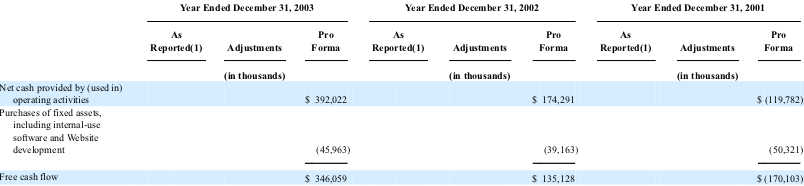

绝对估值是关于企业内在价值的一种估算方法，其中**现金流贴现法（Discounted Cash Flow DCF）**是最经典的绝对估值法，它是基于企业自由现金流的计算公式。本文就采用这种方法算算几家比较著名公司的绝对估值。

<!-- more -->
# 获取财报
这是我第一次写金融相关的笔记，因此把中途遇到的基础问题都一一记录下来，首先就是怎么获取美国上市公司的财报。
来[美国证券交易委员会官网](https://www.sec.gov/)，在EDGAR（Electronic Data Gathering, Analysis, and Retrieval System 即 电子化数据收集、分析及检索系统）搜索框中键入待查公司，比如`facebook`，可以搜到各类文件，它们的缩写和含义的对应关系为：   
`10-Q` 季报 　　　　　　　　　　　　　　　　 `10-K` 年报  
`F-1` 部分美国以外公司注册上市声明  　　　　　`Form D` 规则D下的证券发行豁免注册公告  
`3` 首次持股声明  　　　 　　　 　　　 　　　　 `4` 持股变动声明  
`5` 持股变动年度报告  　　　 　　　 　　　　　 `S-1` 注册上市声明  
`POS AM` 招股信息更正说明  　　　 　　　 　　　 `13D` 股东单独或合并持有5%以上公司股份公告  
`144` 证券拟出售报告  　　　 　　　 　　　　　 `20-F` 美国以外上市公司的年度报告或过度报告   
`ARS` 股东年报  　　　 　　　 　　　 　　 　　　 `6-K` 美国以外上市公司的临时报告   
`DEF 14-A` 股东委托书决议  　　　　　　　　　　`11-K` 员工持股变动年度报告  
`8-K` 季报发布期间的重要事件或公司变化临时报告  

此外美国的上市公司在他们的官方网站的底端都有投资者关系（Investor Relationship IR），这里也都能查到它们的财报。有的隐藏比较深，比如可口可乐，可以直接Google 搜索`coca cola investor relationship`，点开页面后找`Annual Reports`，然后再在顶部tab中找到`SEC Filings`，即可查找历史文件。  
不过我通过各个渠道查可口可乐的历史财报，最早也只能查到1994年。在《得到》上咨询香帅老师，答复是：更早的财务稳健如果在SEC上都查不到，就要借助专业数据库了，行业研究员会用到bloomberg, thomson reuters，学术界喜欢用compustat。我大致搜了一下，这些数据库应该都是付费服务，国内一些大学图书馆有终端可用，貌似还能申请免费的试用版，正在申请中，慢慢研究吧j~

# 自由现金流
自由现金流（Free Cash Flow，FCF）是指企业经营活动产生的现金流量扣除资本性支出(Capital Expenditures，CE）的差额。即：FCF=OCF-CE。  

## Facebook

Facebook的自由现金流在它的10-K年报中有直接的体现：  
**年份**　 **自由现金流（百万$）**   
——————————————————————————————————————————  
`2017` 　　17,483   
`2016` 　　11,617   
`2015` 　　6,076   
`2014` 　　3,626   
`2013` 　　2,849   
`2012` 　　37   

## Amazon

在亚马逊的10-K年报中，2004年之后的财报是有自由现金流这个字段的，之前没有，需要自己计算。不过好在2004这一年的财报中包含了2001、2002、2003的自由现金流的计算过程：
  
这里有一个细节：在财报中，负数是使用圆括号括住的来表示的，这也是在在excel中的默认设置，因此在2001年的营业性收入是-119,782，支出是-50,321，因此自由现金流是-170,103。它是用运营的净收入减去购买固定资产的支出。   
**年份**　　　	**自由现金流**   
2017　　　 8,376,000,000  
2016　　　 10,535,000,000  
2015　　　 7,450,000,000   
2014　　　 1,949,000,000   
2013　　　 2,031,000,000   
2012　　　 395,000,000   
2011　　　 2,092,000,000   
2010　　　 2,516,000,000   
2009　　　 2,920,000,000   
2008　　　 1,364,000,000   
2007　　　 1,181,000,000   
2006　　　 486,000,000   
2005　　　 529,000,000   
2004　　　 477,000,000   
2003　　　 347,000,000   
2002　　　 135,000,000   
2001　　　 170,000,000   
2000　　　-4,316,000   
1999　　　-196,180,000   
1998　　　 2,702,000   
1997　　　-6,916,000   
1996　　　 675,000   
1995　　　 180,000   

## Apple

再来看苹果的财报，苹果财报则始终没有Free Cash Flow这一项，需要自己去算，找到它的CONSOLIDATED STATEMENTS OF CASH FLOWS这种表，其中`Cash generated by operating activities`是企业运营收入，支出它没有像亚马逊的`Purchase of fixed assets, including internal-use software and  Website development` 这一项，这就需要自己分析了，在`Investing activities`一栏中，包含：

`Purchases of marketable securities` 购买有价证券
`Proceeds from maturities of marketable securities` 从有价证券的到期收益
`Proceeds from sales of marketable securities` 销售有价证券所得收益
`Payments made in connection with business acquisitions, net` 与商业收购相关的付款，净额
`Payments for acquisition of property, plant and equipment` **收购物业、厂房和设备的付款**
`Payments for acquisition of intangible assets` **无形资产收购付款**
`Payments for strategic investments, net` 战略投资支付净额
——————————————————————————————————————————  
如果和亚马逊对标的话，我认为和经营相关的支出应该是第5、6项。我觉得苹果的成本支出应该有一大部分是付给供应商的原材料，为啥这里看不到呢？  
按照这个计算方式，苹果的自由现金流为：  
**年份**　　	**自由现金流（百万）**  
2017　　	 50,803   
2016　　	 52,276   
2015　　	 69,778   
2014　　	 49,900   
2013　　	 44,590   
2012　　	 41,454   
2011　　	 30,077   
2010　　	 16,474   
2009　　	 8,946   
2008　　	 8,397   
2007　　	 4,484   
2006　　	 1,535   
2005　　	 2,275   
2004　　	 758   
2003　　	 125   
2002　　	 (85)  
2001　　	 (47)  
2000　　	 726   
1999　　	 751   
1998　　	 729   
1997　　	 101   
1996　　	 452   
1995　　	 (399)  
1994　　	 577  

## Google

再看google，谷歌也没有直接列出Free Cash Flow，但是有了苹果的经验，计算就是轻车熟路了：  
**年份**	　　**自由现金流（百万）**  
2017　　	 23,907   
2016　　	 25,824   
2015　　	 16,622   
2014　　	 11,417   
2013　　	 11,301   
2012　　	 13,346   
2011　　	 11,127   
2010　　	 7,063   
2009　　	 8,506   
2008　　	 5,494   
2007　　	 3,372   
2006　　	 1,677   
2005　　	 1,621   
2004　　	 588   
2003　　	 218   
2002　　	 118   

## 阿里巴巴

再看阿里巴巴，需要注意，美国以外的上市公司的年报不是10-k，而是20-F。阿里巴巴由于上市不久，财报数据还不多。需要注意的是阿里的现金流是以人民币计的：  
**年份**　　	**自由现金流（百万￥）**  
2017　　	 68,790   
2016　　	 51,279   
2015　　	 48,121   
2014　　	 32,269   
2013　　	 19,745   

## 腾讯

再看腾讯，腾讯是在香港上市，应该去[香港交易所官网](http://www.hkexnews.hk/)，点击`进阶搜寻`，输入相关信息完成搜索。腾讯现金流也是以人民币计：  
**年份**　　	**自由现金流（百万￥）**  
2017　　	 74,182   
2016　　	 48,270   
2015　　	 35,371   
2014　　	 26,095   
2013　　	 18,386   
2012　　	 14,903   
2011　　	 8,523   
2010　　	 10,529   
2009　　	 7,578   
2008　　	 3,375   
2007　　	 772   
2006　　	 1,170   
2005　　	 729   
2004　　	 117   

----

这几家公司的年复合增长最厉害的是FaceBook，涨势最漂亮的是腾讯，一路向上几乎没有出现波动。苹果和谷歌最近两年有波动。

# 现金流贴现法
现金流贴现法是计算出企业未来所有的的自由现金流求合，就等于对现在的估值。  
假设企业第0年的自由现金流为A，每年保持α的增长率，贴现率为β。（贴现率可以理解为投资的一般回报率，比如如果存定期，明年的100块钱，在今年值多少钱x，$\frac{100-x}{x}$就是贴现率）  
那么第1年它的自由现金流就为$A(1+α)$，折合到现在的现金为$\frac{A(1+α)}{1+β}$  
那么第2年它的自由现金流就为$A(1+α)^2$，折合到现在的现金为$\frac{A(1+α)^2}{(1+β)^2}$  
...
那么第n年它的自由现金流就为$A(1+α)^N$，折合到现在的现金为$\frac{A(1+α)^n}{(1+β)^n}$  
如果这家公司永远能保持α的速度发展，那么他当前的估值就等于每年自由现金折现到现在的总和：
$\frac{A(1+α)}{1+β} + \frac{A(1+α)^2}{(1+β)^2} + ... + \frac{A(1+α)^N}{(1+β)^N} = A×\frac{1-(\frac{1+α}{1+β}　)^N}{1-\frac{1+α}{1+β}}$  

但是通常一家公司很难保持长时间的高增长，所以我们给它估计一个短期增长率和一个长期增长率，短期增长率是在n年内保持α，长期增长率是在n+1年之后保持γ，于是在第n年前它折合当前现金流为
$A×\frac{1-(\frac{1+α}{1+β}　)^n}{1-\frac{1+α}{1+β}}=A×\frac{1+β}{β-α}×\frac{(1+β)^n - (1+α)^n}{(1+β)^n}$  
第n+1年后所有现金这和当前现金流为：$\frac{A(1+α)^n}{(1+β)^n}×\frac{1-(\frac{1+γ}{1+β}　)^N}{1-\frac{1+γ}{1+β}}$ （以第n年为起点的等比数列求合）  
如果γ＜β，则第n+1年后所有现金这和当前现金流为：$\frac{A(1+α)^n}{(1+β)^n}× \frac{1+β}{β-γ}$   

综上所述，该公司未来所有现金流折合当前价值为：$A×\frac{1+β}{β-α}×\frac{(1+β)^n - (1+α)^n}{(1+β)^n} + A×\frac{(1+α)^n}{(1+β)^n}× \frac{1+β}{β-γ}$  

----

我根据上面列出的这些公司，把他们未来n年的增长率设定为历史增长率的一半，贴现率8%，n年后的增长率为3%~5%，n在5~10年。计算出绝对估值为：  
**公司**　　　　**绝对估值（亿）**　　**2018年6月市值（亿）**　　**市盈率**  
Apple 　　　　18,000　　　　　9,098　　　　　　　　　17.82  
FaceBook　　 14,000　　　　　5,820　　　　　　　　　33.4  
Tencent　　　 10,924　　　　　5,901　　　　　　　　　43.63  
Google　　　　10,355　　　　　8,025　　　　　　　　　48.96  
Alibaba　　　　 6,887　　　　　5,183　　　　　　　　　51.02  
Amazon　　　　6,780　　　　　8,325　　　　　　　　　216.1  

具体的算法放在了[analysis.xlsx](https://github.com/palanceli/finance-learning/blob/master/analysis.xlsx)。
本节是学习了香帅的绝对估值法做出了自己的计算，应该还很肤浅，继续学习继续完善吧。

最后，汇总一下本节使用的网站：  

> [美国证券交易委员会官网](https://www.sec.gov/)  
> [香港交易所官网](http://www.hkexnews.hk/)  
> [巨潮资讯](http://www.cninfo.com.cn/cninfo-new/index)，这是中国证监会指定信息披露网站  