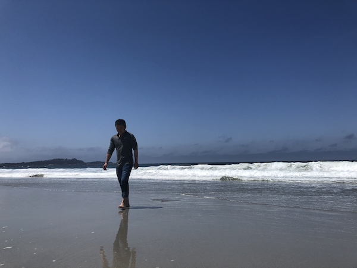
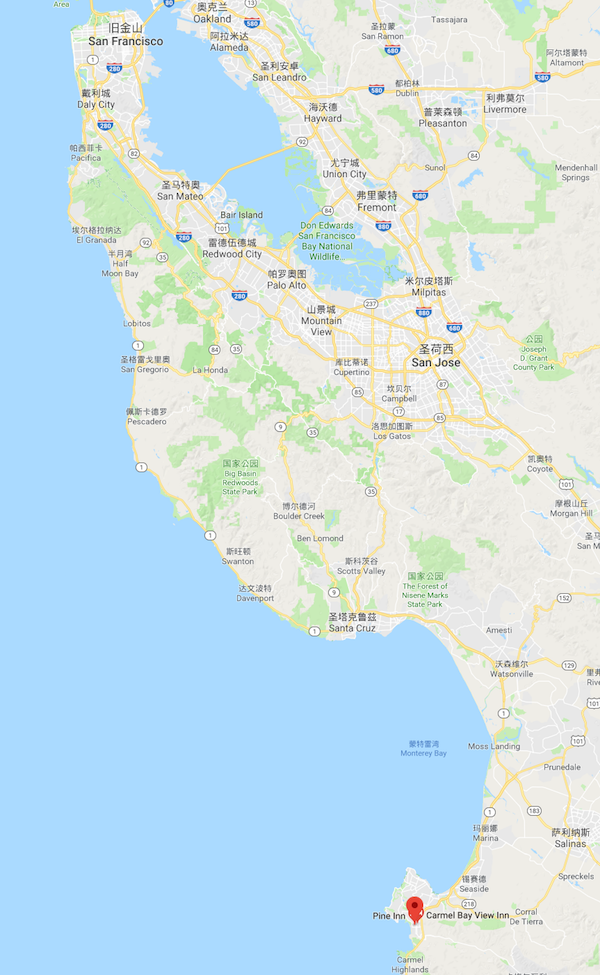
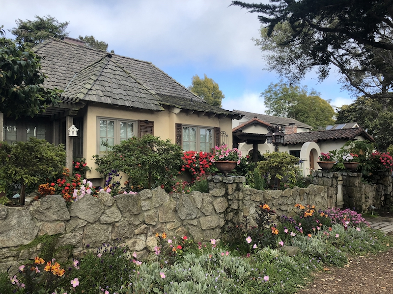
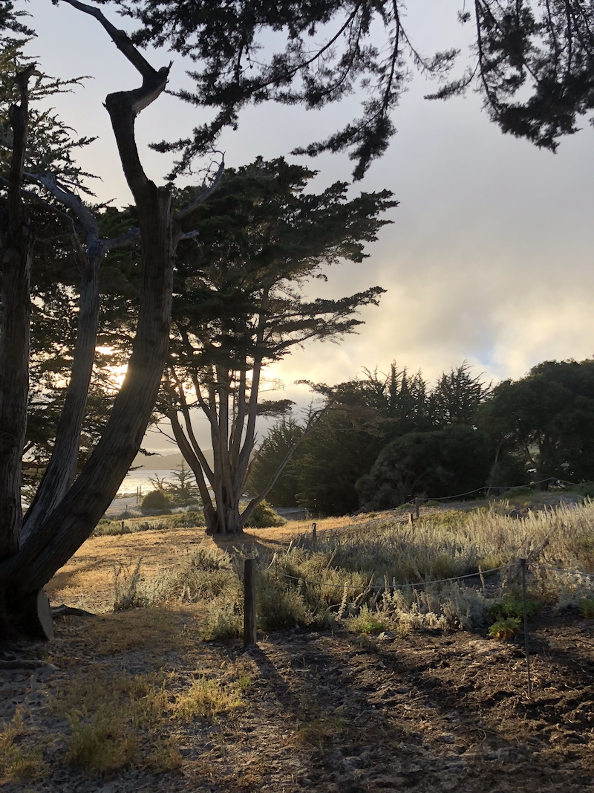
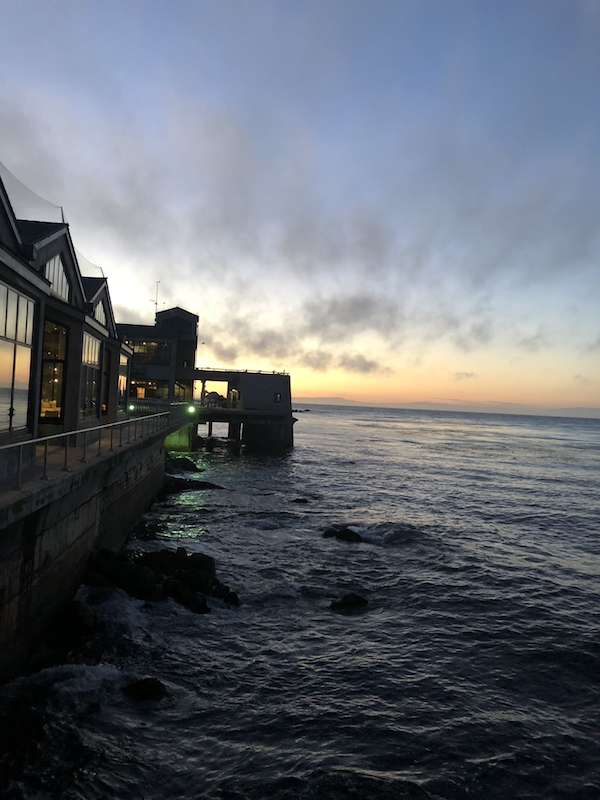

*如果你爱她，请带她去Carmel，在那里她会爱上你；*  
*如果你恨她，请带她去Carmel，在那里你会爱上她。*

<!-- more -->

Carmel是位于加州西部的一个小港湾，在旧金山往南约200公里。整个小镇非常非常小，可能比清华的校园还小，从一侧散步走到另一侧只需要20分钟。虽然是个旅游小镇，主干道两侧都是小商店，但整个镇子非常的静谧，街道的两侧种满了五颜六色的鲜花，非常整齐，每一座庭院里也都簇拥着绿植。感觉这里更像是欧洲，而不像美国那种粗放、紧张的生活氛围。  

清晨，我们开车直接来到海边，车停在马路边上，光着脚走过一段下坡就是海岸了。当海滩的景色映入眼帘，我瞬间就爱上了这里。虽然曾经去过很多海边度假，但这回是我生命当中第一次来到了梦想里的大海边！在梦里，大海应该长这样。  

这里的沙滩很干净，被海浪轻抚得很平滑，能够映出自己的倒影。这里的海浪热情奔放，一人高雪白的浪花摇曳着空气，反而更衬托这里的宁静。这里的人们很散淡，沙滩上看海、散步，偶尔靠近海浪嬉戏片刻，孩子们带着小桶玩沙子，很多人牵着狗狗，他们像是这里的常客，也许就住在附近吧，狗狗不怕水，常常冲进海浪里一会又从别的浪花中钻出来。这里的海岸线让你身不由己不停地看不停地想，近处的小木屋里面住着什么人？稍远一些的山和森林，它们和这片海陪伴了多久？更远处浩渺的海平面，当我在北京摸爬滚打的时候，那里的某个浪花，某条小鱼，某个贝壳，它们正在干什么…… 无论怎么想，最后总会落到一个问题上来，我是不是该留下来:)  

上午就坐在海边，看海，听海。一个小时，两个小时，很快就过去了。现在的海水还是冰凉的，像夏天的井水，所以偶尔下去被海浪摇晃几次，就得赶紧回到岸上缓一会，然后又想再下去。每一次感受大海扑面而来的冲动，尔后海浪退去它发动脚下每一颗沙粒轻抚你的脚心，直达内心，让你再恢复平静。那种棒喝、教诲也许只有大海才能给到我们吧。

中午时分，我们恋恋不舍地离开海边，去镇上找东西吃。我们来到一家意大利餐厅，在yelp上这家餐厅是镇上评分最高的。我对吃一直不是很敏感，体验不出美味和一般食物的差距，吃的东西很难给我留下特别深刻的印象，如果说有的话，那就是烤羊腿，大腰子，哈哈哈…… 精致的饭菜很难撩动我，因此也少了很多口福。不过这家餐厅很有特色，午餐结束，后厨的师傅们围裙还没解就出来拿起鼓、琴开始唱歌，很多客人加入一起跳舞，很开心。

午餐后沿着小镇的主干道散步，主干道两侧是一些商店和小庭院，大概也就一两百米。这里和海滩一样迷人，让你不由自主地想一遍一遍地溜达。加州的紫外线很强，我四月份来参加Google I/O大会，上午在草坪上听了1小时的keynote，就晒脱皮了。在Carmel大路两旁都有老树，连绵而成的树荫，保留了鲜亮的光线，却一点不感到灼热。在树下就是大片而且整齐的鲜花，每家商店或庭院里也都被鲜花簇拥着，在这里漫步就像在天堂一样。

阳光、老树、泥土、清风只停留在我童年的印象里，长大后常年穿梭在都市的水泥丛林，而且即使回到故乡，当年的田园早已不在。在路边我情不自禁地想在一棵大树下多停留一会，去体会那种久违的怀念。

在这里，只感觉时间走得太快，太阳西沉，真地想让它再慢一点落入海平面。最后一点时光，我们决定在海边度过，一边看夕阳，一边努力地记住这里每一个像素、声音和空气中的味道。金色的夕阳洒下来，看这张照片像不像童话中的仙境？我有一种感觉：加州的夕阳比北京美一个量级。有一天我们在旧金山吃晚餐，刚好也是夕阳西下，整个餐厅都是一片金灿灿的。

太阳落山后，我们来到旁边的小镇，叫Carmel Beach，本来想去看海豚，那里有一个海洋公园。开车到达后，天已经黑透，海洋公园也关门了。这里比Carmel商业化气氛更浓重，旅游观光的人明显多了，走在马路上感受这里更像是一座城市，两边的商店也更繁华。Happy的是海鲜餐厅也多了，尽管天色已晚，回程需要一个多小时，我们还是决定在这里吃了晚餐再回去。这张照片就是在餐厅边上拍的：

餐厅不负所望，虽然吃的什么我已经不记得了，但是美好的感觉却是深深沉淀给Carmel！

写这篇文章的时候才感觉到我是多么不爱也不擅长摄影，自己拍的照片本来就很少，仅有的几张挑来挑去都没法看，这里奉上的照片大多是同伴照的。感谢她！

文章开头那句话源自《北京人在纽约》的片头——

>如果你爱她，请带她去纽约，因为那里是天堂；如果你恨她，请带她去纽约，因为那里是地狱。  

第一次看到这句话我还上初中，给我印象非常深刻。不过我对这句话并不认同，幸福来自爱与被爱，与恨无关。Carmel是一个令你想要爱的地方！