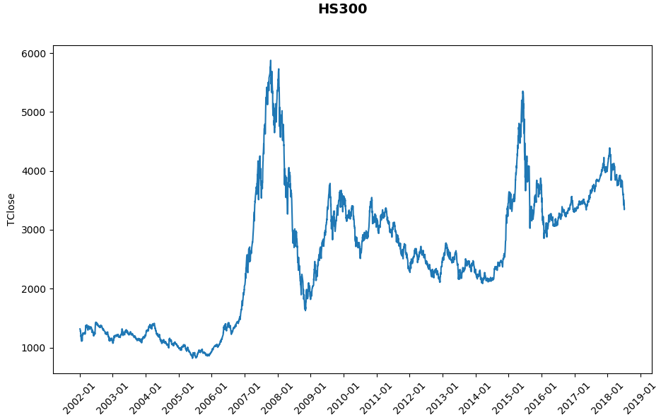

昨天跟老爸聊投资，聊着聊着就抬起杠了：我说无论美股还是中国股市，大盘代表这个国家经济的基本走势，以年的粒度来看是向好的，几乎不会亏钱；而老爸一句话就给我顶回来，2008年都要飙到6000点了，现在才多少点？这都10年了，你告诉我哪年可以翻盘？

<!-- more -->
我所持的观点是受巴菲特的影响，他曾无数次说过：对于个人投资者，最好的投资方式就是指数基金定投。2008年，巴菲特还在long bets上发布了一个为期10年的赌约——对冲基金不能长期战胜市场，具体操作就是用被动型的股指基金标普500来代表市场，与敢于应战的对冲基金在10年跨度上对比。当时只有Protégé Partners敢于应战，去年答案揭晓了：Protégé Partners所选取的五支FOF基金完败，好一点的年化回报率是6.5%，最惨的只有0.3%，而标普500年化收益是8.5%！

对于老爸的质疑，应该怎么回答呢？其实也很简单：巴菲特的观点是长期定投被动型股指基金，它包含两个要素：1、投资标的是被动型股指基金，比如沪深300、标普500，纳斯达克100；2、长期定投，而不是一次下注。老爸的观点是忽视了第2点。如果一次性下注，下到了2008年接近6000点上，那确实会导致十几年无法翻身。

像我这么认真的人，还是想花点时间亲自验证老巴“长期定投理论”的正确性。于是周末就用网易财经公开API去抓了中国A股的历史数据，用这些数据做了一些实验。数据抓取的代码我放在了[finance-learning/main.py](https://github.com/palanceli/finance-learning/blob/master/main.py)，这套接口挺好用的，不过这不是本文的重点，这里就不详细介绍了。

我就以中国A股`沪深300`作为标的，考察假如从2002年、2001年、……、2017年分别开始投资，每个月初定投固定的金额，计算到今天各组的投资损益率。从网易财经的API中我能抓取到的`沪深300`最早的数据就是2002年，因此最早的一组就从2002年开始。下面是我对每日收盘价绘制的历史走势图：

由于是计算损益率，因此和每个月投入多少钱没关系，我假设每个月投入1元。如果从2002年至今，每个月初投入1元，今天这组投资的损益率如下：

时间　　　　　　当初的1元在现在的价值  
—————————————————————————  
2002年01月　　　2.864  
2002年02月　　　3.101  
2002年03月　　　3.072  
2002年04月　　　2.862  
2002年05月　　　2.809  
2002年06月　　　3.107  
2002年07月　　　2.664  
…… …… …… ……  
…… …… …… ……  
2017年12月　　　0.943  
2018年01月　　　0.922  
2018年02月　　　0.888  
2018年03月　　　0.931  
2018年04月　　　0.97  
2018年05月　　　1.002  
2018年06月　　　1  
—————————————————————————  
总投入: 198.00，总产出: 374.26，总收益率: 89.02%，年复合收益率: 3.93%。

这里只能做一个定性的计算，来验证长期定投赚钱和亏钱各自的概率。这个年复合收益率的值是不准确的，因为少算了算基金分红，一来我没这个数据，二来我还不知道怎么算~

接下来我就不再列每组实验的中间数据了，各组实验的起点、终点和收益率如下：

起点　　　　　终点　　　　总投入　　总产出　　年复合收益率  
—————————————————————————————————  
2002年01月　2018年07月　198.00　　374.26　　3.93%  
2003年01月　2018年07月　186.00　　338.87　　3.94%  
2004年01月　2018年07月　174.00　　300.88　　3.85%  
2005年01月　2018年07月　162.00　　262.17　　3.63%  
2006年01月　2018年07月　150.00　　212.84　　2.84%  
2007年01月　2018年07月　138.00　　176.53　　2.16%  
2008年01月　2018年07月　126.00　　163.57　　2.52%  
2009年01月　2018年07月　114.00　　147.80　　2.77%  
2010年01月　2018年07月　102.00　　131.19　　　3.00%  
2011年01月　2018年07月　90.00　　 116.44　　　3.49%  
2012年01月　2018年07月　78.00 　　101.13　　　4.07%  
2013年01月　2018年07月　66.00 　　82.25　　　4.08%  
2014年01月　2018年07月　54.00　　　63.78　  　3.77%  
2015年01月　2018年07月　42.00　　　44.16　  　1.45%  
2016年01月　2018年07月　30.00　　　32.24　  　2.93%  
2017年01月　2018年07月　18.00　　　18.18　 　 0.68%  
2018年01月　2018年07月　6.00　　　 5.71　  　　-9.39%  

由此可见，即便是在最差的2008年进入，只要遵守纪律每个月坚持定投，到今天也依然是赚钱的。但是短期来看，比如去年投资，到今天几乎不挣钱，如果是今年初进入，到现在是巨亏。这反映出：1、股指基金定投只能使用长期闲置的资金，锁定住流动性，如果是今天投进去，明天就急用，风险是极大的；2、我体会投资和爬山、潜水非常类似，属于极限运动，最核心的要求是对自我的管理约束力和执行力，一旦制定好计划，雷打不动坚持执行。

----

不过这组实验我感觉还有一个漏洞：它们考察的是从任意一点出发到现在的收益率，如果当前所在的位置是2007年的水平，无论从哪个点出发，都是挣钱的。所以我们在做第二组实验：从2002年的每年初出发，分别考察3年、5年和10年后的收益率。

起点　　　3年复合收益率　　　5年复合收益率　　　10年复合收益率  
——————————————————————————————  
2002年　　-4.39%　　　　　　8.61%　　　　　　4.54%  
2003年　　-6.76%　　　　　　29.88%　　　　　1.88%　  
2004年　　16.55%　　　　　　4.75%　　　　　　2.40%  
2005年　　51.35%　　　　　　15.56%　　　　　　3.11%  
2006年　　-3.69%　　　　　　5.97%　　　　　　3.67%  
2007年　　5.95%　　　　　　　-2.94%　　　　　2.24%  
2008年　　2.87%　　　　　　　-5.39%　　　　　　  
2009年　　-3.87%　　　　　　-2.12%  
2010年　　-8.72%　　　　　　1.64%  
2011年　　-2.10%　　　　　　　5.97%  
2012年　　5.76%　　　　　　　5.49%  
2013年　　9.79%　　　　　　  
2014年　　6.19%　　　　　　  
2015年　　4.23%　　  
———————————————————————————  
3年赚8亏6，5年赚8亏3，10年总是赚钱的。赚钱的概率大于亏钱，赚钱的幅度远大于亏损，投资的窗口期越长赢面越大。

我认为造成这个现象的原因是：股市毕竟不是赌场的轮盘，而是国家经济的体现，国家经济总体趋势是向上的，中美两国在这一点上没有悬念。而未来，由于两个经济体的体量巨大，如果没有天灾、战争，二者在惯性驱动下还能保持多年这样的趋势向前发展。

再回到上面的数据，3年的复合收益有时候高得爆棚，到了10年收益率又回归到一个平稳的低值上来，有没有什么办法能锁住这超高的收益呢？我想应该可以借助投资组合的方案：把资产按照比例投入到基金和债券上去，比如80%vs20%，每年定期调整一次，如果基金的占比高了，就赎回一部分到债券上去，否则反之。这样也就贯彻了“别人贪婪的时候我谨慎，别人谨慎的时候我贪婪”的思想。当然我还没有对此做更量化的分析，这超出了今天的讨论范围，以后有时间再做吧。