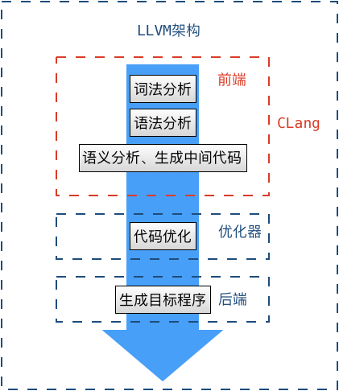
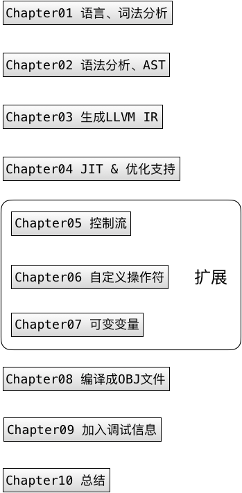
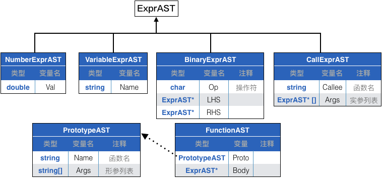
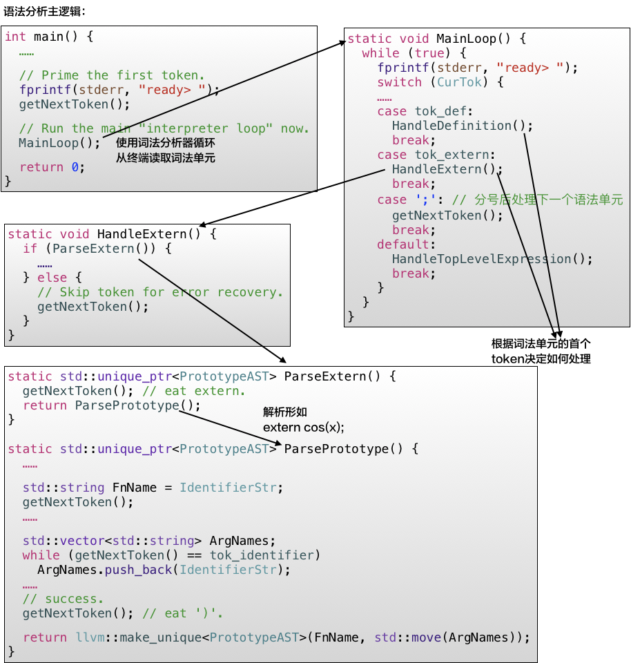
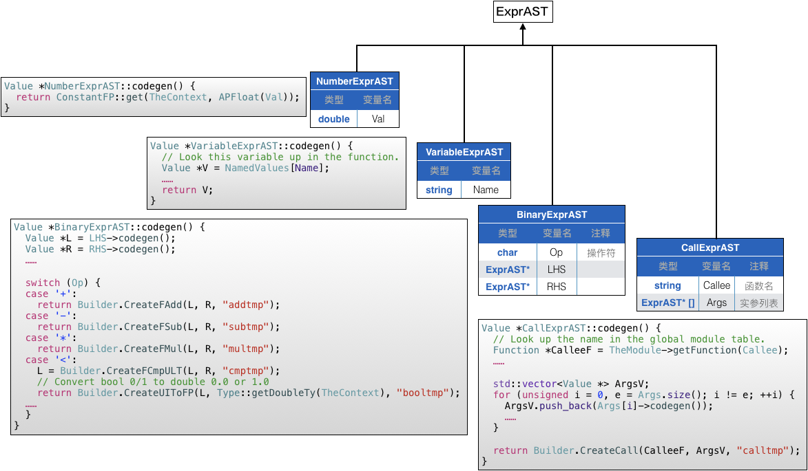
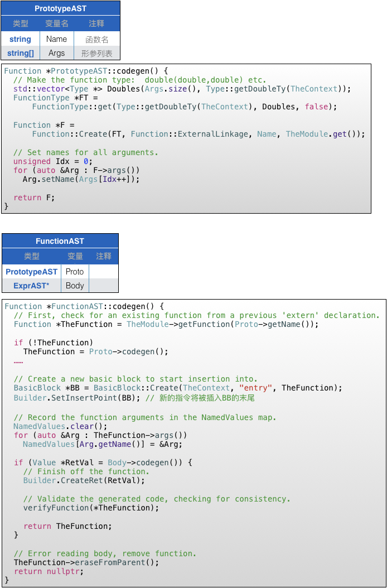

  
本文是对[LLVM官网入门教程](http://llvm.org/docs/tutorial/index.html)中《Kaleidoscope:Implementing a Language with LLVM》和《Building a JIT in LLVM》的总结。主要目的是了解LLVM的能力边界。

<!-- more -->
# 整体架构
这张图对于了解LLVM的整体架构非常重要：  
  
图很清晰，不需过多解释。  
在[《Kaleidoscope:Implementing a Language with LLVM》](http://llvm.org/docs/tutorial/index.html)这篇文章也是按照这个脉络介绍的：  
  

# Kaleidoscope: Implementing a Language with LLVM
[词法分析器](/2018/06/18/2018/0618BuildASimpleInterpreter1/#%E8%AF%8D%E6%B3%95%E5%88%86%E6%9E%90%E5%99%A8)和[语法分析器](/2018/06/18/2018/0618BuildASimpleInterpreter1/#%E8%AF%AD%E6%B3%95%E5%88%86%E6%9E%90%E5%99%A8)的概念在[编写编译器和解释器一](/2018/06/18/2018/0618BuildASimpleInterpreter1/)已经介绍过了，熟悉这些概念后，在教程里稍微看下实现即可。词法分析的逻辑比较简单，每次吐出一个token，我们直接进入Chapter02的语法分析。

## 语法分析
语法分析的结果是AST，[Chapter02](http://llvm.org/docs/tutorial/LangImpl02.html)为AST定义的数据结构为：
  
我没想明白<font color=red>为什么函数原型和函数不算做表达式，不从ExprAST派生呢？</font>

代码主路径展开就是这样：
  

## 代码生成
[Chapter03](http://llvm.org/docs/tutorial/OCamlLangImpl3.html)的代码生成没有太多编译原理相关的概念，更多是怎么运用`LLVM::Builder`生成指令的技术细节问题。首先在每个`HandleXXX(...)`函数中完成了AST的构建之后，将调用此次AST根部节点的`codegen()`函数来生成代码，由于AST节点是可以循环引用的，因此父节点再调用子节点的`codegen()`完成整棵树枝的代码生成：
``` objc
static void HandleDefinition() {
  if (auto FnAST = ParseDefinition()) {
    if (auto *FnIR = FnAST->codegen()) {
      ……
      FnIR->print(errs());
    }
  } else 
  ……
}
```
剩下就是为每个AST节点定义`codegen()`函数了：
  
  

## 优化器支持和JIT
[Chapter04](http://llvm.org/docs/tutorial/LangImpl04.html)短期我学习LLVM的目标是了解它的能力边界，我想基于它来实现iOS的热更新。优化属于更进一步的实现环节，因此很简略地跳过了，只要知道优化是通过FPM(Function Pass Manager)实现的，每个优化器是一个Pass实例，需要做什么优化只需要将对应的Pass实例添加到FPM即可：
``` objc
static void InitializeModuleAndPassManager() {
  // 获得TheModule并为之绑定FPM
  TheModule = llvm::make_unique<Module>("my cool jit", TheContext);
  // 这一句属于JIT的初始化
  TheModule->setDataLayout(TheJIT->getTargetMachine().createDataLayout());

  // Create a new pass manager attached to it.
  TheFPM = llvm::make_unique<legacy::FunctionPassManager>(TheModule.get());

  // 通过一系列add设置优化策略
  //Do simple "peephole" optimizations and bit-twiddling optzns.
  TheFPM->add(createInstructionCombiningPass());
  // Reassociate expressions.
  TheFPM->add(createReassociatePass());
  // Eliminate Common SubExpressions.
  TheFPM->add(createGVNPass());
  // Simplify the control flow graph (deleting unreachable blocks, etc).
  TheFPM->add(createCFGSimplificationPass());

  TheFPM->doInitialization();
}
```

JIT是用来解释执行前面`codegen()`生成的LLVM IR代码，这是我比较关心的环节。在本教程中仅展示了JIT的使用，没有太深入到其实现。首先是初始化：
``` objc
int main() {
  // 为创建JIT初始化环境 
  InitializeNativeTarget();
  InitializeNativeTargetAsmPrinter();
  InitializeNativeTargetAsmParser();

  ……
  getNextToken();
  // 创建TheJIT
  TheJIT = llvm::make_unique<KaleidoscopeJIT>();

  InitializeModuleAndPassManager();

  // Run the main "interpreter loop" now.
  MainLoop();

  return 0;
}
```
都是些程式化的调用，需要注意TheJIT其实是自定义的`KaleidoscopeJIT`实例，而不直接来自LLVM API，想要了解细节应该深入到该类的内部，这是[《Building a JIT in LLVM》](http://llvm.org/docs/tutorial/index.html)中讨论的问题。  
具体解析执行的代码如下：
``` objc
static void HandleTopLevelExpression() {
  ……
  if (auto FnAST = ParseTopLevelExpr()) {
    if (FnAST->codegen()) {
      // 将包含顶级表达式的模块添加到JIT
      auto H = TheJIT->addModule(std::move(TheModule));
      InitializeModuleAndPassManager();

      // Search the JIT for the __anon_expr symbol.
      auto ExprSymbol = TheJIT->findSymbol("__anon_expr");
      ……

      // Get the symbol's address and cast it to the right type (takes no
      // arguments, returns a double) so we can call it as a native function.
      double (*FP)() = (double (*)())(intptr_t)cantFail(ExprSymbol.getAddress());
      fprintf(stderr, "Evaluated to %f\n", FP());

      // Delete the anonymous expression module from the JIT.
      TheJIT->removeModule(H);
    }
  } ……
}
```
解释执行在大的步骤上分四步：
1. 添加模块`TheJit->addModule(...)`。这一步很容易理解，函数、变量定义只有先添加进来，后面才能执行。
2. 找到入口函数`TheJIT->findSymbol(...)`。和添加模块不同，仅在`HandleTopLevelExpression()`中有对`findSymbol(...)`的调用，这是因为只有顶层表达式需要执行，对于函数定义只需要添加到模块就可以了。
3. 执行入口函数。对于顶层表达式，可能就是一段代码，没有函数入口，此时这段代码依然有个名字——`__anon_expr`，如上面代码所示。
4. 删除模块。当次顶层表达式执行完成后，就应该立刻删除，因为进入了下一轮交互，再输入表达式和上一次的无关，如果不删除会导致重复执行。在这里有个细节：就是只删除可执行的表达式即可，定义还是要保留的，因此需要把可执行表达式和定义表达式分开添加。

## 编译为目标代码
更是一段程式化的操作了，需要注意的是LLVM可以执行交叉编译，编译成目标机器的代码，因此需要指定目标机器：
``` objc

int main() {
  ……
  MainLoop();

  // Initialize the target registry etc.
  InitializeAllTargetInfos();
  InitializeAllTargets();
  InitializeAllTargetMCs();
  InitializeAllAsmParsers();
  InitializeAllAsmPrinters();

  auto TargetTriple = sys::getDefaultTargetTriple();
  TheModule->setTargetTriple(TargetTriple);
  ……
  auto Target = TargetRegistry::lookupTarget(TargetTriple, Error);
  ……
  // 指定目标机器
  auto CPU = "generic";
  auto Features = "";

  TargetOptions opt;
  auto RM = Optional<Reloc::Model>();
  auto TheTargetMachine =
      Target->createTargetMachine(TargetTriple, CPU, Features, opt, RM);

  TheModule->setDataLayout(TheTargetMachine->createDataLayout());
  // 准备发出目标代码
  auto Filename = "output.o";
  ……
  raw_fd_ostream dest(Filename, EC, sys::fs::F_None);
  ……

  legacy::PassManager pass;
  auto FileType = TargetMachine::CGFT_ObjectFile;

  if (TheTargetMachine->addPassesToEmitFile(pass, dest, FileType)) {
    ……
    return 1;
  }
     
  pass.run(*TheModule);   // 发出目标代码
  dest.flush();
  ……

  return 0;
}
```

# Building a JIT
该教程在概念上只记住一个框架就可以了，就是JIT的基本调用流程：
1. `addModule(Module &M)`，使得指定的IR模块可用于执行
2. `JITSymbol findSymbol(const std::string &Name)`，从添加到JIT中的模块中查找符号的指针
3. `void removeModule(Handle H)`，从JIT中删除模块，释放所有与之相关的内存。

代码形式如下：
``` c++
std::unique_ptr <Module> M = buildModule ();
JIT J ;
Handle H = J.addModule ( *M );
int (*Main)(int , char* []) = (int (*)(int , char* []))J.getSymbolAddress("main");
int Result = Main();
J.removeModule(H);
```

# 思考
研究LLVM的目的是为了求证基于它是否能搞出一个iOS下的热更新机制，因为之前我使用的JSPatch被禁了，改成JSCore但还是存在挺大的技术问题，比如执行效率、内存分配、回收时机不可控等。设想如果用OC生成IR，能否使用JIT来执行呢？把上面两个教程拼凑在一起理论上可行：通过LLVM 的CLang前端生成IR，再由JIT执行呗。所不同在于希望IR以文件形式保存，而不是像教程里保存在内存中的数据结构。

我找到一篇文章[《Exploring LLVM ExecutionEngine》](https://mayuyu.io/2017/07/12/Exploring-LLVM-ExecutionEngine/#more)，就是验证这件事儿的，按照他的描述我也写了段代码[llvm_examples/Kaleidoscope/BuildingAJIT/ChapterA/](https://github.com/palanceli/llvm_examples/tree/master/Kaleidoscope/BuildingAJIT/ChapterA)。
其中`llvm_examples/Kaleidoscope/BuildingAJIT/ChapterA/test/test/main.m`是一个OC文件，执行
`llvm_examples/Kaleidoscope/BuildingAJIT/ChapterA/setupenv.sh`将该文件编译成IR。
`llvm_examples/Kaleidoscope/BuildingAJIT/ChapterA`应被放到llvm工程的`llvm-src/examples/Kaleidoscope/BuildAJIT`下，可以执行`llvm_examples/setupenv.sh`建立软链，这样就不必拷贝了。

在[《Exploring LLVM ExecutionEngine》](https://mayuyu.io/2017/07/12/Exploring-LLVM-ExecutionEngine/#more)这篇博客里，他讲到这种做法有一定局限：
- 不支持可变参的外部函数
- 不支持结构体
- 大量系统库，比如libOBJC的初始化需要本地一些原生级的支持，比如扫描一些二进制文件的部分段来完成初始化。
- 性能不好
- GV需要映射到本机，以便本机调用

但是他没有提到解决这些问题的思路。