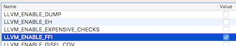

本文做了一个最简单的JIT Demo，测试其时空性能。


<!-- more -->

# 代码结构
代码放在了[https://github.com/palanceli/llvm_examples/tree/master/Kaleidoscope/BuildingAJIT/ChapterA](https://github.com/palanceli/llvm_examples/tree/master/Kaleidoscope/BuildingAJIT/ChapterA)
结构如下：
``` shell
llvm_examples
├── Kaleidoscope
│   └── BuildingAJIT
│       └── ChapterA
│           ├── CMakeLists.txt
│           ├── KaleidoscopeJIT.h
│           ├── setupenv.sh        # 将test/test/main.m编译成IR文件
│           ├── test               # 被测试的OC源码
│           │   └── test
│           │       └── main.m
│           └── toy.cpp            # JIT主要代码
├── FindClassDecls
└── setupenv.sh
```
与本文相关的代码主要在Kaleidoscope，它分两部分：1、`ChapterA/test`是被测试的OC源码；2、其余部分是用C++写的JIT  

`llvm_examples/setupenv.sh`负责和llvm_src建立软链关系：

不把代码直接放到`llvm_src`里面是便于`llvm_examples`的独立维护。

`Kaleidoscope/ChapterA/setupenv.sh`执行clang命令，将OC源码生成LLVM IR：
``` shell
clang -fobjc-arc -emit-llvm -S test/test/main.m -o test/test/main.ll
```

# 被测试OC源码

在`main.m`中执行了100万次数学运算：
``` objc
void testEntry(){
  float x = 0;
  for(int i=1; i<1000000; i++){
    if(i % 3 == 0){
      x = x * i;
    }else if(i % 7 == 0){
      x = x / i;
    }else if(i % 11 == 0){
      x = x - i;
    }else{
      x = x + i;
    }
  }
}

int main(int argc, const char * argv[]) {
  @autoreleasepool {
    double time_begin = CFAbsoluteTimeGetCurrent();
    testEntry();
    double time_end = CFAbsoluteTimeGetCurrent();
    NSInteger time_interval = 1000 * (time_end - time_begin);  //单位毫秒	
    NSLog(@"time_interval: %ld. \n", time_interval);
  }
  return 0;
}
```

# JIT代码

`Kaleidoscope/BuildingAJIT/ChapterA/toy.cpp`负责初始化JIT，并执行OC源码：
``` c++
  ……
  SMDiagnostic SMD;
  LLVMContext context;
  const string llPath = ...; // main.mm的路径
  const string funcName = "testEntry";
  EngineBuilder EB(parseIRFile(llPath, SMD,context));
  EB.setEngineKind(EngineKind::Interpreter);
  ...
  ExecutionEngine* EE = EB.create();
  
  EE->runStaticConstructorsDestructors(false);
  Function* func=EE->FindFunctionNamed(funcName);   // 查找函数入口testEntry
  
  struct timeval tvBegin, tvEnd;
  gettimeofday(&tvBegin, NULL);  // 开始计时
  
  EE->runFunction(func,ArrayRef<GenericValue>());   // 执行函数
  
  gettimeofday(&tvEnd, NULL);    // 结束计时
  // 计算耗时
  double dDuration = 1000 * (tvEnd.tv_sec - tvBegin.tv_sec) + ((tvEnd.tv_usec - tvBegin.tv_usec) / 1000.0);
  printf("dDuration=%.2f ms. \n", dDuration);
```

# 编译执行
1. JIT代码由于依赖LLVM，必须结合LLVM一起编译，在CMake时应该打开开关`LLVM_ENABLE_FFI`：

打开该开关后，如果被解释执行的代码使用了外部函数，LLVM解释器将链接到外部对应的函数库上去。比如`NSLog`就依赖`Fundation`库，如果不打开该开关，在执行JIT时会提示错误：
`LLVM ERROR: Tried to execute an unknown external function: NSLog`
2. 在JIT代码中，应当`dlopen`被使用的库文件，例如OC源码中为了计时，调用了函数`CFAbsoluteTimeGetCurrent()`，故JIT代码中应当调用：
``` c++
  void *handle = dlopen("/System/Library/Frameworks/CoreFoundation.framework/Versions/A/CoreFoundation", RTLD_LAZY|RTLD_GLOBAL);
```
  既然前面已经开启了`LLVM_ENABLE_FFI`开关，为什么代码里还要显示打开呢？这是因为开关只管要不要链接，即记录导入函数及来源，并不负责外部库的加载。
  此处还有一个细节：如果在xcode中直接执行，不调用`dlopen（...)`也没问题，因为xcode的调试器帮你加载了很多库，如果在命令行下执行，就必须显式调用了。

# 执行结果
编译出来的JIT代码有18.9M，仅比lli23.8M小了5M，如果想拿来嵌入到app里支持热更新显然是太大了。
再看时间开销：如果使用JIT的执行时间是`750ms`，如果编译成机器码直接执行只有`6ms`的开销，相差100倍！

看来如果想支持热更新，LLVM自带的JIT是不行的。