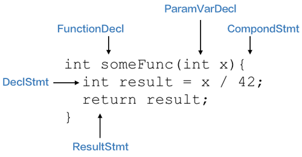

本文想利用clang生成的AST，遍历其每个节点并追溯生成IR的过程，企图生成自己的指令体系，并用一个简版的VM来执行，最终达到热更新的目的。

<!-- more -->

参考[《How to write RecursiveASTVisitor based ASTFrontendActions.》](http://clang.llvm.org/docs/RAVFrontendAction.html)，这篇文章演示了如何遍历AST。在阅读代码之前有必要先了解RecursiveASTVisitor/FrontEndAction/ASTConsumer的概念以及相互关系。

Clang用三种基本数据结构来描述AST：
- Type 类型
- Decl 声明
- Stmt 陈述

如：


# Clang Tools 和 AST结构
Clang Tools是通过Clang提供的库函数实现的可独立运行的工具。类似的还有clang-check、clang-fixit、clang-format。

使用
``` shell
clang -Xclang -ast-dump <oc源文件>
```
可以打印出源文件对应的AST树：
```
TranslationUnitDecl
|- TypedefDecl
|- ...
|- FunctionDecl
|   |- ParamVarDecl
|   |- ...
`- ...
```

指定SDK和framework的路径
``` shell
clang -Xclang -ast-dump -isysroot /Applications/Xcode.app/Contents/Developer/Platforms/MacOSX.platform/Developer/SDKs/MacOSX10.14.sdk -F/Applications/Xcode.app/Contents/Developer/Platforms/MacOSX.platform/Developer/SDKs/MacOSX.sdk/System/Library/Frameworks <oc源文件>
```

# Visitor/Action/Consumer结构

## RecursiveASTVisitor
查找AST中的节点，既可以遍历AST，也可以使用Clang封装好的算法——RecursiveASTVisitor。继承该类并实现VisitCXXRecordDecl，该方法就在访问CXXRecordDecl节点时被触发。（CXXRecordDecl表示C++ class/union/struct）

## FrontEndAction
该类与编译实例打交道，词法分析、语法分析等过程都被编译实例隐藏了，编译实例会触发FrontEndAction定义好的方法，并把编译过程中的详细信息都告诉它。如编译哪个文件，编译参数等等。

## ASTConsumer
ASTConsumer是FrontAction的一个子过程，在ASTConsumer中可以拿到整个编译单元，调用visitor进行遍历。

------

这三个数据结构的关系如下：


**ASTContext**是编译实例保存所有AST信息的一种数据结构，主要包括编译期间的符号表和AST原始形式。在遍历AST的时候，需要从该数据结构中提取节点的相关信息


<font color=red>待续...</font>