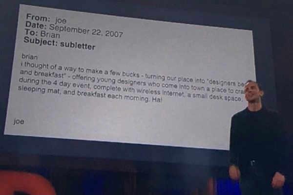

分享给搜狗正摩拳擦掌准备参加黑马大赛的同学。

<!-- more -->

# 往事

在搜狗，作为选手我曾经参加过前两届黑马大赛。其实总共参加过三个项目，由于精力有限，第一届我自己主持了一个项目，另一个项目交给了一位同事，我在那个团队担任开发。

我主持的项目叫“搜狗键盘”，是一个硬件产品。那是2015年初，我们工作和生活还很依赖PC，同时移动互联网处于发展期，手机上的输入场景越来越多，但打字效率比PC低，所以我就想做一个蓝牙键盘，可以实现在PC和手机之间方便地切换。当然这里还要考虑很多体验上的细节，比如解锁屏幕、多屏之间的瞬时切换……这个项目最后进入了决赛，不记得最后的名次了。

我给同事的另外一个项目叫做“搜狗太空舱”，当时公司还没有小P摇一摇，开门全靠刷卡，我就想做这么一个东西，而且更酷一些，不需要摇一摇。我上小学的时候有一部科幻片给我留下印象非常深刻——《恐龙特急克塞号》，里面的时空战士们一脸严肃，为拯救地球穿梭在飞船不同船舱，船舱之间的舱门就会“唰”地一下打开，再“唰”地一下关上，特别的酷！虽然后来很多科幻片都有这种场景，而且今天很多楼宇大厦的大门都安装了红外感应，实现了那个效果，但童年第一印象给我留下的冲击，始终都在那。所以我取的名字叫“搜狗太空舱”，我希望搜狗员工，只要带着手机，靠近大门，门就会“唰”地一下打开，然后员工一脸严肃地进去改变世界😆那会还做了很多延展型的设想，让我们的办公环境更酷，让你进入公司就像进入人类的下一个时代。

但是理想很性感，现实很骨感。这个项目最后未能进入决赛，因为那一届有这个创意的项目不止这一个，大家都想一块去了。而且我们那个团队是一群程序员，缺少一个设计师妹子，技术实现没问题，但在展示和讲给别人听的时候还是过于朴实了。

我参加第二届黑马大赛的项目叫做“钢琴陪练”，因为我有个女儿学钢琴，每天要在家练琴。可是我们家只有我听得懂，而我又没时间天天陪她。所以每天练得对不对，有没有偷工减料，妈妈听不出来，只有在周末上课的时候请老师指出问题，可是这个时候也许使用错误的方式已经练了一个礼拜了，做了很多无用功。所以我就想做一款APP，通过声音识别来帮助女儿发现练习中的错误，提升她练琴的效率。最后这个项目也获得了第二届黑马大赛的第一名。

这就是我两届黑马大赛的经历，但在这三个项目背后还有一些很好玩的花絮，我觉得那些才更值得和大家分享。

# 花絮

## 搜狗海盗船

首先就是开始的那面海盗旗，那是我给自己团队的队标，我给团队取名叫搜狗海盗船，两届都是这个名字，我非常喜欢。它来自《乔布斯传》里面有一节“我们当海盗吧”，它讲了一个故事：在乔布斯当年组建麦金塔团队的时候，一次集思会上他提出“当海盗，不当海军”，他希望自己团队具有叛逆精神，能够做出“非同凡想”的事情。麦金塔团队还真地做了一面海盗旗挂在他们团队的大楼顶上，这在公司也引起了反对声，因为担心这种精神会让团队失控。有一天苹果另外一个团队“丽萨”的成员把这面海盗旗偷走了，而且还给麦金塔团队发了一张赎金单。麦金塔团队当然不甘示弱，当天又把它抢了回来，重新挂回到大楼顶，直到麦金塔项目完成。我非常喜欢这个故事，“当海盗，不当海军”这句口号总是给人一种血脉贲张的力量，所以我用海盗旗作为自己团队的队标。

## 我要参赛
我记得公司在筹划第一节黑马大赛的时候，我是PC输入法的产品、技术负责人，HR同学来找我，问我能不能担任评委，我说不去——要参加就报个项目参加比赛，当评委实在太无聊了。我内心一直对这个东西的评委、导师有挺大的抵触心理，因为我觉得创新是没法教的，它有心法但是没有技法。在一个具体的项目当中，评委和导师能不能起到作用，甚至说起到正面还是负面的作用都不好说。第二点，一个产品有没有价值，好不好用，这个东西要回归到用户当中来评价。靠几个评委评出你是第一，你就真的好么？评出你不能入围，你就真的烂么？那是扯淡！但是参加比赛不一样，你有机会逼着自己和自己的内心去做深度对话，把一件事想透彻、想清楚，做这事是有意义的。

但后来截止日期临近了，张卓就问我：“你不是参加比赛么？怎么一直没报名呢？”我也挺不好意思地说：“实在太忙了，还没想好做什么。”他就想让我先同意做评委，我说：“你再给我三天时间，如果还想不出，那我就去当评委。”

## 有梦就去闯
再接下来三天时间里，我花了两天半先写了首歌。因为一开始我确实在想项目来着，想了很多创意，但越想越激动，可能是有点自恋，我想，这个创意真棒，以前怎没想过呢；那个想法也不错，可以改变我很多生活场景……其实后来冷静分析每个想法，未必真的那么有价值，可是当它们刚从脑子里蹦出来的时候，那种激动的心情越来越猛烈地冲击着自己的内心，以至于没有办法再让我平静下里。于是我就说那我先把此刻的心情记录下来吧，这种心情曾经经历过，但是已经很多年没有再体会，我觉得记下来当做生命的一个标记也是有意义的。

我不知道大家能不能理解，我觉得可能和我在搜狗的成长经历有关。我入职搜狗实习刚好赶上搜狗输入法即将发布第一个版本，然后你看着这样一个产品从无到有，从小到大，从一颗嫩芽到参天大树在你手里慢慢长大，你随着它也一步步成长，那种充实和喜悦是伴随在你工作中每一天的。可是当产品的用户体量从5000万，到8000万，到1个亿…… 自己的工作由一个手艺活，逐步要做管理、协调，随之而来的是一些常规甚至无聊的琐事、杂事，你不得不做，你突然发现疲惫和麻木不知道从什么时候开始爬满了你的内心。这个时候公司突然告诉你：给你一段时间，去做任何你想做的事儿！你天马行空的去想，去想对你有用的创意，也许做好了对更多人都有用；我可以按自己的想法把它做成什么样，我可以解决什么问题……你就会越想越激动，仿佛又回到了刚来输入法的那段手艺活的时光。于是我就想甭管事能不能做成，一定先把当时的心境记录下来，于是有了那首歌叫做《有梦就去闯》。
<iframe height=100 width=150 src='http://player.youku.com/embed/XOTYzMDc4Mzg0' frameborder=0 'allowfullscreen'></iframe>

写歌是我表达自己的一种方式，在早期，随输入法成长的那段光辉岁月里，我现在还印象深刻，我们经常周五下午发版本，一个版本发出去，那天晚上我就很难睡着，一方面觉得发版了很欣慰，另一方面很忐忑，不知道这个版本用户会怎么评价，会不会挨骂。输入法早期的用户参与特别积极，每个版本发出去都能收到上千封的用户反馈。所以有一次发版后那天晚上辗转睡不着，我就给输入法写了一首歌，叫做《完美体验》。
<iframe height=100 width=150 src='http://player.youku.com/embed/XMzg0OTIyMDg4NA==' frameborder=0 'allowfullscreen'></iframe>

# 体会

说了这么多，我想表达两点：
第一，在我们生命当中，应该努力地追寻可以令自己怦然心动，不计代价，为之付出的人或事。这当然需要运气，也需要不断努力。因为一旦你找到了，并为之付出全力，即使这事儿最后没有成，它也足以成为你生命当中的闪光点，你不会后悔的。
第二，公司举办黑马大赛，会有公司层面上的考量和引导，比如有没有利用AI技术，有没有和现有的业务结合，有没有发挥公司的优势…… 但我认为对我们每个个体来说，最重要的是给自己一次全面检阅自己的机会。检阅自己还能不能冲动起来，检阅自己有没有实现它的能力。
我跟朋友开玩笑说：这就好比在你婚姻十年的时候，突然给你一次合法出轨的机会，你说你要不要？真地不要错过！

# 沉淀心法

## 从生活中来

回到主题上来，写完歌以后终于可以平静了，我花了半天的时间最后敲定做键盘。原因是我刚买了一个蓝牙键盘，本来是给pad用，但我希望可以在Pad、手机和PC上都能用它，而实际我发现这几乎不可行，因为每次切换我必须断开前一个连接，再重新连到新设备，这么复杂的操作在频繁切换的时候是不能忍的，于是就有了“搜狗键盘”的创意。我报名以后过了几天，在刷卡进门的时候又萌生了“搜狗太空舱”的想法，但因为已经有项目了，只好把它交给其他同事。

我认为在想创意的时候，应该从我们日常工作、生活出发，做一件首先对自己有用的事儿，然后再去想他是不是对更多人也有价值。我后来做“钢琴陪练”也是这么个思路，因为它对我有用。而不是先考虑它有没有使用AI技术，是否充分利用公司的优势。至于它能不能入围，能不能取得名次，那更不重要了。尽管“搜狗太空舱”没有入围，但我依然认为自己当时的思考是有价值的，今天据我观察绝大部分同事进门都不再刷卡，而是摇一摇了。

很多成功的创业项目最初发心也都是这么来的。首先搜狗输入法就是，马占凯觉得当时的输入法总是打不出自己想要的字、词，但他观察搜索引擎suggestion的联想和纠错就很准，哪怕只输入拼音，也能给出想要的候选，于是他就想到把二者结合起来，基于搜索引擎技术做一款输入法，可以让打字更快。当时我们几个开发、产品、测试也都是输入法的重度用户，很多开创性的功能首先我们想自己怎么用着爽就会怎么做它，做出来后不好用再根据自己的体验改进。

业内也有很多这样的例子。程维自己讲过两段经历：一个是之前在阿里工作，杭州、北京两边跑，经常因为打不到车而错过航班；还有一次老家亲戚来北京，定了7点在王府井吃饭，5点钟打车，8点还没到，这让程维萌生了做打车工具的想法。Netflix也有同样的故事，当时的行业霸主是百视通，在它的规则下，用户租录像带过期不还，需要交非常昂贵的滞纳金。有一次哈斯廷斯在租完录像带归还的时候发现，之前有一个没注意的过期了，结果一盘录像带租金三四美金，而滞纳金就得交四十美金，哈斯廷斯一怒之下创办了Netflix。

还有Airbnb，Airbnb的几位创始人都是设计师出身，他们都毕业于罗德岛设计学院。说到这我也想为今天在座的设计是同学打打气，产品创新不只是留给产品、技术的舞台，在现实的前方就有估值300亿美金的Airbnb是我们的典范。Airbnb的全称叫做Airbed and breakfast——“充气床+早餐”，这是怎么来的呢？其中一位创始人切斯基毕业后在大学同学歌比亚的软磨硬泡下决定辞职创业，他带着1000块钱来到旧金山时，并不知道该干什么，这点钱连住的地儿都不好找，碰巧又赶上当时一个国际设计大会要在旧金山召开，由于参会人数太多，导致附近的宾馆、酒店都被预订一空了，这就让歌比亚想到一个主意：既然世界各地的设计师都要来旧金山开会，他们肯定都需要找住的地方。所以是不是可以把我们住的地方打造成一个“床位+早餐”的小旅馆，解决这4天里来自全球设计师的饮食、住宿问题。他把自己的想法发送给切斯基然后就开始了Airbnb的创业历程。这就是后来改变世界的那封邮件，非常地朴素：

回到我刚刚的观点上来：第一、想一个创意不要一上来就想着改变世界，而要从解决一个非常具体的问题着手；第二、这个问题必须是自己感同身受的；第三、不要想着输入法有多大体量，借助这个体量优势我们可以实现推广，这种优势如果作为你思考问题的起点，它也必将成为你无法突破自己的诅咒。

## 检阅自己
给我的第二点感触是一次检阅会逼着你发现自己身上有什么不足。比如想创意这件事儿，我在决定参加比赛以后，肯定会逼着自己绞尽脑汁想各种创意，这个时候我才发现自己的创意思维怎么这么匮乏呢，能想到的点其实都遍布在自己日常生活当中，但我平时怎么就没想过这事儿呢？临近截止日期，也许直到最后我也没有满意的创意，但没关系只要我意识到了这一点，以后一定会有意识地观察生活，去积攒素材培养这种思维习惯，为下一次挑战做准备。这对自己来说就是一次成长。

我前面说过创新没法教，但是它可以学，创新思维可以刻意练习，增加命中的几率。最近我参加过一门《创新管理》的培训，老师上课第一个问题就是：在最近的半年里，你的生活当中有什么新奇的事情值得分享给大家。我们每桌八九个人，每人一分钟给大家分享。我就发现我们不少同学会先花半分钟的时间解释——比如，我是做技术的，我的生活比较单调、枯燥，好像没啥可分享的。其实在我们生活当中新奇和美好的事物是一样多的，有人说生活当中不缺少美，缺少的是发现美的眼睛。新奇的事物也一样，比如我们有的同学就说：今天早上上班的时候，我发现天上有片云，特像一展开翅膀的天使，很奇特我把它拍下来了。也有人说：我发现父母做了个软支架固定在身上来支撑手机，这样可以在屋子里走来走去，不耽误看片。这都是我们生活当中细微的新鲜事，老师说：你不去可以观察，这种新鲜事物可能就从你眼皮底下滑过去了，你只有捕捉到了，才有可能进一步思考他为什么和以前不同。

这句话对我很有启发，比如我前一阵去瑞士爬山，下山是坐小火车下来的，到了半山腰需要转车，等山下的火车把我们接下山。但是上车后神奇的事情发生了：这列火车一分为二，前一半继续上山，后一半原路返回，很不幸我坐在前一半上。当时就觉得这事儿非常新鲜，在创意课上，经老师的提点，我突然意识到我应该更深入一步思考他为什么这样做，他解决的是什么问题，成本、运力？它还可以用来解决什么问题？比如现在高铁速度越来越快，中途停站上下车的耗时在整个旅途中占比越来越高，是否也能用分节的思路来解决。素材就是这么一点点积累起来的，你只有用这种方式刻意练习，在需要的时候才能信手拈来。其实你可以把周期缩短到每周，周末晚上闭上眼睛回忆本周遇到过什么新奇的事物，它的新奇之处在于什么？为什么会和以前有所不同。

说到这还有一个非常经典的案例，就是孙正义发明电子词典。孙正义在读书的时候使用一个小方法强迫自己去做创意思考的练习：他把周遭的物品制作成几百张小卡片，每天早上抽出3张，花半小时强迫联想，让他们之间产生关联，看看有没有创新的可能。有一天他抽出“语音合成器”、“液晶屏幕”和“字典”这3张卡片，透过强制联想促成他发明了电子词典这项划时代的产品。他把专利授权给夏普，赚进了1个亿，在此之前他已经有过上百个类似的创意产出了。今天我也在用这种方法和我的女儿做沟通表达的训练游戏——抽出几张卡片，用上面的词造一个复杂的问句，轮流再抽出几张卡片来组织回答。造句其实本身就是一个创意练习，这种小游戏挺有意思的。

其实在我们大脑里有很多陈旧的想法、事物，它们的陈旧远超出我们想象，能达到令人发指的程度。比如在我们《创新管理》课堂上，老师让用太阳、云、山、房子、蝴蝶、花、草树画一幅图。我给大家半分钟时间，大家可以在脑海里去做这幅图，尽量想出细节。这是我画的：

画完后老师就问我们：太阳是毛茸茸的或者一身刺儿的样子请举手，房子是三角尖顶的请举手，花是五瓣向日葵的请举手…… 不幸我全中了，我们大部分同学都中了。老师提醒我们，再看看现实生活那还能看到尖顶房子？路边的花是五瓣向日葵吗？这些都是幼儿园时代老师教我们的画法，哪怕它与真实世界不符，却也根深蒂固地印在我们大脑里了，试问在我们脑子里还有多少类似的事物、想法和概念呢？这句叩问给我带来的冲击非常大，它时刻提醒我，在想问题的时候要突破既有观念。

我认为这才是黑马大赛应该给我们的棒喝。其实也不局限于黑马大赛，比如一次创意培训，或者工作中的一次讨论。这就是我前面说的“检阅”的意思。只不过黑马的检阅范围更全面，我前面只展开讲了“创意”这一个环节，亲身参加一次黑马大赛你才能体会到你应该具备的能力远比日常工作中用到的要多得多，这才是这个世界对你的真实要求。比如对程序员，工作的时候我只做客户端的某些模块，但做一个完整产品，你需要考虑到周边、安装卸载、服务端等等。比如产品经理，平时我可能考虑更多的是功能模块设计，在完整的产品体系下，我就必须考虑这个模块、功能在整体产品战略下的作用是什么，能不能支撑最本质的需求，怎么把它变成最小化可行性方案。作为项目的主导者，你要操心的事儿就更多了：为你做的事儿赋予意义，找到合适的伙伴忽悠他们入伙，把控人力、时间节奏，平衡功能取舍……这些都是更技术化的能力要求，我就不展开讲了。

所以我强烈建议大家，如果没有合适的项目，哪怕去听听，听别人做了什么，怎么做怎么想，如果我来做我会怎么考虑……这种思考对自己同样能起到成长的作用，当然最好还是亲身参与一次，那种提升比做旁观者还是要高出一个量级。

# 克服障碍
下一部分我想分享在黑马大赛中遇到的主要障碍以及自己是怎么克服的。我觉得最大的障碍就是心理障碍，在犹豫做与不做之间顾虑重重：这个东西没有人做过，我这么想靠不靠谱，会不会被人嘲笑；交卷那天要面对那么多评委diss我，会不会令我难堪；我是团队的leader，我的下属也参加了，如果我表现还不如他们，他们会怎么看我？这跟公司的优势有没有结合？

我确实也遇到过在有的场子里评委言辞过于犀利，但其实我想告诉大家，在这个场子里没有权威，即使我们把范围扩大，再扩大，在这个行业里也没有权威。我认为只有一条公理——用户是检验产品的唯一标准。它就像平面几何里那五条公设一样，不言自明，颠扑不破，除此之外再无其他。其它的所有规律、经验、总结都是建立在这一条公理之上的。

大家知道在产品这个行当里，乔布斯是神一样的存在，他第一次封神是在苹果1984推出麦金塔电脑，那是一个划时代的产品。只不过这个划时代可能跟你想象的不一样，因为它既是个划时代的成功，也是个划时代的失败。他的成功首当其冲的是1984主题的麦金塔电脑广告——被称为20世纪最伟大的商业广告。
<iframe height=100 width=150 src='http://player.youku.com/embed/XMzk1Mjc2OTQw' frameborder=0 'allowfullscreen'></iframe>
内容我就不介绍了，可能大部分产品同学看过，有兴趣可以自己去查。这事儿的好玩之处在于：乔布斯在董事会播放这个广告的时候，大部分董事会成员都觉得，这是自己看过的最烂的广告片。但是公司已经花钱买了两个最贵的广告时段，也就是美国的春晚——橄榄球“超级碗”的广告时段。于是大家都主张把买到的时段转手卖了，别丢这个人。还好广告公司和乔布斯都消极抵抗，只卖了一个比较短的时段，保留了另外一个长一点的。结果这则广告在超级碗一经播放，立刻引起全国轰动，美国三大电视网和50多个地方台都播放了这则广告的新闻，使得它在广告营销领域名垂青史。

第二个成功就是1984麦金塔电脑的发布会，它给科技产品的发布会设立了一个标杆，这些年来苹果每次产品发布会都引起无数人关注，包括近几年Google、Facebook的F8开发者大会第一场的产品发布也都引起越来越多的关注，这一切都起源于1984麦金塔的发布会。

但可惜与划时代的成功形成鲜明对比的是在产品维度上，麦金塔却是一次划时代的失败。用户后来给麦金塔电脑取了个别名，叫“烤面包机”，就是因为电脑经常温度过高，出现各种故障，随着糟糕的口碑传播，麦金塔电脑很快就卖不动了，这也是后来乔布斯被赶出苹果的一个重要原因。

这个案例生动地说明了，即便是牛逼的苹果董事会，依然会把一个历史上最伟大的产品判定为一坨狗屎，即便是伟大如乔布斯，如果背离了用户，就算他在产品发布会上拥有强大的现实扭曲力场，当产品接受用户检验的时候，他依然会败走麦城。

所以大家千万不要把所谓评委、导师以及他们的意见太当回事。他们只是一个侧面，帮助你打磨你的想法，帮你拓宽思路，帮你多问几个为什么。但是答案是要你自己去找的，他们的褒奖或批评对你来说没什么意义。

我们把评委当做投资人，把项目展示给他们希望赢得投资，他们投出的不是钱，而是选票。但即便是拿真金白银投票的专业投资人，阅尽项目无数，依然有很大的几率看走了眼。

我还拿Airbnb举例，在硅谷流行一句对Airbnb的评语：Airbnb是他们见过最后居然真成功了的最烂的想法。2011年，YC创始人格雷厄姆公开了他和一个叫弗雷德·威尔森的投资人的17封邮件。大家知道前一阵陆奇加入YC成为YC中国第一名员工，YC是业界公认的硅谷最伟大的创业孵化器，没有之一。它不仅孵化出了像Airbnb、Dropbox等一批成功的公司，它把当今最重要的一些创业理念随着自己十几年的发展推广到了全世界。格雷厄姆有本书大家应该听说过《黑客与画家》。这个弗雷德·威尔森是当今科技界最顶级的风险投资人之一，也是联合广场投资基金的合伙人。

[这17封邮件的链接](http://paulgraham.com/airbnb.html)今天还可以查得到。这是顶级投资人之间最保密也最真实的谈话。当时YC已经投了Airbnb的种子轮，正在帮他们寻找下一轮天使轮融资，格雷厄姆把Airbnb的情况介绍给了威尔森，第一次威尔森说几个合伙人对“充气床”这个概念意见不统一，等他在第二天例会上再讨论一轮。格雷厄姆就回复力荐Airbnb团队，建议威尔森先见见这个团队再讨论